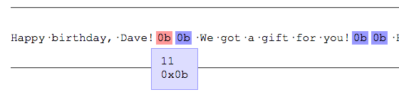

Vào một ngày đẹp trời, một mail rì pọt từ user gửi đến, nội dung như này:

> Tui đang dùng app ABC của mấy người. Ở màn hình order, tui copy một đoạn text từ Powerpoint ra và dán vào mục Order Message. Xong tui bấm nút tiếp tục, thì app ngừng hoạt động, màn hình chỉ hiện lên một nửa, đây là nội dung lời nhắn:
>
> "Happy birthday, Dave! We got a gift for you! Hope you like it, Mom and Dad."

Nhìn từ bên ngoài, lời nhắn kia trông không có gì khả nghi, nhưng nếu nhìn kĩ bằng cách bật chế độ hiển thị các kí tự ẩn (hidden characters) trên editor (với Emacs thì `M-x whitespace-mode`, với các editor khác thì các bạn tự Google đi), thì ta có thể thấy ngay một vài kí tự lạ xuất hiện:

```
"Happy birthday, Dave!^K^K We got a gift for you!^K^K Hope you like it,^K Mom and Dad."
```

Để chi tiết hơn, ta có thể dùng một công cụ xem các kí tự ẩn nào đó, ví dụ như [công cụ này](https://www.soscisurvey.de/tools/view-chars.php). Ta sẽ thấy kí tự lạ kia là `0x0b`.



Té ra, `0x0b` hay còn gọi là `vertical tab \v`, là một dạng kí tự ngắt dòng giống như `\n`, mã ASCII là `11`, có thể được chèn vào bằng cách gõ `Ctrl + K` (đó là vì sao Emacs hiện ra `^K`). Giống như kí tự `tab \t` (giúp nhảy nhanh về bên phải vài kí tự), `\v` có chức năng tương tự nhưng là nhảy xuống dòng, nhưng ở thời điểm hiện tại thì không còn ai dùng đến kí tự này nữa.

Nhưng khổ cái là nó vẫn còn tồn tại trong nhiều tài liệu, và nghiêm trọng hơn, nó không nằm trong chuẩn của JSON [^1]. Chính vì thế nên đa số các JSON parser (như của V8 và Spidermonkey) đều không thể parse được nếu nội dung có chứa `\v`, và còn nhiều dạng kí tự ẩn (non-printable characters [^2]) khác nữa. Và sẽ quăng lỗi khi phải parse nội dung chứa các kí tự lạ đó.

Ở ví dụ đầu bài, vì user input chứa kí tự không hợp lệ, `JSON.parse()` quăng lỗi khiến cho chương trình không thể chạy tiếp, và ngắt luôn quá trình render (nhân tiện, thằng nào nghĩ ra ba cái vụ client-side rendering vậy???). Mọi thứ diễn ra bên dưới, chỉ để lại cái màn hình render nửa vời cho anh bạn user xấu số.

Cho nên cẩn tắc vô áy náy, chúng ta nên replace hết các kí tự không mong muốn trước khi đưa một đoạn nội dung nào đó từ user vào xử lý, ví dụ:

```
// Viết regex phải có tâm:
// - \v: thay thế kí tự \v thành \n
// - \p{C}: match tất cả các kí tự non-printable
const filterUnwantedChars = str => str.replace(/\v/g, "\n")
                                      .replace(/\p{C}/g, "");
```

Và một lưu ý khác, đó là đừng bao giờ sử dụng hàm `JSON.parse()` trực tiếp, vì nó sẽ **throw error**, mà nên wrap nó và handle lỗi có thể xảy ra một cách hợp lý để tránh làm "bể" UI chỉ vì user input như ví dụ đầu bài (nhớ dùm, chúng ta là JS dev, không phải Elixir hay Erlang dev, chúng ta không có cái triết lý gọi là "Let it crash").

```
const safeParseJSON = str => {
    let result = null;
    try {
        result = JSON.parse(str);
    } catch (e) {
        console.error("Failed to parse JSON", e);
    }
    return result;
};
```

Bằng cách này, chúng ta expect hàm `safeParseJSON` trả về một object khi parse thành công, và trả về kết quả `null` khi có lỗi xảy ra, đồng thời có thể kiểm tra log để biết chính xác là lỗi gì, mà không làm ngắt quá trình thực thi của code [^3].

**Bổ sung:** Sau khi published bài viết này, thì thím [@nhducit](https://github.com/nhducit/) có bổ sung thêm một điểm, đó là đối với React, từ `v16` có hỗ trợ method `componentDidCatch()`, hoạt động giống như `catch {}` để không làm crash quá trình execute code của component [^4], bằng cách này chúng ta có thể handle lỗi một cách an toàn.

**Đọc thêm**

- [^1]: The JavaScript Object Notation (JSON) Data Interchange Format, https://tools.ietf.org/html/rfc7159#section-7
- [^2]: Non-printable Characters, https://www.regular-expressions.info/nonprint.html
- [^3]: What is the difference between throw error and console.error?, https://stackoverflow.com/questions/25377115/what-is-the-difference-between-throw-error-and-console-error
- [^4]: Error handling in React 16, https://reactjs.org/blog/2017/07/26/error-handling-in-react-16.html
