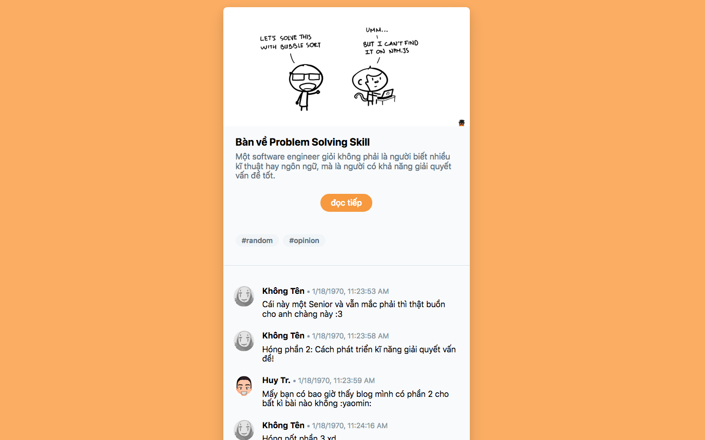

Thực lòng mà nói, khi cả thế giới thậm chí đã ngưng nói về OOCSS, BEM hay các CSS methodologies khác, thì mình vẫn còn stick với kiểu viết CSS truyền thống, đó là cách viết "trải lòng", theo đúng nghĩa đen của nó:

```scss
// css
.container .mot-cai-gi-do {
    color: #f00;
    background: #000;
    border: none;
    border-radius: 3px;
}

.container .mot-cai-gi-do .con-cua-mot-cai-gi-do {
    color: #f00;
}

// hay scss
.container {
    .mot-cai-gi-do {
        color: #f00;
        background: #000;
        border: none;
        border-radius: 3px;
        .con-cua-mot-cai-gi-do {
            color: #f00;
        }
    }
}
```

Cho đến một ngày, khi mình quyết định là mình đã chịu hết nổi khi phải nghe [@kcjpop](https://ehkoo.com/) và **@bần_harris** <span class="mute sidenote">@bần_harris là thanh niên không chịu cho xin địa chỉ Github để link vô đây, đây là thanh niên làm cho mình mỗi sáng thức dậy lại cảm thấy khủng hoảng vì trình độ lớp trẻ ngày một cao siêu...</span> nói mãi về những `tachyons` hay `tailwind`, cụ thể hơn là `Atomic CSS`, những thứ từ vựng mình không biết và không hiểu mẹ gì. Mình quyết định lại một lần nữa, nhảy lên con tàu của những kẻ hipster.

---

**Atomic CSS** hiểu nôm na là một cách viết CSS mà chúng ta... không cần viết một dòng CSS nào cả. Thay vì viết code CSS, chúng ta sẽ sử dụng các class có sẵn mà một Atomic CSS Framework cung cấp. Trong các framework này, mỗi class có nhiệm vụ định nghĩa một thuộc tính duy nhất (vậy nên mới gọi là atomic).

> **atomic /əˈtämik/**: _adjective_, relating to an atom or atoms / of or forming a single irreducible unit or component in a larger system. tiếng Việt: nguyên tử

Ưu điểm lớn nhất của Atomic CSS có lẽ là giúp tránh được các vấn đề với CSS specificity (mức độ ưu tiên của các thuộc tính), gây ra do cách viết kế thừa class.

Tức là, thay vì muốn có một cái nút phẳng bo góc tròn, thay vì:

```html
<button class="btn-cai-nut">Touch me</button>
```
```scss
.btn-cai-nut {
    border: none;
    border-radius: 3px;
    background: $red;
    color: #FFF;
    padding: 2px 5px;
    
    &:hover {
        background: $dark-red;
    }
}
```

Thì ta chỉ cần:

```html
<button class="bg-red hover:bg-red-dark border-none rounded-sm text-white px-5 py-2">Touch me</button>
```

Nhìn qua thì có vẻ hơi rối và hoang đường, thứ nhất, ai lại đi viết một đống class dài lê thê thế kia? thứ hai, ấn tượng của mình là: _Ba cái bọn bốc phét! Không viết CSS thì chắc chỉ làm được vài ba cái style đơn giản, còn mấy cái cần customize nhiều thì thách cha nó làm cũng không được!_

Đây cũng là quan điểm của khá nhiều người, mình biết được vì sau đó vài ngày thì trên Hacker News cũng xuất hiện một [thread thảo luận](https://news.ycombinator.com/item?id=18362493) về một bài viết về Atomic CSS của Julia Evans. 

Tuy nhiên, sau vài hôm thử nghiệm, mình làm được vài cái demo nho nhỏ với [Tailwind CSS](https://tailwindcss.com/), cũng cảm thấy thoải mái hơn khi sử dụng. Đầu tiên là prototype một cái giao diện blog minimal:

Live demo: https://codepen.io/huytd/pen/mzzoRe



Xét về khả năng customize và sự tự do khi thiết kế giao diện, Tailwind tỏ ra là không thua bất cứ ai, thậm chí nó còn hỗ trợ responsive và các thuộc tính CSS như `hover` nữa.

Sẵn tiện đã hype, thì hype cho tới, mình cũng quất luôn một cái demo khác và lần này ôm thêm cả [React Hooks](https://reactjs.org/docs/hooks-intro.html). Là prototype một cái mail client UI.

Live demo: https://codepen.io/huytd/pen/pxGqOK

<animate>img/atomic-css-demo-02.mp4</animate>

Đến demo thứ hai này thì mình buộc phải xuống tay viết một vài dòng custom CSS để làm hiệu ứng background nằm chéo màn hình, mấy cái trò này hiển nhiên Atomic CSS chưa thể hỗ trợ được.

Khi sử dụng với React thì coi bộ Atomic CSS khá tiện, giúp cho việc prototype nhanh chóng mà không cần phải switch qua lại để vừa viết code JS và viết CSS, cũng không cần phải viết CSS style trong JS nữa.

---

Nhìn chung thì đây cũng là một phương pháp viết CSS rất đáng quan tâm, tuy nhiên để đưa ra thêm nhận xét thì mình còn phải sử dụng nó nhiều nữa. Còn từ giờ cho đến lúc đó, bài này đành phải kết cụt lủn như thế này vậy :joy:

**Đọc thêm:**

- React Hooks là gì? https://ehkoo.com/bai-viet/react-hooks-la-gi
- Tailwind: style your site without writing any CSS! https://jvns.ca/blog/2018/11/01/tailwind--write-css-without-the-css/
- The Problem with Atomic CSS https://medium.com/simple-human/the-problem-with-atomic-css-d0c09c7aa38e
