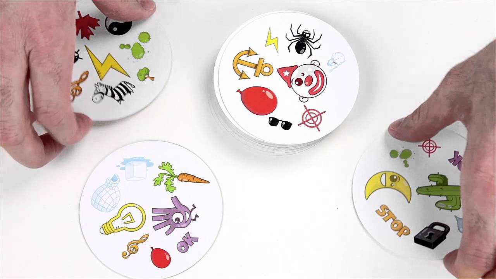
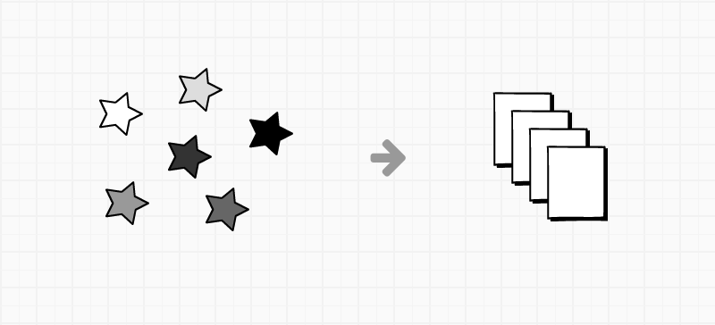
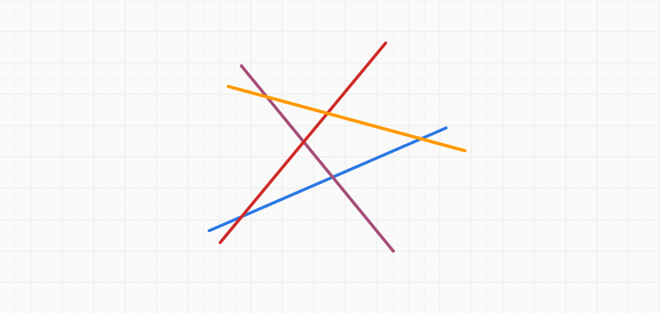
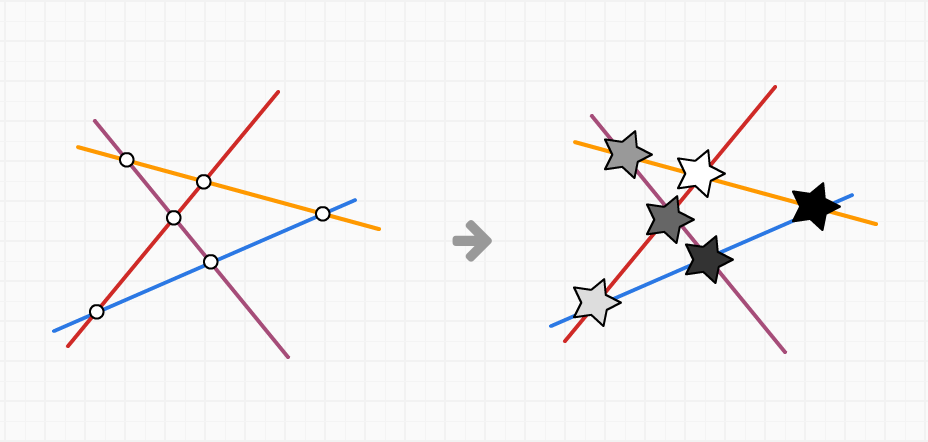
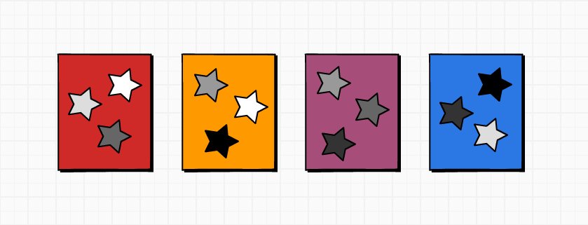

Tựa đề đầy đủ là "Bài toán xếp hình lên lá bài", mình đặt tiêu đề nửa vời vậy chỉ nhằm mục đích clickbait thôi :))



Trong bức hình trên là bộ bài **Spot It!**, gồm có 55 lá, mỗi lá có 8 hình vẽ khác nhau.

Điểm đặc biệt của bộ bài trên là: **với 2 lá bài bất kì, sẽ luôn xuất hiện 1 hình vẽ giống nhau.**

Vấn đề đặt ra là làm thế nào để ta có thể tạo ra một bộ bài với tính chất giống như bộ bài **Spot It!** ở trên?

Ta thử thu nhỏ phạm vi của đề bài lại như sau:

```txt
Sắp xếp 6 hình vẽ khác nhau vào một bộ bài gồm có 4 lá, mỗi lá có 3 hình.

Sao cho mỗi 2 lá bài bất kì thì sẽ có một hình vẽ giống nhau trên đó.
```



Bài toán nghe có vẻ rắc rối nhưng thật ra rất dễ để giải nếu quy về dạng một bài toán hình học cơ bản.

Đầu tiên, chú ý vào yếu tố **2 lá bài bất kì luôn xuất hiện 1 hình vẽ giống nhau**. Trong hình học, đối tượng có tính chất tương tự như vậy chính là các **đường thẳng**.

> 2 đường thẳng bất kì không song song trên cùng một mặt phẳng thì luôn cắt nhau tại một điểm nào đó

Vậy ta có thể hình dung, **mỗi lá bài sẽ là một đường thẳng**, và **giao điểm của 2 đường thẳng chính là hình vẽ giống nhau** nằm trên 2 lá bài đó.

Theo đề bài chúng ta có **4 lá bài** tương đương với **4 đường thẳng**.

Mỗi lá bài có **3 hình vẽ** suy ra chúng ta cần có **3 giao điểm trên mỗi đường thẳng**.

Nếu ta vẽ 4 đường thẳng bất kì không song song như hình sau:



Ở mỗi giao điểm giữa các đường thẳng, ta đặt các hình vẽ trong đề bài vào:



Như vậy các bộ 3 hình vẽ trên mỗi đường thẳng cũng chính là bộ 3 hình vẽ chúng ta cần đặt vào mỗi lá bài.



Quay lại bài toán ban đầu, để có thể tạo ra một bộ bài **Spot It!** với **55 lá bài** và có **8 hình vẽ** trên mỗi lá bài, chúng ta có thể vẽ **55 đường thẳng** sao cho mỗi đường thẳng phải giao nhau với **8 đường thẳng** bất kì. Và cần $(55 \times 8) / 2 = 220$ giao điểm, tương ứng với **220 hình vẽ**.

<div class="copyright">Trích từ bài báo [The Intersection Game](http://www.maa.org/sites/default/files/pdf/horizons/PolsterApril2015.pdf), của Burkard Polster, đăng trên tạp chí Math Horizon, Hiệp hội toán học Hoa Kỳ (MAA), tháng 4/2015.</div>
