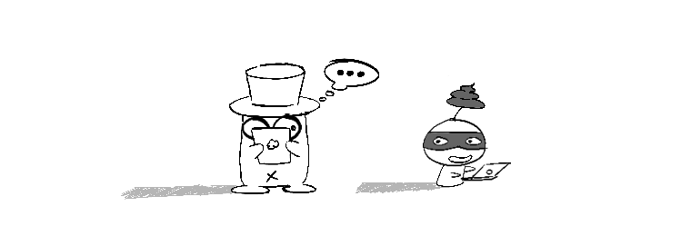

Hiện tại một số bài trên blog này mình đăng lại trên [Kipalog](https://kipalog.com) và [HVA Zone](https://hvazone.com), ngoài ra không có trang nào khác.

Một số bên có lấy bài của mình, cùng nhiều anh em trên **Kipalog** và các blog khác như [Codeaholicguy](https://codeaholicguy.com), [Tôi đi code dạo](https://toidicodedao.com) và đăng lại trên trang web của họ. Về cá nhân mình thì mình rât cảm kích cho thiện chí share bài của họ, vì việc này giúp cho các bài viết của mình tiếp cận được với nhiều người hơn.

Tuy nhiên mình không đồng tình ở việc họ lấy bài và share lại nhưng không dẫn link cụ thể tới bài viết gốc, và tác giả cũng không hề hay biết việc bài của mình được đăng lại trên các trang web đó. Một việc nữa đó là các bài được đăng lại bị chèn quảng cáo vào ngay giữa các đoạn nội dung, phá hỏng format của bài viết. Về việc này thì mình không chấp nhận được.

Việc anh em bỏ công ra viết bài, vẽ hình minh họa, review, sửa đổi một cách rất đầu tư nhưng vô hình chung lại bị đem ra sử dụng cho mục đích **tạo ra lợi nhuận** cho một bên thứ 3 mà mình không hề hay biết là một vấn đề đáng quan ngại. Nhất là các bên đó lại là những tổ chức hoạt động có đăng kí, có giấy phép của bộ này sở nọ, nhưng hành xử như thế là rất thiếu chuyên nghiệp.

Để bảo vệ nội dung bài viết của mình, đảm bảo nó không bị sửa đổi lung tung và sử dụng ngoài mục đích chia sẻ kiến thức thì mình xin phép quy định bản quyền cho toàn bộ các bài viết trên blog, cụ thể là [Giấy phép Attribution-NonCommercial-NoDerivatives 4.0 International (CC BY-NC-ND 4.0)](https://creativecommons.org/licenses/by-nc-nd/4.0/), giấy phép này không ảnh hưởng gì đến người đọc.

Mọi việc chia sẻ, trích dẫn nguyên văn là hợp lệ nếu bạn có ghi rõ nguồn, tuy nhiên không được sử dụng vào [mục đích thương mại](http://www.thehelpful.com/creativecommons/what-is-commercial-use.html), cũng như không được sửa đổi, làm thay đổi nội dung bài viết.

Mình cũng kêu gọi anh em sử dụng giấy phép này hoặc tự chọn cho mình một loại giấy phép tương đương khi chia sẻ bài trên mạng. Các site lớn như [Medium](https://medium.com) cũng cho phép user lựa chọn loại giấy phép khi viết bài.

Đây là chuyện cực chẳng đã chúng tôi mới phải làm, hy vọng các bên có liên quan tôn trọng chút công sức và đóng góp của anh em kĩ thuật đến các bạn độc giả.

---

Lời cuối, rất cảm ơn các bạn đã ủng hộ blog trong thời gian qua, mình sẽ tiếp tục nghiên cứu để cho ra lò các bài viết có chất lượng tốt hơn nữa để phục vụ cộng đồng. Mong các bạn tiếp tục ủng hộ.

Ngoài ra, các bạn cũng có thể tìm đọc các blog khác trong mục [Blog nhà hàng xóm](https://thefullsnack.com/posts/friend-sites.html).
