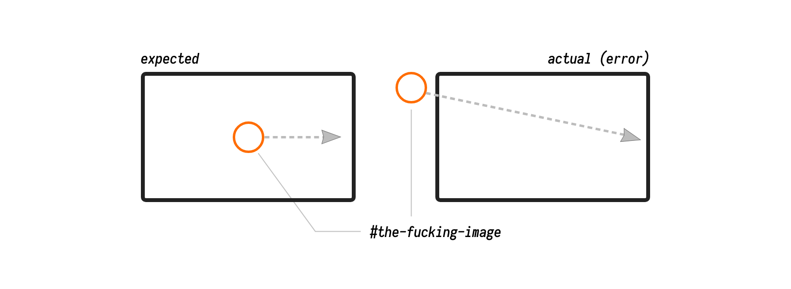

<div class="mute">
■ :warning: Bài viết có dùng những từ ngữ không được thuần phong mỹ tục cho lắm. Vui lòng cân nhắc kĩ trước khi phê phán tác giả. :chicken:
</div>

Nằm ở giữa trong một team có 3 thế hệ engineers (junior, senior, principal), mình phải làm công việc review code cho cả 2 thế hệ còn lại, vì lý do đơn giản, đám junior không đủ dũng cảm để review code các level cao hơn trong team, còn lão principal (từ khúc này sẽ gọi là bác P) thì có vẻ như chả bao giờ có ý định review code của tụi nhỏ. Nhưng cũng nhờ thé mà mình trở thành người quan sát được toàn bộ mọi sự thay đổi trong dự án. Ai, thay đổi những gì, ở đâu, vào lúc nào thì dù không muốn mình vẫn nhớ hết.

Tưởng đâu đó là lợi thế, nhưng ai ngờ lợi bất cập hại, cái hại lớn nhất đó là _nghĩ_ rằng mình biết quá nhiều, và tạo thành tính chủ quan khi tiếp cận vấn đề.

Vào một ngày thứ hai đẹp trời, bác P gửi lên một pull request để replace các lệnh xử lý tọa độ khi animation từ JavaScript sang dùng CSS transform, code của lão này mình đọc thì cũng chỉ biết approve chứ chả tranh cãi được cái vẹo gì.

Thế rồi hôm sau có liền một bug liên quan tới animation và chỉ xảy ra trên IE: Animation bị lỗi, như hình sau:



Thế là, bằng tất cả [kinh nghiệm trận mạc](https://thefullsnack.com/posts/wtf-is-problem-solving-skill.html) và bản lĩnh của một señor, mình đưa ra phân tích nhanh trong đầu:

- **Tiếp nhận và hiểu vấn đề:** Bug description ghi: animation không đúng với yêu cầu. Quan sát thấy: cái hình đáng ra phải bắt đầu chạy từ giữa màn hình, giờ nó chạy từ góc trên bên trái màn hình.
- **Phân tích vấn đề:** Bug xảy ra sau khi lão P update code, vậy khả năng là do lão ấy gây ra. Coi như đã khoanh vùng được nguyên nhân. Dựa trên hiện tượng quan sát được, đối chiếu với code của lão, có mấy vấn đề để đưa ra xem xét:
  - Có khi nào cái hình được tạo ra nằm không đúng vị trí của nó không? không, vì code của lão ta không đụng tới phần khởi tạo.
  - Vậy khả năng là khi dịch chuyển, tọa độ bị tính sai, và chỉ sai trên IE: rất có khả năng này, nếu IE không hỗ trợ tốt một vài thuộc tính của CSS transform.
  - Search Google thì thấy đúng là IE có cách xử lý thuộc tính `transform-origin` [rất cùi bắp](https://github.com/heygrady/transform/wiki/correcting-transform-origin-and-translate-in-ie), code của lão P cũng có đoạn `transform-origin(left, top)`!
  - Thôi chuẩn con mẹ nó rồi! Là bug của lão P! :think-hopeful:
- **Lên phương án hành động:** Vậy chỉ cần không dùng `transform-origin(left, top)` nữa, và chịu khó tính toán thêm một chút để thay thế cho việc set origin, không khó lắm, miễn là đảm bảo fix xong nó vẫn chạy đẹp trên Chrome.

Và không cần suy nghĩ, anh siêu nhân comment ngay vào ticket, bằng một giọng điệu "nghĩa hiệp":

- "_Bug này xảy ra vì anh P vừa update code, nhưng giải pháp của anh ấy không được tốt cho lắm, mà không sao, tôi sẽ fix nó dùm ảnh._"

...3 tiếng sau...

- "_Quái, sao đéo chạy được..._"

Thế là lại bắt đầu từ con số 0. Google thêm một lúc, thấy có cái lạ lạ. Trên MDN không hề đề cập gì tới sự khác biệt trong cách xử lý `transform-origin`, bản thân cái animation nó cũng rất khác, vì nếu origin không đúng, cái hình cũng sẽ không đến mức bị rơi ra bên ngoài của màn hình như thế này.

Thôi thử in tọa độ của nó lúc animate ra coi sao:

```javascript
const target = document.querySelector("#the-fucking-image");
const watcher = () => {
    let targetStyle = window.getComputedStyle(target);
    console.log("->", targetStyle.top, targetStyle.left);
    window.requestAnimationFrame(watcher);
};
watcher();
```

Output in ra lúc bắt đầu animate:

```
// Chrome, Firefox, Safari  
-> 600px 960px
-> 600px 960.001px
-> 600px 960.012px
-> 600px 960.025px
...
```

```
// IE
-> undefined undefined
-> 0.122px 0.423px
-> 0.922px 1.423px
-> 2.91px 5.93px
...
```

Ô cái nồi gì vậy nè :scream: Sao khác nhau thế? lại còn `undefined` nữa?

Hóa ra ngay từ đầu tọa độ lúc khởi tạo của `#the-fucking-image` đã bị sai. Lần mò thêm một hồi thì lỗi sai đúng là nằm ở phần code khởi tạo:

```javascript
const animateTarget = $(targetSelector).getBoundingClientRect();
const img = $("")
            .attr('src', imgSrc)
            .attr('id', 'the-fucking-image')
            .css({
                width: animateTarget.width,
                height: animateTarget.height,
                top: animateTarget.y,
                left: animateTarget.x
            });
```

Hai giá trị `animateTarget.x` và `animateTarget.y` không tồn tại dẫn đến giá trị `top` và `left` ban đầu của `#the-fucking-image` bị `undefined`. Nhưng mà trên các trình duyệt không phải IE thì nó lại tồn tại :scream:

Thì ra, trên IE, hàm `getBoundingClientRect()` được [mô tả như thế này](https://developer.mozilla.org/en-US/docs/Web/API/Element/getBoundingClientRect#Browser_compatibility):

>  Returns a ClientRectList with ClientRect objects (which do not contain x and y properties) instead of DOMRect objects.

Vậy là đã rõ vấn đề, quả nhiên, trên đời có những thứ chỉ tồn tại với mục đích làm cho cuộc đời kẻ khác trở nên khó khăn hơn, IE là một trong số chúng. Chúng ta phải tìm cách khác, không dùng `getBoundingClientRect()` nữa, để lấy tọa độ `x, y`, có thể dùng `offsetTop` và `offsetLeft`, nhưng hai hàm này không được hỗ trợ trên mọi trình duyệt.

Nếu [xem kĩ document](https://msdn.microsoft.com/en-us/library/hh826029(VS.85).aspx), thì ta vẫn thấy thuộc tính `left` and `top` có trong kết quả trả về của `getBoundingClientRect()`, nếu dùng luôn hai thuộc tính này thì sẽ ít gây ra thay đổi lớn trên phần code đã có, khá là thích hợp. Thậm chí trên MDN cũng có ghi:

> Due to compatibility problems (see below), it is safest to rely on only properties left, top, right, and bottom. 

Vậy là, thằng nào đó trong team, lúc implement cái hàm khởi tạo trên đã không chịu đọc kĩ tài liệu, thay vì chọn hai thuộc tính mà trình duyệt nào cũng có trả về là `top/left`, thì lại đi chọn hai thuộc tính `x/y` để khi chạy trên IE thì lỗi banh xác. Hoàn toàn không phải lỗi của lão P. Và mình quá "thông thạo" tình hình dự án đến mức áp đặt ngay cái kết luận là bug xảy ra do thay đổi của lão P, chỉ vì lão ấy vô tình update trúng vào một chỗ hơi liên quan. Và cái suy nghĩ áp đặt này đã khiến cho mình đi lạc hướng lúc phân tích vấn đề.

Bản fix khá là đơn giản:

```javascript
const img = $("")
            .attr('src', imgSrc)
            .attr('id', 'the-fucking-image')
            .css({
                width: animateTarget.width,
                height: animateTarget.height,
-               top: animateTarget.y,
-               left: animateTarget.x
+               top: animateTarget.top,
+               left: animateTarget.left
            });
```

Kinh nghiệm được rút ra ở đây là gì?

Đó là khi tiếp cận và giải quyết vấn đề, luôn gạt bỏ tất cả mọi sự đánh giá chủ quan ra một bên, mọi sự khẳng định thì đều phải đi kèm với phân tích và chứng minh, ở câu chuyện trên, mình kết luận bug xảy ra do code của lão P mà không hề kiểm chứng từ đầu. Hậu quả là bị định kiến và đi lệch hướng, gạt bỏ luôn nguyên nhân gốc rễ của vấn đề ngay từ đầu.

Kinh nghiệm thứ hai, đó là luôn brainstorming để đưa ra càng nhiều giả thiết hoặc giải pháp càng tốt cho một vấn đề, và lựa chọn giải pháp hữu hiệu nhất. Như ở trên, sau khi xác định được đúng nguyên nhân, mình đã đưa ra nhiều hướng giải pháp khác nhau và cân nhắc lợi hại của từng giải pháp, cuối cùng chọn cách ít làm thay đổi chương trình sẵn có, giảm thiểu tối đa cơ hội gây ra bug mới khi đang fix bug cũ :joy:

Kinh nghiệm thứ ba, luôn rút kinh nghiệm và phân tích sai lầm của bản thân hoặc đồng đội trong quá trình ~gây ra bug~ nhầm, fix bug. Trên tinh thần đó, mình chạy `git blame` để tìm xem ai đã commit đoạn code bị lỗi lên, để còn giáo huấn.

```
$ git blame animation.js

8a2038 (Huy  2018-10-08 11:44:04 -0700 451)     .css({
8a2038 (Huy  2018-10-08 11:44:04 -0700 452)         width: animateTarget.width,
8a2038 (Huy  2018-10-08 11:44:04 -0700 453)         height: animateTarget.height,
8a2038 (Huy  2018-10-08 11:44:04 -0700 454)         top: animateTarget.y,
8a2038 (Huy  2018-10-08 11:44:04 -0700 455)         left: animateTarget.x
8a2038 (Huy  2018-10-08 11:44:04 -0700 456)     });
```

Ồ thì ra...
