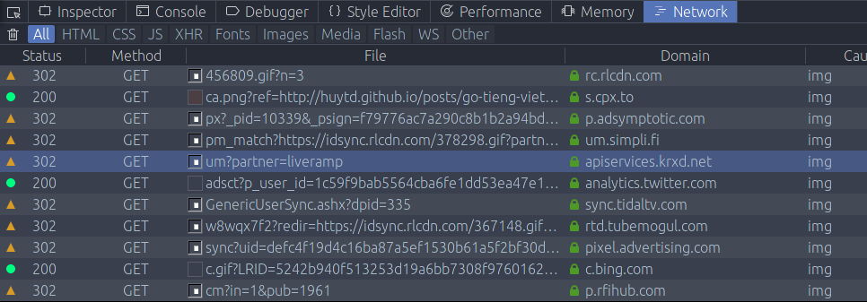

Nếu các bạn để ý thì gần đây mình đã gỡ phần comment bằng Disqus ra khỏi blog, và thay bằng chức năng comment tự build.

Mục đích của việc này là để đảm bảo tốc độ load trang được nhanh hơn, và vì bản thân Disqus tạo ra quá nhiều kết nối không rõ ràng trên phía máy tính của người đọc (client side), mình không chắc họ làm gì trong đó nữa.

Giải pháp tốt nhất là không xài nữa.

Một thay đổi khác là Google Analytics. Hiện tại mình cũng đã bỏ nó đi và thay bằng chức năng tracking riêng, các thông tin mình thu thập sau mỗi lần view page của người đọc gồm có:

- User Agent của trình duyệt
- Ngôn ngữ hiển thị của trình duyệt
- IP address
- URL của trang hiện tại
- URL của trang trước đó (referrer URL)
- Giờ hiện tại

Ngoài ra mình không thu thập bất cứ thông tin nào khác.

---

Có nhiều bạn nhắn tin và gửi mail cho mình hỏi là mình có thường xuyên "đồng bộ" các bài viết trên cả 2 trang **Kipalog** và **The Full Snack** không? Để theo dõi một nơi thôi cho tiện.

Về câu hỏi này, thì mình xin trả lời ngắn gọn là: Mình chỉ đăng các bài viết mang tính kĩ thuật lên **Kipalog**, còn các bài nhố nhăng khác thì mình xin phép giữ lại trên blog cá nhân, không đăng đi đâu cả. 

Và để tiện cho việc theo dõi, thì các bạn có thể [đăng ký nhận mail thông báo tự động](http://eepurl.com/cN5YDv) mỗi khi mình viết bài mới. Hoặc theo dõi [kênh RSS](https://thefullsnack.com/rss.xml) của blog.

---

Cả 2 chức năng comment và tracking đều được build dựa trên Firebase.

Mã nguồn của phiên bản blog mới cũng được public tại [branch `refresh` / dự án **azeroth-js**](https://github.com/huytd/azeroth-js/tree/refresh). Tuy nhiên tài liệu hướng dẫn thì chưa có 😂

Có thể trong thời gian tới mình sẽ chuyển thành dạng self-hosted và public nếu các bạn quan tâm.
