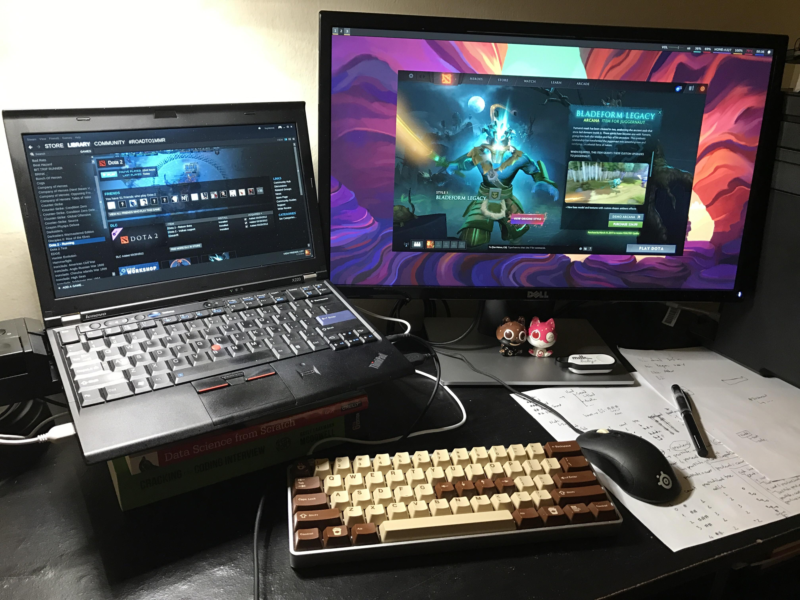

```
To anyone thinking about asking what laptop we recommend: The x220.

    But what about a laptop that's good for Arch? x220
    But what about a laptop that's powerful and upgradeable? x220
    But what if my budget is $X? x220
    But what if I want a touchscreen? x220t
    But isn't there anything besides an x220? Yes: another x220.

You get the picture. Now get an x220 and stop asking ;)
```

Đoạn "tư vấn" trên là từ các "chuyên gia" trên [Reddit](https://www.reddit.com/r/archlinux/comments/3d9ikt/looking_for_a_laptop_lenovo_x220/). :))

Chuyện là mình vừa mua 1 con laptop mới sau khi bị mất con iMac =.= nghe danh x220 đã lâu nhưng chưa có cơ hội xài vì đã có máy bàn rồi, nên khi bị mất máy tính thì cũng hơi... mừng 😂 vì có lý do để vợ phải đồng ý cho mình mua máy mới =)) (lúc vợ bảo mua máy mới đi mình còn giả vờ làm eo, bảo thôi, không cần đâu đến cả tháng đấy :)))

Và chọn em x220 này là một quyết định sáng suốt nhất của mình.

Với thân hình mảnh mai nhưng không kém phần nồi đồng cối đá, nhìn vào rất ngầu với cái logo Thinkpad, đủ để bất cứ em gái nào nhìn vào cũng phải bĩu môi: _"Ôi cái thằng cha này nghèo thế, thời buổi này rồi mà không có nổi con Macbook để xài à"_ (chứng tỏ xài Thinkpad rất là an toàn và bảo mật, không bao giờ còn bị vợ la vì dính dáng tới gái gú nữa 😭).

Thôi lan man chút chơi, vì là máy cá nhân, công việc chính là viết blog và lập trình, nên đây là setup của mình cho con laptop:

- **Hệ điều hành:** Arch Linux
- **Window Manager:** i3 + Polybar
- **Mail:** mutt ([xem cách cấu hình mutt tại đây](https://thefullsnack.com/drafts/mutt-setup.html))
- **Editor:** neovim ([dùng theme tự bịa ra](https://gist.github.com/huytd/10e490955d344ea1a2af7ebc28e2a8e1))
- **Browser:** Firefox, hôm nào mát trời thì xài Surf ([xem cách xài surf kết hợp với tabbed tại đây](https://thefullsnack.com/drafts/til.html#use-surf-with-tabbed))
- **Chat:** weechat kết hợp ZNC trên server để giữ session cho cả IRC lẫn Slack
- **Map phím:** Vì chuyển từ Mac qua nên vẫn còn thói quen xài phims CMD, có thể dùng Xmodmap để đổi vị trí phím Ctrl và Alt trên Linux.

Chốt cái hình minh họa:


