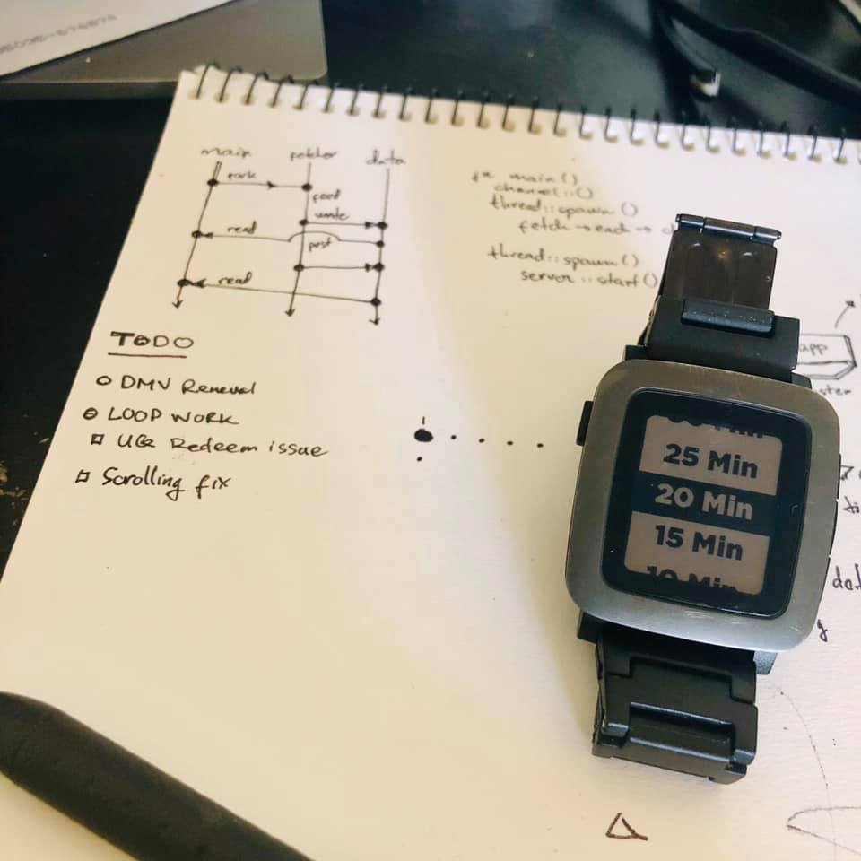
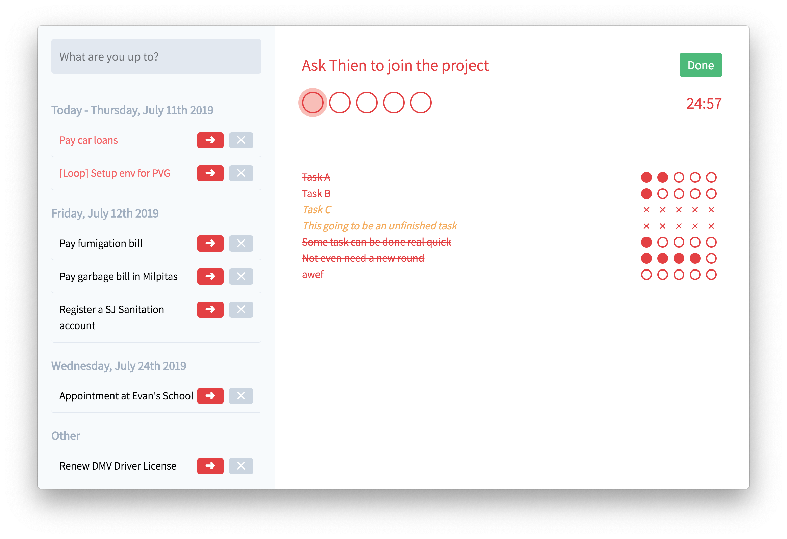
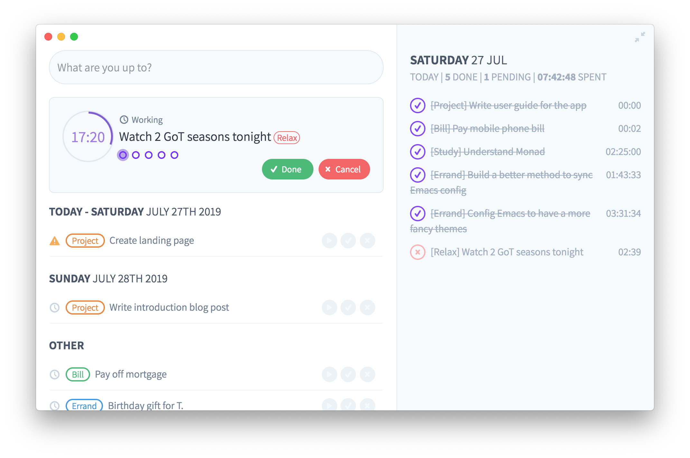
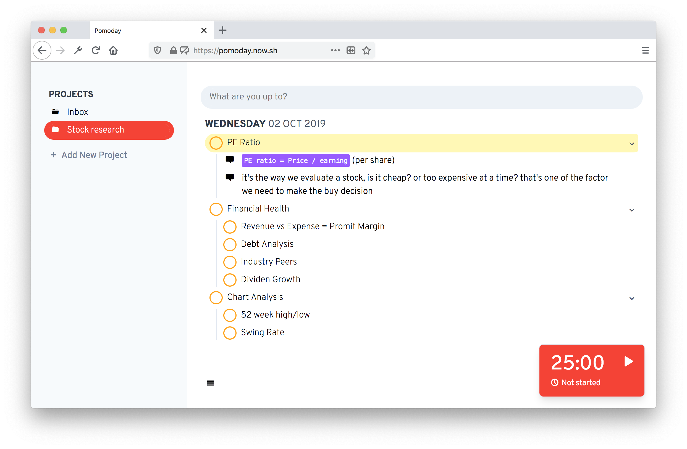

Hẳn là có nhiều bạn từng nói chuyện với mình bên Slack đều biết là mấy tháng nay mình đang build một cái app tên là Pomoday. Thực ra từ đầu năm nay mình ít viết lách, vì phần lớn thời gian rảnh trong ngày mình đều dành để build các thứ app này nọ, toàn bộ đều fail tính đến thời điểm này. Pomoday cũng vậy.

Khi nào có thời gian mình sẽ nói thêm về các thất bại trước đó, còn post này mình nói về Pomoday.

Pomoday là một ứng dụng giúp quản lý thời gian và công việc với phương thức Pomodoro. Tại sao lại là Pomodoro? Đó là vì mình tin tưởng vào quan điểm: Một người bình thường không thể nào thực hiện được hai việc cùng một lúc, cách để làm việc tốt nhất là focus vào một việc ở một thời điểm. Tuy nhiên, để giúp cho việc focus được tốt hơn, chúng ta cần có một thứ tín hiệu nào đó thường trực ở trước mặt để thúc ép. Pomodoro là phương thức thích hợp cho việc đó.

Ban đầu thì mình thực hành Pomodoro trên giấy, bạn nào follow mình trên Facebook chắc thấy cái post này:

Cách thức thì rất đơn giản:

- Đầu tiên, viết ra danh sách các task cần làm lên một tờ giấy
- Ở phía bên phải, bắt đầu đánh các chấm tròn tượng trưng cho mỗi một chu kì pomodoro
- Bấm đồng hồ cho nó chạy
- Khi kết thúc một pomodoro, nếu chưa xong việc thì vẽ dấu chéo rồi tiếp tục
- Nếu đã xong việc thì tô tròn nó rồi move qua task khác

Chuyện chả có gì đáng nói nếu mình không nảy ra ý tưởng làm một cái app cho nó, cái app ban đầu trông như này:

Sau đó, phần vì lỡ đem khoe và nhận đc feedback từ nhiều người, phần vì nhu cầu sử dụng càng lúc càng thay đổi, cái app nó biến thành thế này:

Lại tiếp tục nhận đc feedback, đa số nói UI quá xấu và tông màu đỏ quá liều, nó trở thành thế này:

Đây cũng là lúc mình bắt đầu nhận đc "tiền đầu tư" từ một số nhà hảo tâm nhưng có quan tâm tới dự án của mình, chắc không tiện nêu tên ra ở đây, và một vài early user, đa số họ đến nay đều đã không dùng app của mình nữa :sob:

Đến khúc này thì tự mình cũng thấy nó xấu, nên quyết định dừng code 2 ngày để design lại toàn bộ UI và user flow, và đây là phiên bản UI cuối tính tới thời điểm này:

Đến đây thì mình phải viết lại toàn bộ code, coi như đi tong phần việc của hơn 1 tháng. Nhưng bù lại thì sản phẩm trông có vẻ hợp lý hơn với đại chúng. Sai lầm bắt nguồn từ đây.

Sau thêm gần một tháng miệt mài ngồi code, thì giao diện mới cũng đã hòm hèm tạm coi là chạy được, tuy nhiên bug thì nhiều vô kể, vì thế nên càng lúc nó càng khiến mình tụt hứng.

Và mình bắt đầu nhận ra mình không có dùng Pomodoro hay Pomoday nhiều như lúc trước nữa :think-old: có thể là cách làm việc của mình cũng dần dần đổi khác đi, điều này có nghĩa là chính mình cũng không thèm dùng sản phẩm do mình làm ra :joy:

---

Quay trở lại lý do tại sao mình build Pomoday, đó là vì mình không cảm thấy phù hợp với bất kỳ một ứng dụng nào hiện có trên thị trường, từ Things, Agenda cho tới Todoist, 2Do,...

Sau khi nghỉ hẳn Pomoday, mình bắt đầu đọc nhiều hơn về productivity và các nghiên cứu về tâm lý học cũng như các vấn đề khác về cách mà chúng ta làm việc, tập trung,... thì có một điều khá là hiển nhiên mà bây giờ mình mới tin, đó là: **Mỗi người có một cách làm việc khác nhau, nên không thể có một công thức hay quy tắc chung trong vấn đề productivity cũng như phương thức quản lý công việc.**

Đó cũng là lý do vì sao mình cảm thấy không phù hợp với bất kỳ một app nào sẵn có. Thậm chí là với các phiên bản app Pomoday của mình. Và mình tin là khi đưa Pomoday ra, nhiều người cũng sẽ cảm thấy tương tự.

Nếu mình chịu khó tìm hiểu và phân tích kỹ hơn từ trước, có lẽ mình đã không tốn thời gian nhiều như thế, mà chỉ cần stick với phương pháp mình cảm thấy thích hợp nhất ngay từ đầu: làm trên giấy.
