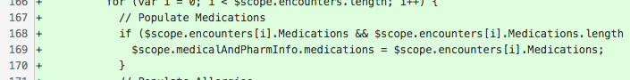

# Code Monk(ey): Kiểm tra Array trong JS

Chuyên mục [Code Monk(ey)](/tags/code-monkey.html) bàn về những lỗi tai hại thường gặp khi code. Những lỗi này thoạt nhìn có vẻ rất hiển nhiên và vặt vãnh.

---

Khi cần kiểm tra một Array có phải là một Array hay không trong JS, một số người sẽ viết đoạn code như thế này:

```js
// Giả sử `kips` là biến cần kiểm tra
if (kips && kips.length) {
  ...
}
```

Bạn có thể dễ dàng tìm ra đoạn code như thế này ở hầu hết mọi project JavaScript nào. Nếu tìm không ra thì bạn quả thực rất may mắn.



<div class="copyright center">Đoạn code trên là từ một "senior JS engineer" đến từ một công ty gia công mà mình có vinh hạnh được làm việc cùng.</div>

Vì sao lại viết như vậy? Vì nếu một biến là Array thì nó sẽ không phải `null` hoặc không `undefined`, và nó có thuộc tính `length`? Nghe cũng có vẻ hợp lý?

Nếu dùng để kiểm tra tính hợp lệ của một Array thì đoạn code trên là hoàn toàn sai. Đây là sai lầm lớn nhất và thường gặp nhất của các bạn chưa nắm vững JavaScript. Tại sao?

- Thứ nhất: Giả sử biến `kips` thực sự là một Array, thì đoạn code trên vẫn sai. Nếu `kips = []`, tức là thuộc tính `length` sẽ bằng `0`, điều kiện kiểm tra ở trên vẫn sẽ trả về `false`.
- Thứ hai: Tai hại hơn, nếu `kips` không phải là một Array mà là một String, ví dụ `kips = "Hello";`, thì những điều kiện kiểm tra ở trên vẫn hoàn toàn đúng. Một string vẫn luôn có `length`.

Vậy thì nên dùng gì?

Đơn giản, chỉ cần dùng `Array.isArray()`.

Các bạn có thể đọc thêm về hàm này [tại MDN](https://developer.mozilla.org/en-US/docs/Web/JavaScript/Reference/Global_Objects/Array/isArray?v=example).

```js
Array.isArray([1, 2, 3]);  // true
Array.isArray({foo: 123}); // false
Array.isArray('foobar');   // false
Array.isArray(undefined);  // false
```

Hàm này đảm bảo kiểm tra chính xác một Array có là Array hay không, và không bị nhập nhằng bởi các tính chất tương đồng với kiểu dữ liệu khác (như String trong ví dụ trên).

---

Có thể bạn sẽ nói chuyện này nhỏ như con thỏ. Nhưng trên thực tế thì con thỏ nó ko nhỏ chút nào đâu.

Be a code monk, don't be a code monkey.

--@TAGS: code-monkey, code
