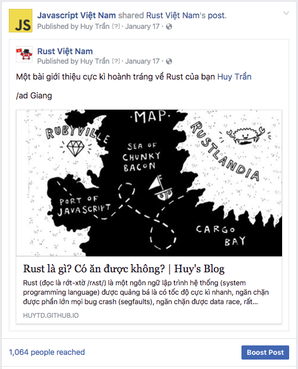
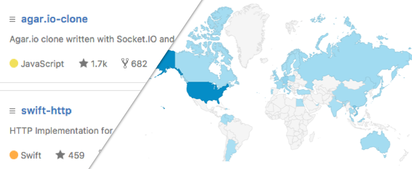
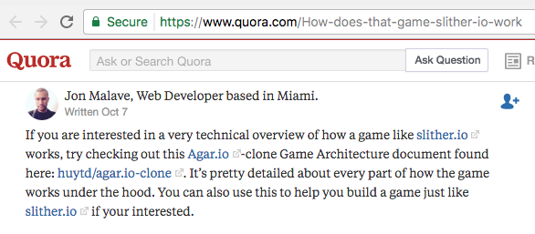

**TL;DR:** Nếu bạn nghĩ rằng một developer thì không cần phải biết về Growth Hacking, thì bạn nên đọc bài viết này.

---

Đã bao giờ bạn nghe tới khái niệm **"Growth Hacking"** chưa? 

Đã bao giờ bạn nghe tới khái niệm "Growth Hacking" và tự nhủ rằng "Đó là công việc của bọn làm marketing/SEO các kiểu, mình không cần phải quan tâm" chưa?

Đã bao giờ bạn tự hỏi "bản chất của một Growth Hacker, anh ấy là ai" chưa?

Đã bao giờ bạn tự hỏi "tại sao project của mình trên GitHub lại ít 'sao' đến thế?", "tại sao bài blog mình viết ra không ai thèm đọc?", "làm sao để quảng cáo cái side-project của mình ra cho mọi người vào sử dụng?" chưa?

## Mà khoan đã, Developer thì cần gì biết mấy cái này?

Khái niệm "Growth Hacking" chắc là bắt đầu được nhắc tới nhiều trong khoảng 1, 2 năm trở về trước và đến bây giờ thì cũng không còn nóng lắm. Bản thân mình cũng rất ghét và tìm cách tránh đọc các bài liên quan tới "Growth Hacking" khi nó còn hot.

Cho tới cách đây 2 tháng, mình bị a @kiennt và @huydx ở Kipalog dụ dỗ đọc cuốn [Growth Hacker Marketing: A Primer on the Future of PR, Marketing, and Advertising](https://www.amazon.com/Growth-Hacker-Marketing-Primer-Advertising/dp/1591847389), thì mình mới nhận ra một điều rất quan trọng là **Growth Hacking là một kĩ năng thực sự cần thiết cho một developer** chứ không đơn thuần là một nghề cho một nhóm người non-tech nào cả.

## Growth Hacker, anh ấy là ai?

Nói sơ về cuốn sách trên một tí, tác giả của nó là một marketer kì cựu, và anh ấy nóng mặt khi thấy báo chí bắt đầu tung hô Growth Hacking như là một nghề sắp soán ngôi của marketing truyền thống, nên bắt đầu tìm hiểu xem nghề này thực sự nó là cái gì, và anh ấy viết sách để giải thích nó dưới góc nhìn của một marketer, cách mà các công ty công nghệ lớn như Dropbox, Google, Facebook, Uber kiếm được những khách hàng đầu tiên của mình mà không cần phải tốn đồng nào cho việc quảng cáo truyền thống.

> "Not a blowout grand opening, but a strategic opening or a stunt that catches the attention of our core audience"

Và cuốn sách đưa ra một nhận định: **Những người đầu tiên làm nên định nghĩa của một Growth Hacker không phải là những marketer truyền thống, mà chính là các Engineer**.

## Tại sao Growth Hacker lại là các Developer/Engineer?

Để trả lời cho câu hỏi trên, cuốn sách đưa ra vài quan điểm về công việc Growth Hacking:

- Mục đích của Growth Hacking là: **Kiếm được user cho sản phẩm của mình**, và làm sao để từ một user sẽ kiếm thêm được 2 hay 100, 1000 users (growth)
- Yêu cầu của Growth Hacking là: Làm cho nhiều người biết đến sản phẩm của mình mà **không phải tốn một đồng nào cho việc quảng cáo** (hack).
- Cách để Growth Hacking là: Không có một công thức cụ thể nào cả, phương pháp thay đổi liên tục từng ngày theo sự biến động của công nghệ, nhưng có một điểm không thay đổi đó là **Growth Hacking sử dụng công nghệ**, và những người sử dụng được công nghệ (hacker), và không ai khác, đó chính là các engineers.

## Người ta growth hacking như thế nào?

> "Do it in a cheap, effective, and usually unique and new way"

Cuốn sách cũng có đề cập tới cách mà các công ty công nghệ đã ứng dụng growth hacking để tìm được user cho sản phẩm của mình, không cách nào giống cách nào, nhưng có một điểm chung đó là không ai phải bỏ ra 1 đồng nào cho những cách đó cả:

- Hotmail khi mới ra mắt đã chèn vào phần cuối của mỗi email do user gửi đi một lời mời sử dụng dịch vụ thư điện tử của mình. Từ đó dùng chính user làm công cụ phát tán =)). Sau này thì Apple cũng bắt chước bằng cái chữ kí "Sent from my iPhone" thần thánh.
- Google thì launch Gmail dưới hình thức invite-only, mỗi user sẽ được cấp cho 5 đến 10 invite và dùng nó để mời bạn bè mình tham gia vào dịch vụ, tạo ra tâm lý tò mò. Cái này chính bản thân mình cũng từng chạy đi hỏi khắp nơi xin cho bằng được cái invite Gmail hồi năm 2004.
- Dropbox thì tự làm một [video demo](https://www.youtube.com/watch?v=w4eTR7tci6A) sản phẩm, với giọng điệu hài hước và post lên các diễn đàn mà dân xài công nghệ hay lui tới như là Digg, Slashdot, Reddit,... vài năm sau đó họ cũng lanch sản phẩm Mailbox bằng chính phương pháp tương tự và đã có 1 triệu users đăng kí trong vòng 6 tuần đầu tiên.

<iframe width="700" height="400" src="https://www.youtube.com/embed/w4eTR7tci6A" frameborder="0" allowfullscreen></iframe>

Growth hacking không phải là thứ chỉ dành cho các sản phẩm vừa mới launch, mà còn là chiến lước giúp lôi kéo, tìm thêm khách hàng cho những dịch vụ đã và đang hoạt động.

> "This is not just about finding your first customers. Established brands and companies can use the same techniques to pull in more customers. Growth is growth."
 
Ví dụ như eBay vào năm 2012 đã hợp tác với Gogo, một công ty cung cấp dịch vụ wifi trên máy bay để cung cấp chức năng truy cập vào eBay.com miễn phí cho các hành khách khi đang bay (nếu bay đường dài thì các bạn sẽ biết là Wifi trên máy bay thì ko có miễn phí), eBay nhắm tới hàng trăm ngàn hành khách phải ngồi bó gối trên máy bay suốt mười mấy tiếng (rất chán, không có việc gì làm ngoài nằm ngủ, xem phim) thông qua **dịch vụ của người khác** (đó, hack đó).

Hay Airbnb, viết tool để cho user có thể đăng thông tin cho thuê ở Airbnb của mình lên Craigslist, một dịch vụ rao vặt khá là nổi tiếng ở Mỹ (vâng, rất là thủ đoạn =))))

Hay như mình mỗi khi viết xong bài nào, dù là về JavaScript hay Rust thì cũng chạy vào room thảo luận Ruby của cộng đồng Ruby Việt Nam để quảng cáo, đơn giản vì trong này có gần 1k3 người, hoặc dùng luôn fan page JavaScript Việt nam để quảng cáo, nên khả năng ai đó rãnh rỗi vào đọc bài của mình cũng vì thế mà cao hơn rất nhiều :)))

Và còn rất nhiều những ví dụ khác nữa.

Tóm lại thì growth hack là phải làm đủ mọi thủ đoạn, mọi cách để giành giật từng user một. Ở đây là nói đến user - những người thực sự sẽ sử dụng sản phẩm của bạn, chứ không phải là bỏ ra 1 đống tiền chạy quảng cáo trên truyền hình để được nhiều người biết tới nhưng không ai dùng (ví dụ Google chẳng bao giờ đi quảng cáo Gmail trên tivi trước giờ chiếu phim Cô dâu 8 tuổi hết :)))

> It doesn't matter how many people know about you or how they find out about you. It matter how many sign up. If handing out flyers on the street corner accomplisheds that, then consider it growth hacking.

## Thế thì chúng ta growth hacking như thế nào?

Vậy đám developer chúng ta cần áp dụng growth hacking để làm gì?

Câu trả lời hết sức đơn giản, để quảng cáo sản phẩm của mình!

Xem nào, một developer thì có thể đẻ ra những sản phẩm gì ta? Một cái blog về kĩ thuật, hoặc một project trên Github.

### Tìm đúng nơi, share đúng người 

Nếu bạn vừa làm xong một gem hay ho để cho các Ruby on Rails developer sử dụng, bạn sẽ làm gì? 

- Share vào các group lập trình Game mobile? -> Sai lầm hoàn toàn 
- Đem về khoe với người yêu? -> Cũng được, nếu người yêu bạn cũng là 1 Rails developer
- Khoe với bạn gái của người yêu? -> Chà, những hành vi này thường mang lại những tai nạn không đáng có
- Share vào các group lập trình Ruby? -> Chính xác!

Một sản phẩm làm ra (một project, hoặc một bài blog), luôn luôn nhắm đến một nhóm đối tượng nào đó rất cụ thể, như ví dụ ở trên thì chúng ta làm ra một sản phẩm cho các Rails developers, thì khi muốn quảng bá sản phẩm, chúng ta phải tìm tới những nơi mà các Rails developer hay lui tới, ví dụ:

- HackerNews
- Subreddit Ruby hoặc Rails ở Reddit
- Các diễn đàn nhiều Rails developer lui tới
- Các group lập trình web trên Facebook
- Cộng đồng Ruby Việt Nam trên Slack
- ... 

Nếu đọc đến đây, mà bạn nói: Mình không biết các Rails developer thường lui tới ở những đâu cả. Thế thì bạn chưa thực sự hiểu được nhóm đối tượng người dùng mà mình muốn nhắm đến, lời khuyên cho bạn lúc này là đừng làm nữa, bạn không thể làm một gem cho các Rails developer sử dụng nếu bạn không hiểu các Rails developer muốn cái gì và muốn dùng như thế nào.

### Chú trọng vào chi tiết 

Bạn chia sẽ đúng chỗ, nhưng chưa chắc người ta đã hưởng ứng sản phẩm của bạn.

Nếu bạn làm một project trên Github mà file README.md chỉ vỏn vẹn có 3 dòng chữ, không thèm mô tả xem project đó làm gì, bạn nắm chắc tấm vé rớt. Hãy bỏ chút thời gian viết hướng dẫn thật kĩ và thật chi tiết, nếu project của bạn hay và có hướng dẫn cực kì chi tiết thì không ai ngại gì mà không đi share với mọi người về sản phẩm của bạn cả.

Cách đây không lâu mình có viết 1 project nhỏ clone lại trò chơi Agar.io, và dành ra 2 ngày để viết một tài liệu hướng dẫn [cực kì chi tiết](https://github.com/huytd/agar.io-clone/wiki/Game-Architecture) để giúp cho người mới vào tìm hiểu về project dễ dàng hơn. 

Hiệu quả của việc này là rất nhiều người đã đi share lại tài liệu này trong các cuộc thảo luận về làm game online, project của mình cũng vì thế mà được quảng bá miễn phí.

Hoặc như bác @quocnguyen trong một vài bài viết gần đây, nhờ vào cách viết dí dỏm thân thiện và hình minh họa home-made độc đáo đã thu hút được rất nhiều người [tự nguyện share lại khắp nơi](https://www.facebook.com/search/top/?q=google%20drive%20web%20phim%2099.99%25).

Hoặc bác @HuyHoangPham Tôi Đi Code Dạo làm ra ứng dụng nhận diện khuông mặt các diễn viên phim người lớn để giới thiệu loạt bài viết về xử lý ảnh/nhận diện của mình =)))

### Còn gì nữa không?

Còn, rất nhiều, kể không hết được. Để lôi kéo được user cho sản phẩm của mình thì có rất nhiều cách, dễ có, rất khó cũng có. Và bản thân bài viết này cũng chưa nói hết toàn bộ các yếu tố cần thiết về Growth Hacking.

Cá nhân mình không phải lúc nào cũng thành công với những project trên Github hay các bài viết, có những lúc đơn giản chỉ là làm ra mà share không đúng thời điểm (đang có một bài top của người khác vừa ra lò, share vào cuối tuần không ai online,...) hoặc nội dung không được nhiều người quan tâm, không hiểu user mà mình nhắm tới, viết bài quá nhiều chữ khiến người xem đọc mệt =))) 

---

Tóm lại, growth hacking là cả một quá trình, nó không phải là chuyện dành cho các marketer hay những người làm SEO chuyên nghiệp, mà đó là một kĩ năng cực kì cần thiết của một developer. Bạn nên tìm hiểu nó nếu muốn tạo ra các sản phẩm tốt và được nhiều người đón nhận. 

--@TAGS: 
