**Pomodoro** là phương pháp phân chia thời gian làm việc thành từng task, sao cho mỗi task chiếm một quãng thời gian ngắn, thường là từ **20 đến 25 phút** cho một cycle, tiếp theo sau đó là **3 đến 5 phút** giải lao. Sau khoảng **4 cycles** thì có một lần nghỉ dài **10 đến 15 phút**.

Bạn có thể tự do làm bất cứ việc gì mình thích trong các quãng nghỉ xả hơi (check Facebook, Twitter, Slack,...) nhưng trong các quãng 20-25 phút thì bạn phải hoàn toàn tập trung giải quyết các task đã chọn.

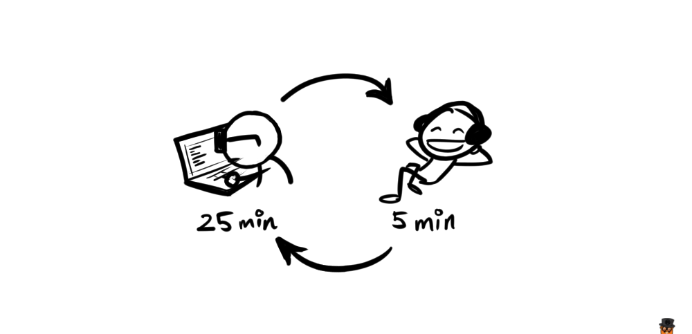

Về tính hiệu quả của phương pháp này thì các bạn có thể tự mình trải nghiệm và nhận xét, đối với cá nhân mình thì nó rất hiệu quả.

Hiện có rất nhiều phần mềm Pomodoro Timer trên máy tính, tuy nhiên cá nhân mình không thích chúng lắm, lý do thì đơn giản tại vì mình không thích thôi :v thế nên mình quyết định tìm một cái đồng hồ Pomodoro để bàn, nhỏ gọn để có thể đặt bên cạnh máy tính mỗi lúc làm việc.

Tuy nhiên sau khi xem một hồi thì cảm thấy mấy cái đồng hồ này nó khá là đơn giản, tại sao không thử build một cái mà phải đi mua, thế là bắt tay vào làm luôn :D

## Ý tưởng

Chúng ta sẽ thiết kế một chiếc đồng hồ hình hộp vuông, có dạng như thế này:

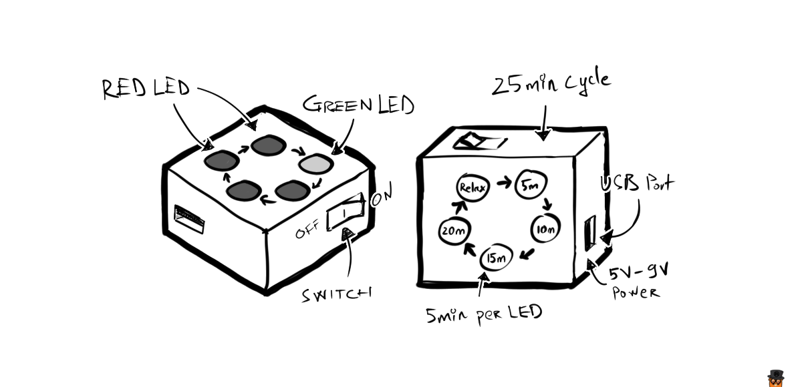

Theo đó, chiếc đồng hồ gồm có 4 chiếc đèn báo màu đỏ, thể hiện quá trình làm việc (working time), và 1 đèn báo màu xanh lá cây thể hiện quá trình nghỉ xả hơi (relax time). Sử dụng nguồn từ cổng USB (vì chúng ta thường dùng khi ngồi cạnh laptop mà :D) hoặc sử dụng pin.

Các đèn sẽ tự động chuyển lần lượt sau mỗi 5 phút để chúng ta dễ theo dõi thời gian. Và toàn bộ có **20 phút** working time, **5 phút** relax time.

## Chuẩn bị

Đầu tiên, thì có rất nhiều cách để làm được một mạch điện có chức năng như đã mô tả ở trên, ta có thể dùng các microcontroller như Arduino, tuy nhiên với một thiết bị nhỏ này, việc dùng Arduino là hơi bị overkill.

Ở các bài sau, có thể mình sẽ giới thiệu cách làm đồng hồ Pomodoro dùng Arduino hoặc ATTiny với các chức năng phức tạp hơn, như có thể điều chỉnh thời gian, tích hợp màn hình,...

Đối với chiếc đồng hồ Pomodoro mà chúng ta sẽ build, thì nó chỉ cần sử dụng một IC tạo xung là **NE555**, và một IC đếm xung **CD4017**.

Bạn cần chuẩn bị trước các linh kiện sau:

|                                   | Linh kiện | Số lượng |
|:---------------------------------:|:---------:|:--------:|
| 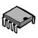 | IC NE555  | 1 |
| 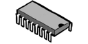 | IC 4017b  | 1 |
| 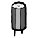 | Tụ $4700$ $\mu$ $F$ | 1 |
|  | Điện trở $39k$ $\Omega$ | 1 |
|  | Điện trở $12k$ $\Omega$    | 1 |
|  | Điện trở $330$ $\Omega$ | 1 |
|  | Đèn LED  | 5 |

Bạn cũng cần chuẩn bị thêm breadboard và dây nối (jump wire), hoặc board đục lỗ sẵn (stripboard, prototype board) và mỏ hàn.

Trước khi bắt đầu, chúng ta hãy cùng tìm hiểu sơ qua về 2 con IC này trước. Bạn nào đã biết thì có thể bỏ qua phần này :D

### IC Timer NE555

IC 555 là IC tạo xung được dùng rất nhiều trong các thiết bị điện tử. Để tìm hiểu sâu hơn về cấu tạo cũng như nguyên lý hoạt động, các bạn có thể tìm đọc thêm các tài liệu khác. Trong bài này mình sẽ chỉ giới thiệu sơ đồ pin out và các chân mà chúng ta sẽ dùng.

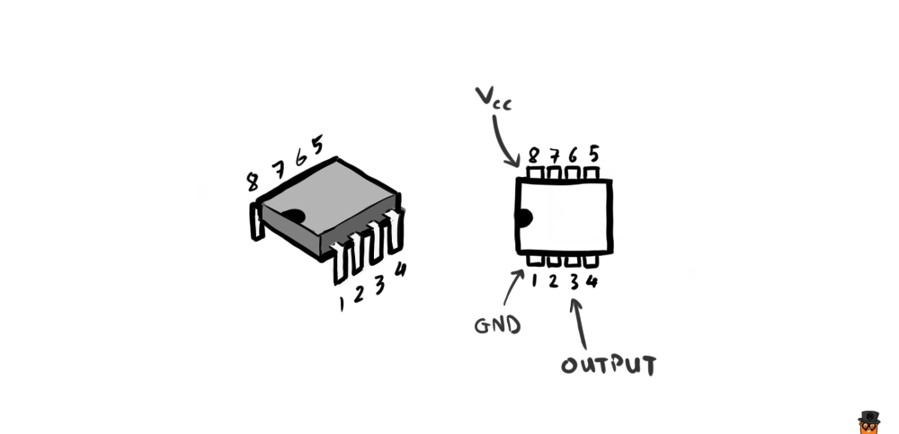

Các chân được đánh số từ 1 đến 8 theo sơ đồ trên, trên thân IC sẽ có một lỗ khuyết để giúp chúng ta xác định chân dễ hơn.

IC 555 có 3 chế độ hoạt động là Astable, Monostable và Bistable. Chúng ta sẽ sử dụng chế độ Astable. Với mạch như hình sau:

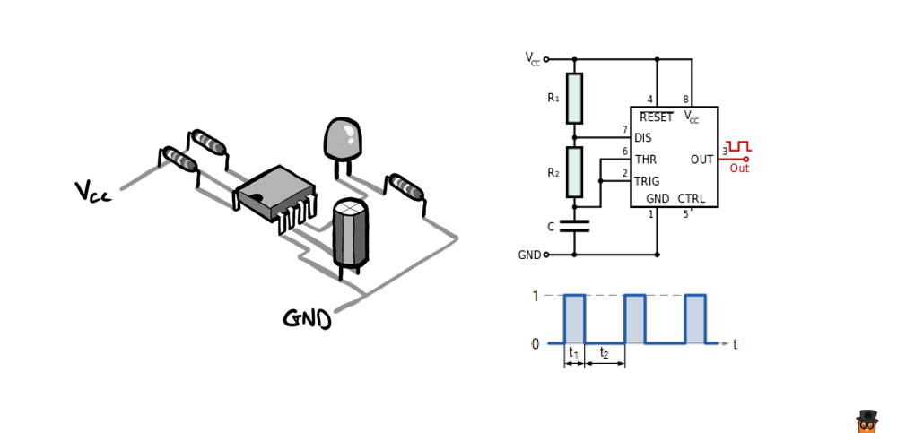

Mạch điện dùng IC 555 chạy ở chế độ Astable sẽ cho ra output là một chuỗi các xung vuông liên tục ở một tần số $f$ nhất đinh.

Tần số này thay đổi khi ta thay đổi các giá trị của điện trở $R_1$, $R_2$ và tụ điện $C$. Mối liên hệ này được thể hiện qua công thức:

<math>
f = \displaystyle\frac{1}{\ln(2) \cdot C \cdot (R_1 + 2R_2)} \tag{1}
</math>

Thời gian $t_1$ của các xung cao được tính bằng công thức:

<math>
t_1 = \ln(2) \cdot C \cdot (R_1 + R_2)
</math>

Thời gian $t_2$ của các xung thấp được tính bằng:

<math>
t_2 = \ln(2) \cdot C \cdot R_2
</math>

Từ đó ta có thể suy ra tổng thời gian $T$ của 1 chu kỳ dao động sẽ là:

<math>
T = \displaystyle\frac{1}{f} = t_1 + t_2 \tag{2}
</math>

Đơn vị của $R_1$, $R_2$ là Ohm ($\Omega$), và của $C$ là Farad ($F$).

Chúng ta sẽ sử dụng các công thức trên để tính ra giá trị của các linh kiện cần dùng khi bắt đầu phần sau.

### IC Decade Counter CD4017B

IC CD4017B là loại IC có khả năng thay đổi điện áp output ở mỗi chân lần lượt, dựa theo số lượng xung input. Có sơ đồ như sau:

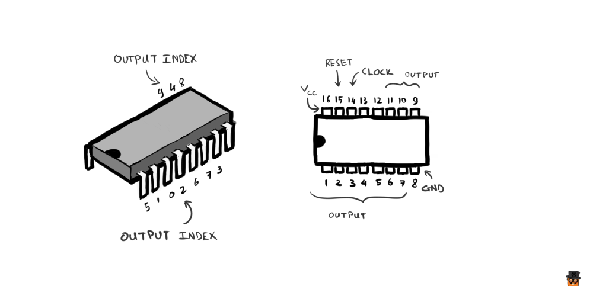

Các chân được đánh số theo thứ tự giống như IC 555, nhưng IC này có 16 chân. Các chân số $1, 2, 3, 4, 5, 6, 7$ và $9, 10, 11$ là các chân output. Tuy nhiên thứ tự sắp xếp của các output thì được bố trí như hình bên trái.

Khi chân số $14$ (CLOCK) nhận được tín hiệu điện áp cao (HIGH), thì bộ đếm trong IC sẽ tăng lên, và tín hiệu đầu ra ở vị trí tương đương sẽ trở thành HIGH. Cứ thế tiếp tục tăng dần từ $0$ đến $9$ và các pin out sẽ lần lượt trở thành HIGH.

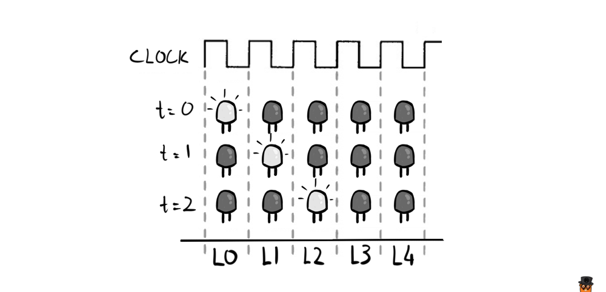

Hình trên minh họa thứ tự bật sáng của các đèn $L_0, L_1, L_2, L_3, L_4$ tương ứng với chu kỳ dao động truyền vào chân CLOCK.

Bộ đếm trở về vị trí số $0$ khi chân số $15$ (RESET) nhận được tín hiệu HIGH.

Đối với con này thì chỉ cần nhớ mấy thứ "ngắn gọn" vậy thôi, không có công thức gì cả, khỏe, hề hề :D

## Prototyping

Vì quá trình prototyping cần rất nhiều lần thay đổi cả về thiết kế lẫn linh kiện, cho nên chúng ta có thể sử dụng máy tính để làm việc này trước, rồi sau đó hiện thực hóa nó trên breadboard sau.

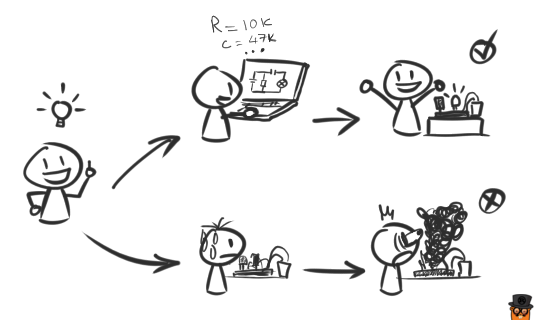

Bạn có thể dùng một phần mềm mô phỏng mạch điện bất kỳ cho bước này. Nếu có điều kiện, hãy xài **Proteus** hoặc **Circuit Wizard**. Tiếc là trên Mac và Linux vẫn chưa thấy có phần mềm mô phỏng nào xịn, tuy nhiên nếu chạy bằng Wine thì **Circuit Wizard** hoạt động rất tốt.
 
 
_Ngoài ra, còn có một tool mô phỏng online đó là [Autodesk Circuits](https://circuits.io/lab), mô phỏng được cả Arduino (tất nhiên là lập trình được luôn), nhưng lại thiếu nhiều loại IC cơ bản như 4017b. Cho nên ở bài này chúng ta sẽ ko dùng._

Có thể bạn sẽ nhận ra là chức năng của chiếc đồng hồ Pomodoro đã nêu ở đầu bài về bản chất nó hoàn toàn giống với một mạch đèn LED "chạy đuổi".

Vậy nên thứ chúng ta sẽ prototype chính là một mạch đèn chạy đuổi đơn giản, dùng IC 555 để tạo xung và dùng IC 4017b để hiển thị lần lượt từng đèn LED để báo thời gian.

Ở phần trên chúng ta đã nắm được cách sử dụng 2 loại IC này, vậy làm sao để phối hợp chúng với nhau?

Mạch điện của chúng ta sẽ gồm 2 module: **Tạo xung** và **Chạy đuổi**.

### Module tạo xung

Module tạo xung như đã nói ở phần trước, thực chất chỉ là một mạch dao động xài IC 555 hoạt động ở chế độ Astable:

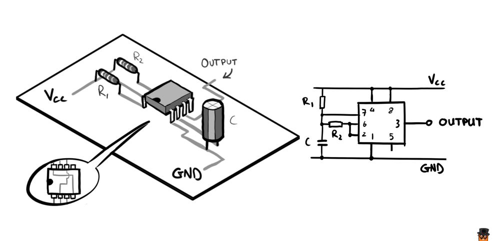

Lưu ý, như sơ đồ trên, thì đối với IC 555, chân số 4 sẽ nối với chân sô 8, và chân số 2 sẽ nối với chân số 6.

Giả sử với điện trở $R_1 = 10k \Omega$, điện trở $R_2 = 47k \Omega$ và tụ điện $C = 10 \mu F$, dựa vào công thức $(1)$ ta có thể tính được tần số dao động là:

<math>
f = \displaystyle\frac{1}{\ln(2) \cdot 10^{-5} \cdot (10000 + 2 \cdot 47000)} \approx 1.388 Hz
</math>

Như vậy thời gian của một chu kỳ dao động sẽ vào khoảng $T = \displaystyle\frac{1}{f} = 0.72$ giây.

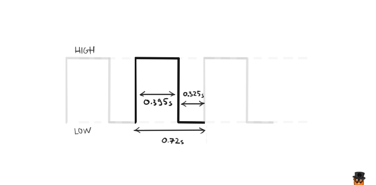

Mục đích của chúng ta là tạo ra mạch với chu kỳ dao động vào khoảng $5$ phút, tức là $T = 300$ giây. 

Dựa theo phần lý thuyết ở trên, việc ta cần làm là thay đổi thông số của các linh kiện trong mạch, mà cụ thể ở đây là $R_1$, $R_2$ và $C$. Có rất nhiều cách thay đổi để chúng ta đạt được con số $T$ như đã nói ở trên. Ví dụ:

| $R_1$ | $R_2$ | $C$ |
|:-----:|:-----:|:---:|
| 10k $\Omega$  | 39k $\Omega$  | 5000 $\mu$ $F$ |
| 12k $\Omega$  | 39k $\Omega$    | 4700 $\mu$ $F$ |
| 15k $\Omega$  | 47k $\Omega$  | 3900 $\mu$ $F$ |
| 330k $\Omega$  | 487k $\Omega$  | 330 $\mu$ $F$ |
|  | ... | |

Bạn có thể chọn 2 linh kiện bất kì và tính toán thông số của linh kiện còn lại dựa theo các công thức $(1)$, $(2)$.

Việc lựa chọn tùy thuộc vào ý đồ thiết kế và khả năng bạn kiếm được loại linh kiện như thế nào. Tại Việt Nam thì các bạn có thể đặt mua linh kiện online tại [IoT Maker](https://iotmaker.vn/in-tr-1-4w.html). Hồi mình còn ở Đà Nẵng thì mình hay tìm mua ở mấy cửa hàng bên hông chợ Cồn, phía đường Ông Ích Khiêm, hoặc cửa hàng [ChipViet](http://chipviet.vn/) đường Đoàn Thị Điểm. 

Để dễ hình dung, thì đây là hình so sánh kích thước giữa 2 loại tụ điện $4700\mu F$ và $330\mu F$, so với kích thước của một chiếc đèn LED.

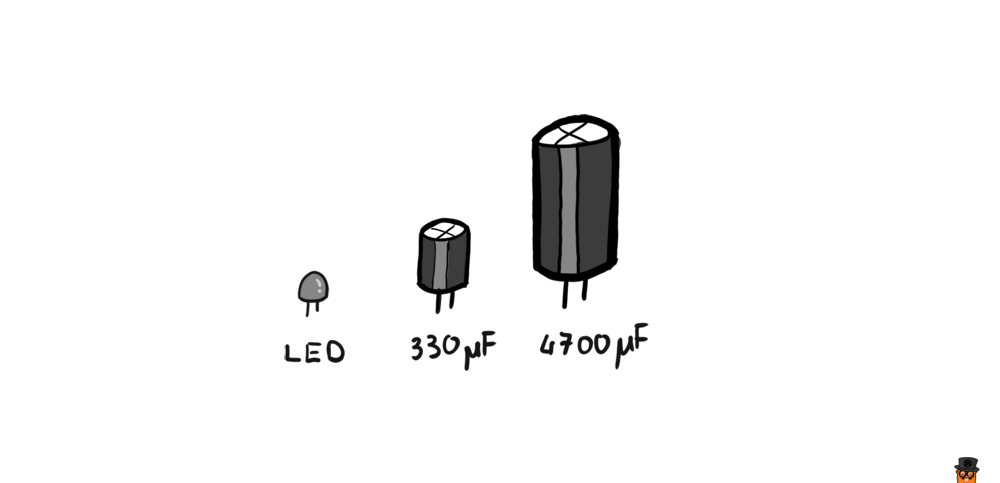

Các linh kiện mình chọn có thông số như sau: $R_1 = 12k\Omega$, $R_2 = 39k\Omega$ và $C = 4700\mu F$. Lý do thì đơn giản là vì lúc đi mua chỉ tìm ra những loại đó =)))

### Module LED chạy đuổi

Tiếp theo, ta thiết kế mạch đèn LED chạy đuổi sử dụng IC 4017b, tiép nhận tín hiệu đầu vào là từ Output của **module tạo xung** ở trên.

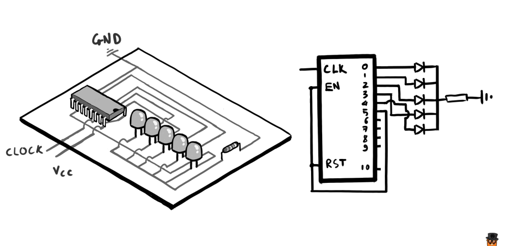

Chúng ta chỉ sử dụng 5 đèn, nên chỉ cần các chân số $2, 3, 4, 7$ và $10$. Ở vị trí đèn thứ 6 (chân số $1$), chúng ta nối nó vào chân `RESET` để bộ đếm tự động nhảy về $0$ khi chạy đến đèn này.

### Lắp ráp

Cuối cùng ta lắp 2 module này lại với nhau để được một mạch hoàn chỉnh:

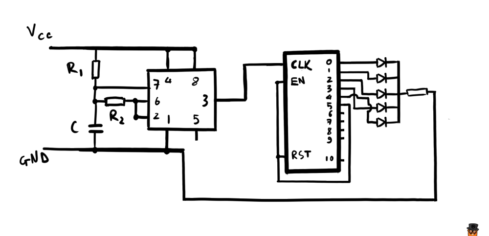
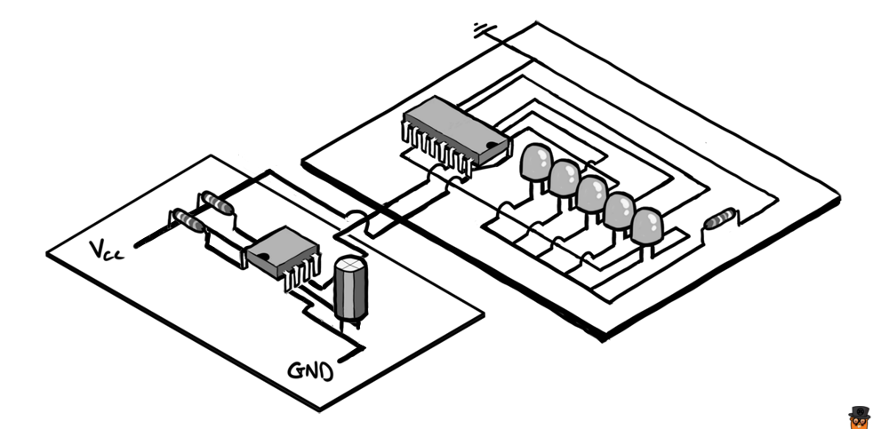

Bạn có thể bố trí các LED như thế nào tùy ý. Trên hình minh họa thì mình bố trí theo 1 đường thẳng để dễ hình dung cách đi dây. Trên thực tế, để đúng như bản thiết kế ban đầu, ta có thể bố trí các LED theo hình vòng tròn, như sau:

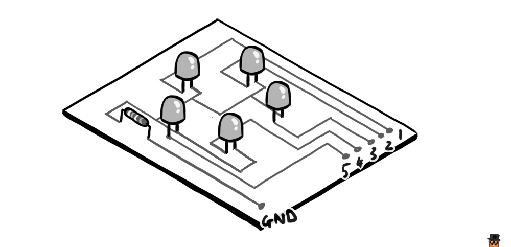

Đây là hình hình ảnh demo mạch trên, sử dụng tụ $10 \mu F$ cho thời gian của một chu kỳ đèn sáng là $0.72$ giây.

Hình hơi bự (5MB) nên load hơi lâu :D

Đèn xanh báo trạng thái nghỉ xả hơi, đèn đỏ báo trạng thái khi làm việc.

Còn đây là khi dùng tuj $4700 \mu F$, cho chu kỳ đèn sáng ~5 phút:

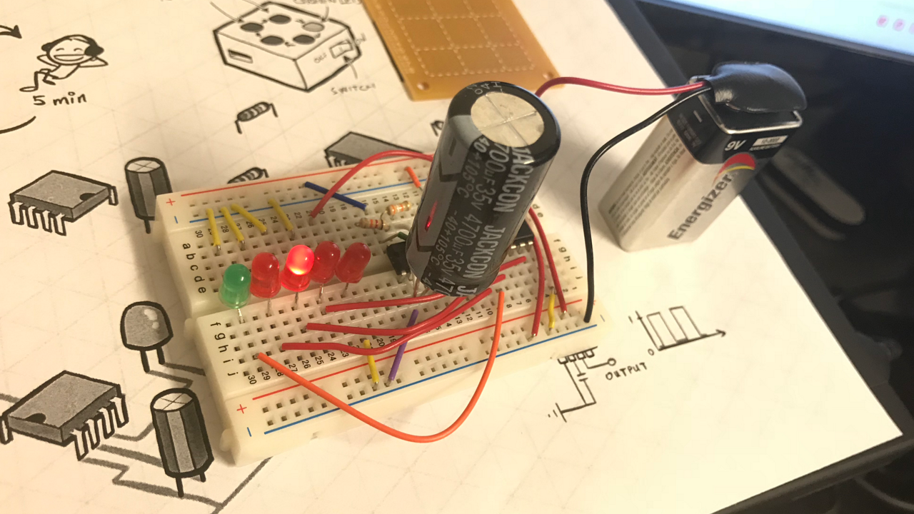

Và tất nhiên là prototype nên chưa có gì hấp dẫn cả...

## Tiếp theo thì làm gì?

Bây giờ bạn đã có bản prototype hoạt động được. Với đầy đủ thông số linh kiện cần thiết.

Sau đó, bạn có thể chuyển bản prototype này thành mạch in và thiết kế vỏ hộp để tăng tính thẫm mỹ cho sản phẩm.

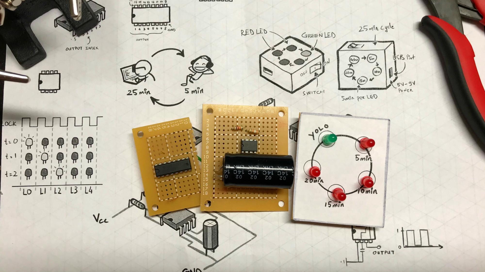

Cái này vẫn là prototype thôi =)))

Tiếp theo có thể đem cất đi, hoặc tặng cho bạn gái, hoặc đem bán, kêu gọi đầu tư, rồi thì startup các kiểu... :v tùy bạn.

Bước tiếp theo bạn có thể thêm vào các chức năng phụ thêm để làm cho chiếc đồng hồ trở nên hữu ích hơn, ví dụ như: thêm loa hú (hú mỗi 5 phút 1 lần, chứ ko phải hú 1 lần 5 phút nhé :))), thêm kim đồng hồ xoay, thêm màn hình hiện thông tin (thực ra để làm được như này thì phải đụng tới MCU rồi),... ở các bài sau mình sẽ giới thiệu các mạch Pomodoro với nhiều chức năng phụ đa dạng hơn.
