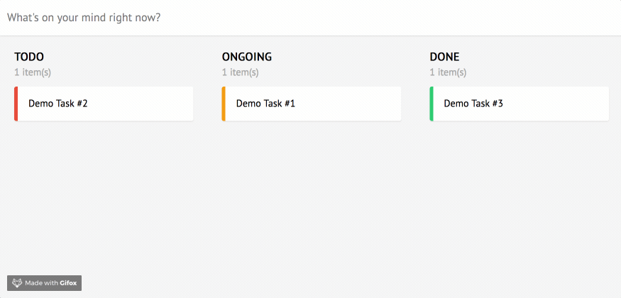

Dịp cuối tuần vừa rồi thì mình cũng bắt đầu học Elm và làm thử 1 [project nho nhỏ](https://github.com/huytd/kanelm), mục đích là clone lại Trello chơi.



Trong quá trình làm thì cũng nhận thấy có nhiều thứ cần phải note lại.

[Elm](http://elm-lang.org/) là một ngôn ngữ lập trình hàm (functional programming language) khá thú vị, chịu ảnh hưởng khá nhiều từ Haskell, và được biên dịch trực tiếp ra JavaScript.

Ngoài việc giống Haskell ra thì điểm nổi bật nhất của Elm chính là [kiến trúc](https://guide.elm-lang.org/architecture/) của nó (Elm Architecture) , giúp cho việc phát triển web apps với các ngôn ngữ functional programming trở nên dễ dàng hơn. Redux của hội React cũng chịu ảnh hưởng lớn từ kiến trúc này.

## Records

Records trong Elm là một khái niệm tương đồng với Objects trong JavaScript, tuy nhiên có vài điểm khác:

- Không thể truy xuất một field không tồn tại: Compiler sẽ báo lỗi chứ ko trả về `undefined` như JS.
- Không có field nào được mang giá trị `undefined` hay `null` cả.
- Không được khai báo object lồng nhau với từ khóa `this` hoặc `self`

Để khai báo một record thì khá đơn giản, giống với JS:

```
hero : { name : String, level : Int }
hero = {
  name  = "Shadow Fiend",
  level = 1
}
```

Điểm khác biệt là khi chúng ta update một record, thì Elm sẽ trả về một record mới, vì một record là immutable:

```
hero = { hero | level = 25 }
```

Để tìm hiểu thêm, bạn có thể đọc [tài liệu về Records](http://elm-lang.org/docs/records) của Elm.

## Data Driven

Với Elm Architecture, chúng ta không cần phải (và không thể) tương tác trực tiếp với một DOM element nào cả, thay vào đó, chúng ta tương tác với dữ liệu (data) biểu diễn element đó. Mọi thao tác mà người dùng thực hiện trên web app của bạn, đều là việc tương tác (cập nhật) với các dữ liệu này.

_Nếu bạn đã biết khái niệm data binding trong các framework khác như React hay Angular, thì đây chính là nó đó._

Ví dụ trong project của mình, các `task` hiển thị trên màn hình được biểu diễn bằng một `List` trong Model, như sau:

**src/Models.elm**
```
type alias Task = {
  name: String,
  status: String
}

type alias Model = {
  tasks: List Task,
  ...
}
``` 

Để hiển thị các task ra màn hình, việc chúng ta cần làm chỉ là hiển thị từng item có trong `List` đó, thông qua sự hỗ trợ của `Html` helper:

**src/Views.elm**
```
taskItemView : Int -> Task -> Html Msg
taskItemView index task =
  li [ class "task-item" ] [ text task.name ]
```

Khi user muốn thêm một task mới, việc chúng ta làm là tương tác với Model để add thêm một task:

**src/Models.elm**
```
addNewTask : Model -> ( Model, Cmd Msg )
addNewTask model =
  let
     newModel = { model | tasks = model.tasks ++ [ newTask ] }
  in
    ( newModel, Cmd.none )
```

Elm sẽ tự thực hiện phần việc bên dưới, bao gồm: kiểm tra sự thay đổi của Model, update lại DOM (như là thêm, xóa, update các element,...) tương ứng.

## "Tương tác" với DOM element

Như đã nói ở phần vừa rồi, chúng ta không thể tương tác với bất kì một DOM element nào, vậy khi cần... tương tác thì phải làm sao?

Ví dụ chúng ta có một textbox và muốn lấy nội dung của nó (thuộc tính `value`).

Việc đầu tiên chúng ta cần làm chính là định nghĩa phần dữ liệu để biểu diễn nó, mà ở đây chúng ta tạo một trường mới trong Model:

**src/Models.elm**
```
type alias Model = {
  ...
  taskInput: String,
  ...
}
```

Tiếp theo, chúng ta sẽ thực hiện "binding" phần data này với textbox:

**src/Models.elm**
```
type Msg = ... | TextInput String
```
**src/Main.elm**
```
view : Model -> Html Msg
view model =
  ...
  input [ type_ "text", 
          placeholder "What's on your mind right now?",
          onInput TextInput,
          value model.taskInput
        ] []
  ...
```

Khi người dùng gõ vào textbox, sự kiện `onInput` được trigger, chúng ta sẽ phát đi một Message tạm gọi là `TextInput` kèm theo một tham số kiểu `String` để update giá trị của `Model.textInput`.

**src/Main.elm**
```
update : Msg -> Model -> ( Model, Cmd Msg )
update msg model =
  case msg of
    ...
    TextInput content -> 
      ( { model | taskInput = content }, Cmd.none )
```

Như vậy, tại bất kì thời điểm nào, chúng ta cũng có thể lấy được nội dung của textbox thông qua giá trị `Model.textInput`, hoặc thay đổi nó thành một giá trị khác.

## Side effects

Một đặc điểm của functional programming đó là việc hạn chế side effect, mỗi một hàm được viết ra đều chỉ thực hiện một việc duy nhất (pure function). Nghe qua thấy khà là mâu thuẫn đối với việc làm web, vì side effects là một phần tất yếu của các web apps (HTTP calls, Web socket,...).

Elm có một loại effect gọi là **managed effects**. Và cũng tương tự như khi làm việc với DOM, đối với managed effects, chúng ta khai báo data để biểu diễn thao tác mà chúng ta muốn thực hiện, Elm sẽ lo phần còn lại.

Có 2 kiểu managed effects chúng ta có thể dùng trong `Commands` và `Subscriptions`.


- **Commands** là các thao tác mà chúng ta muốn thực hiện (ví dụ: HTTP call, "bắn" một message khác,...)
- **Subscriptions** là thao tác listen một message hay một event nào đó, ví dụ nhận tín hiệu từ web socket,...

Trong project mà mình giới thiệu, khi muốn gọi một hàm `setStorage` để lưu dữ liệu vào _localStorage_ sau khi add một task mới, ta có thể gọi nó dưới dạng một command, ở đây là `setStorage`:

**src/Models.elm**
```
addNewTask : Model -> ( Model, Cmd Msg )
addNewTask model =
  ( newModel, setStorage newModel )
```

## Kết nối với JavaScript thông qua Ports

Để tương tác được với JavaScript (ví dụ sử dụng thư viện, sử dụng các hàm JS đã được viết trước đó,...), chúng ta có thể kết nối thông qua [Ports](https://guide.elm-lang.org/interop/javascript.html).


<div class="center copyright">Nguồn: https://twitter.com/pragmaticstudio/status/847919629821517827</div>

Việc khai báo một `port` từ phía Elm khá đơn giản, ví dụ đây là đoạn code khai báo hàm `setStorage`, hàm này trả về một Command, và sẽ được gọi từ phía JavaScript.

**src/Models.elm**
```
port setStorage : Model -> Cmd msg
```

Từ khóa `port` đóng vai trò tương tự như `extern` trong C.

Ở phía JavaScript, ta viết:

**main.js**
```javascript
app.ports.setStorage.subscribe(function(model) {
  // Do something
});
```

Như vậy, khi command `setStorage` được gọi từ phía Elm, phía JavaScript sẽ nhận được message này kèm với dữ liệu đi kèm (là Model) và thực hiện việc xử lý trong hàm callback của lệnh `subscribe`.

## Pattern Matching

Pattern Matching là một phương pháp khá là hữu ích, xuất hiện trong nhiều ngôn ngữ lập trình, trong đó có cả Rust và Elm.

Việc sử dụng pattern matching trong Elm phụ thuộc nhiều vào cú pháp `case .. of`, ví dụ sau đây là một hàm kiểm tra một `List` có rỗng hay không:

```
isEmpty : List a -> Bool
isEmpty xs =
    case xs of
        [] ->
            True

        _ ->
            False
```

Nếu `a` là một List rỗng `[]` thì trả về True, ngược lại nếu nó match với một giá trị bất kì thì trả về False.

Hoặc ta có thể sử dụng pattern matching để viết hàm tính số Fibonacci:

```
fibo : Int -> Int
fibo n =
  case n of
    0 -> 1
    1 -> 1
    _ -> fibo (n-1) + fibo (n-2)
```

Đối với dân Haskell thì sẽ thấy cách viết này hơi khó chịu một tí, vì đã quen với cách viết của bên đó là:

```
fibo : Int -> Int
fibo 0 = 1
fibo 1 = 1
fibo n = fibo (n-1) + fibo (n-2)
```

Tuy như vầy có "đẹp" hơn, nhưng anh bạn tác giả của Elm lại [không thích](https://github.com/elm-lang/elm-compiler/issues/973), nên anh ấy quyết định không đưa chức năng này vào :joy:.

Ngoài ra thì pattern matching còn làm được rất nhiều việc khác, rất là hữu dụng trong quá trình viết code Elm, các bạn có thể tham khảo ở gist [Elm Destructuring cheatsheet](https://gist.github.com/yang-wei/4f563fbf81ff843e8b1e).

---

Nhìn chung, Elm là một ngôn ngữ đáng để học, nhất là nếu bạn đã có sẵn background về lập trình (thường là imperative programming) và đang muốn dòm ngó sang functional programming thì Elm thực sự là điểm khởi đầu khá tốt.
