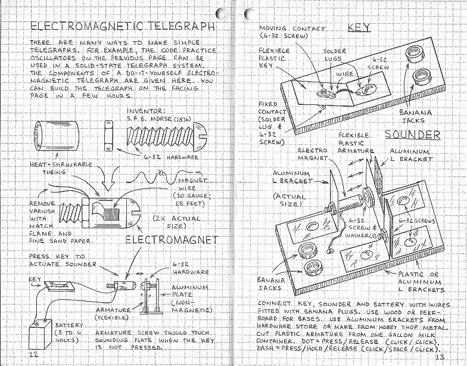

Đây là một quyển trong bộ sách **Engineer's Mini-Notebook** được phát hành năm 1987 bởi Radio Shack, một thương hiệu bán đồ linh kiện điện tử khá nổi tiếng ở Mỹ, vẫn còn hoạt động cho đến ngày hôm nay.

Quyển sách này giới thiệu các mạch điện ứng dụng trong truyền tin vào những năm đó. Một điểm đặc biệt là quyển sách này được viết và vẽ bằng tay hoàn toàn.

Bên cạnh các mạch điện ứng dụng thì quyển sách này còn cung cấp rất nhiều kiến thức nền cơ bản với các minh họa rất trực quan và ngắn gọn (còn có cả sơ đồ cách đọc màu điện trở và công thức định luật Ohm luôn), kèm theo đó là dữ kiện về các mốc thời gian và các sự kiện diễn ra xuyên suốt lịch sử ngành điện tín.

Các bạn có thể tìm đọc [bản scan online tại Archive.org](https://archive.org/details/Forrest_Mims-Engineers_Mini-Notebook_-_Communications_Projects_Radio_Shack_Elec) hoặc mua [bản sách giấy trên Amazon](https://www.amazon.com/Communications-Projects-Engineers-Mini-Notebook-Forrest/dp/B000LPV10W) nếu thích.
