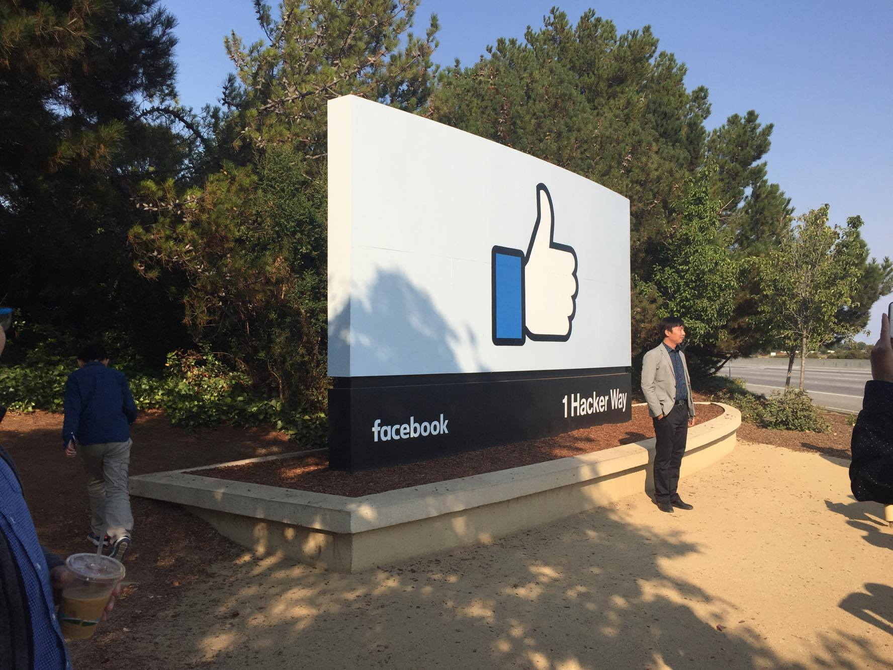
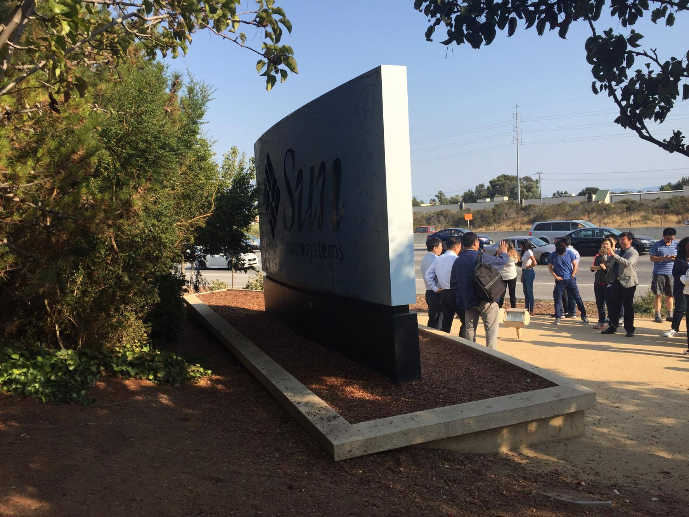

Ngày hôm qua mình có dịp đến tham quan campus của Facebook ở Palo Alto.

Nói về mấy cái ấn tượng ở đây thì chắc cũng nhiều người đã kể về nó trước rồi. Chỉ có một điểm đáng chú ý nhất là cái bảng hiệu có biểu tượng Like đặc trưng của Facebook đặt ở ngay cổng vào khu campus.

Điều "bất ngờ" (không bất ngờ mấy vì báo chí cũng có nhắc đến đâu đó rồi) đằng sau lưng tấm bảng này là logo của Sun Microsystem. Nhìn rất chi là thê thảm.

Facebook mua lại khu campus này của Sun và cải tạo nó thành môi trường làm việc của mình, nhưng lý do gì mà một hãng công nghệ lớn tới mức đồ ăn thức uống để sẵn trong tủ lạnh, đặt ở gần như là mọi gốc cây trong khu campus rồi cho ăn uống thả ga lại không có tiền xây mới cái bảng hiệu mà phải tận đụng dến mức như thế này? 

Thực ra ý nghĩa đằng sau cái bảng hiệu này là lời nhắn nhủ của Mark Zuckerberg dành cho các nhân viên: 

> "Nếu đã ở trên đỉnh thành công mà không chịu thay đổi, sáng tạo thì một ngày nào đó, đây sẽ là kết cục của bạn"

Sun Microsystem từng là một cái tên sáng giá trong làng công nghệ, nhưng kết cục là bị Oracle mua lại vào năm 2009 và hoàn toàn biến mất khỏi ngành công nghệ.

Hay như gần đây thì là kết cục giống như Yahoo, Nokia,...

Có hình rõ hơn copy từ trên [Business Insider](http://www.businessinsider.com/why-suns-logo-is-on-the-back-of-facebooks-sign-2014-12):

Nhưng nếu đặt mình vào vị trí của một người đứng trên đỉnh thành công để ghi nhớ lời nhắc nhở này thì chắc cũng xa vời quá. 

Đứng ở góc độ một người làm kĩ thuật đơn thuần, đây cũng là một lời nhắc nhở rất có ý nghĩa. Chắc hẳn các bạn đi làm cũng từng tiếp xúc với những anh "tiền bối" có 5, 6 năm kinh nghiệm nhưng quanh năm suốt tháng chỉ làm mỗi 1 thứ công nghệ, và vì "nó đủ dùng cho công việc rồi", anh ta không cần học / và cũng không học được bất kì thứ công nghệ mới nào nữa. 

Có lẽ nhiều người cho đó là điều cần thiết, vì phải master được một cái gì đó, "nhất nghệ tinh nhất thân vinh". Nhưng cá nhân mình không nghĩ đó là hay ho. Vì công nghệ là thứ thay đổi từng ngày một, nếu một người làm công nghệ mà có đầu óc bảo thủ, không biết cân bằng giữa việc "nghệ tinh" và việc live on the edge thì kết cục cũng sẽ giống như Sun mà thôi :))

Và thêm nữa, là Java, C++ hay JavaScript, Ruby on Rails, mỗi thứ này không phải là một cái nghề, mà "lập trình" mới là một cái nghề, việc master mỗi một món Java hay Ruby chỉ đơn giản là master **một** kĩ thuật trong nghề lập trình mà thôi. Nên đừng lấy đó làm lý do để tự vỗ về sự lười biếng của bản thân.
