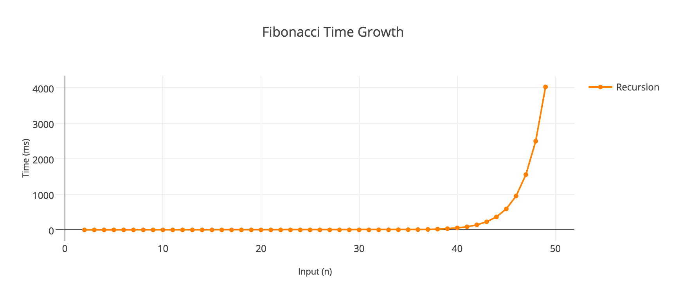

Cuối tuần này có nói chuyện với bác [@haond](http://kipalog.com/users/nguyenduyhao1111/mypage) về một đề tài khá là thú vị, đó là bài toán: **Tính tổng các số Fibonacci từ 1 tới 4 triệu**

## Giải pháp đơn giản

Để tính một số Fibonacci thì cực kì đơn giản, chỉ cần làm theo công thức: 

<pre class="math">
$F_{n}=F_{n-1}+F_{n-2}$
</pre>

Code thì khá là đơn giản bằng cách dùng đệ quy: 

```
func Fibonacci(n: Int) -> Int {
  if n <= 2 {
    return 1
  }
  return Fibonacci(n - 1) + Fibonacci(n - 2)
}
```

Hoặc dùng vòng lặp để khử đệ quy:

```
func Fibonacci(n: Int) -> Int {
  var a = 0
  var b = 1
  var next = 0
  for i in 0..<n {
    if i <= 1 {
      next = i
    } else {
      next = a + b
      a = b
      b = next
    }
  }
  return next
}
```

Quay lại bài toán tính tổng các số Fibonacci, ta có thể implement một hàm tính tổng đơn giản như sau:

```
func Sum(n: Int) -> Int {
  var sum = 0
  for i in 0..<n {
    sum += Fibonacci(n)  
  }
  return sum
}
```

Tuy nhiên thì với thuật toán như vậy, chúng ta có gặp phải vấn đề gì không? 

Câu trả lời là có, vấn đề rất lớn!

Đầu tiên hãy nhìn vào đồ thị biểu diễn thời gian cần để tính Fibonacci dưới đây:



Dễ nhận thấy, với số n càng lớn, thì thời gian để tính Fibonacci của số đó càng lâu.

Cho nên đối với bài toán ở đây là tính tổng các số Fibonacci từ 1 tới 4 triệu, thì xét về yếu tố thời gian, điều này cũng trở thành một vấn đề bất khả thi rồi. Để giải quyết bài toán này, chúng ta cần phải loại trừ được vấn đề thời gian do chạy đệ quy hoặc việc lặp gây ra.

Vì mọi vấn đề liên quan đến số học đều, hiển nhiên, có thể biểu diễn được bằng toán học, vậy đây cũng không phải là ngoại lệ, hãy xem chúng ta có thể mượn được gì từ toán nào.

## Công thức tính tổng n số Fibonacci

Chúng ta có công thức tính tổng n số Fibonacci với mọi số n >= 2 như sau:

<pre class="math">
$$\mbox{S}_{n}\;=\;\sum_{i=1}^{n}{F_{i}}=\;F_{n+2}\; -\; 1$$
</pre>

Nếu không tin tưởng vào công thức, thì các bạn có thể tham khảo [chứng minh công thức tại đây](https://proofwiki.org/wiki/Sum_of_Sequence_of_Fibonacci_Numbers#Proof)

Vậy để tính tổng các số Fibonacci từ 1 tới 4 triệu, chúng ta có thể **tìm số Fibonacci thứ 4 triệu lẻ 2 (4,000,002) rồi trừ giá trị này đi cho 1**. Bài toán quay trở về tìm một số Fibonacci bất kì.

Tuy nhiên, 4 triệu lẻ 2 vẫn là một con số quá lớn để có thể tính toán bình thường trên một máy tính cá nhân (với các yếu tố như: tốc độ xử lý, giới hạn bộ nhớ, giới hạn của kiểu dữ liệu,...). Chúng ta cần tìm một giải pháp khác ít tốn kém hơn.

## Công thức tìm một số Fibonacci bất kì

### Sử dụng công thức Binet

Chúng ta có thêm công thức [Binet](http://mathworld.wolfram.com/BinetsFibonacciNumberFormula.html) để tìm một số Fibonacci bất kì như sau:

<pre class="math">
$$F_{n}\;=\;\frac{\phi ^{n}\; -\; \left( -\phi  \right)^{-n}}{\sqrt{5}}$$
</pre>

Chi tiết về kí hiệu <code class="math">$\phi$</code> (phi): Xem [tỉ lệ vàng](http://mathworld.wolfram.com/GoldenRatio.html)

Công thức trên có thể được khai triển thành: 

<pre class="math">
$$F_{n}\;=\;\frac{\left( 1\; +\; \sqrt{5} \right)^{^{n}}\; -\; \left( 1\; -\; \sqrt{5} \right)^{^{n}}}{2^{^{n}}\sqrt{5}}$$
</pre>

Áp dụng 2 công thức trên, chúng ta có thể loại bỏ hoàn toàn việc sử dụng đệ quy hoặc vòng lặp, và điều này sẽ cải thiện tốc độ tính toán một cách đáng kể.

Cách implement thì cực kì đơn giản: 

```
import Foundation

func Fibonacci(n: Double) -> Double {
  return (pow((1.0 + sqrt(5.0)), n) - pow((1.0 - sqrt(5.0)), n)) / (pow(2.0, n) * sqrt(5.0))
}

func Sum(n: Double) -> Double {
  return Fibonacci(n: n + 2.0) - 1.0
}
```

Một nhược điểm duy nhất của cách này là việc tính toán với căn bậc 2 trên máy tính sẽ dẫn tới tình trạng làm tròn số và sẽ xuất hiện sai số nhất định khiến cho giá trị không thực sự chính xác.

### Sử dụng ma trận

Sau khi viết bài này thì được a [@kiennt](http://kipalog.com/users/kiennt/mypage) giới thiệu thêm một cách khác, đó là dùng ma trận.

Quay trở lại công thức tính một số Fibonacci: 

<pre class="math">$$F_{n}=F_{n-1}\; +\; F_{n-2}$$</pre>

Đồng nghĩa với: 

<pre class="math">$$F_{n+2}=F_{n+1}+F_{n}$$</pre>

Vì vậy ta có thể biểu diễn dưới dạng ma trận như sau:

<pre class="math">
$$\left[ \begin{array}{c} F_{n+2} \\ F_{n+1} \end{array} \right]\; =\; \left[ \begin{array}{c} F_{n+1}\; +\; F_{n} \\ F_{n+1} \end{array} \right]\; =\; \left[ \begin{array}{cc} 1 & 1 \\ 1 & 0 \end{array} \right]\; \left[ \begin{array}{c} F_{n+1} \\ F_{n} \end{array} \right]$$
</pre>

Nếu không tin thì các bạn cứ thử tự chứng minh đi :3, tiếp, ta cũng có thể viết lại biểu thức trên thành:

<pre class="math">
$$\left[ \begin{array}{c} F_{n+1} \\ F_{n} \end{array} \right]\; =\; \left[ \begin{array}{cc} 1 & 1 \\ 1 & 0 \end{array} \right]\; \left[ \begin{array}{c} F_{n} \\ F_{n-1} \end{array} \right]$$
</pre>

Và sau khi thực hiện một vài phép tính toán đơn giản trên ma trận chúng ta thu được kết quả sau:

<pre class="math">
$$\left[ \begin{array}{c} F_{n+1} \\ F_{n} \end{array} \right]\; =\; \left[ \begin{array}{cc} 1 & 1 \\ 1 & 0 \end{array} \right]^{n}\; \left[ \begin{array}{c} F_{1} \\ F_{0} \end{array} \right]$$
</pre>

Với `F(1) = 1` và `F(0) = 0`. Bài toán quay trở về dạng bài toán nhân 2 ma trận 2x2 và nhân một ma trận 2x2 với một ma trận 2x1. 

Dưới đây là đoạn implement bằng Python của a [@kiennt](http://kipalog.com/users/kiennt/mypage):

```
def mul_metrix_1(m1, m2):
    return (
        m1[0][0] * m2[0] + m1[0][1] * m2[1],
        m1[1][0] * m2[0] + m1[1][1] * m2[1]
    )


def mul_matrix(m1, m2):
    """
    matrix m1, m2 is 2x2 matrix which is respresend like
    ((r00, r01), (r10, r11))
    """

    return (
        (m1[0][0] * m2[0][0] + m1[0][1] * m2[1][0], m1[0][0] * m2[0][1] + m1[0][1] * m2[1][1]),
        (m1[1][0] * m2[0][0] + m1[1][1] * m2[1][0], m1[1][0] * m2[0][1] + m1[1][1] * m2[1][1])
    )


def pow_matrix(m, n):
    """ m is 2x2 matrix """
    if n == 1:
        return m
    elif n % 2 == 0:
        a = pow_matrix(m, n / 2)
        return mul_matrix(a, a)
    else:
        return mul_matrix(pow_matrix(m, n - 1), m)


def fibo(n):
    if n == 0:
        return 1
    if n == 1:
        return 1

    a = ((1, 1), (1, 0))
    an = pow_matrix(a, n)
    pair_0 = (1, 1)
    pair_n = mul_metrix_1(an, pair_0)
    return pair_n[1]


for i in xrange(2, 10):
    print fibo(i)
```

Xin chân thành cảm ơn ae nhóm **#hardcore** của cộng đồng Ruby Việt Nam đã tích cực thảo luận để tổng hợp thành bài viết này.

Hy vọng bài viết phần nào giúp cho các bạn nhận ra sự quan trọng của việc ứng dụng toán học, đặc biệt là việc sử dụng ma trận vào giải quyết các bài toán phức tạp. Viết xong bài tổng hợp này mình vẫn còn ngồi vắt tay lên trán mà suy nghĩ, giá mà hồi đó mình chăm học toán hơn thì tốt biết mấy :joy:
