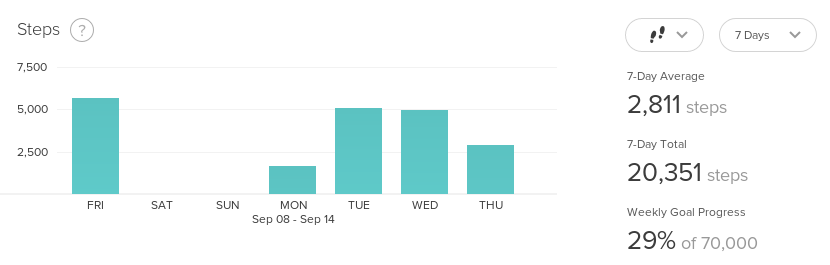

Đối với lĩnh vực Frontend nói riêng, chuyện học hay luyện các kĩ năng phân tích thiết kế thuật toán là một kĩ năng bị xem nhẹ nhất. Vì lý do đơn giản, chúng ta không thấy nhiều về tính ứng dụng của nó vào công việc thực tế.


Nhưng đây là sai lầm lớn nhất của đại đa số Frontend Developers.

Trên thực tế, chúng ta phải đối mặt với các vấn đề cần phải sử dụng thuật toán, và cần phải vận dụng các kĩ năng phân tích thiết kế thuật toán gần như là hằng ngày. Nhưng rất ít khi chúng ta nhận ra.

Đây cũng là lý do mà mình viết sê-ri **Algorithm in Frontend** này, xoay quanh những kinh nghiệm thực tế mà mình đã gặp phải trong thời gian làm việc, phần lớn là trong hai lĩnh vực sản phẩm mình đã/đang làm là Realtime Infrastructure Monitoring (theo dõi hạ tầng CNTT thời gian thực) và Health Care (chăm sóc sức khỏe).

Bài đầu tiên nói về vấn đề **Xử lý dữ liệu trên Frontend**.

## Đặt vấn đề

Nếu các bạn có đọc bài [phỏng vấn](https://toidicodedao.com/2017/07/06/phong-van-anh-huy-tran-silicon-valley/) của mình trên blog Tôi Đi Code Dạo, thì có lẽ các bạn đã biết, công việc chính của mình hiện nay ngoài việc fix bug ~~cũ~~ ra thì còn phải phối hợp với các team khác nhau để ~~tạo ra bug mới~~ xây dựng feature mới cho sản phẩm của công ty.

Một trong những chức năng mới nhất mà team mình vừa ship thành công đó là cung cấp khả năng **thống kê tình trạng sức khỏe của bệnh nhân** cho các bác sĩ.

Dạng đơn giản nhất của chức năng này, thì các bạn có thể hình dung thông qua hình minh họa sau (lấy từ bảng thống kê của Fitbit, không phải sản phẩm công ty mình, NDA đã ký, up bậy lên là thành homeless ngay, cũng xin các bạn đừng phán xét về mức độ siêng năng đi bộ của mình :v).



Đây là tính năng thống kê dữ liệu theo từng khoản $n$ ngày tính từ ngày hiện tại (ở đây $n = 7$). Lưu ý là không phải thống kê theo tuần nhé.

Như vậy, nếu hôm nay là thứ 5 bác sĩ muốn xem tình trạng sức khỏe trong 7 ngày gần đây của bênh nhân thì phía Frontend phải hiển thị được dữ liệu trong khung thời gian như hình sau:

<math>
\dots, \texttt{T5}, \overbrace{\texttt{T6}, \texttt{T7}, \texttt{CN}, \texttt{T2}, \texttt{T3}, \texttt{T4}, \underbrace{\texttt{T5}}_\texttt{today}}^{n = 7}, \texttt{T6}, \texttt{T7}, \dots
</math>

Từ phía frontend, một request có dạng như sau sẽ được gửi lên để lấy dữ liệu:

```
GET /api/v0/tracker?from=14-09-2017&to=08-09-2017
```

Bất kỳ ngày nào có dữ liệu thì sẽ được gửi trả về, không có dữ liệu thì không xuất hiện luôn:

| Date | Steps |
|:-----|:-----:|
|Fri 08-09-2017|5123|
|Mon 11-09-2017|1734|
|Tue 12-10-2017|5000|
|Wed 13-10-2017|4985|
|Thu 14-10-2017|3220|

Và để vẽ được biểu đồ lên màn hình theo đúng $n$ ngày thì nội dung đầu vào phải đúng $n$ records. Thiếu hay thừa 1 record đều sẽ dẫn đến kết quả hiển thị bị sai.

Phía frontend phải làm công việc xử lý dữ liệu để với mỗi record bị thiếu, chèn vào một record mới với một giá trị mặc định, đảm bảo tính đúng đắn này.

Ví dụ với bảng dữ liệu trên, sẽ phải chèn thêm 2 record mới là:

| Date | Steps |
|:-----|:-----:|
| Sat 09-09-2017|0|
| Sun 10-09-2017|0|

## Bài toán cần giải quyết

Để dễ hình dung hơn, ta có thể đơn giản hóa bài toán cần giải quyết cho vấn đề trên là:

Cho một mảng $I$ gồm $m$ phần tử ($m > 0$), với mỗi phần tử là một ngày trong tuần, không liên tục, và một số $n$ (với $m \leqslant n$), implement thuật toán trả về mảng $O$ gồm $n$ ngày liên tục, tính từ phần tử đầu tiên của $I$, và vẫn giữ được thứ tự xuất hiện trong mảng.

Ví dụ:

| Input [I;n] | Output [O] |
|:------|:-------|
|[Mon; 7] | [Mon, Tue, Wed, Thu, Fri, Sat, Sun] |
|[Mon; 10] | [Mon, Tue, Wed, Thu, Fri, Sat, Sun, Mon, Tue, Wed] |
|[Fri, Sun; 5] | [Fri, Sat, Sun, Mon, Tue] |
|[Mon, Thu, Sat; 5] | [Mon, Tue, Wed, Thu, Fri] |

## Phân tích và implement thuật toán

Có thể thấy đây là một bài toán hết sức đơn giản, việc cần làm chỉ là tạo ra một mảng $n$ phần tử và lần lượt đưa vào mảng này các ngày tương ứng, tính từ ngày đầu tiên trong mảng $I$. Nếu một phần tử đã tồn tại ở mảng $I$ thì chúng ta sẽ đưa phần tử đó vào mảng kết quả.

Ta cũng chú ý đến tính chất xoay vòng của các ngày trong tuần, nếu cho $i$ là một giá trị tăng dần, với $i = 0$ là thứ hai (Monday), $i = 1$ là thứ ba (Tuesday), tiếp tục tăng, đến $i = 6$ sẽ là Chủ nhật (Sunday). Tương đương với một mảng có 7 phần tử, như sau:

```javascript
const DAYS = ["Mon", "Tue", "Wed", "Thu", "Fri", "Sat", "Sun"];
```

Ta có thể viết một hàm `day_to_num()` để chuyển đổi giữa giá trị ngày sang số để tiện cho việc tính toán:

```javascript
const day_to_num = day => DAYS.findIndex(i => i === day);
```

Nếu $i$ tiếp tục tăng, thì với việc đối chiếu thông thường, $i = 7$ tương ứng với $\texttt{DAYS}[7]$, là một giá trị không tồn tại. Để $i$ tiếp tục tăng nhưng giá trị tham chiếu phải xoay vòng, ta có thể thay $i$ bằng một giá trị $i_2$ với:

<math>
i_2 = i \mod 7
</math>

Ví dụ, với $i = 12$ ta có $i_2 = 12 \mod 7 = 5$ tương đương với $\texttt{DAYS}[5] = \texttt{Sat}$.

Dựa vào đây ta có thể viết hàm `num_to_day()` để chuyển một giá trị số thành ngày tương ứng:

```javascript
const num_to_day = num => DAYS[num % DAYS.length];
```

Thuật toán xử lý dữ liệu của chúng ta có thể được mô tả thông qua các bước như sau:

- **Bước 1:** Tạo ra mảng `result` có $n$ phần tử, với phần tử đầu tiên cũng là giá trị đầu của mảng $I$.
- **Bước 2:** Tạo một vòng lặp với $i = 1 \rightarrow n$.
  - **Bước 2a:** Ở mỗi lần lặp, tìm ngày tiếp theo tương ứng với vị trí $i$.
  - **Bước 2b:** Duyệt qua mảng $I$ để tìm giá trị tương đương với giá trị vừa tính được ở bước **2a**.
  - **Bước 2c:** Nếu tìm được giá trị ở bước **2b** thì đưa giá trị này vào mảng `result`, nếu không thì đưa giá trị ở bước **2a** vào.
- **Bước 3:** Trả về kết quả của mảng `result`.

Implement thuật toán trên bằng JavaScript:

```javascript
const fill_days = (input, n) => {
  let result = [input[0]];
  for (let i = 1; i < n; i++) {
    let previous_day = day_to_num(result[i - 1]);
    let current_day = num_to_day(previous_day + 1);
    let day_from_input = null;
    for (let j = 0; j < input.length; j++) {
      if (current_day == input[j]) {
        day_from_input  = input[j];
        break;
      }
    }
    if (day_from_input) {
      result.push(day_from_input);
    } else {
      result.push(current_day);
    }
  }
  return result;
};
```

Đừng quên test lại để đảm bảo thuật toán của chúng ta chạy đúng:

```javascript
fill_days(["Mon"], 7); // [Mon, Tue, Wed, Thu, Fri, Sat, Sun]
fill_days(["Mon"], 10); // [Mon, Tue, Wed, Thu, Fri, Sat, Sun, Mon, Tue, Wed]
fill_days(["Fri", "Sun"], 5); // [Fri, Sat, Sun, Mon, Tue]
fill_days(["Mon", "Thu", "Sat"], 5); // [Mon, Tue, Wed, Thu, Fri]
```

## Cải thiện thuật toán

Vậy là hàm `fill_days()` của chúng ta đã hoạt động và trả về đúng giá trị cần tìm, tuy nhiên chúng ta không thể dừng ở bước này được vì thuật toán trên vẫn còn rất nhiều điểm cần phải cải thiện.


Cụ thể, chúng ta sẽ thực hiện các thay đổi như là cache lại những chỗ tính toán bị lặp đi lặp lại, tận dụng lại biến `current_day` để bỏ bớt một khối lệnh `if` không cần thiết,...

Hàm `day_to_num()` cũng có thể được tối ưu bằng cách không dùng hàm `findIndex()` có sẵn nữa mà [tự viết vòng lặp for riêng](https://jsperf.com/day2num-performance-test/1).

```javascript
const day_to_num = day => {
  for (let i = 0, len = DAYS.length; i < len; i++) {
    if (DAYS[i] == day) return i;
  }
  return -1;
};

const fill_days = (input, n) => {
  let result = [input[0]];
  for (let i = 1; i < n; i++) {
    let previous_day = day_to_num(result[i - 1]);
    let current_day = num_to_day(previous_day + 1);
    for (let j = 0, len = input.length; j < len; j++) {
      if (current_day == input[j]) {
        current_day = input[j];
        break;
      }
    }
    result.push(current_day);
  }
  return result;
};
```

Chúng ta có thể chạy test lại, kết quả vẫn chính xác.

```javascript
fill_days(["Mon"], 7); // [Mon, Tue, Wed, Thu, Fri, Sat, Sun]
fill_days(["Mon"], 10); // [Mon, Tue, Wed, Thu, Fri, Sat, Sun, Mon, Tue, Wed]
fill_days(["Fri", "Sun"], 5); // [Fri, Sat, Sun, Mon, Tue]
fill_days(["Mon", "Thu", "Sat"], 5); // [Mon, Tue, Wed, Thu, Fri]
```

Các bạn cũng có thể so sánh thử performance của 2 thuật toán [trước và sau khi tối ưu tại đây](https://jsperf.com/day-filling-algorithm-compare/1).

## Ứng dụng thuật toán vào thực tế

Vậy là chúng ta đã xây dựng thành công thuật toán xử lý lấp đầy dữ liệu cho trước bằng những ngày bị thiếu và vẫn đảm bảo được số lượng record, và thứ tự xuất hiện của các record.

Việc tiếp theo là ứng dụng thuật toán này vào với dữ liệu thực tế.

Quay lại với API request ở đầu bài:

```
GET /api/v0/tracker?from=14-09-2017&to=08-09-2017
```
 
Dữ liệu trả về sẽ có dạng:

```javascript
let input = [
  {
    date: '2017-09-08T00:00:00.000Z',
    steps: 5123,
  },
  {
    date: '2017-09-11T00:00:00.000Z',
    steps: 1734,
  },
  {
    date: '2017-09-12T00:00:00.000Z',
    steps: 5000,
  },
  {
    date: '2017-09-13T00:00:00.000Z',
    steps: 4985,
  },
  {
    date: '2017-09-14T00:00:00.000Z',
    steps: 3220,
  }
]
```

Mỗi một record ở đây là một Object có dạng như sau, không đơn thuần là một chuỗi nữa.

```javascript
{
  date: '<date>',
  steps: '<step>'
}
```

Vì vậy chúng ta phải sửa phần code logic ở thuật toán bên trên một tí để có thể làm việc được với kiểu dữ liệu thực tế:

```javascript
const fill_days_with_data = (input, n) => {
  let result = [input[0]];
  for (let i = 1; i < n; i++) {
    let next_day = new Date(result[i - 1].date);
    next_day.setDate(next_day.getDate() + 1);
    let next_date = {
      date: next_day,
      steps: 0
    };
    for (let j = 0, len = input.length; j < len; j++) {
      let date = new Date(input[j].date);
      if (next_day.getDay() == date.getDay()) {
        next_date = input[j];
        break;
      }
    }
    result.push(next_date);
  }
  return result;
};
```

Và đây là kết quả sau khi test:

```javascript
fill_days_with_data(input, 7);

[
  {
    date: '2017-09-08T00:00:00.000Z',
    steps: 5123
  },
  {
    date: '2017-09-09T00:00:00.000Z',
    steps: 0
  },
  {
    date: '2017-09-10T00:00:00.000Z',
    steps: 0
  },
  {
    date: '2017-09-11T00:00:00.000Z',
    steps: 1734
  },
  {
    date: '2017-09-12T00:00:00.000Z',
    steps: 5000
  },
  {
    date: '2017-09-13T00:00:00.000Z',
    steps: 4985
  },
  {
    date: '2017-09-14T00:00:00.000Z',
    steps: 3220
  }
]
```

Hoàn toàn đúng với yêu cầu đặt ra từ ban đầu.

---

Qua bài viết này, chúng ta đã cùng đi qua các bước: Tiếp cận vấn đề thực tế, phân tích bài toán, xây dựng thuật toán, cải thiện thuật toán để chạy tốt hơn, và cuối cùng là ứng dụng thuật toán đó để giải quyết các yêu cầu kĩ thuật từ phía frontend.

Mình biết cảm giác bây giờ của các bạn là gì, các bạn đang nghĩ là cái quần què này thì có gì đâu, đây vẫn là thứ mà các bạn vẫn làm mỗi ngày mà. Đúng là như vậy, chúng ta đã và đang áp dụng thuật toán vào cho công việc frontend mỗi ngày.

Có thể thấy, việc áp dụng, xây dựng, sử dụng thuật toán là một vấn đề chung không chỉ giới hạn trong bất kì một lĩnh vực nào của lập trình. Hy vọng bài viết này có thể giúp bạn nhận ra tầm quan trọng của thuật toán, nhất là đối với các bạn frontend developers.

Cảm ơn các bạn đã kiên nhẫn đọc đến tận đây. Hẹn gặp lại các bạn ở các phần sau của sê-ri **Algorithm in Frontend**.
