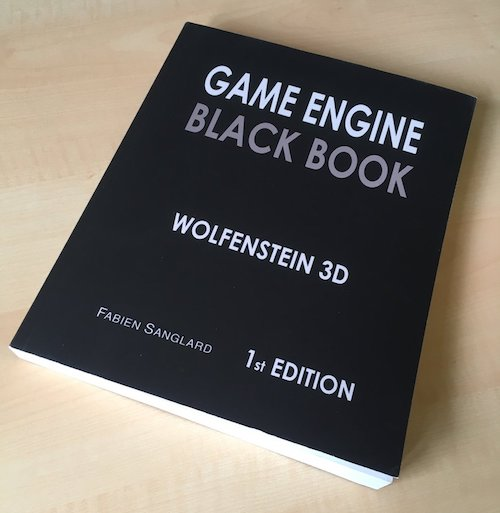

Mặc dù tựa đề của cuốn sách đã nói lên khá rõ rằng đây là một cuốn sách về game development, nhưng nội dung bên trong nó thì rộng hơn rất là nhiều.

Và dù bạn là một game developer hay là web developer, backend developer,... thì đây cũng là một quyển sách rất đáng để đọc.

Về nội dung, quyển sách nói về những khía cạnh kĩ thuật trong quá trình phát triển tựa game **Wolfenstein 3D** của **id Software**. Nếu các bạn chưa biết, thì đây là tượng đài đã đặt nền móng cho dòng game bắn súng góc nhìn người thứ nhất (First Person Shooter - FPS) lừng danh trên máy tính. Được phát triển chính bởi **John Carmack** - lúc đó mới 21 tuổi - hiện ông đã rời **id Software** và làm CTO cho **Oculus VR**.

Quay trở lại với cuốn sách, ngoài nội dung chính đã nêu ở trên, [Game Engine Black Book](https://www.amazon.com/Game-Engine-Black-Book-Wolfenstein-ebook/dp/B0768B3PWV/ref=sr_1_1?ie=UTF8&qid=1510006184&sr=8-1&keywords=game+engine+black+book) cũng cho chúng ta làm một chuyến du hành ngược thời gian trở về những năm 1990, 1991 để hiểu rõ hơn về các loại máy tính cá nhân ở thời điểm đó, về những khó khăn trở ngại về mặt kĩ thuật khiến cho việc làm game trên PC trở thành một việc gần như bất khả thi. Bên cạnh đó là rất nhiều thông tin bên lề thú vị về những sự kiện xảy ra trong thời gian này, ví dụ như chuyện Linus Torvalds phát triển hệ điều hành Linux khiến cho Microsoft mất ăn mất ngủ, hay chuyện xử lý số thực (floating point number) trên máy tính khó khăn ra làm sao,...

Nếu bạn đủ "cũ" (I mean... old enough :joy:), đây là một cuốn sách nên đọc vì chắc chắn bạn sẽ cảm thấy bồi hồi khi nghe đến những cái tên như dòng chip 38x, ngắt 10h, Borland C++ 3.1, MS DOS... :sob:

Có thể sẽ có người nghĩ việc đọc về những chuyện xảy ra hơn 20 năm trước là một việc vô bổ, tác giả có nói câu này, mình xin trích nguyên văn:

> It may appear like a waste of time to read and write about “old” engines dedicated to extinct machines, compilers, and operating systems, but they carry tremendous value. Not only are they packed with clever tricks, they also remind us of the constraints programmers from the past had to overcome. They remind us of the spirit it once took to reach new frontiers.

Và cuối cùng, thông điệp mà tác giả muốn gửi gắm:

> To those who struggle today, keep in mind you are not alone. Others have struggled before. Some have found fame and some have found fortune but in the grand scheme of things we all belong to a family of people who roll up their sleeves and try to make things better with hard work. Wherever it takes you, be proud of your labor. Be proud of your passion and keep on looking for The Right Thing to Do!

Sách có giá `$9.99` cho bản Kindle và `$33` cho bản giấy trên [Amazon](https://www.amazon.com/Game-Engine-Black-Book-Wolfenstein-ebook/dp/B0768B3PWV/ref=sr_1_1?ie=UTF8&qid=1510006184&sr=8-1&keywords=game+engine+black+book).
