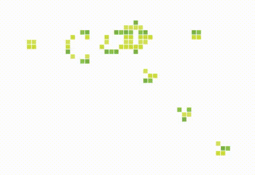
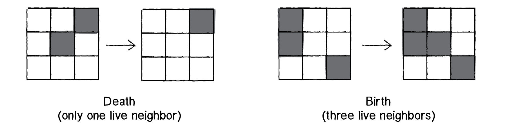
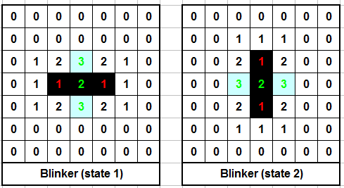
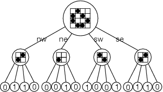

[Game of Life](https://en.wikipedia.org/wiki/Conway%27s_Game_of_Life) của Conway là một trò mô phỏng khá là nổi tiếng. Thoạt nhìn trông rất dễ để implement, nhưng xét ở một mức độ nào đó, ví dụ trên một ô lưới có kích thước cực kì lớn, thì nó rất phức tạp để đạt được kết quả tối ưu.

Trò chơi gồm một ô lưới $n \times m$ không giới hạn, mỗi ô (**cell**) có hai trạng thái **alive** hoặc **dead**.

Ở mỗi một thời điểm, toàn bộ ô lưới này được gọi là một thế hệ (**generation**), và máy tính sẽ tự động biến đổi từ thế hệ này sang thế hệ tiếp theo bằng cách thay đổi các cell trên lưới, theo quy tắc:

- Ô _sống_ nào có đúng **2 hoặc 3** ô _sống_ lân cận thì sẽ tiếp tục _sống_ đến thế hệ tiếp theo. Ngược lại thì sẽ thành ô _chết_.
- Ô _chết_ nào có đúng **3** ô _sống_ lân cận thì sẽ trở thành ô _sống_ ở thế hệ tiếp theo.

Nguồn: http://natureofcode.com/book/chapter-7-cellular-automata/

---

Một trong những cách dễ nhất để implement trò chơi này đó là dùng một mảng 2 chiều $n \times m$, với mỗi phần tử đại diện cho một ô.

Ở mỗi generation thì ta chạy 2 vòng `for` lồng nhau, đếm tổng số ô "hàng xóm" lân cận, và thực hiện việc biến đổi theo tập luật. Ví dụ hình sau, con số trên mỗi ô biểu diễn số ô sống lân cận của ô đó, biến đổi qua 2 thế hệ liên tiếp nhau:

Nguồn: http://www.paleotechnologist.net/?p=451

 

<b>Input:</b> Mảng hai chiều A kích thước $n \times m$ 

<b>1:</b> For i từ $0 \rightarrow n$: 
<b>2:</b> &emsp;For j từ $0 \rightarrow m$: 
<b>3:</b> &emsp;&emsp;Đếm số ô sống lân cận của ô $A[i, j]$ 
<b>4:</b> &emsp;&emsp;Biến đổi trạng thái ô $A[i, j]$ dựa vào số ô sống đã đếm ở trên 
<b>5:</b> Trả về mảng $A$ 

<b>Output:</b> Mảng hai chiều mới A kích thước $n \times m$

Thuật toán trên có độ phức tạp $O(n m)$ và hoàn toàn không phải là giải pháp tối ưu. Đối với kích thước $n \times m$ càng lớn, thì việc sinh ra generation tiếp theo sẽ càng chậm.

Có một điểm cần lưu ý đối với thuật toán trên đó là việc đếm số ô lân cận cần phải được thực hiện trên mảng đại diện cho generation cũ, chứ không phải trên generation đang được tạo ra (khúc này nếu bạn không hiểu thì không sao, cứ thử implement đi là bị liền :joy: nếu không bị thì tốt :smirk:).

---

Có rất nhiều giải pháp để tối ưu thuật toán sinh generation của Game of Life, đa số phục vụ cho mục đích xử lý được trò chơi với kích thước lớn nhất có thể.

Một giải pháp được đề cập đến nhiều nhất đó là [thuật toán Hashlife](http://www.drdobbs.com/jvm/an-algorithm-for-compressing-space-and-t/184406478?pgno=1), thể hiện ô lưới của trò chơi bằng Quadtree và sử dụng phương pháp memoize để tăng tốc độ tính toán.

Nguồn: Dr. Dobb's - An Algorithm for Compressing Space and Time

Tiếp đến là các phương pháp sử dụng các phép tính trên bit như ở link tham khảo số 9, 10 và 11.

Sau cùng là các giải pháp sử dụng GPU như giải pháp [dùng texture để tính toán với WebGL](http://nullprogram.com/blog/2014/06/10/), hoặc là [sử dụng CUDA](http://www.marekfiser.com/Projects/Conways-Game-of-Life-on-GPU-using-CUDA).

Có thể thấy, việc implement Game of Life là một chủ đề khá là thú vị, vì tùy theo khả năng, nếu ta muốn nó dễ (kích thước giới hạn, cho biết sẵn) thì nó cực kì dễ, nhưng nếu ta muốn nó khó hơn (không giới hạn kích thước), thì nó cũng trở nên cực kì phức tạp.

---

**Đọc thêm:**

- [1] [Conway's Game of Life](https://en.wikipedia.org/wiki/Conway%27s_Game_of_Life), Wikipedia
- [2] [Cellular Automaton](https://en.wikipedia.org/wiki/Cellular_automaton), Wikipedia
- [3] [A discussion of The Game of Life](http://web.stanford.edu/~cdebs/GameOfLife/), Stanford University
- [4] [Cool math: Conways' Game of Life](http://www.paleotechnologist.net/?p=451), The Paleotechnologis Blog
- [5] [The Nature Of Code: Cellular Automata](http://natureofcode.com/book/chapter-7-cellular-automata/), The Nature Of Code
- [6] [The Game Of Life](http://www.jagregory.com/abrash-black-book/#chapter-17-the-game-of-life), Michael Abrash's Graphics Programming Black Book
- [7] [An Algorithm for Compressing Space and Time](http://www.drdobbs.com/jvm/an-algorithm-for-compressing-space-and-t/184406478?pgno=1), Dr. Doobs
- [8] [The Game of Life, part 2: HashLife](http://www.thelowlyprogrammer.com/2011/05/game-of-life-part-2-hashlife.html), The Lowly Programmer
- [9] [Bitboard Methods for Games](https://eprints.qut.edu.au/85005/1/__staffhome.qut.edu.au_staffgroupm%24_meaton_Desktop_bits-7.pdf), Cameron Browne
- [10] [Game of Life bit-parallel algorithm](https://hackaday.io/project/18632-game-of-life-bit-parallel-algorithm), Yann Guidon
- [11] [What about a Game of Life?](https://hackaday.io/project/14628-ambap-a-modest-bitslice-architecture-proposal/log/49599-what-about-a-game-of-life), Yann Guidon
- [12] [A GPU Approach to Conway's Game of Life](http://nullprogram.com/blog/2014/06/10/), Crhis Wellons
- [13] [Conway's Game of Life on GPU using CUDA](http://www.marekfiser.com/Projects/Conways-Game-of-Life-on-GPU-using-CUDA), Marek Fišer
- [14] [An implementation of Conway's Game of LIfe](http://dotat.at/prog/life/life.html)
