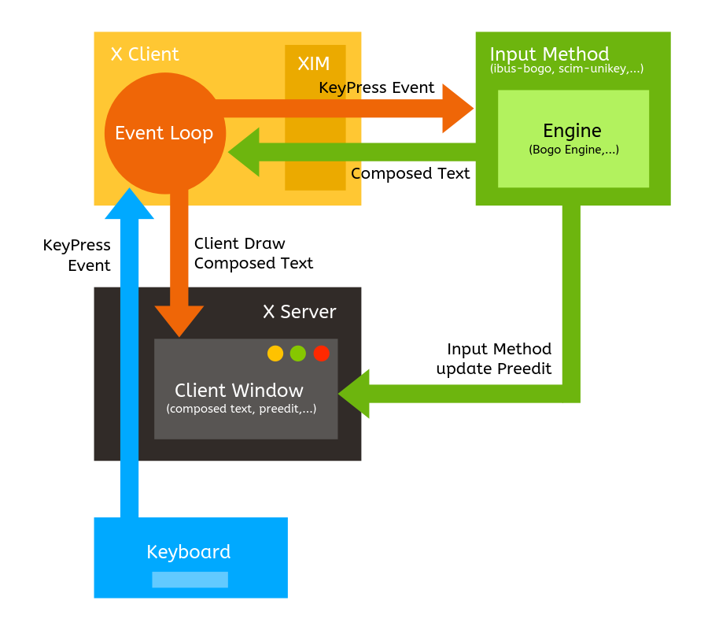
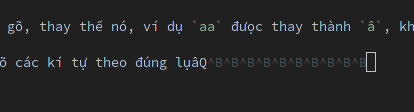

Hẳn là các bạn xài Linux (dù là distro nào) thì cũng đều gặp phải một vấn đề giống nhau, đó là **gõ tiếng Việt**.

Đã từng gõ tiếng Việt trên Windows với Unikey hay Vietkey ngày xưa thì hẳn ai cũng cảm thấy khá là khó chịu với cái dấu <u>gạch đít</u> quái đản khi chuyển qua xài macOS hoặc Linux. Đối với các bạn chưa biết, thì dấu này gọi là preedit và là một phương pháp "chính thống" theo lời tác giả [Trung Ngo](https://github.com/lewtds) (thành viên team phát triển BogoEngine) trong bài viết [Ước mơ bộ gõ kiểu Unikey](http://lewtds.github.io/2014/07/31/uoc-mo-bo-go-kieu-unikey/).

## Hai cách gõ tiếng Việt

Đại ý của bài viết trên thì: tựu chung, các bộ gõ tiếng Việt hiện nay có **2 cách** để xử lý tiếng Việt khi gõ, đó là **Backspace** và **Preedit**.

- **Preedit**: là cách gõ xuất hiện dấu <u>gạch đít</u>, đây thực chất là một vùng buffer lưu tạm các kí tự đang gõ, thay thế nó, ví dụ `aa` đưọc thay thành `â`, khi ngưòi dùng nhấn space để kết thúc từ đang gõ thì nó sẽ commit từ đó về cho UI của ứng dụng. Các bộ gõ tiếng Việt sử dụng kĩ thuật này thì có: ibus-unikey, bộ gõ tiếng Việt mặc định của macOS,...
- **Backspace giả**: là cách gõ không xuất hiện dấu <u>gạch đít</u>, cơ chế hoạt động của giải pháp này là khi gõ các kí tự tiếng việt như `aa`, bộ gõ sẽ tự động gửi 2 dấu `backspace` vào ứng dụng, và gửi tiếp một kí tự `â` thay thế. Các bộ gõ sử dụng kĩ thuật này có ibus-bogo, fcitx-bogo, GoTiengViet trên macOS,...

## Kĩ thuật Backspace

Lại nói về **Backspace giả**, trong bài viết của mình, tác giả Trung Ngo có nói:

> Gần như tất cả các bộ gõ trên Windows (tôi không dám chắc nhưng không thể kiểm chứng được vì phần lớn là phần mềm nguồn đóng) giải quyết vấn đề này bằng cách sử dụng dấu backspace giả. 

Mình nghĩ là đúng, ít ra là với một vài bộ gõ như GoTiengViet trên Windows (không biết phiên bản trên macOS và Linux anh Trần Kỳ Nam có cải tiến hay sử dụng kĩ thuật khác không, mình không kiểm chứng đưọc), vì từng có một thời gian lúc mình còn tham gia diễn đàn [Câu lạc bộ VB](http://caulacbovb.com), mọi ngưòi cũng thảo luận về vấn đề phát triển bộ gõ, kĩ thuật hồi đó mọi ngưòi áp dụng là: 

```
- Hook keyboard để bắt lại các kí tự đang gõ
- Đưa kí tự vừa đưọc hook vào buffer và kiểm tra theo luật gõ (Telex, VNI,...)
- Gửi backspace để xóa các kí tự đã gõ, ví dụ `aa`
- Đưa kí tự cần thay thế, ví dụ `â`, vào clipboard và gửi phím `Shift + Insert` 
  hoặc `Ctrl + V` để "dán" kí tự này vào ứng dụng đang chạy.
- Hoặc gửi trực tiếp kí tự cần thay thế vào thông qua API của Windows
```

Và thêm một lý do nữa đó là lần cuối cùng mình check thì không nhớ trên Windows có API nào để hỗ trợ các kĩ thuật khác ngoài chuyện send key.

Hiện giờ nội dung các bài thảo luận đó vẫn còn, các bạn có thể tìm đọc để hiểu thêm:

- [1] [Từng bưóc xây dựng bộ gõ Tiếng Việt](http://caulacbovb.com/forum/viewtopic.php?t=27082), tuyen_dt18
- [2] [Mã nguồn bộ gõ VBKey của bài viết trên](http://caulacbovb.com/forum/viewtopic.php?t=13876), tuyen_dt18
- [3] [Thread trao đổi về quá trình phát triển của bộ gõ GoTiengViet](http://caulacbovb.com/forum/viewtopic.php?f=41&t=5858), Trần Kỳ Nam
- [4] [Đoạn trao đổi về việc nên dùng Ctrl + V hay Shift + Insert](http://caulacbovb.com/forum/viewtopic.php?f=41&t=3238&start=20#p36775), Trần Kỳ Nam (GoTiengViet) và Tienlbhoc (DotNetKey)

## Cấu trúc một bộ gõ thông thường trên Linux

Phải nói là trên **X Window System** mới đúng. Các bộ gõ khác nhau có nhiều cách xử lý khác nhau, đoạn này mình chỉ nói đến các bộ gõ dùng kiến trúc **X Input Method** (XIM) như **ibus**, **SCIM**,...

Nếu để ý, các bạn sẽ thấy các bộ gõ như `ibus-bogo` hay `scim-unikey` thưòng hay tự gọi mình là một frontend cho một cái engine gì đó để dùng với `ibus` hoặc `scim`:

> IBus frontend for the BoGo engine.

> scim-unikey là một bộ xử lý nhập liệu tiếng Việt cho scim, sử dụng engine xử lý tiếng Việt của unikey

Đọc phần này sẽ giúp các bạn hiểu thêm về cái vụ "engine gì đó" đó.

Hình sau mô tả toàn cảnh việc xử lý nhập liệu trong một hệ thống X Window System:



<div style="text-align: center;" class="copyright">Hình vẽ lại từ tài liệu [Xlib Programming Manual - Chapter 11: Internationalized Text Input](http://menehune.opt.wfu.edu/Kokua/Irix_6.5.21_doc_cd/usr/share/Insight/library/SGI_bookshelves/SGI_Developer/books/XLib_PG/sgi_html/ch11.html)</div>

- Khi user nhấn một phím trên bàn phím, keycode của phím này sẽ đưọc gửi về cho X Server.
- X Server gửi một sự kiện  nhấn phím (KeyPress Event) tới cho các X client đang đăng ký chờ event (application sẽ làm nhiệm vụ báo cho client biết nó có nên đăng kí nhận event hay ko)
- Event loop trên X client sẽ đọc KeyPress Event đó bằng một lệnh gọi tới hàm `XNextEvent()`
- Thông tin của Event này sẽ được gửi sang Input Method (ibus, scim,...) và tại đây, tùy theo mỗi bộ gõ khác nhau, mà sẽ thực hiện việc kiểm tra các tổ hợp phím đưọc nhấn, rồi thay thế kí tự cho phù hợp với tập luật của bộ gõ, các nhà phát triển thưòng viết riêng phần xử lý này thành một engine để có thể sử dụng lại với nhiều loại bộ gõ khác nhau.
- Trong quá trình xử lý (compose), Input Method cũng sẽ báo lại cho application biết để nó update phần preedit cho phù hợp.
- Sau khi xử lý xong, Input Method sẽ gửi lại nội dung đã đưọc xử lý (một từ tiếng Việt hoàn chỉnh - composed text) về cho X client để in ra màn hình (bưóc này là bước commit). Commit xong thì application cũng thôi không in cái preedit ra nữa.

Engine xử lý việc bỏ dấu (thay thế kí tự phù hợp với tập luật của bộ gõ) có rất nhiều loại khác nhau, đây là [tài liệu mô tả logic](https://github.com/BoGoEngine/bogo-logic/blob/master/literate-src/Bogo.adoc) cho engine mà `ibus-bogo` sử dụng.

Việc trao đổi giữa X client và Input Method được thực hiện thông qua một phương thức gọi là XIM Protocol.

Và như các bạn thấy thì mô hình này phụ thuộc lớn vào preedit, chính vì vậy mới nói preedit là phưong pháp chuẩn cho việc soạn thảo với các ngôn ngữ ngoài tiếng Anh.

## Thử nghiệm các bộ gõ trên Linux

Vì phần lớn thời gian làm việc của mình là trên terminal, nên chuyện chấp nhận thưong đau mà dùng Preedit khi gõ lệnh hay xài trong VIM thì mình chịu, không làm đưọc, nên dù không hoàn thiện, mình vẫn chấp nhận được các bộ gõ dùng phưong pháp dùng Backspace, vậy nên bài viết này mình chỉ nhắm tới việc tìm ra bộ gõ xài Backspace hoạt động hiệu quả nhất trên Linux.

### xvnkb

Bộ gõ đầu tiên mình tìm hiểu thử là `xvnkb`, vì khá ấn tưọng với cái dòng release notes trên trang chủ:

> WoW! After 6 years, we have a new official release! L0LzZzzZZzz...
> Some bugs with Firefox and other apps have been fixed in this release.
> Still having fun! Hahaha!

LOL.

Quá trình download và cài đặt diễn ra rất trơn tru, không có lỗi gì xảy ra.

Nhưng sau khi cài đặt xong và restart lại máy tính thì `xvnkb` làm crash luôn X server và máy tính không thể khởi động vào môi trưòng đồ họa đưọc nữa, đáng lý ra thì tới đây mình phải tìm hiểu thêm lý do crash là gì nhưng vì vừa tốn công cài đặt lại máy xong, khá là lưòi, không thấy chạy nữa thì cứ remove thẳng tay thôi :)) thành thật xin lỗi tác giả.

Thế là ứng viên đầu tiên đã bị loại.

### ibus-bogo

Thật sự là sau khi đọc bài viết của tác giả Trung Ngo và xem homepage của project trên Github xong thì không muốn xài `ibus-bogo` tí nào, nhưng vì đã hết option rồi nên thôi cài vào xài luôn. Quá trình cài đặt thì khá là đơn giản:

```
$ sudo pacman -S ibus
$ yaourt -S ibus-bogo
```

Để `ibus` tự động khởi động thì chúng ta có thể thêm dòng sau vào `~/.xinitrc`:

```
ibus-daemon -drx
```

Kết quả gõ thử nghiệm cho thấy `ibus-bogo` hoạt động rất tốt trên terminal, trên các trình duyệt như `surf`, `firefox`,... không hiện thanh preedit phiền toái.

Tuy nhiên với chế độ gõ TELEX, một vài từ có các nguyên âm `ươ` như `trước, bước, nước`, ta bắt buộc phải gõ `uwow` hoặc `uow` nếu không muốn bị sót mất chữ `ơ`, ví dụ `nưóc, trưóc`. Các bộ gõ như GoTiengViet hay Unikey trên Mac và Windows không bị trường hợp này.

Một nhược điểm khác của `ibus-bogo` là không hỗ trợ các trình duyệt `Chromium`, `Google Chrome`, lý do thì tác giả Trung Ngo đã giải thích trong [Issue #216 - ibus-bogo](https://github.com/BoGoEngine/ibus-bogo/issues/216).

Lý do lớn nhất khiến nhiều người ngại dùng `ibus-bogo` có lẽ là vì project này đã không còn được maintain nữa. Ở thời điểm viết bài này, có **63 open issues** trên trang Github của project. Thành viên của team phát triển là Trung Ngo đã ngừng maintain dự án vì bất đồng quan điểm với tác giả [Ha-Duong Nguyen](https://github.com/cmpitg) và fork ra một project khác tên là [`ibus-ringo`](https://github.com/NgoHuy/ibus-ringo) (project này add thêm vài chức năng khác trong đó có preedit, nên mình ko xài :D)

### fcitx-bogo

Một phiên bản khác cũng dùng `BogoEngine` đó là `fcitx-bogo`, xây dựng cho `fcitx`. Cách cài đặt thì cũng đơn giản:

```
$ pacman -S fcitx
$ yaourt -S fcitx-bogo
```

Khởi động với lệnh sau trong `~/.xinitrc`:

```
fcitx -d
```

Kết quả thử nghiệm cho thấy bộ gõ này hoạt động tạm gọi là tốt trên mọi phần mềm, trong đó đặc biệt là có thể gõ đưọc tiếng Việt trên `Chromium` và `Google Chrome` luôn.

Tuy nhiên khi sử dụng trên terminal thì khá là lag, thời gian từ lúc gõ phím cho tới lúc hiện ra kí tự tiếng Việt rất chậm, không như `ibus-bogo`, và thêm một điểm trừ nữa là rất không ổn định, hay bung lụa kiểu:



<div class="copyright" style="text-align: center">^B chính là phím backspace đó (￣▽￣)</div>

Và khi gõ trên `Firefox` thì vẫn gặp hiện tượng không gõ đầy đủ dduwocj tiêngs Viêjt =.= (đó, bị như vậy đó).

## Kết luận

Hy vọng bài viết này giúp các bạn có thêm cái nhìn sâu hơn về các loại bộ gõ tiếng Việt hiện có và những thử thách về mặt kĩ thuật mà chúng ta đang phải đối mặt để có thể phát triển đưọc một bộ gõ tiếng Việt hoàn chỉnh cho môi trưòng Linux. 

Bài viết chỉ dựa trên quan điểm chủ quan của tác giả khi tìm hiểu về các bộ gõ không dùng preedit, nên còn nhiều thiếu sót và có nhiều nội dung liên quan đến phưong pháp chuẩn (preedit) và các kĩ thuật khác như surrounding text,... đã bị bỏ qua. 

Hy vọng các bạn quan tâm có thể nhiệt tình góp ý, bổ sung và giúp mình hoàn thiện bài viết. Xin cảm ơn :D
