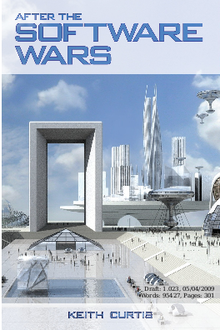
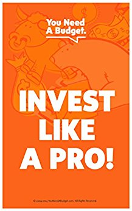
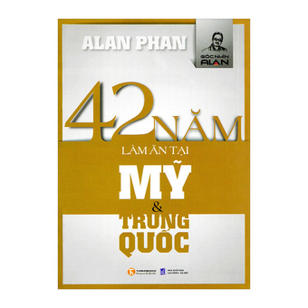

Tuần này mình vô chế độ lười, nên [không làm gì](https://www.youtube.com/watch?v=mjpUWO5MuPg) cả, chỉ nằm đọc sách báo linh tinh là chính, thôi thì làm cái post tổng hợp mấy thứ hay ho đọc được:

Do nothing and do it well ¯\\\_(ツ)\_/¯

## Blog posts

- [Những gì bạn nên biết về float rounding](https://kipalog.com/posts/Nhung-gi-ban-nen-biet-ve-float-rounding): Bài viết từ anh admin Kipalog, nói về chuyện implement thuật toán làm tròn floating number. Mặc dù là một hàm đơn giản và được dùng khá thường xuyên nhưng khi đọc mới thấy đằng sau nó phức tạp phết.

- [Tìm hiểu quy trình TC39](https://ndaidong.xyz/tim-hieu-quy-trinh-tc39/): Bài này được anh Đồng đăng trên Kipalog, sau mình tìm được blog của ảnh, biết ảnh một thời gian ngắn cách đây vài năm nhưng nể không để đâu cho hết. Bài này giúp bạn hiểu rõ thêm về quy trình mà một chức năng mới trong JavaScript phải trải qua từ khâu đề xuất ý tưởng, cho đến thảo luận, viết specs, implement, trình làng cho cả thế giới dùng thử, bên cạnh đó cũng góp phần cung cấp thêm khá là nhiều thông tin để bạn có thể áp dụng và bắt kịp với nhịp phát triển của thứ ngôn ngữ kì quặc này =))).

  Ngoài lề, trên blog của anh Đồng có những bài viết rất hay, cả về kĩ thuật lẫn không kĩ thuật, có những post tuổi đời lên đến cả 10 năm :D

- [Chuyện kể về các trình duyệt web](https://ndaidong.xyz/cau-chuyen-ve-cac-trinh-duyet-web/): Một bài viết của anh Đồng, tổng hợp lại lịch sử quá trình phát triển của JavaScript cùng các trình duyệt web, về các sự kiện như Đại chiến trình duyệt lần thứ I, Đại chiến trình duyệt lần thứ II (nghe giống Thế chiến :D).

- [Single endpoint cùng GraphQL](https://kipalog.com/posts/Single-endpoint-cung-GraphQL--Backend-Go): Bài viết của một bạn trẻ có nghệ danh @runi_vn, anh bạn này không được đẹp trai cho lắm, được cái là giỏi và có sở thích đọc truyện ngôn tình, bạn này hiện đang là Golang/Backend Engineer cho một công ty khá xịn ở Sài Gòn, mặc dù ít người biết đến =))) bài viết nói về những nhược điểm sẽ gặp khi chúng ta implement một RESTful API đến một quy mô nào đó, và cách dùng GraphQL để giải quyết các vấn đề đó.

- [Bắt đầu với Machine Learning thông qua Tensorflow](https://kipalog.com/posts/Bat-dau-voi-Machine-Learning-thong-qua-Tensorflow--Phan-I-I): Bài viết của bạn タムさん (à, thực ra bạn ấy tên là Tâm =))), hiện đang công tác tại Nhật, viết về vấn đề tự học Machine Learning với Tensorflow, phần 1 chủ yếu là các khái niệm, sang [phần 2](https://kipalog.com/posts/Bat-dau-voi-Machine-Learning-thong-qua-Tensorflow--Phan-I-2) thì thực sự rất hấp dẫn.

## Sách

- [After the Software Wars](http://keithcu.com/wordpress/?page_id=407): Quyển sách của Keith Curtis, cựu nhân viên Microsoft (bác ấy vào M$ làm vì ngưỡng mộ Bill Gết), kể về hành trình đến với thế giới mã nguồn mở của mình sau khi rời khỏi tập đoàn này, với những thông tin bên lề và những so sánh phải nói là khó có ai có được (ví dụ: giữa mã nguồn Windows và mã nguồn Linux, quy trình phát triển phần mềm rùa bò tại Microsoft và mô hình community driven của thế giới mã nguồn mở,...).

  Sách có giá `$3.99` cho bản Kindle, `$8.99` cho bản cứng, còn bản PDF, ePub thì miễn phí.

- [Invest Like a Pro: A 10-Day Investing Course](https://www.amazon.com/Invest-Like-Pro-10-Day-Investing-ebook/dp/B00O4G1BBI): Thực sự thì mình chả bao giờ có hứng thú với chuyện tài chính cá nhân hay chuyện đầu tư sinh lợi, đơn giản mình chỉ muốn tập trung vào làm công nghệ thôi. Nhưng đứng trước cơn bão "lướt sóng" của các con buôn Altcoin thì mình cũng không thể làm ngơ được, đành phải xách ví lên và đi, trong quá trình đi thì mình cũng có đọc qua vài quyển sách nói về chuyện đầu tư, tài chính, và đây là quyển dễ đọc nhất đứng ở góc độ dân CNTT mà nói. Sách đưa ra các khái niệm cơ bản trong vấn đề đầu tư, cũng nhưng những thứ tâm lý cần chuẩn bị, văn phong ngắn gọn, toàn bộ sách cũng chỉ dài tầm 1 tiếng hơn, thích hợp là quyển sách vỡ lòng nếu bạn muốn bắt đầu có một khoản tiền tiết kiệm hiệu quả.

  Một trong những điều mình học được trong thời gian vừa rồi là: "Đồng tiền để trong ngân hàng là đồng tiền chết", tức là nó không sinh ra được lợi nhuận, thay vào đó, cuốn sách này nói một câu rất hay là "Đem tiền đi đầu tư - tức là bắt tiền làm việc cho bạn, từ đó nó sẽ 'tuyển' về thêm nhiều em tiền nữa cho bạn" =)))))

  Sách có giá `$0.99` cho bản Kindle, rẻ như cho.

- [42 năm làm ăn tại Mỹ và Trung Quốc](https://tiki.vn/42-nam-lam-an-tai-my-va-trung-quoc-tai-ban-p342712.html): Quyển sách của Alan Phan, kể lại câu chuyện về những năm tháng lăn lộn của ông ở đất Mỹ và Trung Quốc. Mình đem từ Việt Nam sang nhưng đã 2 năm rồi giờ mới đọc :D

  Mặc dù không có ý định "làm ăn" kinh doanh gì tại Mỹ ở thời điểm này, nhưng sau 2 năm trải nghiệm cuộc sống trên đất Mỹ thì cũng đã đến lúc mình lật quyển sách này ra để xem những gì tác giả đã trải nghiệm.

  Sách có bán tại Tiki và các nhà sách trên toàn quốc.
