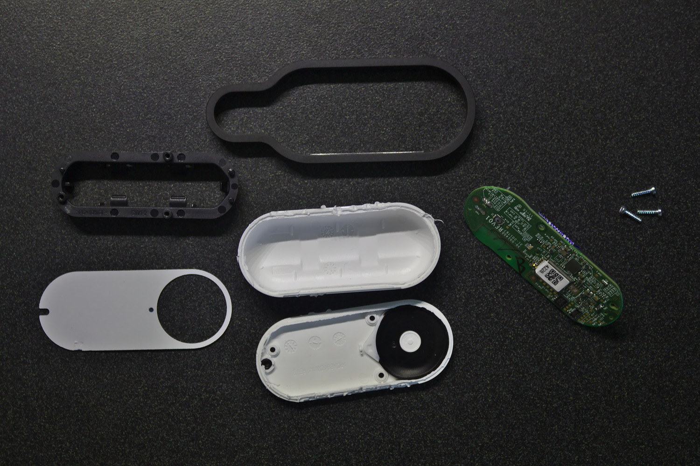

Amazon Dash Button là một thiết bị kết nối Wifi và chỉ có 1 nút bấm. Sau khi mua về và cài đặt xong, thì khi bấm cái nút này, nó sẽ tự động gửi request đến Amazon để order món đồ mà bạn đã chọn trưóc đó. 

Bạn có thể dùng nó để order mì tôm, bánh kẹo, sữa, bột giặt, cà phê, hay bất cứ thứ gì tùy thích. Tuy nhiên bạn chỉ đưọc order những mặt hàng của một hãng cho một nút, tùy theo nhãn in trên nút đó.



<div style="text-align: center;" class="copyright">Hình ảnh bợ từ blog [Matthew Petroff: Amazon Dash Button Teardown](https://mpetroff.net/2015/05/amazon-dash-button-teardown/)</div>

## Cấu hình bên trong

Tuy bề ngoài nhìn khá là đơn giản, nhưng bên trong Dash button có rất nhiều thứ hay ho:

- Dùng chip xử lý `ARM Cortex-M3` (STM32F205RG6), xung nhịp lên đến `120 MHz`.
- Chip này có `128 KB` RAM và `1 MB` bộ nhớ flash để chứa chưong trình điều khiển.
- Chip này còn tích hợp luôn module WIFI `BCM943362`.
- Có 1 microphone tích hợp.
- Có 1 đèn LED RGB.
- Cấp nguồn bằng 1 cục pin `Energizer Ultimate Lithium AAA` có tửu lưọng... nhầm, thời lưọng lên đến 20 năm

Và tất nhiên với khả năng kết nối wifi cùng thời lưọng pin trâu bò của nó, thì việc dùng nó để làm cái nút order bỉm sửa có vẻ hơi bị phí. Chưa kể là được bán với giá rẻ bèo như cho không (từ `0.99$` - `4.99$`) thì đây quả là một món đồ chơi lý tưởng cho dân ghiền công nghệ.

Chưa hết, sau khi mua 1 em Dash này về, thì bạn sẽ được giảm giá ngay 4.99$ cho order đầu tiên. Vì bạn Evan nhà mình chuẩn bị mọc răng, rất thích nhai bất cứ thứ gì bạn ấy vớ được nên hôm qua mình order một cục chew toy giá `5$` và đưọc giảm giá ngay lập tức, dù là cái Dash button mua chỉ có `0.99$` :))

Giờ vô chủ đề chính: **Hack cái nút Dash button**.

## Hacking
Mô hình hoạt động của Dash button có dạng như sau: 

```
 .--------.
| DASH ( ) | -------> INTERNET -------> AMAZON SERVER
 `--------'
```

Sau khi bạn nhấn nút, nó sẽ gửi một request tới server của Amazon và thực hiện lệnh order. Việc chúng ta cần làm là lập một server để listen và chặn hết các gói tin do Dash gửi đi. Đồng thời vì đã bắt được event nhấn nút, coi như chúng ta có thể dùng Dash để điều khiển thứ gì đó theo ý mình tùy thích.

```
 .--------.
| DASH ( ) | -------> NODE SERVER ----X     INTERNET
 `--------'                |
                           |
                            `-------> Làm trò mèo 
```

### Cài đặt Dash Button
Sau khi order về, thì việc đầu tiên cần làm đó là cấu hình cho cái nút kết nối đưọc với Wifi.

Để cấu hình thì chỉ cần mở app Amazon trên điện thoại ra, vào **Menu -> Your Account -> Add new Dash Button**, sau đó làm theo hướng dẫn trên app, nhấn cái nút của Dash trong vòng 6 giây cho tới khi cái đèn trên đó chuyển qua màu xanh thì nhả ra. Điền pass Wifi vào.

Sau đó app Amazon sẽ nhảy ra màn hình chọn sản phẩm cần mua, tại bước này nhớ **đừng chọn cái gì cả**, chỉ lẳng lặng tắt app đi là xong.

### Tìm MAC address của Dash Button
Để có thể sử dụng được Dash button thì chúng ta cần phải lấy địa chỉ MAC của nó. Cách lấy thì nhiều vô kể. Có ngưòi sử dụng các script chuyên dụng, có ngưòi tự viết script để bắt gói tin và tra địa chỉ. Mình chỉ trình bày cách đơn giản đó là dùng `tcpdump`.

Đầu tiên chạy `tcpdump`:

```
$ tcpdump
```

Nếu chưa có thì có thể cài thông qua `brew` trên macOS hoặc package manager của bản Linux bạn đang xài, ví dụ trên Arch là:

```
$ pacman -S tcpdump
```

Khi chạy thì `tcpdump` sẽ liệt kê toàn bộ các kết nối trong mạng, lưu ý không nên sử dụng khi đang ở trong một mạng có quá nhiều thiết bị (vì lưọng output sẽ nhiều, khó tìm). Lúc này bạn có thể bấm cái nút trên Dash vài ba lần và tìm output có dạng:

```
22:26:52.777174 IP 0.0.0.0.bootpc > 255.255.255.255.bootps: BOOTP/DHCP, 
Request from XX:XX:XX:XX:XX:XX (oui Unknown), length 261
```

Trong đó `XX:XX:XX:XX:XX:XX` sẽ là địa chỉ MAC của Dash button mà chúng ta cần tìm.

### Tạo server trung gian để bắt request

Để listen các request từ Dash, chúng ta có thể dùng thư viện [`node-dash-button`](https://github.com/hortinstein/node-dash-button). Cách làm rất đơn giản:

Đầu tiên, chúng ta tạo một thư mục mới cho dự án hacking của mình và khởi tạo một node project mới với `yarn` hoặc `npm`:

```
$ mkdir dashfun
$ yarn init
```

Tiếp theo, chúng ta cài đặt gói `node-dash-button`:

```
$ yarn add node-dash-button
```

Sau đó tạo file `main.js` và bắt đầu viết code:

```
$ touch main.js
```

Nội dung file `main.js` đơn giản như thế này thôi:

```
const DashButton = require('node-dash-button');
const dash = DashButton("XX:XX:XX:XX:XX:XX", null, null, 'all');

dash.on("detected", function (){
	console.log("omg found");
});
```

Nhớ thay `XX:XX:XX:XX:XX:XX` bằng địa chỉ MAC của dash button bạn có.

Bất cứ khi nào bạn nhấn nút, thư viện `node-dash-button` sẽ bắt các gói tin và thực thi hàm callback của sự kiện `detected`.

Đến đây việc hack coi như hoàn thành, bạn có thể thực hiện thao tác gì đó bạn muốn (pha cà phê, bật tắt đèn, request gửi tin nhắn, shutdown server, chạy lệnh `rm -rf /`,...) tùy thích bên trong hàm callback này.

Video demo:

<iframe width="700" height="400" src="https://www.youtube.com/embed/unKgZ29CrDM" frameborder="0" allowfullscreen></iframe>

Ở thời điểm hiện tại thì chưa thấy ai làm đưọc gì nhiều hơn trong việc hack em Dash button này ngoài việc bắt lại request của nó mỗi khi nhấn nút và thực hiện một thao tác khác bằng server của chính mình. Nên trong phạm vi bài viết này cũng chỉ đề cập đến vấn đề đó. Sau này nếu tìm hiểu được thêm kĩ thuật gì mới hơn thì mình sẽ viết thêm.
