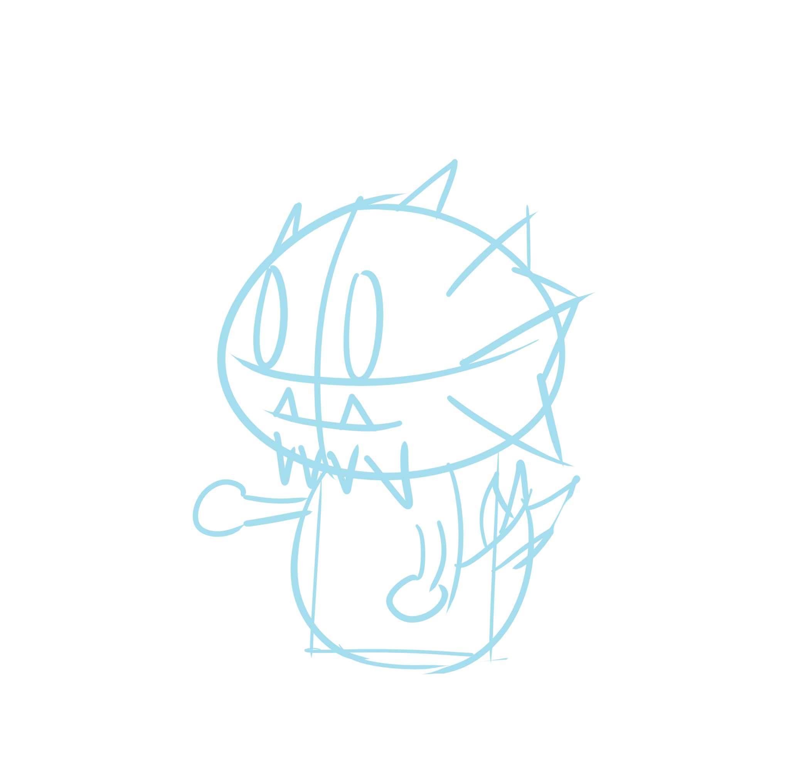
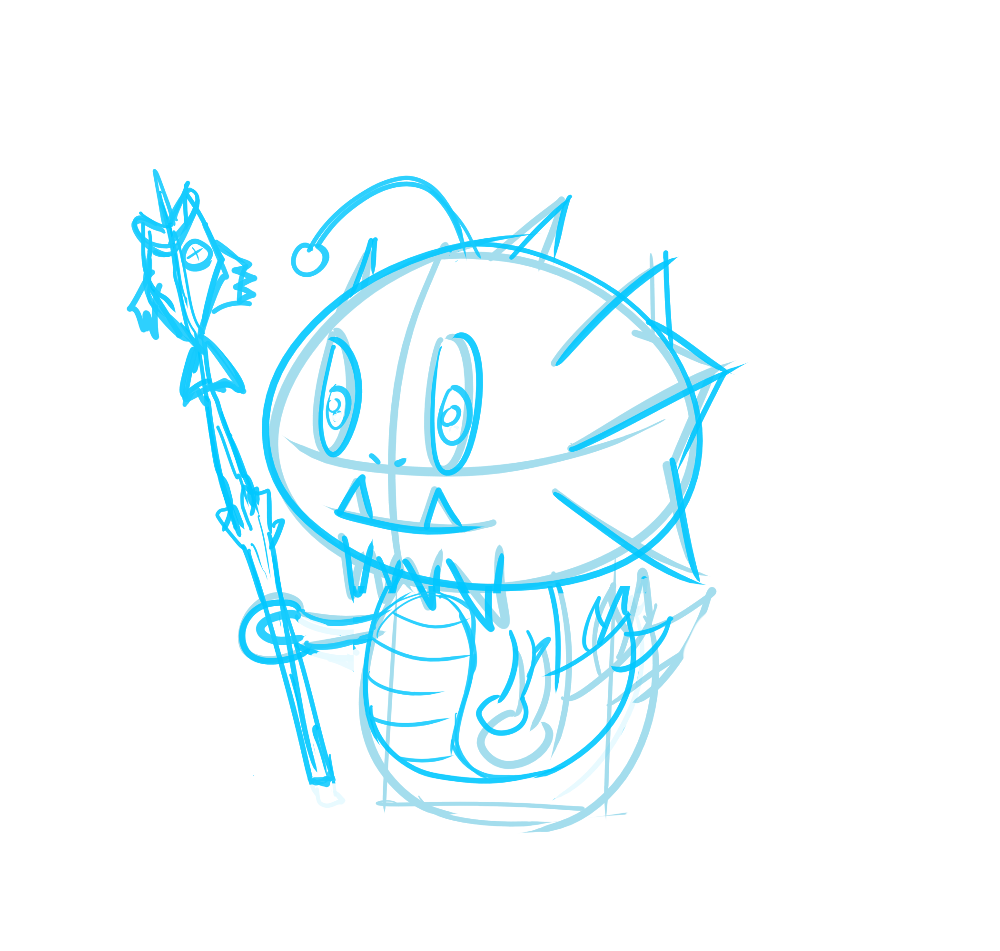
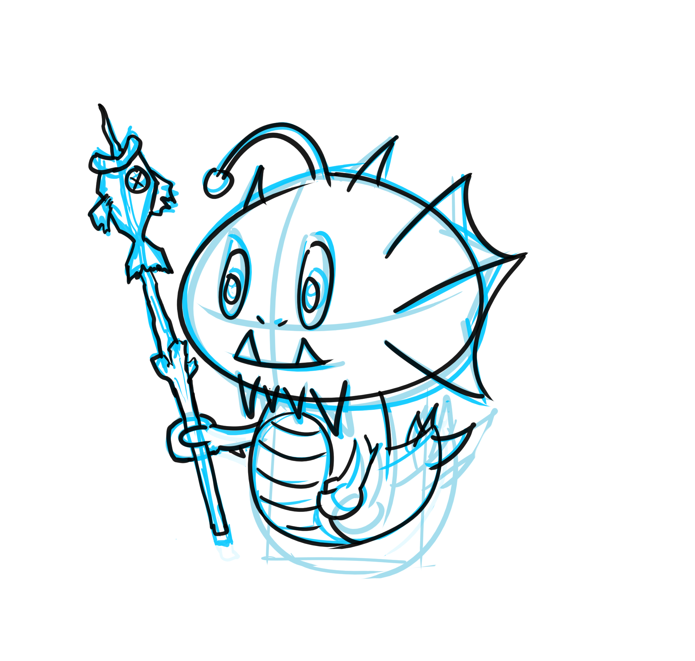
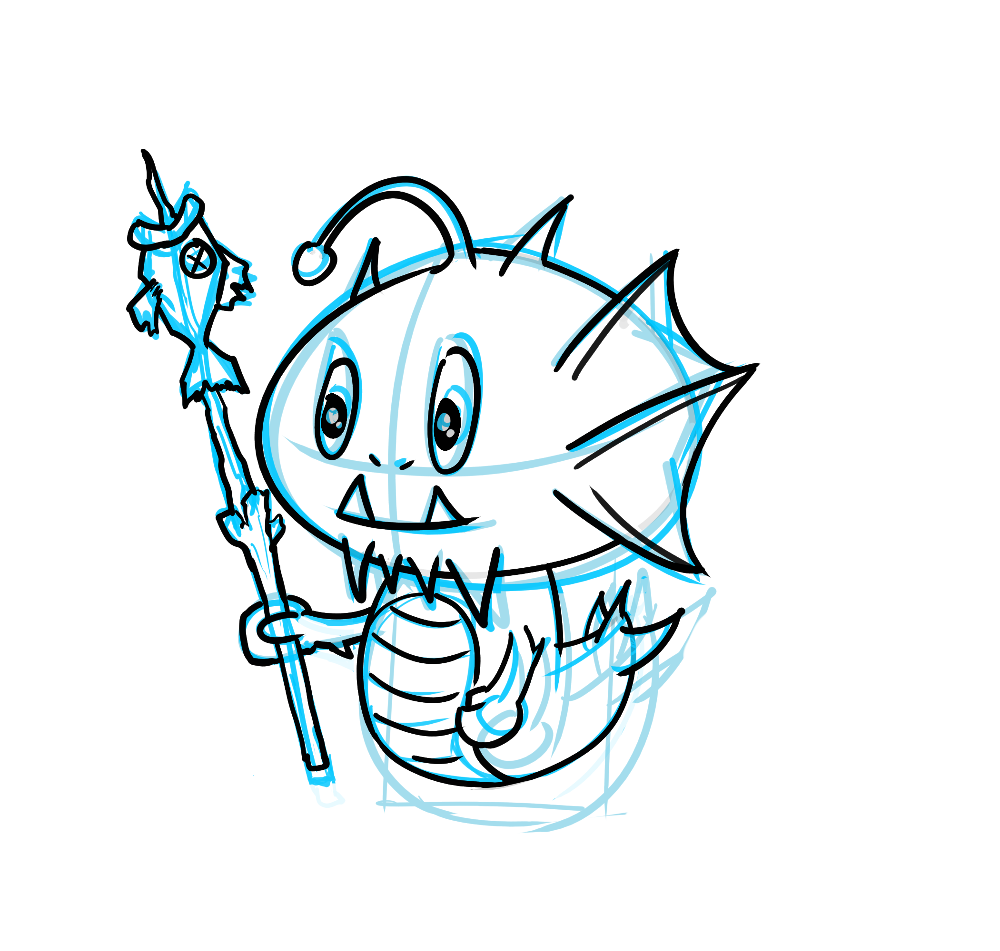
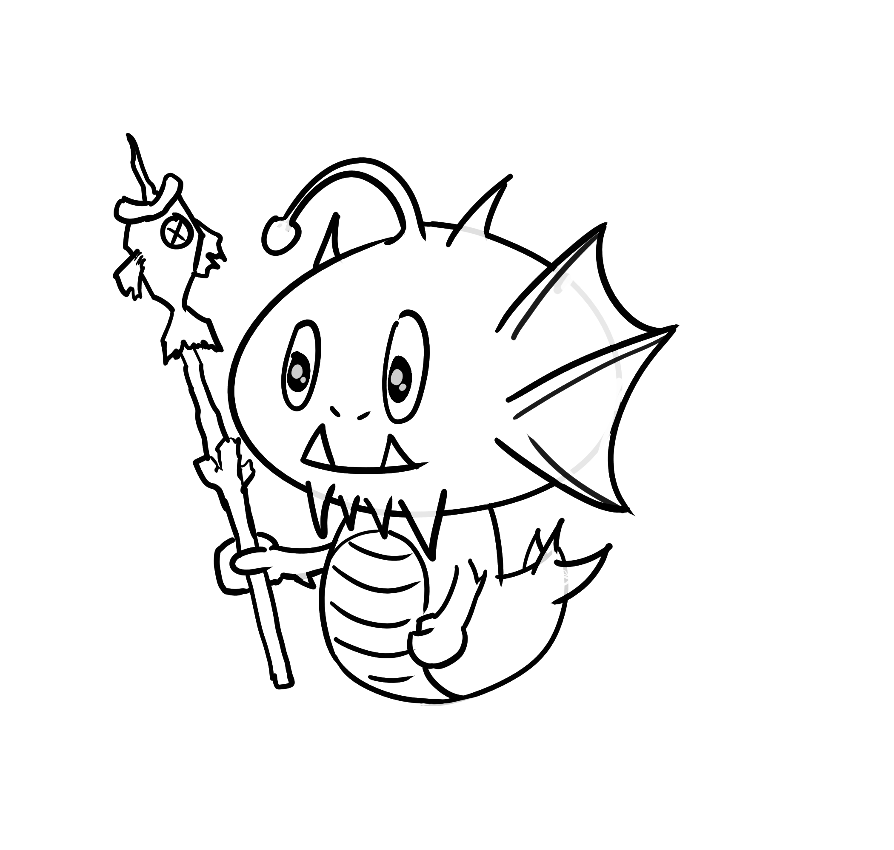

# Các bước vẽ hình minh họa cơ bản

Lâu lâu cũng thấy có bạn nhắn tin hỏi mình vẽ mấy cái hình minh họa trên blog ra làm sao, nên mình làm 1 bài để dành khi nào ai hỏi lại thì lôi ra trả lời cho tiện :v

Đầu tiên, mình thường bắt đầu bằng cách vẽ phát một vài hình khối đơn giản để định hình bố cục, nhân vật cần vẽ.

Lúc vừa bắt đầu thì **không nên đi sâu vào chi tiết** mà chỉ lướt qua vài đường nét thôi.

Quá trình vẽ phát này có thể lặp đi lặp lại từ vài lần cho tới vài trăm lần, đến khi nào bạn cảm thấy OK với hình khối và ý tưởng.

Sau mỗi lần vẽ, có thể chỉnh opacity cho layer trước mờ đi rồi phát tiếp lên layer mới, đây cũng là lúc chúng ta canh chỉnh tỉ lệ, thêm thắt các chi tiết, phát triển thêm các ý tưởng sau mỗi lần vẽ, và hoàn thiện dần dần hình dáng.

Không ai có thể vẽ được một hình ảnh hoàn thiện chỉ với 1 lần phát cả (có thì cũng rất ít) cho nên đừng ngại tốn thời gian cho bước này.

Sau khi đã ưng ý với bản phác thảo thì có thể tiến hành đi nét cơ bản, lúc này chúng ta có thể dùng màu đậm hơn như là màu đen, cũng là màu nét chính của bức tranh.

Đến bước này cố gắng đi nét cho thật chuẩn và tự nhiên.

Tiếp theo tiến hành clean bản vẽ nét bằng cách sửa lại các nét lệch, xóa bớt các nét thừa, hoàn thiện các chi tiết,...

Thường thì mình chỉ làm đến bước này là xong vì trên blog mình dùng hình minh họa đen trắng, tuy nhiên hôm nào hứng thì mình sẽ thử tổ màu coi sao, có điều làm vậy khá là tốn thời gian.

Cách vẽ này áp dụng được cho cả vẽ máy lẫn vẽ trên giấy. Riêng phần vẽ trên máy thì mình dùng phần mềm [Krita](https://krita.org/en/), đây là một công cụ vẽ mã nguồn mở và khá là mạnh so với các phần mềm vẽ phổ biến khác như Paint Tool SAI hay Illustrator.

--@TAGS: random
