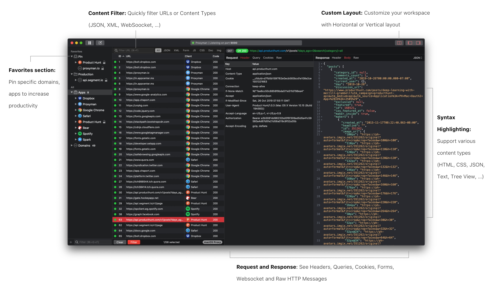

_Bắt đầu từ một pet product để giải quyết những vấn đề cá nhân gặp phải trong
quá trình làm việc, bạn Nghĩa Trần đã dày công theo đuổi và xây dựng
[Proxyman](https://proxyman.io)
trở thành một sản phẩm chuyên nghiệp thu hút được hàng nghìn user đến từ khắp
nơi trên thế giới, đem về doanh thu cực khủng._

_Bài phỏng vấn dưới đây là những chia sẻ hết sức thú vị và bổ ích của Nghĩa về
kinh nghiệm cũng như quá trình xây dựng và phát triển [Proxyman](https://proxyman.io)._

**Xin chào Nghĩa, cảm ơn Nghĩa đã nhận lời mời phỏng vấn ngày hôm nay. Nghĩa có thể giới thiệu qua một tí về bản thân cũng như về Proxyman với các độc giả được không?**

Mình là Nghĩa Trần. Hiện tại mình đang là macOS Developer ở Toggl.com

Cơ bản thì ý tưởng về Proxyman chỉ đơn giản là giải quyết cái ức chế của mình khi xài Charles Proxy mà mình “bị”, “phải” xài hằng ngày lúc mình còn ở Zalora Vietnam.

- Nếu bạn đã từng xài Charles Proxy, Wireshark hay Fiddler để bắt được HTTP/HTTPS traffic từ mac hoặc iPhone để debug dễ dàng thì bạn sẽ biết Proxyman là gì ;]
- Còn nếu chưa, thì Proxyman là một HTTP Debugging Proxy app, dùng dễ capture / intercept / manipulate HTTP / HTTPS requests / response từ macOS, iPhone, Android và cả Simulator.

Một vài selling-point của Proxyman là:

- Native macOS app
- Dễ xài, không cần Google để setup certificates.
- Đầy đủ features như Charles Proxy (Hopefully)
- Và phải nhanh (ai cũng muốn nhanh nên app phải nhanh ;]

**Bạn build Proxyman lâu chưa? Trước Proxyman thì bạn có product nào khác nữa không? Bạn làm team hay một mình?**

Proxyman là pet product mà mình theo đuổi lâu nhất : D hơn 1 năm và vẫn chưa có ý định chán =)) (Hy vọng là thế)

Version Prototype đầu tiên của Proxyman được ra mắt vào ngày Aug 3, 2018, và bản Stable gần nhất là Proxyman 1.7.2 Oct 24, 209. Tổng cộng có tất cả 46 releases.

Ngày launch app bất ngờ trên Product Hunt là hôm March 31st, 2019. Do một bạn nào đó tự post và tag mình vào :D nên phải cuốn theo chiều gió và coi như làm hôm launch chính thức, dù mình vẫn định delay thêm vài tháng cho để có thêm thời gian fix thêm một mớ bugs.

Launch trên Setapp ngày Jun 1st, 2019 và cũng là ngày launch cái licensing system.

Trước Proxyman thì mình chỉ build vài product chơi, chủ yếu là học code macOS. Ví dụ

- Artify: [GitHub - NghiaTranUIT/artify-macos: 🌎 18th century Arts for everyone](https://github.com/NghiaTranUIT/artify-macos)
- Uber for macOS: [GitHub - NghiaTranUIT/Unofficial-Uber-macOS: Unofficial Uber 🚗 for macOS.](https://github.com/NghiaTranUIT/Unofficial-Uber-macOS)

Cả 2 project hiện tại đã stop, vì Uber không còn ở VN và Artify cũng đã gần xong :D

Proxyman thì mình là người build từ những ngày đầu tiên. Hiện tại thì có bạn gái mình tham gia viết blog và đảm nhiệm phần users acquisition, Huy - TablePlus là co-founder sau này giúp mình có thêm business insight về users và SaaS product.

**Về pricing model thì bạn dựa vào đâu để định mức giá? Và việc distribute nó trên Setapp có khiến bác thay đổi gì về pricing không?**

Về Pricing thì mình tham khảo đối thủ chính của Proxyman là

- Charles Proxy (https://www.charlesproxy.com)
- Một số apps (Sketch, NSSurge, TablePlus, Postico) có customer chủ yếu là individual / SMEs.

Giá License thường tầm $49 / năm nên mình chọn mức này. Fun fact là với giá $49 này, mình cũng bị một vài users complain về việc quá mắc, mà feature lại chưa đầy đủ :)) nhưng kệ, cứ ra feature và giữ standard cao.

Ngoài ra vẫn có kha khá users (developers) có 2 máy, và việc mua 2 license ($90) thì không khả thi, nên mình offer thêm Combo với mức giá $59. Team license (>= 3) thì $39.

Ngoài ra, vẫn có những đối thủ cộm cán như Fiddler, Wiresharke, Debookee …. tuy nhiên customers chủ yếu là enterprise.

Việc distribute lên Setapp không ảnh hưởng gì tới mức license hiện tại cả. Vì 80% users của mình không xài Setapp. User vẫn thích mua license và được support  trực tiếp từ mình khi có bug hay feature request. Mục đích của việc distribute lên Setapp là giúp tăng độ trust của Proxyman.

**Bạn có run ads hay gì để marketing cho nó không? Hay để… hữu xạ tự nhiên hương?**

Hiện tại mình không run ads. Tất cả chi phí dành cho ads hay marketing hiện là 0. Tất cả điều nhờ "word of mouth".

Approach này có thể sẽ chậm lúc ban đầu, nhưng khá hiệu quả để build trust của users. Vì thường mọi người sẽ thích xài app khi bạn bè mình giới thiệu hơn là xài một cái app thấy trên Ads. Cách này cũng rất dễ convert một user thành loyaty user (purchased license, cuồng app, tweet Proxyman và khoe với mọi người). Họ đã trờ thành local influencers, và Proxyman cũng từ từ được biết tới.

Ngoài ra mình cũng chú trọng tới viết blogs và trả lời nhiều câu hỏi liên quan tới SSL Proxying, debugging trên StackOverflow, … và có link lại Proxyman.

Ngoài ra, 1 chiến thuật khác để acquire users là quick responsiveness. Mình sẽ support trong vòng 1-2 tiếng. Nếu user report 1 bug trên Github, Twitter, Gitter, thì mình sẽ fix và gửi bản hotfix cho user ngay lập tức. Cách này rất hiệu quả ở giai đoạn đầu của product, vì chứng tỏ product mình rất active, có hot-fix build thì user nó có thể tiếp tục job của nó mà không cần phải đợi qua tuần cho bản Stable release.

Kết quả là có rất nhiều users appreciated, và họ rất thích được chat với founder của products. Chắc vì họ cũng painful khi Charles Proxy (product họ đang xài) không có 1 kênh chính thức nào để support họ. Và cũng kha khá user mua license để cảm ơn sau khi mình support họ 😄

Tất cả những điều trên điều giúp mình acquire nhiều users hơn và cũng là go-to-market strategies của Proxyman hiện tại.

**Về tình hình revenue thì hiện tại như nào, nếu tiện thì Nghĩa có thể chia sẻ một tí được không?**

Revenue hiện tại tầm "chưa đến $5K MRR" từ License + Setapp. Cũng không nhiều so với những app SaaS khác, nhưng cũng đủ cho thời điểm hiện tại.

Plan của Proxyman là long term nên mình vẫn tin là Proxyman sẽ bump lên được vài năm tới. Thực tế là, Charles Proxy cũng mất 15 năm mới lên được vị trí như bây giờ, và Charles Proxy team chỉ có 1 người :D

**Khi build sản phẩm này thì bạn có từng cân nhắc giữa chuyện có nên open source nó for free và kiếm tiền từ nó không?**

Kha khá users email hỏi về việc mình Open Source, tuy nhiên mình không cân nhắc approach này. trong thời điểm hiện tại (Cả founder của Insomnia cũng khuyên mình OSS).

Thật ra mục đích đầu tiên ở Proxyman là thử sức với những technical challenges mới. Mình có vài năm code iOS, cơ bản công việc vẫn chỉ là app listing, social apps, mọi thứ đã có sẵn và điều này khiến mình cảm thấy rất boring.

Charles Proxy không có alternative nào và có rất nhiều người đang tìm alternative, nhưng bất lực, nên mình nghĩ có thể đây là cơ hội để mình disrupt, kiểu Trello vs Jira :D

Mình cũng cân nhắc chuyện bán license. Vì đó là cách để thuyết phục users là Author của Proxyman là nghiêm túc trong việc làm product.

OSS sợ mọi người thấy code dỏm, user bỏ đi 😄

**Nói về technical challenges, Nghĩa có thể chia sẻ thêm về những challenge bạn đã gặp phải trong quá trình làm Proxyman được không?**

Một vài challenges trong Proxyman là:

- Build 1 app macOS native, developer tool.
- Làm sao để buit được Intuitive UI? Không cần train vẫn mà naive users vẫn có thể xem được HTTPS Response? In fact, những ngày đầu mình xài Charles Proxy và Wireshark, thì gần như user phải biết mình phải làm gì, 90% (cả mình) cũng phải google cách sử dụng. Xài app mà cũng phải google cách xài LOL.
- Làm sao build được 1 cái Proxy server? Làm sao parse được Raw HTTP Message?
- Làm sao biết được request đó đi ra từ client nào?
- Làm sao xem được HTTP Response? Cả HTTPS?
- Làm sao trở thành MitM app, và không bị client reject the certificates?
- Làm sao generate chain certificate on the fly?
- Làm sao xem được requests từ iPhone, iOS Simulator và Android?
- SSL Handshake?
- Làm sao implement được “Privileged Helper Tool” để override system HTTP/HTTPS Proxy trên macOS?
- WebSocket debugging, Advanced features (Local Map, Breakpoint, External Proxy, Network Throttling, …)?
- Và rất rất nhiều thứ mình không có cơ hội làm nếu là iOS dev :D

Tóm lại, code developer tool nó nhều challenges và hẳn là fun hơn :D

**Khi quyết định hướng kiếm tiền từ nó, bạn có từng phải cân nhắc giữa chuyện "bao nhiêu là đủ" cho việc xài free và bản trả phí không? Bạn có nghĩ tới chuyện sẽ bị user nó abuse cái free trial không?**

Mình cũng cân nhắc rất nhiều về Business Model cho Proxyman: Premium, Freemium hay Trial.

Cuối cùng thì mình chọn Freemium. Cơ bản tất cả features (basic và advanced features) điều free và xài thoải mái để hoàn thành công việc hơn là phải mua license trước.

Bản Paid Proxyman chỉ unlock một vài cái cơ bản như Multiple-Tabs, số pin item, số rule trong Local Map, Breakpoint, …

Mục đích là để users cho dù xài bản free, vẫn có thể hoàn thành công việc của họ mà không có bất kỳ cản trở nào. Khi họ enjoy, làm được việc, thì họ sẽ thích app và mua license. Hạn chế việc làm user cảm thấy ức chế khi xài.

Một vài ví dụ, Charles Proxy bản free sẽ tự kill cái session trong 30p, nghĩa là sau 30p, sẽ mất hết :D rất ức chế.

Kha khá users mua app ngày từ đầu, vì họ vui mừng tìm được 1 app thay thế Charles Proxy mà họ đã xài một cách "chịu đựng" vài năm.

**Với kinh nghiệm từ Proxyman, thì bạn đánh giá tỉ lệ giữa free user và paid user là như nào? và conversion rate ở đây như nào? Thị trường nào có tỉ lệ paid user cao nhất? Và so với thị trường VN thì sao?**

Convert rate của Proxyman hiện tại là 1-2%. US và EU là 2 thị trường có user mua nhiều nhất. VN và ASIA nói chung chỉ có free users, không có paid users hiện tại.

Proxyman có khoảng 4k monthly users và khoảng 250-350 daily user. Returned user là ~80% users. US + EU chiếm khoảng 95%, còn lại China và một chút Southern-ASIA.

**Có vài điểm mình để ý là Nghĩa có đề cập đến trong quá trình build và marketing cho Proxyman, nghe có vẻ khá thú vị và mình muốn đào sâu vào khía cạnh này một tí như việc làm thế nào để build được intuitive UI, hay như việc tập trung quảng bá bằng cách educate người dùng thông qua blog, hay trả lời câu hỏi trên StackOverflow. Nghĩa có thể chia sẻ về con đường mà bạn đã trải qua để có được những kinh nghiệm này được không?**

Để trả lời được câu hỏi làm sao build được intuitive UI thì rất khó trả lời, vì nó không có câu trả lời cuối cùng nào cả:

- Mình chỉ xài nhiều modern native app như TablePlus, Dropbox, Paw, Sublime, … và hiểu được cái Common-sense của những app native đó. Nó cũng giống như việc để design một app iOS thì cách đơn giản nhất là download nhiều features iOS app trên AppStore và xài hằng ngày. Về lâu dài gì mình sẽ hiệu được kha khá common-sense và biết được trend hiện tại.
- Đọc Human Interface Guidelines của platform mà mình đang build. Ở macOS là https://developer.apple.com/design/human-interface-guidelines/macos/overview/themes/
- Có 1 người high standard ở cạnh và debate về UI.
- Những feature nào users xài nhiều nhất thì mình để ra toolbar, còn lại sẽ được hide trong Context Menu. Để users không bị choáng nếu app mình có quá nhiều buttons. Lấy ví dụ một số app theo style Windows như Pycharm, Wireshare,... sẽ có rất nhiều feature và buttons trên toolbars.
- UI Đơn giản là quan trọng nhất.
- Và may mắn???

Bởi vì plan của Proxyman là không dùng Ads nên cách duy nhất để reachout tới users là thông qua nhưng channels như Blog, StackOverFlow, Reddit, … Trả lời giúp mấy bạn đang bí trên StackOverflow và offer họ 1 solution tốt hơn là cách mình đang áp dụng.

**Có một vấn đề mà mình và nhiều người khác cũng hay gặp phải, đó là việc giữ cho bản thân mình tập trung và có thêm động lực trong quá trình build ý tưởng của mình thành một sản phẩm hoàn chỉnh, nhất là khi gặp phải những trở ngại trong quá trình build, nó khiến chúng ta rất dễ nản chí và thậm chí là bỏ cuộc. Nghĩa nghĩ sao về điều này? Chắc bạn cũng đã từng gặp vấn đề này trong quá trình làm Proxyman?**

Việc này là điều hiển nhiên nếu bạn build SaaS product và việc duy nhất có thể làm được là chấp nhận nó tiếp tục làm.

Ko có silver-bullet cho việc này. Tất cả chỉ là từ phía bạn và chỉ là bạn có muốn tiếp tục hay ko?

Mình nhớ có tới 3 giai đoạn mình cũng rơi vào thế bí toàn cục khi làm Proxyman. Ví dụ

- Làm sao build được native Proxyman Core (MitM) và có thể xem được HTTPS Request/Response?
- Làm sao làm được Local Map hay Breakpoint feature? Mà có thể can thiệp và chỉnh được Message on-the-fly?
- Làm sao design được UI vừa đẹp mà cũng vừa dễ xài?

Để trả lời được mấy câu hỏi trên thì mình cũng phải làm 3-4 prototype versions cho từng vấn đề. Google đủ kiểu, đọc OSS, và code prototype. Bí quá thì tìm cách khác hoặc đi hỏi bạn bè.

Ngoài ra mình còn 1 lời khuyên là nên build MVP version cho từng feature. Đừng bao giờ expect là mình có thể làm 100% feature rồi mới release vì sẽ rất lâu, và cũng không có cái gọi là 100% hoàn hảo.

MVP version, log lại hành trình của mình lên Twitter, và làm hài lòng một nhóm nhỏ user trước khi tiếp tục code tiếp v2 là cách dễ dàng nhất để có thêm động lực làm tiếp. Vì user họ khoái, họ support mình : D

- UI hiện tại mình là version 4. Tạm coi là được nhưng mình đang improve v5 cho phần Filter bar.
- Proxyman core của mình cũng là 3 version, hiện tại khá stable.

**Có rất nhiều bạn độc giả cũng gửi mail và message cho mình rằng họ rất quan tâm đến việc tự phát triển và phát hành sản phẩm, như những gì mà Nghĩa đã làm với Proxyman. Là một người đi trước và cũng nếm trải đủ nhiều, Nghĩa có lời khuyên gì cho các bạn không?**

Mình cũng không chắc là lời khuyên của mình có hợp với mọi người hay ko. Nhưng đây là những gì mình đã và đang làm:

- Nếu mục tiêu của product là học hỏi, thử nghiệm framework, language mới thì bạn có thề start từ ngay bây giờ. Open Source, và nếu được bạn có thể viết blog kể về journey của bạn. Hướng đi này rất hay vì bạn có thể build được reputation cho chính bạn, vừa có cả quality product để apply job sau này.
- Nếu muốn build một product nghiêm túc thì theo mình tìm cái pain point và validate cái idea này ở global market ngày từ những ngày đầu tiên.

Có rất nhiều cách reach tới global market là bạn publish app lên Product Hunt, Reddit, Hackernews, Markerlog hoặc một kênh distributions nào đó như Setapp.

Twitter + Github làm channel chính mà make connection với những authors khác. Ví dụ Insomnia, NativeConnect, Chime, …

**Rất cảm ơn Nghĩa đã dành thời gian tham gia cuộc phỏng vấn này. Chúc Nghĩa sẽ ngày càng thành công hơn nữa với [Proxyman](https://proxyman.io) cũng như với các sản phẩm của bạn trong tương lai nhé 😀**

