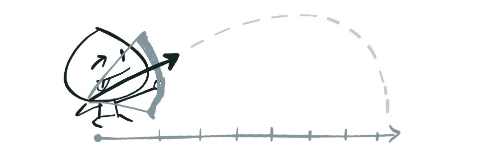

Một phút dành cho việc tra từ điển:

- **iterate**: make repeated use of a mathematical or computational procedure, applying it each time to the result of the previous application; perform iteration - là từ chỉ một hành động lặp đi lặp lại từng lượt trong một quá trình xử lý/tính toán nào đó.
- **iteration**: là từ dùng để nói đến mỗi lần iterate.
- **iterable**: là từ dùng để nói đến khả năng iterate của một đối tượng nào đó.

_Kể từ sau đây thì mình sẽ dùng những chữ này mà không dịch ra tiếng Việt nữa, lý do là dịch ra thì viết dài dòng, bài đã dài rồi, bớt được gì thì bớt lại chút._

---

Trong JavaScript, vòng lặp `for...of` có tác dụng iterate qua nội dung của các đối tượng iterable (iterable objects).

```javascript
const text = "hello"; // String là một iterable object
for (const c of text) {
    console.log(c);
}
// Output: "h" "e" "l" "l" "o"
```

Một đối tượng được coi là iterable nếu như nó thõa mãn [iterable protocol](), theo đó, nó phải được implement phương thức `@@iterator`, hay còn có thể ghi là `Symbol.iterator`, như này:

```javascript
a["@@iterator"] = ...
// hoặc
a[Symbol.iterator] = ...
```

Hồi xưa các cụ phải xài `"@@iterator"` vì `Symbol` chưa được support rộng rãi, tuy nhiên đến bây giờ thì hầu như ai cũng đã hỗ trợ `Symbol`, tất nhiên là trừ IE ra.


Việc implement phương thức `[Symbol.iterator]` này phải trả về một object thỏa mãn [iterator protocol]().

```javascript
const obj = ...;
for (const o of obj) { } // không chạy được vì obj không iterable
obj[Symbol.iterator] = () => { ... };
for (const o ob obj) { } // giờ thì đã iterable rồi
```

Một object thỏa mãn giao thức `iterator protocol` nếu nó có một hàm `next()`, hà này không nhận vào tham số nào, và trả về một kết quả có dạng:

```javascript
next() {
    return { value: ..., done: false };
}
```

Giá trị của `value` sẽ là giá trị xuất hiện trong mỗi iteration. Vòng lặp sẽ tiếp tục cho đến khi kết quả trả về có `done` là `true`.

Chúng ta có thể dễ dàng tạo ra một object thỏa mãn cả hai giao thức `iterable` và `iterator` theo cách sau:

```javascript
let obj = {
    next: function() {
        // ...
    },
    [Symbol.iterator]: function() { return this; }
};
```

Cú pháp như này thì rất ngắn gọn, trông rất ngầu, nhưng mà đọc vô sẽ khó hiểu hơn, nên ở các phần tiếp theo chúng ta sẽ không viết như này nữa, mà viết theo cách khác dễ hiểu hơn (cũng dễ reuse hơn).

Thêm tí, nếu không lặp bằng `for...of`, chúng ta cũng có thể lặp thủ công như với `generator`:

```javascript
let iter;
while (iter = iterator.next(), !iter.done) {
    // ...
}
```

---

Có thể thấy, iterator là một công cụ giải quyết vấn đề khá là lợi hại, để hiểu rõ hơn, hãy cùng xem qua một vài ví dụ với nó.

**Ví dụ: Tách chuỗi**


Giả sử chúng ta muốn implement một hàm `words()` cho kiểu dữ liệu `String` trong JavaScript, theo đó, hàm này sẽ có nhiệm vụ tách chuỗi hiện tại thành một mảng chứa các từ trong chuỗi.

```javascript
const text = "The quick brown fox jump over a lazy dog";
```

Đầu tiên, chúng ta cần phải tạo ra một iterator, đây sẽ là một class tên `WordIterator`, class này sẽ có constructor làm nhiệm vụ tách chuỗi hiện tại thành nhiều từ, bằng hàm `String.prototype.split()`. Cuối cùng, ta sẽ implement hàm `next()`, có nhiệm vụ từng bước trả về mỗi từ đã được tách cho đến khi không còn từ nào nữa thì kết thúc.

```javascript
class WordIterator {
    constructor(data) {
        this.data = data.split(/\s/);
        this.index = -1;
    }

    next() {
        this.index++;
        if (this.index < this.data.length) {
            return {
                value: this.data[this.index],
                done: false
            }
        }
        return { done: true };
    }
}
```

Tiếp theo, chúng ta sẽ implement hàm `words()` cho kiểu `String`, trong hàm này, chúng ta sẽ implement phương thức `[Symbol.iterator]` cho chuỗi đang được xử lý.

```javascript
String.prototype.words = function() {
    const iterable = this;
    iterable[Symbol.iterator] = () => new WordIterator(this);
    return iterable;
};
```

Ở trên, chúng ta tạo một biến trung gian `iterable` và implement phương thức `[Symbol.iterator]` cho biến này thay vì implemen trực tiếp vào kiểu `String`, vì chúng ta không muốn thay đổi behavior mặc định của kiểu `String`.

Thế là xong, chạy thử:

```javascript
for (let word of text.words()) {
    console.log(word);
}

// Output:
// "The" "quick" "brown" "fox" "jump" "over" "a" "lazy" "dog"
```

Quá dễ, phải không nào?

Oh, và các bạn biết sao không? Trong cách implement trên, chúng ta đã bỏ qua một thực tế là, kiểu `Array` đã là một iterable object rồi, để rồi phức tạp hóa cái solution lên :joy: trên thực tế, chúng ta chỉ cần implement hàm `words()` như này:

```javascript
String.prototype.words = function() {
    return this.split(/\s/);
}
```

---

**Ví dụ: Python's range function**

OK, giờ lấy ví dụ khác nhé.

Hẳn các bạn ai cũng đã từng dùng qua Python, hay cũng từng gặp hàm `range()` hay `xrange()` của Python. Nếu như các bạn không biết nó là gì, thì nói đơn giản, hàm này tạo ra <span class="mute sidenote">Đây chỉ là một dạng đơn giản của hàm `range()`, trên thực tế hàm này còn có nhiều cách sử dụng khác nữa.</span> một dãy số trong phạm vi của hai giá trị đầu vào, ví dụ `range(5, 15)` sẽ tạo ra dãy số `[5, 6, 7,... 14]`.



Chúng ta sẽ mô phỏng hàm này trong JavaScript bằng iterator.

Hàm `range()` của chúng ta sẽ nhận vào hai tham số, `from` và `to`. Với mỗi lượt iterate của hàm `next()`, chúng ta sẽ tăng giá trị `from` lên một đơn vị cho tới khinào nó đụng giá trị `to`.

```javascript
const range = (from, to) => {
    return {
        [Symbol.iterator]: function() { return this; },
        next: function() {
            if (from < to) {
                from++;
                return { value: from - 1, done: false };
            }
            return { done: true };
        }
    }
};
```

Ở đây chúng ta cũng sử dụng cú pháp implement kiểu rút gọn như đã nói ở phần trước chứ không cần tạo class, vì ở ví dụ này cũng không phức tạp gì mấy, và mục đích của chúng ta là sử dụng hàm `range()` luôn nên cũng không cần quan tâm đến chuyện reuse code làm gì.

Và đây là cách sử dụng:

```javascript
for (const i of range(0, 100)) {
    console.log(i);
}
```

Nếu để ý kĩ cách implement trên, có thể các bạn sẽ nhận ra là, hàm `range()` chỉ sinh ra giá trị tiếp theo chỉ khi nào nó được gọi, chứ không phải tạo sẵn ra luôn một dãy các số từ `from` tới `to`, đó cũng chính là đặc tính "laziness" của hàm `xrange()` trong Python.

---

**Ví dụ: Lazy Evaluation**

**Call-by-need** là một đặc điểm của Lazy Evaluation (đối lập với **call-by-name**, đặc tính chỉ các thanh niên nhanh nhẩu, chỉ cần gọi tên là xuất kích) - một khái niệm từ functional programming, giải thích một cách đơn giản không đầy đủ, thì đây là phương pháp xử lý mà khi ta có các biểu thức nối tiếp nhau, chỉ khi nào biểu thức phía sau cần sử dụng kết quả tính toán từ biểu thức phía trước, thì biểu thức trước mới được thực thi.


Giả sử, ta có một hàm `evenNumbers()` trả về một dãy các số chẵn bắt đầu từ 0, và ta muốn lấy ra **n** giá trị đầu tiên trong dãy số đó.

```javascript
const list = evenNumbers();
console.log(list.slice(0, n));
```

Nếu `evenNumbers()` là một hàm **call-by-name**, thì ngay từ sau câu khai báo `list`, hàm này sẽ được thực thi ngay, và vì `evenNumbers()` là một hàm không có điểm dừng, chương trình trên sẽ không bao giờ chạy được đến dòng lệnh thứ 2, và nó sẽ treo.

Nếu `evenNumbers()` là một hàm **call-by-need**, thì nó sẽ chưa được gọi chừng nào giá trị trả về của nó vẫn chưa cần thiết được sử dụng, và trong trường hợp này, nó chỉ được sử dụng sau khi chúng ta kết thúc câu lệnh `slice()`, lúc chúng ta in kết quả ra màn hình. Và mặc cho logic của hàm `evenNumbers()` chạy không có điểm dừng, vì nó là lazy, nên nó chỉ trả về một lượng dữ liệu vừa đủ dùng, trong trường hợp này là **n** giá trị mà thôi.

Với iterator, ta có thể mô phỏng lại hoạt động của hàm `evenNumbers()` call-by-need trong JavaScript kiểu như sau, tất nhiên là không hoàn toàn đúng theo mô tả ở trên:

```javascript
const evenNumbers = () => {
    let index = 0;
    return {
        [Symbol.iterator]: function() { return this; },
        next: function() {
            index+=2;
            return { value: index, done: false };
        },
        take: function(n) {
            let values = [];
            for (let i = 0; i < n; i++) {
                values.push(this.next().value);
            }
            return values;
        }
    }
};

console.log(evenNumbers().take(5));
```

Có thể thấy, ta có thể viết theo cách mà người bình thường không ai điên gì mà làm, đó là code logic của hàm `next()` không cần có điểm dừng.

Để nói kĩ hơn về Lazy Evaluation, sẽ có một bài viết khác ~vào một ngày nào đó~.

---

Mặc dù khá là hữu ích, nhưng iterator hiện nay vẫn còn một nhược điểm đó là không thể thực hiện các thao tác bất đồng bộ (asynchronous) được, ví dụ, bạn muốn thực hiện HTTP request trong mỗi iteration, hoặc bạn muốn implement một iterator làm nhiệm vụ đọc một file và trả về từng byte hoặc từng line của file đó. Giải pháp thay thế thì hiện đã có proposal, đó là [Async Iteration](https://github.com/tc39/proposal-async-iteration), và nó đã [ở stage 4](https://github.com/rwaldron/tc39-notes/blob/master/es8/2018-01/jan-25.md#13iih-async-iteration-for-stage-4).
