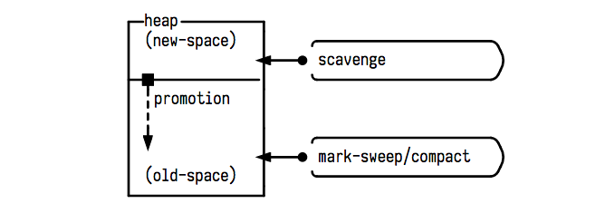
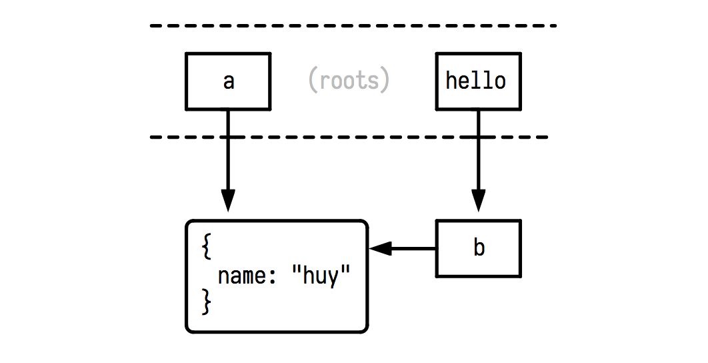
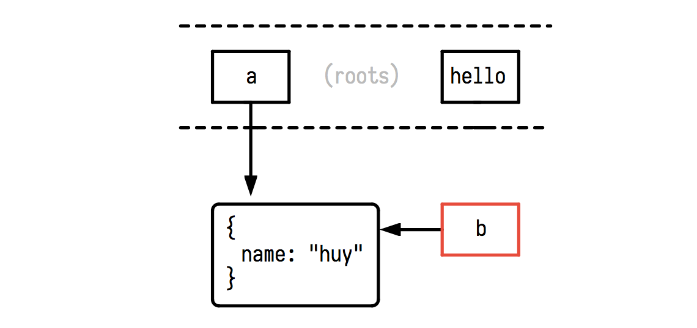
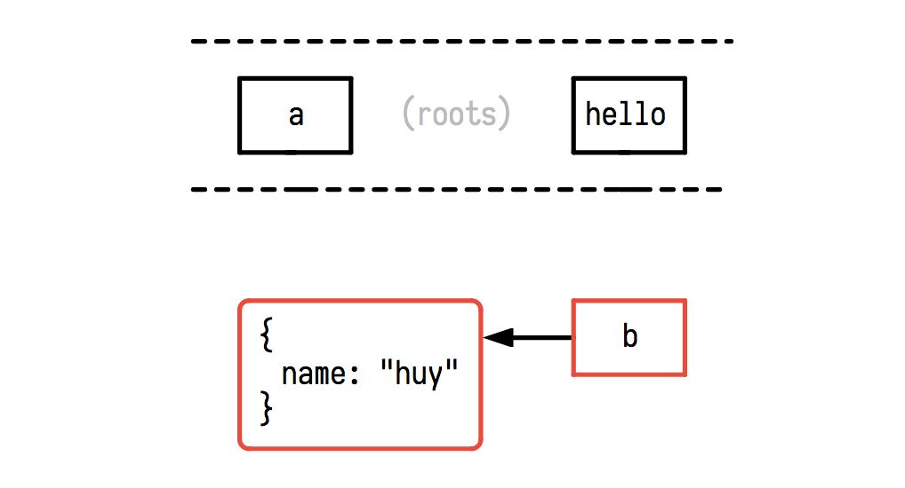
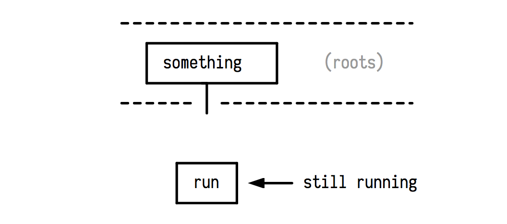

Bài viết này chỉ đề cập đến V8 (là JavaScript engine đứng sau Google Chrome và NodeJS), sau khi đọc bài này, nên tìm đọc thêm về SpiderMonkey (Firefox), Chakra (Edge) và Carakan (Opera), các yếu tố về kĩ thuật trong các engine này có thể sẽ khác nhiều so với V8.

Lý do chọn viết về V8 thì rất là đơn giản, vì engine này có nguồn tài liệu cực kì phong phú và gần như là, hễ tìm với từ khóa JavaScript engine thì nó cứ ra V8 =))

Thực ra, nếu nhìn nhận một cách khách quan về V8 cũng như những kĩ thuật mà team này bỏ ra cho công việc optimization một ngôn ngữ như JavaScript, và đào sâu vào những kĩ thuật đó, thì đó là một kho tàng kiến thức đồ sộ mà chỉ có dại lắm mới dám bỏ qua không ngó ngàng tới.

Viết bài này, mình không có tham vọng gom hết đống kiến thức đồ sộ đó vào một bài viết nhỏ, nên tất nhiên sẽ còn nhiều điểm thiếu sót, hy vọng các bạn đọc xong sẽ nhiệt tình góp ý, cũng như thu về được một ít thông tin vụn vặt, để từ đó mà đem đào sâu hơn vào engine lý thú này.

<div class="mute">
■ :chicken: Trong khi đọc, các bạn nên hạn chế đọc những dòng in nghiêng, đây là những đoạn bình luận nhố nhăng không đóng góp gì nhiều vào nội dung bài viết =))
</div>

## Hidden Class

Mọi thứ trong JavaScript đều là `object`, và mọi thuộc tính của một object thì đều có thể được thêm vào hoặc bỏ đi (thay đổi layout), hoặc thay đổi kiểu dữ liệu (type) bất cứ lúc nào (on the fly). Điều này khiến cho việc optimize một ngôn ngữ "động" như JavaScript (dynamically typed language) trở nên rất khó khăn.

Ví dụ luôn, giả sử ta có đoạn code như thế này:

```javascript
class Car {
    door_open() {
        // ...
    }
}

class Girl {
    // girls has no door
}

const open_the_door = (object) => {
    object.door_open();
};
```

Trong ví dụ trên, hàm `open_the_door()` nhận vào một object và gọi hàm `door_open()` của object đó, tuy nhiên, vì không có cách nào quy định một cách cụ thể kiểu dữ liệu nhận vào của hàm `open_the_door()`, compiler sẽ không thể nào biết trước được liệu object truyền vào có tồn tại hàm `door_open()` hay không. Mà nếu không biết thì phải kiểm tra, bằng cách tra cứu (lookup - duyệt hết toàn bộ hàm/thuộc tính có trong object đó và tìm). Rõ ràng, là không hề tối ưu, và nguyên nhân thì lại do chính thiết kế của JavaScript.

<div class="mute">
■ :chicken: "not a design weakness, but a weakness by design" :shit:
</div>

Team V8 giới thiệu một khái niệm gọi là `hidden class`, gán vào cho mỗi object để giúp cho việc tracking kiểu và các thuộc tính của chúng một cách thuận tiện hơn. Và mỗi lần object thay đổi, thì `hidden class` của nó cũng sẽ thay đổi tương ứng.

Một ví dụ thực tế, có lẽ là rất thường gặp:

```javascript
let product = {};
product.title = api.getBookTitle(book_id) || "";
product.pages = api.getBookPages(book_id) || "";
```

Với cách viết như trên, ta có tổng cộng `3 lần` thay đổi cấu trúc của object `product`. Đầu tiên, là ở câu lệnh `let product = {}`, lúc này V8 sẽ tạo ra hidden class `C0` để biểu diễn cấu trúc của `product` (là một object rỗng). Tiếp theo, khi gặp câu lệnh gán `product.title`, thì cấu trúc thay đổi, V8 thay thế hidden class `C0` thành `C1` (có thêm thuộc tính `.title`), và cuối cùng là thành `C2` ở câu lệnh gán `product.pages`, quá trình thay đổi diễn ra như hình bên dưới:


Việc xảy ra đến 3 lần thay đổi cấu trúc, dẫn đến 3 lần V8 phải tạo ra hidden class mới là không hề tối ưu. Ta nên khởi tạo tất cả các thuộc tính của một `object` ngay trong khi khởi tạo chính `object` đó, bằng cách viết rút gọn:

```javascript
let product = {
    title: api.getBookTitle(book_id) || "",
    pages: api.getBookPages(book_id) || ""
};
```

Với cách viết này, V8 chỉ tạo ra một hidden class duy nhất cho object `product`, vì không có sự thay đổi cấu trúc nào xảy ra sau câu lệnh khởi tạo:


Các object có cùng kiểu hoặc cấu trúc (hoặc thuộc cùng một class) thì sẽ có chung một `hidden class`, V8 sẽ không tạo mới mà sử dụng lại các hidden class đã có nếu trùng khớp.

Ví dụ với câu lệnh sau, hidden class của `product` thay đổi từ `C2` về lại `C1` chứ không tạo mới:

```javascript
delete product.pages;
```

Tuy nhiên, nếu trong trường hợp trên, thuộc tính bị xóa là `.title` thì sẽ lại có một hidden class `C3` được tạo ra.


Bằng cách sử dụng hidden class, V8 luôn biết trước được cấu trúc của một class/object, từ đó có thể tối ưu việc truy xuất đến các thuộc tính của chúng bằng nhiều cách, một trong các kĩ thuật tối ưu mà V8 áp dụng đó là `inline caching`.

Có thể hiểu nôm na, inline caching là việc tạo ra "đường tắt" (lưu luôn vị trí chính xác của từng vùng nhớ cho từng thuộc tính vào trong code) giúp cho việc truy xuất đến thuộc tính đó diễn ra nhanh hơn, thay vì cách dùng "đường chính" (thực hiện lookup vị trí của thuộc tính đang cần truy xuất trong bộ nhớ).

<div class="mute">
■ :chicken: Cái chữ "đường tắt" kia đúng ra phải gọi là "fast path", bản thân cái từ đó nó cũng mang nhiều ý nghĩa và đọc vào nghe thấm thía hơn. Thế nào là fast path? có fast hẳn phải có slow, vậy slow path khác fast path như nào? Bạn phải tự đặt ra đc câu hỏi như vậy. Tiếc là viết tiếng Việt không dùng được những cái vô lời hữu ý như vậy được, chán bỏ bà.
</div>

Ví dụ khi truy xuất một thuộc tính của một object:

```javascript
let x = product.title;
```

Giả sử V8 sẽ sinh ra ~machine~ pseudo code để xử lý câu lệnh trên như thế này:

```python
create $x
create $product_hidden_class_offset
assign $product_hidden_class_offset = lookup_hidden_class($product)
create $p_title_offset
assign $p_title_offset = lookup_property($product_hidden_class_offset, "title")
assign $x = $p_title_offset
```

<div class="mute">
■ :chicken: Okay, khi thực thi, V8 sẽ sinh ra machine code và chạy trực tiếp đống code đó, trên đây không phải là machine code, mà chỉ là pseudo code mà mình chế ra nhằm giúp dễ theo dõi bài viết hơn mà thôi. Suy cho cùng, đâu có ai muốn đọc machine code trong một bài viết về JavaScript đâu đúng không?
</div>

Ở đây ta thấy có việc tra cứu một thuộc tính xảy ra (hàm `lookup_property`, giả sử hàm này trả về kết quả là vị trí của vùng nhớ chứa thuộc tính `title`, là `0xDAEDBEEF`).

Nếu thuộc tính `product.title` được sử dụng thường xuyên trong chương trình, thì việc tra cứu liên tục như vậy rất tốn kém, để tối ưu, V8 sẽ cache output của hàm này lại sau lần gọi đầu tiên, để rồi nó sẽ thay đổi đống ~machine~ pseudo code đã sinh ra thành:

```python
create $x
assign $x = 0xDAEDBEEF
```

Trong bài viết tiếp theo, chúng ta sẽ tìm hiểu thêm về cơ chế sinh code và tối ưu động này của V8. Còn bây giờ, hy vọng các bạn đã hiểu được tầm quan trọng của hidden class cũng như những lợi ích mà nó đem lại trong việc cải thiện performance của JavaScript.

Đọc thêm:

- \[1\] V8 Design Elements, https://github.com/v8/v8/wiki/Design-Elements
- \[2\] Hidden classes in JavaScript and Inline Caching, https://gist.github.com/twokul/9501770

## Garbage Collection

Nói đến công việc dọn rác (thu dọn và xóa sổ những object/giá trị không còn được dùng tới, trả lại bộ nhớ để dùng cho việc khác), đây là một phần khá quan trọng mà ít người quan tâm trong JavaScript. Ngày nay, khi mà JavaScript được dùng càng nhiều cho cả phía server lẫn các single page application, vòng đời của một JS app ngày một dài ra, vai trò của GC ngày một lớn.

<div class="mute">
■ :chicken: Trước đây nhiều người vẫn hay nói đùa là JavaScript thì cần gì GC, chạy trên browser, khi nào hết mem thằng user nó F5 một phát thì tất cả bay biến hết mẹ nó rồi còn đâu :think-hopeful:
</div>

GC của V8 là một [Generational Garbage Collector](http://www.memorymanagement.org/glossary/g.html#term-generational-garbage-collection). Trong quá trình thực thi, các giá trị (biến, object,...) được tạo ra nằm trong bộ nhớ `heap`. V8 chia `heap` ra làm nhiều khu vực, trong đó ta chỉ đề cập đến hai khu vực chính là `new-space` (chứa các đối tượng nhỏ, có vòng đời ngắn) và `old-space` (chứa các thành phần sống dai hơn, bự hơn).

Hai khu vực này cũng là hai đối tượng cho hai loại thuật toán GC khác nhau, đó là `scavenge` và `mark-sweep / mark-compact`.



Khi chúng ta khai báo một giá trị mới, giá trị này sẽ được cấp phát nằm rải rác trong khu vực `new-space`, khu vực này có một kích thước nhất định, thường là rất nhỏ (khoảng 1MB đến 8MB, tùy vào cách hoạt động của ứng dụng). Việc khai báo như thế này tạo ra nhiều khoảng trống không thể sử dụng được trong bộ nhớ.

<div class="mute">
■ :chicken: Vì sao lại có những khoảng trống đó thì là kiến thức cơ bản, và bắt buộc các bạn phải biết, không biết thì Google, mình không thích nói nhiều.
</div>

Khi `new-space` đã đầy, thì `scavenge` sẽ được kích hoạt để dọn dẹp các vùng nhớ "chết", giải phóng mặt bằng, có thể sẽ gom góp các vùng nhớ rời rạc lại gần nhau cho hợp lý, vì `new-space` rất nhỏ, nên `scavenge` được kích hoạt rất thường xuyên. Trong quá trình giải tán đô thị của `scavenge`, nếu các vùng nhớ nào còn trụ lại được sau `2` chu kỳ, thì được ~điều đi vùng kinh tế mới~ promote lên khu vực `old-space`, nơi mà có sức chứa lên đến hàng trăm megabytes, và là nơi mà thuật toán `mark-sweep` hoặc `mark-compact` hoạt động, với chu kỳ dài hơn, ít thường xuyên hơn.

Tất cả những thuật toán GC trên đều hoạt động thông qua hai bước chính là:

- Bước đánh dấu: thuật toán sẽ duyệt qua tất cả các giá trị có trong khu vực bộ nhớ mà nó quản lý, bước duyệt này đơn giản chỉ là `depth-first search`, tìm gặp và đánh dấu.
- Bước xử lý: sau quá trình duyệt, tất cả những giá trị chưa được đánh dấu, sẽ bị coi là đã "chết", và sẽ bị xóa bỏ, trả lại bộ nhớ trống (`sweep`), hoặc gom góp lại để lấy lại các khoảng trống trong bộ nhớ không sử dụng được (`compact`).

Điểm khác nhau giữa `scavenge` và `mark-sweep/mark-compact` nằm ở cách mà chúng được implement, các bạn có thể xem thêm chi tiết về hai thuật toán trên trong bài **A tour of V8: Garbage Collection** mà mình sẽ dẫn link bên dưới.

---

Về nguyên lý đánh dấu (`marking`) của các thuật toán trên, chúng ta sẽ làm quen với khái niệm `reachability`.

Tất cả mọi đối tượng được khai báo trong global scope, hoặc các DOM elements thì được gọi là `root`. Và đứng từ các `roots`, tất cả mọi giá trị local có quan hệ trực tiếp hoặc gián tiếp với các `roots` này sẽ được coi là còn "sống" (`reachable`). Những đối tượng nào không có mối liên hệ trực tiếp hoặc gián tiếp vói bất kì `roots` nào, thì coi như là đã "chết" (`unreachable`).

Ví dụ với đoạn code sau:

```javascript
let a = { name: "huy" };

function hello() {
    let b = a;
    // you're here
}
```

Trạng thái của heap và sơ đồ biểu diễn reachability của từng giá trị, ngay tại vị trí `// you're here` được thể hiện như sau:



Ở đây ta có `a` và `hello` là hai giá trị thuộc global scope, vì thế chúng được gọi là các `root`. Biến `a` tham chiếu đến một object nằm trong heap, và biến `b` bên trong hàm `hello` cũng tham chiếu tới chính object này.

Khi hàm `hello()` được thực thi xong, và chúng ta đi ra khỏi scope của hàm đó, thì mọi tham chiếu đến các giá trị bên trong hàm đó đều sẽ bị hủy đi, lúc này `b` trở thành `unreachable`, và sẽ trở thành đối tượng để bị GC nó thịt (mặc dù bị thịt lúc nào thì không ai biết trước được).



Lưu ý, đối với các `root`, chúng ta không thể sử dụng lệnh `delete` để xóa sổ chúng, ví dụ:

```javascript
delete a; // trả về false
delete hello; // trả về false
```

Nhưng chúng ta có thể gán chúng bằng `null` để cho các giá trị mà chúng tham chiếu tới bị GC hốt (nhưng chính biến đó thì lại vẫn còn tồn tại, ở đây, cả `a` lẫn `hello` đều vẫn bảo toàn tính mạng), ví dụ, sau lệnh dưới đây, sơ đồ của chúng ta sẽ là:

```javascript
a = null;
```



Vậy thì đến bao giờ `a` và `hello` mới bị giải phóng khỏi bộ nhớ? Câu trả lời là: chừng nào ứng dụng của chúng ta còn chạy, thì chúng vẫn sẽ còn tồn tại trong bộ nhớ. Dân gian gọi là memory leak. Chính vì thế, nên hạn chế việc tạo và sử dụng các biến global, nếu không thực sự cần thiết.

---

Nói tiếp về vấn đề khi sử dụng `delete` và `null`, ở trên chúng ta đã biết `delete` không thể xóa sổ các `root`, tuy nhiên nó vẫn hoạt động tốt thuộc tính của các object:

```
delete a.name;
```

Khi chạy lệnh trên, ta có thể chủ động làm cho giá trị `a.name` trở thành mục tiêu của GC, nhưng cách này có một hiệu ứng tiêu cực, đó là nó làm thay đổi `hidden class` của `a`, mà như chúng ta đã biết ở phần trước, việc này gây ảnh hưởng tới performance. Tương tự, nếu chúng ta gán `a.name` là `null`, nó cũng sẽ trở thành mục tiêu của GC.

```
a.name = null;
```

Nhưng lại một lần nữa, việc gán một biến thành `null` chỉ có thể làm cho `giá trị mà biến đó tham chiếu tới` trở thành mục tiêu bị xóa sổ, nhưng không thể xóa sổ chính biến đó. Trong trường hợp này thì biến `a.null` vẫn còn tồn tại.

Cách tốt nhất để hủy một giá trị là đưa nó vào một scope nào đó, ví dụ như sử dụng JS Modules hoặc IIFE (immediately invoked function expression):

```javascript
(function() {
    let a = { name: "huy" };
})();

a; // ReferenceError: a is not defined
```

---

Tiếp, khi truyền một hàm vào `setInterval` hoặc `setTimeout`, một tham chiếu đến hàm đó sẽ được tạo ra, khiến cho hàm này không thể bị GC hốt, dù cho chúng ta đã ra khỏi scope chứa nó, và sẽ vẫn tồn tại cho đến chừng nào nó được kích hoạt.

Đối với trường hợp của `setTimeout`, chúng ta có thể yên tâm, vì sau một khoảng thời gian, nó sẽ được chạy, và cuối cùng sẽ bị GC hốt, tuy nhiên đối với `setInterval`, chuyện lại không hề đơn giản:

```javascript
function do_something() {
    setInterval(function run() {
        // do something
    }, 1000);
}
// you're here
```



Hàm `run` vẫn còn tồn tại và vẫn còn được thực thi sau mỗi 1 giây, kể cả khi hàm `do_something` đã kết thúc vòng đời của nó. Chính vì thế, phải luôn luôn lưu lại tham chiếu của mỗi câu lệnh `setInterval`, và chạy `clearInterval` khi không còn cần đến:

```javascript
function do_something() {
    let runner = setInterval(function run() {
        // do something
    }, 1000);
    
    // do more thing

    clearInterval(runner);
}
```

---

Một vài lưu ý khác, GC của V8 là `stop-the-world`, có nghĩa là, khi GC chạy thì toàn bộ chương trình sẽ bị dừng lại, thời gian dừng có khi lên đến vài trăm mili giây, là một con số khá lớn.

Team V8 áp dụng một vài kĩ thuật khác gọi là `concurrent marking`, giúp cho ứng dụng JavaScript vẫn có thể được thực thi (tất nhiên là concurrent) trong khi GC hoạt động. Tuy không hoàn toàn giúp cho ứng dụng tránh bị đứng, nhưng cũng cải thiện được performance rõ rệt, các bạn có thể đọc thêm qua bài **Concurrent marking in V8** (link bên dưới).

---

Trên đây là một vài ghi chép về Garbage Collection trong V8, hy vọng qua bài viết này, các bạn đã hiểu thêm phần nào về những gì xảy ra bên dưới một ứng dụng JavaScript, và về cách mà JavaScript hoạt động, từ đó có cái nhìn sâu sắc hơn, và cẩn trọng hơn trong quá trình làm việc với thứ ngôn ngữ quái đản đó.

Hôm nào có thời gian mình sẽ làm một bài đi sâu hơn về cơ chế thực thi code của V8 (Crankshaft, TurboFan,...). Cảm ơn các bạn đã đọc đến tận những dòng này :think-hopeful:

Đọc thêm:

- \[1\]: Garbage Collection, http://javascript.info/garbage-collection
- \[2\]: A tour of V8: Garbage Collection, http://jayconrod.com/posts/55/a-tour-of-v8-garbage-collection
- \[3\]: Concurrent marking in V8, https://v8project.blogspot.com/2018/06/concurrent-marking.html
- \[4\]: How To Write Fast, Memory-Efficient JavaScript, https://www.smashingmagazine.com/2012/11/writing-fast-memory-efficient-javascript/
