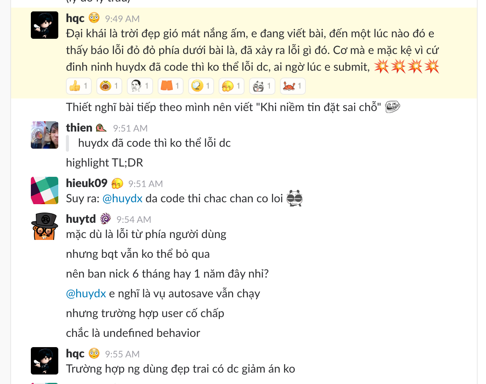

Tên của các nhân vật trong bài **chưa được đổi**.

---

Chuyện hiển thị thông báo lỗi lên UI để cảnh báo cho user về một vấn đề nào đó trong quá trình sử dụng là chuyện thường như cơm bữa đối với nghề làm frontend.

Nhưng sau khi thông báo lỗi rồi thì làm gì tiếp? Đa số chúng ta quá tin tưởng vào user và cứ nghĩ sau khi nhận thông báo lỗi, ai cũng sẽ dừng ngay hành vi gây lỗi lại, nên thường bỏ qua bước sau cùng này.

Tuy nhiên không phải user nào cũng ngoan ngoãn...

Đoạn chat trên xoay quanh việc anh **C**, một user trung thành của sản phẩm **K**, anh **C** viết bài đăng lên sản phẩm **K** nhưng có lỗi trong quá trình sử dụng, và anh **C** bỏ qua, vẫn tiếp tục thực hiện hành vi gây lỗi.

Trích lời anh **H**, một chuyên gia từ chối bug từ phía người dùng của sản phẩm **K**:

> Đây là một trường hợp khá hy hữu, mặc dù chúng tôi đã ra sức thông báo nhưng user vẫn cố tình phớt lờ và ngoan cố tiếp tục, dẫn tới hậu quả cực kì nghiêm trọng

Hiện tại thì đội ngũ phát triển đã đạt được thỏa thuận với anh **C** để anh này im lặng và viết bài lại từ đầu.

Bài học rút ra là:

> Không bao giờ được quá ngây thơ và tin tưởng vào sự hợp tác từ phía user. Một thông báo lỗi đôi lúc phải đi kèm với một vài biện pháp trừng phạt cứng rắn, ví dụ như là disable luôn nút submit, recheck lại user input để đảm bảo lỗi không tiếp tục xảy ra khi user ngoan cố, hoặc cố tình phá hoại.

Trích lời một chuyên gia frontend giấu tên tại thung lũng túi nâng Silicon.

---

Bài viết có nội dung vui là chính. Các nhân vật trong bài là hư cấu và chuyện sản phẩm **K** reject bug từ phía user là **KHÔNG CÓ THẬT**. Nhớ nhé, không có đâu.
