Đọc manga trên mobile là một nhu cầu rất lớn, nhưng hiện nay chưa có nhiều ứng dụng đáp ứng được nhu cầu này một cách hiệu quả.

## Vấn đề 

Một trong những vấn đề lớn nhất của việc đọc manga trên các thiết bị mobile màn hình nhỏ (điện thoại, máy đọc sách,...) là kích thước của một trang truyện thường khá lớn, và màn hình thì rất nhỏ nên dẫn đến nhiều bất tiện khi đọc. Nhất là khi sử dụng điện thoại trong portrait mode (chiều dọc), vì lúc này chữ trong các khung truyện rất nhỏ, dẫn đến hoàn toàn không đọc được.

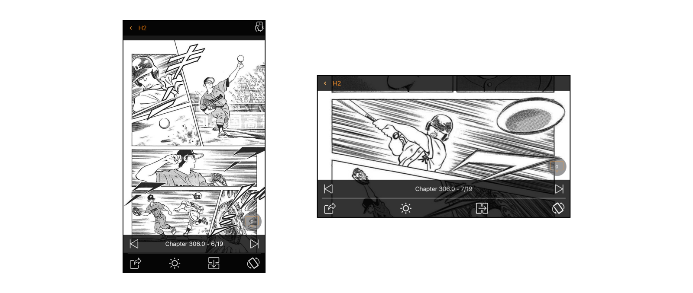

Giải pháp mà đa số các app sử dụng lúc này là đọc truyện trong landscape mode (nằm ngang), điều này tạm giải quyết được vấn đề kích thước, tuy nhiên một khung truyện vẫn rất nhỏ để đọc. Chỉ có một cách là người dùng phải tự tay zoom đến từng ô truyện nếu muốn đọc thoải mái, rất phiền phức. Thêm nữa, việc sử dụng điện thoại khi đọc truyện trong landscape mode trong thời gian dài cũng không phải là một ý kiến hay cho lắm.

Trên các máy đọc sách như Kindle Paperwhite, thì Amazon giải quyết bằng một cách khác, đó là cho phép user thực hiện double tap để zoom to từng góc của một trang truyện, tap thêm một cái thì sẽ dịch chuyển khung màn hình sang một góc khác, cứ như thế đi đến 4 góc của màn hình. 

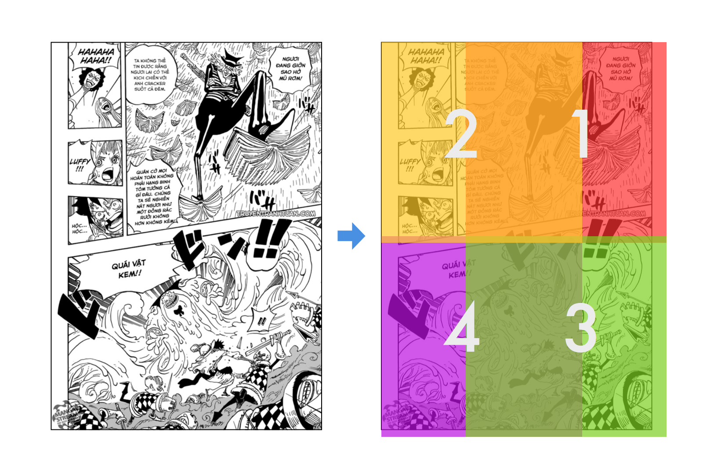

Và với cách này thì các vùng hiển thị sẽ bị chồng chéo, giống như hình trên, khi Kindle hiển thị vùng số 2, một phần nội dung của vùng số 1 vẫn bị dính vào khung hình. Không đem lại cảm giác đọc truyện thoải mái cho người dùng.

## Giải pháp 

Chắc sẽ có rất nhiều giải pháp để giải quyết vấn đề này, trong bài này mình chỉ trình bày giải pháp do mình đề xuất, đó là **tách từng khung truyện ra để hiển thị độc lập trên màn hình**.

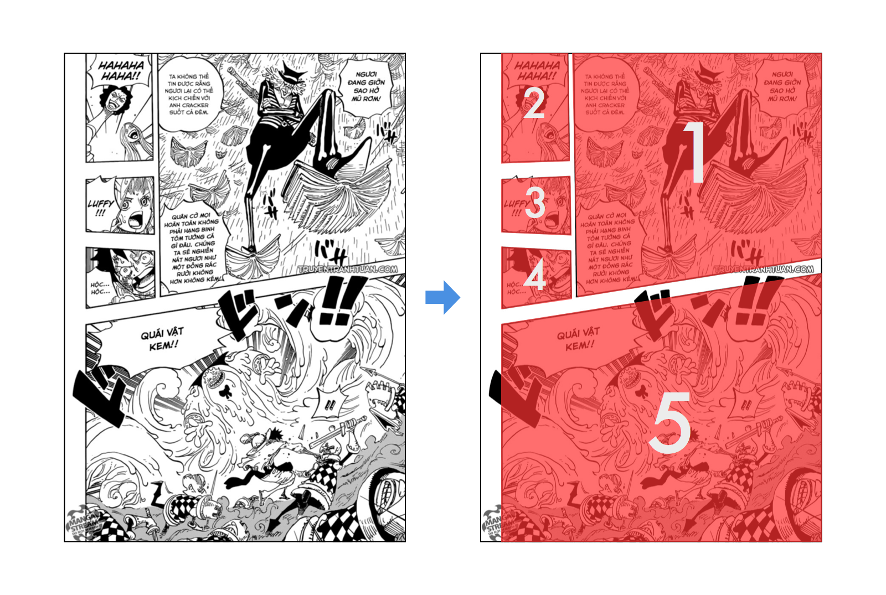

Như hình minh họa trên, chúng ta sẽ dùng một cách nào đó (sẽ nói ở phần tiếp theo của bài viết) để phân tách một trang truyện thành từng khung nhỏ, và hiển thị độc lập từng khung (hoặc có thể hiển thị toàn trang nhưng focus vào trung tâm của từng khung truyện), mang lại trải nghiệm đọc tốt hơn cho người dùng. 

Về ý tưởng thì hoàn toàn hợp lý và không có gì phức tạp cho lắm, nếu các khung truyện chỉ đơn giản là các hình chữ nhật, thì việc tìm và bóc tách khung truyện cũng sẽ rất dễ dàng. Tuy nhiên đa số các manga hiện nay đều sử dụng rất ít bố cục lưới hình chữ nhật ngay ngắn, mà một khung truyện thường sẽ đa dạng như hình minh họa ở trên.

Bài viết này sẽ trình bày về cách implement thuật toán nhận diện khung truyện sử dụng OpenCV, có thể làm việc được với các hình khối của từng khung truyện đa dạng như trên.

## Implementation

Sở dĩ chọn OpenCV là vì nó cung cấp cho chúng ta rất nhiều hàm/thuật toán xử lý hình ảnh cơ bản, và ở giai đoạn này chúng ta chỉ prototype thuật toán nhận diện, chưa đi sâu vào việc implement nó vào một ứng dụng thực tế nào, nên có thể sử dụng nó thoải mái. Khi đã hình thành được phương pháp giải quyết thì chúng ta có thể tự implement toàn bộ các thuật toán liên quan nếu thích.

### Load trang truyện vào OpenCV

Việc đầu tiên cần làm đó là load trang truyện cần xử lý vào OpenCV, ở đây chúng ta sử dụng Python và thư viện OpenCV 2.

Giả sử chúng ta đã có file `manga.jpg` nằm cùng thư mục với chương trình Python:

```
import cv2
import numpy as np

img = cv2.imread('manga.jpg')

print img.shape
```

Chúng ta sử dụng hàm `cv2.imread` để đọc file hình ảnh, đối tượng `img` bây giờ sẽ là một mảng các pixel màu theo định dạng **BGR** (blue, green, red). Thuộc tính `shape` của `img` trả về một tuple gồm các thông tin về kích thước (số dòng, số cột) của mảng pixel, và số channel (kênh màu) trong hình đó.

Ở ví dụ trên, kết quả trả về sẽ là:

```
(1150, 802, 3)
```

Tức là hình ảnh có chiều dài 1150 pixel, rộng 802 pixel và  có 3 kênh màu.

Mặc dù trang truyện trên là trắng đen, nhưng màu sắc mặc định của một hình ảnh sẽ có 3 kênh, quá nhiều kênh màu cũng sẽ gây cản trở cho việc xử lý vì thế chúng ta có thể convert hình ảnh trên về định dạng trắng đen (grayscale) thực sự:

```
img = cv2.cvtColor(img, cv2.COLOR_BGR2GRAY)

print img.shape
```

Lúc này output sẽ chỉ còn:

```
(1150, 802)
```

Vì là ảnh grayscale nên số channel không được hiển thị.

Để hiển thị hình ảnh vừa load lên màn hình, có thể sử dụng thư viện `matplotlib` như sau:

```
import cv2
import numpy as np
from matplotlib import pyplot as plt

img = cv2.imread('manga.jpg')

plt.subplot(111), plt.imshow(img)
plt.show()
```

Hình ảnh sẽ được hiện lên qua một cửa sổ mới như sau:

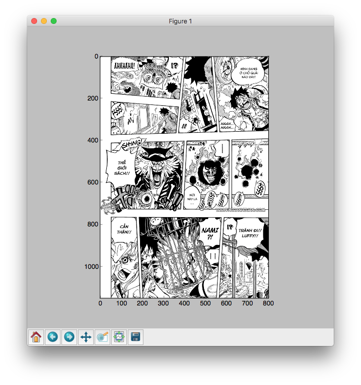

Tiếp theo chúng ta sẽ thử qua một vài phép xử lý ảnh đơn giản.

### Thresholding

Một phương pháp xử lý ảnh đơn giản đó là thresholding, đây là thuật toán dùng để lọc từng pixel của một hình ảnh đen trắng theo một ngưỡng nào đó, nếu pixel đang xét có giá trị thấp hơn ngưỡng đã chỉ định, nó sẽ gán pixel đó thành một màu, nếu pixel đó có giá trị lớn hơn ngưỡng đã chỉ định, nó sẽ gán pixel đó về một màu khác.

Chúng ta có thể sử dụng thresholding để lọc bớt các chi tiết màu xám trong trang truyện để nó hoàn toàn trở về 2 màu đen và trắng. Như vậy ở bước nhận diện khung truyện chúng ta sẽ có kết quả chính xác hơn.

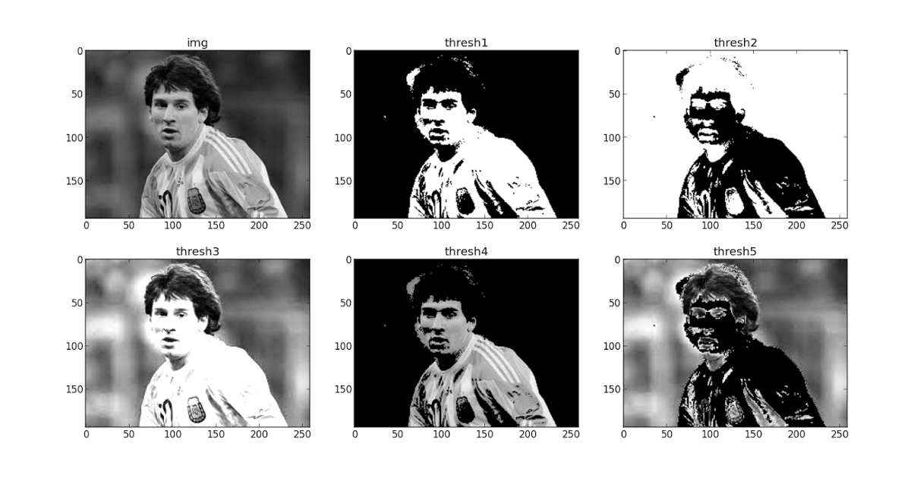

Việc thresholding được thực hiện thông qua hàm **cv2.threshold**, hàm này có dạng:

```
ret, thresh = cv2.threshold(img, <classify value>, <max value>, <type>)
```

Tham số đầu tiên là đối tượng `img`, tức là hình ảnh đầu vào cần xử lý, tham số thứ 2 `classify value` là giá trị màu trong khoảng từ **$0 \rightarrow 255$** (đen đến trắng) dùng làm ngưỡng phân biệt, tham số thứ 3 là giá trị sẽ được gán cho pixel đang xét nếu nó lớn hơn giá trị classify, ở đây chúng ta có thể dùng **255** tức là màu trắng. Cuối cùng là tham số type, nhận vào một trong các giá trị:

- cv2.THRESH_BINARY
- cv2.THRESH_BINARY_INV
- cv2.THRESH_TRUNC
- cv2.THRESH_TOZERO
- cv2.THRESH_TOZERO_INV


Chúng ta sẽ thử apply thuật toán thresholding với tham số `THRESH_BINARY` và xem kết quả:

```
import cv2
import numpy as np
from matplotlib import pyplot as plt

img = cv2.imread('manga.jpg')
img = cv2.cvtColor(img, cv2.COLOR_BGR2GRAY)
ret,thresh = cv2.threshold(img, 90, 255, cv2.THRESH_BINARY)

plt.subplot(121), plt.imshow(img, cmap='Greys_r')
plt.subplot(122), plt.imshow(thresh, cmap='Greys_r')
plt.show()
```

Chạy thử sẽ thấy các chi tiết màu xám (như phần lửa ở khung truyện giữa) đã bị lọc bỏ:

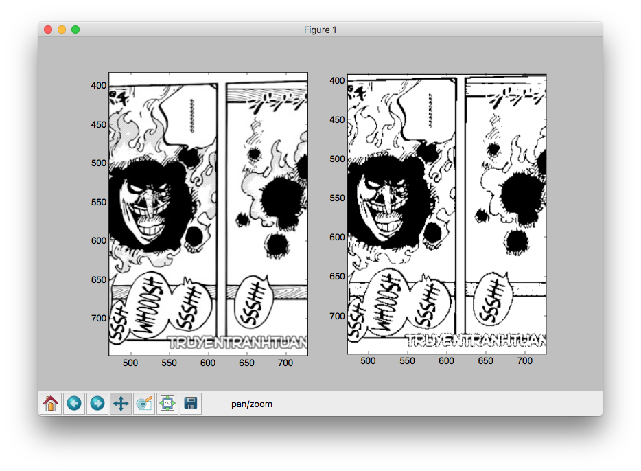

Tuy nhiên các thành phần như watermark vẫn còn, để lấy khung hình chính xác hơn, chúng ta có thể tạm thời loại bỏ chúng ra khỏi vùng xác định (tất nhiên chúng ta sẽ không thay đổi bất kì nội dung nào của trang truyện khi implement trên ứng dụng thực tế cả)

Đồng thời, để phục vụ cho bước tiếp theo, chúng ta cũng sẽ thay giá trị `cv2.THRESH_BINARY` thành `cv2.THRESH_BINARY_INV` để đảo ngược màu sắc trong khung truyện, lý do sẽ giải thích ở bước tiếp theo.

```
ret,thresh = cv2.threshold(img, 80, 255, cv2.THRESH_BINARY_INV)
```

Hạ giá trị ngưỡng màu xuống một tí để lọc các phần màu sáng hơn, kết quả có vẻ khả quan hơn:

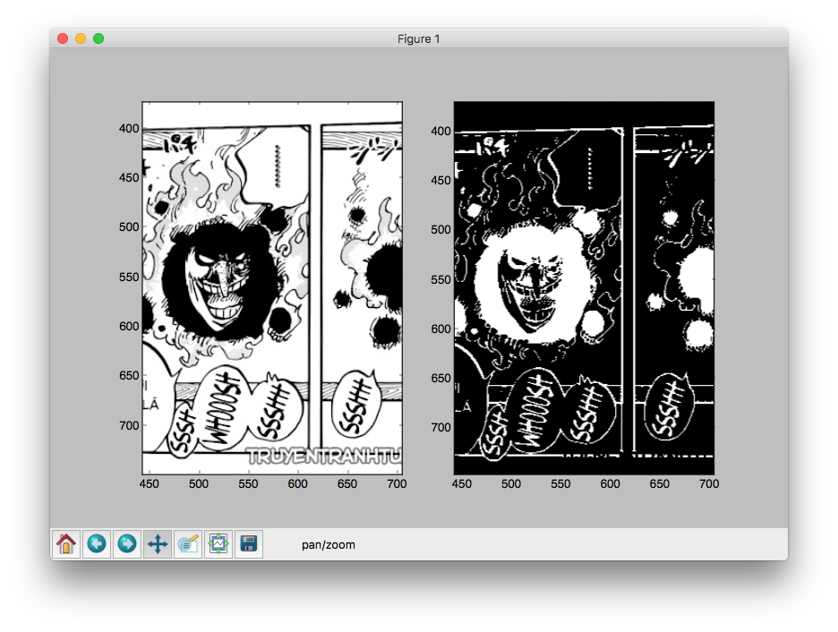

### Xác định Contours

Contours là đường bao kết nối tất cả các điểm liền kề nhau có cùng màu sắc hoặc độ tương phản. Chính vì đặc tính này, contours thường được dùng trong xác định vật thể, nhận dạng,... 

Trong trường hợp này chúng ta cũng sẽ dùng thuật toán xác định contours làm nền tảng để xác định các khung truyện.

Trong OpenCV, thuật toán tìm contours hoạt động dựa trên các chi tiết có màu trắng, trên nền màu đen. Chính vì vậy ở phần trước, khi thực hiện thresholding, chúng ta đã đảo màu nền và màu nét của trang truyện.

Chúng ta sẽ dùng hàm **cv2.findContours()** để tìm hết tất cả contours trong hình, và dùng hàm **cv2.drawContours()** để vẽ các contours tìm được lên hình. Chi tiết về 2 hàm này các bạn có thể xem tại [đây](https://opencv-python-tutroals.readthedocs.io/en/latest/py_tutorials/py_imgproc/py_contours/py_contours_begin/py_contours_begin.html#contours-getting-started).

```
import cv2
import numpy as np
from matplotlib import pyplot as plt

orig = cv2.imread('manga.jpg')
img = cv2.imread('manga.jpg')
result = cv2.imread('manga.jpg')
img = cv2.cvtColor(img, cv2.COLOR_BGR2GRAY)

ret,thresh = cv2.threshold(img, 80, 255, cv2.THRESH_BINARY_INV)
contours, h = cv2.findContours(thresh, cv2.RETR_TREE, cv2.CHAIN_APPROX_SIMPLE)

for cnt in contours:
    cv2.drawContours(result, [cnt], -1, 255, -1)

plt.subplot(121), plt.imshow(orig)
plt.subplot(122), plt.imshow(result)
plt.show()
```

Phần màu đỏ chính là phần contours tìm được sau khi sử dụng thuật toán findContours. Ở đây mình dùng hàm **drawContours** để vẽ đè phần contours lên trên hình gốc để dễ hình dung:

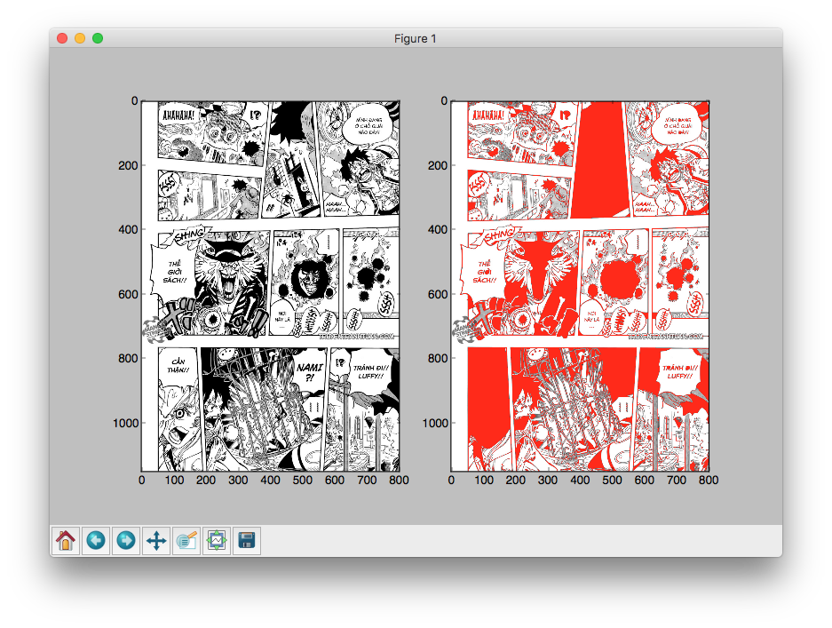

Tuy nhiên, với các contours như trên, chúng ta vẫn rất khó để phân biệt được đâu là khung truyện chính xác, cần có một phương pháp hiệu quả hơn.

### Convex Hull

Convex Hull là một đường xấp xỉ bao quanh contours, và có ít đỉnh hơn, tạo ra một hình khối tổng quát của contour đó.

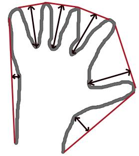

Ta sẽ áp dụng convex hull để xác định các đường bao quanh các contours trong một khung truyện, bằng cách này ta có thể xác định được chính xác hơn.

Để tìm convex hull của một contour, chúng ta sử dụng hàm **cv2.convexHull()**, chi tiết về hàm này có thể xem tại [đây](https://opencv-python-tutroals.readthedocs.io/en/latest/py_tutorials/py_imgproc/py_contours/py_contour_features/py_contour_features.html?highlight=convex%20hull).

```
for cnt in contours:
    hull = cv2.convexHull(cnt)
    cv2.drawContours(result, [cnt], -1, 255, -1)
    cv2.drawContours(result, [hull], -1, 255, -1)
```

Kết quả là chúng ta đã xác định được một cách tương đối chính xác từng ô truyện như hình sau:

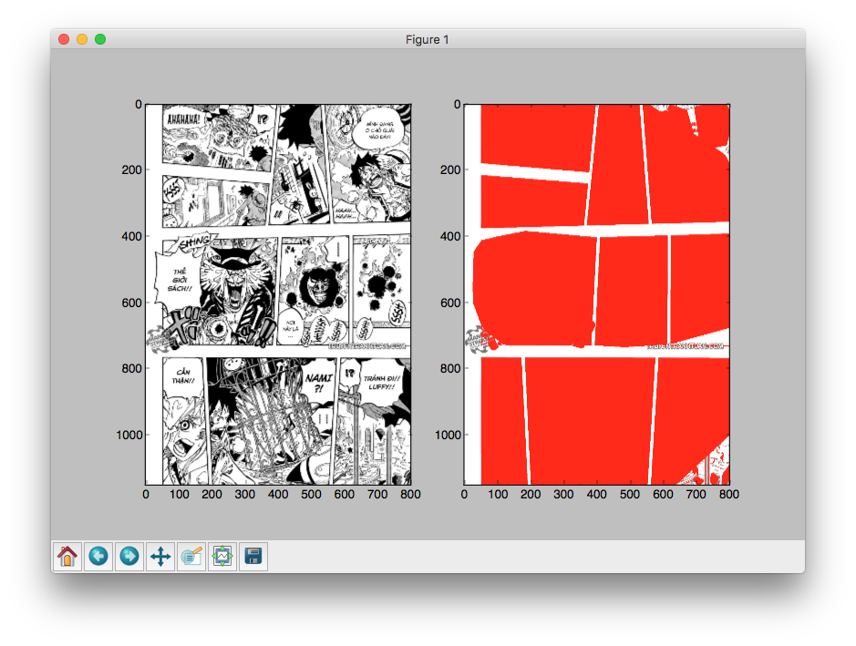

Một số ô truyện vẫn còn bị cắt vào phần nội dung, lý do là chúng ta chưa xác định rõ phần viền của nội dung một trang truyện, và bị cắt xén trong quá trình thresholding. Vấn đề này sẽ được nói chi tiết hơn ở các bài sau.

Các bạn có thể tham khảo mã nguồn đầy đủ tại đây:

```
import cv2
import numpy as np
from matplotlib import pyplot as plt

filename = 'manga.jpg'

orig = cv2.imread(filename)
img = cv2.imread(filename)
result = cv2.imread(filename)
img = cv2.cvtColor(img, cv2.COLOR_BGR2GRAY)

ret,thresh = cv2.threshold(img, 80, 255, cv2.THRESH_BINARY_INV)

contours, h = cv2.findContours(thresh, cv2.RETR_TREE, cv2.CHAIN_APPROX_SIMPLE)

for cnt in contours:
    hull = cv2.convexHull(cnt)
    cv2.drawContours(result, [cnt], -1, 255, -1)
    cv2.drawContours(result, [hull], -1, 255, -1)

plt.subplot(121), plt.imshow(orig)
plt.subplot(122), plt.imshow(result)
plt.show()
```

## Thử nghiệm 

Đối với các trang truyện có khung hình đã được canh chỉnh cách xa đường viền của trang, thì thuật toán hoạt động rất hiệu quả:

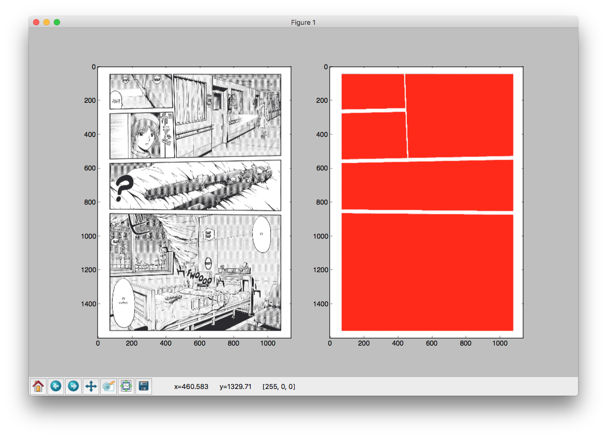

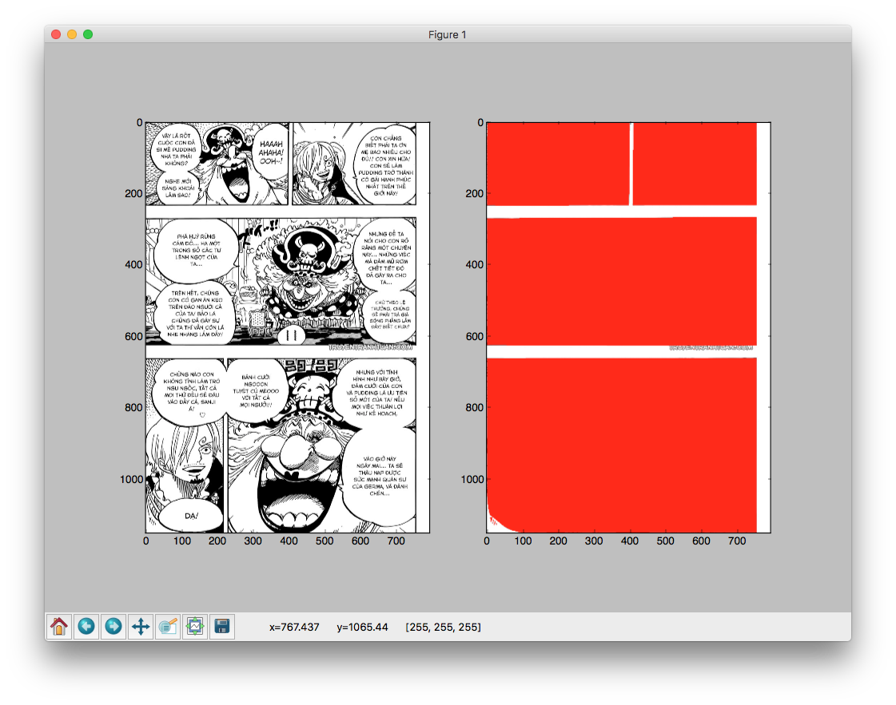

Đối với các truyện có nội dung tràn lề, thuật toán bắt đầu hoạt động kém hiệu quả:

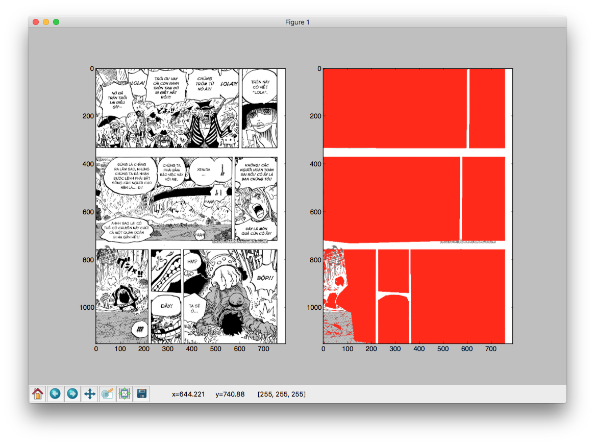

Đặc biệt đối với những truyện có layout hoàn toàn bất thường như 2 ví dụ dưới đây thì thuật toán gần như không hoạt động 😭

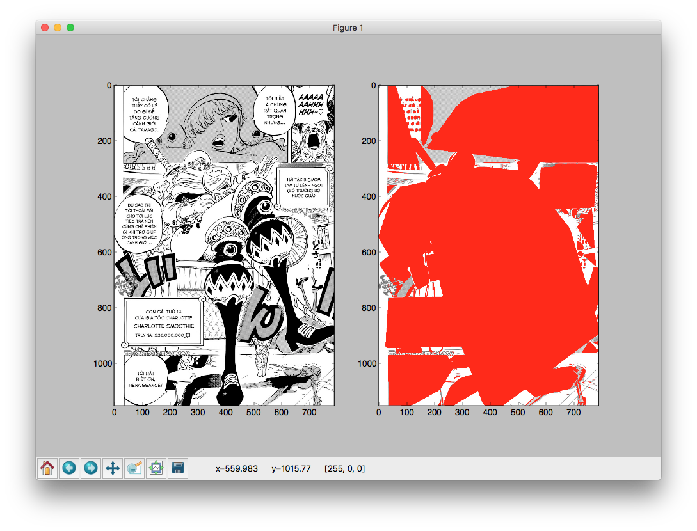

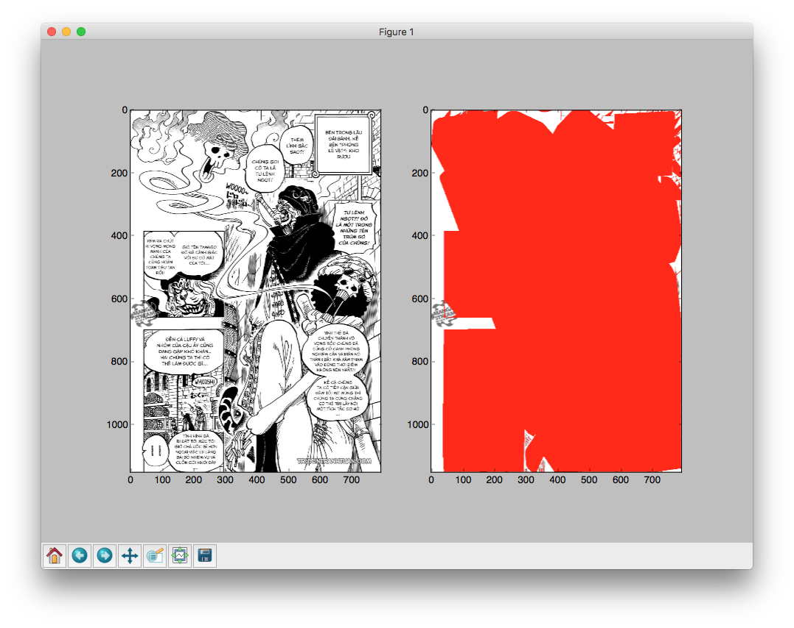

## Kết luận

Tạm thời chúng ta đã thu được kết quả nhất định, thuật toán hoạt động ổn trong một số trường hợp, tuy nhiên với óc sáng tạo của các mangaka, việc bố trí layout cho một trang truyện có thể biến đổi khôn lường, đến lúc này thì thuật toán của chúng ta cần phải có cách giải quyết hiệu quả hơn.

Ngoài 2 trường hợp đặc biệt cuối cùng, thuật toán cần cải thiện việc xử lý khung viền đối với những trang truyện có nội dung tràn lề (như ví dụ 3), ở bài viết tới, chúng ta sẽ cùng tìm hiểu về cách tự động vẽ lại nội dung đường viền để khắc phục tình trạng này.

---

Dữ liệu cho các ví dụ minh hoạt thuật toán ở trong bài viết được lấy từ các manga **One Piece** chapter 846 và **GTO: Paradise Lost** chap 42 từ trang [TruyenTranhTuan](http://truyentranhtuan.com). Việc sử dụng chỉ nhằm mục đích nghiên cứu khoa học, không hề có sự đồng thuận từ phía các tác giả Eiichiro Oda, Fujisawa Tooru hay từ phía các nhà xuất bản.
