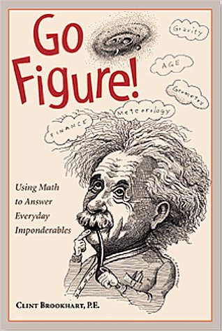
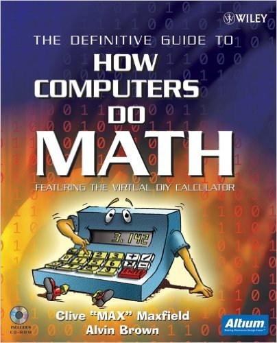
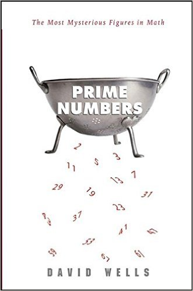
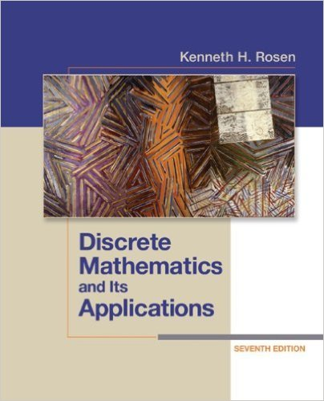

Có một thực tế là trong suốt quá trình đi học từ phổ thông lên tới đại học thì chưa bao giờ mình có cảm tình với mấy môn toán, hồi đó mình đơn giản chỉ nghĩ là mình sinh ra không dành để học toán, thế thôi.

Cho đến một năm gần đây mình mới có dịp để ngộ ra một điều là, không phải tại môn toán khô khan không thu hút được mình, mà tại vì phương pháp học toán theo lối "cưỡng chế" ở nhà đã giúp hình thành nên cái định kiến về toán của mình, mỗi năm một chút một trong suốt 16 năm đi học.

Nói vậy thôi chứ mình cũng không dám tự nhận mình là một người mê toán đích thực, nhưng mình cảm thấy rất có hứng thú với các món toán ứng dụng, đơn giản vì nó rất thực tế (và dần dần mình nhận ra không có chỗ nào trong toán là không có ứng dụng thực tế cả). Nhưng nếu nói bây giờ mình đi học đại học lại và chọn chuyên ngành toán, câu trả lời chắc chắn là: KHÔNG :))

Ở thời điểm này, chắc mình chỉ theo toán ở mức độ hobby thôi. Mình chủ yếu tập trung tìm hiểu về toán ứng dụng trong thực tiễn và tìm cách áp dụng nó vào lập trình, mình cũng sẽ viết thêm nhiều bài về những gì mình tìm hiểu được. 

Nhân đây cũng xin giới thiệu vài cuốn sách mình cảm thấy hợp gu, có thể nó không thực sự chuyên sâu (vì mình là dân amateur mà) nhưng là những quyển mà mình cảm thấy rất đáng để đọc.

## Go Figure! Using Math to Answer Everyday Imponderables

Link sách trên Amazon: [Go Figure!: Using Math to Answer Everyday Imponderables](https://www.amazon.com/Go-Figure-Answer-Everyday-Imponderables/dp/0809228823)

Là một quyển sách không hề sâu, đưa ra các vấn đề phổ thông thường gặp, hướng vào đối tượng người đọc phổ thông, không phải dân chuyên về toán nên có bị ném đá trên Amazon về chất lượng, tuy nhiên để khởi động (as a hobbyist) thì đây là một quyển nên đọc. Quyển sách này phù hợp với mọi lứa tuổi. Và lời khuyên khi đọc quyển này là: **Luôn luôn tìm cách tìm hiểu/kiểm chứng những gì bạn đọc được trong đó**. Đây cũng là cách chúng ta nên làm khi đọc bất cứ một quyển sách nào.

## The Definitive Guide to How Computers Do Math

Link sách trên Amazon: [The Definitive Guide to How Computers Do Math : Featuring the Virtual DIY Calculator](https://www.amazon.com/Definitive-Guide-How-Computers-Math/dp/0471732788)

Nếu bạn đã từng học qua môn "Kiến trúc máy tính" ở trường đại học thì đây là quyển sách mà bạn chắc chắn phải đọc, vì nó thú vị gấp trăm lần những gì bạn được học ở trường. Trình bày mọi thứ trong môn "Kiến trúc máy tính" từ cơ bản tới nâng cao một cách cặn kẽ, chi tiết và đầy ắp hình minh họa (mình là mình rất thích những cuốn sách dùng nhiều hình minh họa :))) 

## Prime Numbers: The Most Mysterious Figures in Math

Link sách trên Amazon: [Prime Numbers: The Most Mysterious Figures in Math](https://www.amazon.com/Prime-Numbers-Most-Mysterious-Figures/dp/1620458241)

Một quyển sách nói về số nguyên tố (prime numbers) và tất tần tận những điều thú vị xung quanh nó. Quan trọng nữa là cuốn này không dài, rất dễ đọc.

## Discrete Mathematics and Its Applications

Link sách trên Amazon: [Discrete Mathematics and Its Applications](https://www.amazon.com/Discrete-Mathematics-Applications-Kenneth-Rosen-ebook/dp/B006U064FY)

"Toán rời rạc và những ứng dụng của nó" - Tựa đề cuốn sách đã nói lên tất cả. Đây là một quyển sách nên đọc đối với các bạn theo ngành CNTT và muốn tìm hiểu thêm về toán. Cuốn sách giải thích các vấn đề mà chúng ta vẫn gặp trong lập trình bằng phương pháp toán học như là các biểu thức logic, tập hợp, ma trận, đệ quy, chia để trị, lý thuyết đồ thị,...

Ở Việt Nam thì cuốn này được nhiều nhà xuất bản dịch ra với cái tên "Toán học rời rạc ứng dụng trong tin học", và nghe đâu bản do nhà xuất bản Giáo Dục thực hiện được dùng làm giáo trình chính thức của Đại học FPT (nguồn: [Diễn đàn Toán học](http://diendantoanhoc.net/topic/45613-toan-h%E1%BB%8Dc-r%E1%BB%9Di-r%E1%BA%A1c-%E1%BB%A9ng-d%E1%BB%A5ng-trong-tin-h%E1%BB%8Dc/)). 

---

Như đã nói thì các cuốn cách mình giới thiệu trên đây là những cuốn mình đang đọc và chưa hề đi sâu vào toán, vì thực sự thì khả năng về toán của mình cũng không đủ sâu để đọc những quyển quá sâu ở thời điểm hiện tại. Hy vọng trong thời gian tới sẽ đủ trình có thể giới thiệu cho các bạn nhiều tựa sách hay hơn. :D 
