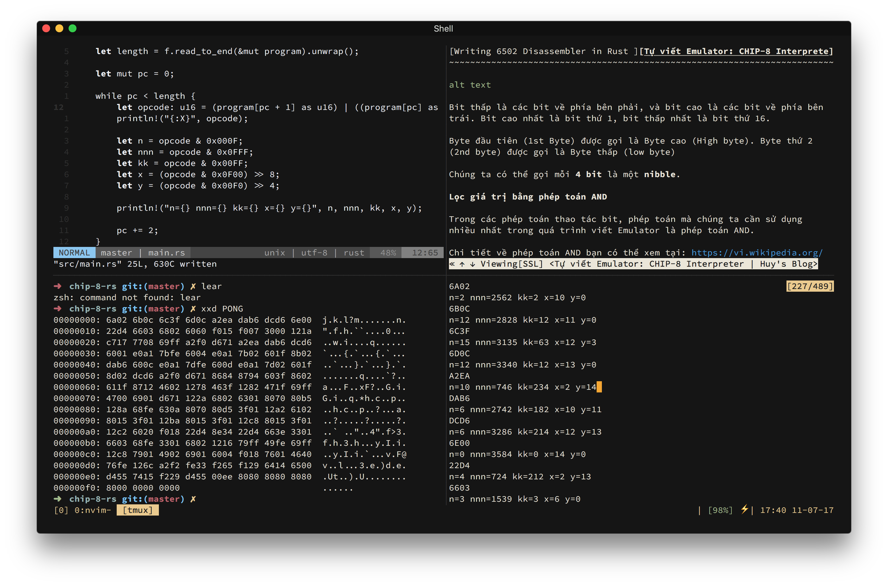
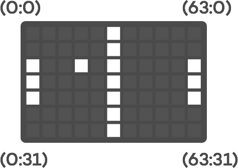
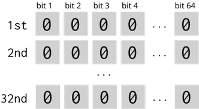
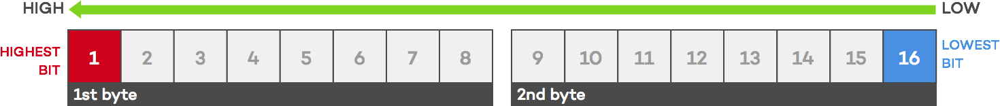

Cách đây mấy hôm mình có share cái screenshot trên Facebook, khoe linh tinh vụ mình đang viết lại cái [CHIP-8 emulator](https://thefullsnack.com/posts/tu-viet-emulator.html) bằng Rust.



Mãi cho đến hôm nay thì vẫn viết chưa xong, chán quá nên ngồi viết mấy dòng linh tinh về quá trình này.

Phàm làm bất cứ chuyện gì, đều là cả một quá trình :joy: viết Emulator hay code bất cứ thứ gì cũng vậy. Và trong quá trình đó thì người viết luôn phải trải qua vô số những quyết định về mặt kĩ thuật, ví dụ như nên dùng `if..else` hay `pattern matching`, viết test hay ko test :smirk:, chia module hay viết 100 ngàn dòng trong 1 file,...

---

Một trong những quyết định đau đầu nhất của mình đó là chọn cấu trúc dữ liệu để biểu diễn ma trận hiển thị (display matrix) - tức là cái màn hình cho emulator.



Như đã đề cập ở bài [Tự viết Emulator](https://thefullsnack.com/posts/tu-viet-emulator.html), màn hình của CHIP-8 là một ma trận $64 \times 32$. Nên cách biểu diễn thường gặp nhất đó là một mảng số nguyên (integer) hai chiều.

Tuy nhiên, việc dùng số nguyên rất là tốn kém, trong Rust, kiểu số nguyên nhỏ nhất là `i8`, chiếm **1 byte** (8 bits), và trong JavaScript thì còn tệ hơn nữa khi một giá trị kiểu `Number` mặc định chiếm bà nó **8 bytes** (64 bits). Nhân lên, để khai báo một mảng hai chiều cho ma trận hiển thị của CHIP-8 ta cần $64 \times 32 \times 8 = 16,384$ bits trong bộ nhớ nếu dùng Rust (tương đương với **2 KB**), và **131,072 bits** tương đương với hơn **16 KB** nếu xài JavaScript.

Con số có vẻ không lớn nếu chạy trên máy tính, nhưng nếu bạn đang implement cho các nền tảng èo ọp hơn :joy: như là Arduino thì đây là cả một vấn đề cực kì lớn. Đơn cử, dòng Arduino phổ biến nhất là UNO R3, sử dụng vi xử lý [ATmega328P](https://store.arduino.cc/arduino-uno-rev3) và bộ nhớ [SRAM (static random access memory)](https://www.arduino.cc/en/Tutorial/Memory) của nó chỉ có đúng **2 KB**.

Quèo, trên thực tế thì bạn vẫn không thể chạy trực tiếp CHIP-8 emulator trên Arduino được vì tính riêng dung lượng bộ chớ chính của nó cũng đã ngốn mất **4096 bytes** rồi :weary: trong trường hợp này chúng ta cần dùng thêm một con chip khác để làm external RAM, tuy nhiên, vấn đề này nằm ngoài phạm vi bài viết, có thể mình sẽ nói tới trong một bài khác.

---

Dễ nhận thấy, đối với CHIP-8, màn hình hiển thị chỉ gồm 2 màu trắng đen, mỗi pixel chỉ có 2 trạng thái đó là **on** hoặc **off**, tương đương với chỉ có 2 giá trị **0** hoặc **1**, vậy thì việc dùng số nguyên để biểu diễn là không cần thiết.

Kiểu dữ liệu nào chỉ có 2 trạng thái nhỉ? `bool`! Tuy nhiên ngay cả kiểu `bool` trong Rust cũng chiếm tới **1 byte** (8 bits). Còn trong JavaScript thì mình chịu, không có tài liệu nào nói cụ thể, các đoạn code tính size của 1 type thì ghi nó tận **4 bytes** :joy:. Mình không tin :angry: có bằng chứng thì mới tin.

Ý định dùng `bool` coi như cũng không có ổn. Bỏ!

## Dùng bit array

Bản thân một bit có thể chứa được 2 giá trị (**0** và **1**), như vậy là đã thỏa mãn cho yêu cầu của một ma trận hiển thị.

Vậy thì có cách nào chỉ dùng đúng $64 \times 32 = 2048$ bits trong bộ nhớ không? Có!

Rust có hỗ trợ kiểu `u64` (64-bit unsigned integer), là một kiểu số nguyên không đấu, khi khai báo một biến kiểu này tất nhiên nó sẽ chiếm 64 bits trong bộ nhớ.


Và nếu chúng ta khai báo một mảng gồm **32** số nguyên **64 bit** `[u64; 32]` thì sao? Chúng ta sẽ có **2048 bits**! Đủ để chứa toàn bộ ma trận hiển thị.



Đến đây thì vấn đề sẽ là: Làm sao để đọc/ghi vào một bit bất kì của một số `u64`.

**Lưu ý:** về thứ tự cao thấp của các bit, ở đây chúng ta theo quy ước các số đều là big endian, các bit được sắp xếp theo thứ tự từ bit cao đến bit thấp. Ví dụ trong hình sau là một số `u16` gồm có 2 bytes:



Từ trái qua phải, bit đầu tiên gọi là bit cao nhất (highest bit), bit cuối cùng gọi là bit thấp nhất (lowest bit).

Vì thế, khi nói một bit thứ `i`, chúng ta có thể hiểu là bit thứ `i` tính từ bit thấp nhất (bên phải) qua :astonished:.

## Đọc một bit

Để đọc một bit thứ `i` của một số `n`, ta dịch phải số `n` một khoảng bằng `i - 1` bits, và thực hiện phép `AND` kết quả thu được với **1**:

<math>
\texttt{(n >> (i - 1)) & 1}
</math>

**Ví dụ:** Để đọc bit thứ 6 của số **0xA1**, ta sử dụng công thức trên qua từng bước như sau:

Số **0xA1** biểu diễn dưới dạng nhị phân là **1010 0001**. Để lấy được bit thứ 6, ta cần dịch phải 5 bit:

<math>
\texttt{1010 0001 >> 5} = \texttt{0000 0101}
</math>

Tiếp theo, ta thực hiện phép `AND` kết quả trên với số **1**, thực chất có biểu diễn nhị phân là **0000 0001**:

<math>
\texttt{0000 0101 & 0000 0001} = \texttt{0000 0001} = \texttt{1}
</math>

Kết quả thu được sẽ là **1**.

## Ghi một bit

Để ghi giá trị **1** vào bit thứ `i` của số `n`, ta dùng phép `OR` cho số `n` và kết quả của phép dịch trái số **1** một khoảng `i - 1` bits:

<math>
\texttt{n | (1 << (i - 1))}
</math>

**Ví dụ:** Để ghi vào bit thứ 4 của số **0xA1**, đầu tiên ta lấy số **1** dịch phải một khoảng 3 bit:

<math>
\texttt{0000 0001 << 3} = \texttt{0000 1000}
</math>

Sau đó ta thực hiện phép `OR` kết quả thu được với số **0xA1**:

<math>
\texttt{1010 0001 | 0000 1000} = \texttt{1010 1001} = \texttt{0xA9}
</math>

## Xóa một bit

Để xóa một bit thứ `i` (đưa bit đó về giá trị ban đầu, là **0**) của một số `n`, ta làm như sau:

<math>
\texttt{n & !(1 << (i - 1))}
</math>

**Ví dụ:** Để chuyển giá trị **0xA9** thu được ở ví dụ trên về lại thành **0xA1**, ta phải xóa bit thứ 4 cua số đó. Tương tự như ở ví dụ trước, đầu tiên ta sẽ dịch trái số **1** một khoảng 3 bit, lần này ta lấy giá trị nghịch đảo `NOT` của nó.

<math>
\lnot (\texttt{0000 0001 << 3}) = \lnot (\texttt{0000 1000}) = \texttt{1111 0111}
</math>

Sau đó thực hiện phép `AND` giữa kết quả thu được và giá trị nhị phân của số **0xA9**:

<math>
\texttt{1010 1001 & 1111 0111} = \texttt{1010 0001} = \texttt{0xA1}
</math>

## Implement

Đã thấy lợi hại chưa?

Cá nhân mình thì ko biết nữa, nhưng thấy khá là hại não :astonished: tuy nhiên hiệu quả đem lại thì rất lớn, chúng ta đã tiết kiệm được một lượng lớn bộ nhớ, từ **2KB** xuống còn **2048 bits**.

Bây giờ thì có thể implement thành hàm hay class để dùng lại cho tiện. Ví dụ, đây là hai hàm mình viết để sử dụng trong emulator:

```rust
// Lưu ý, code này không có chính xác :v
impl Screen {
  ...
  pub fn set_pixel(&mut self, x: usize, y: usize, on: bool) {
    if on {
      self.display[y] |= 1 << x;
    } else {
      self.display[y] &= (!(1 << x));
    }
  }

  pub fn get_pixel(&self, x: usize, y: usize) -> u64 {
    (self.display[y] >> x) & 1
  }
  ...
}
```

---

Ngoài việc dùng cho emulator (màn hình trắng đen) ra, thì cách thể hiện ma trận dùng bit array này còn có thể được dùng cho nhiều trường hợp khác như bảng đèn điện tử (tín hiệu bật/tắt), lưu các đỉnh của một đồ thị, lưu bàn cờ hoặc các thể loại map đơn giản nếu bạn làm game, hoặc có thể cải tiến để sử dụng từng byte thay vì từng bit để lưu trữ được nhiều thông tin hơn.

Hy vọng qua bài viết này, mình đã ít nhiều chia sẽ được cho các bạn chút gì đó, mặc dù cho đến thời điểm này mình vẫn chưa biết là mình đã chia sẽ được gì :grin:

Cảm ơn các bạn đã kiên nhẫn đọc đến tận những dòng này. Nếu các bạn cảm thấy bài viết này thú vị, đừng ngại để lại comment, và nhớ [subscribe vào mailing list](http://eepurl.com/cN5YDv) của mình để nhận thông báo về các bài viết mới, hoặc [like trang Facebook](https://facebook.com/thefullsnackblog) để đọc những dòng status ất ơ ngẫu nhiên của mình vào một ngày đẹp trời nào đó. Chào thân ái và quyết thắng.
