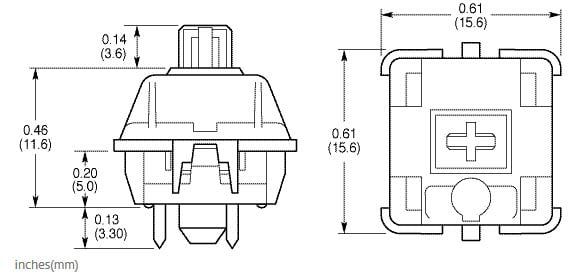

Là một lập trình viên, bàn phím là một vật dụng bạn phải sờ vào hằng ngày, thậm chí số lần bạn sờ nó còn nhiều hơn số lần bạn sờ vào vợ hoặc bạn gái. Chính vì vậy, chúng ta phải đầu tư cho nó một cách xứng đáng, bằng 2 cách:

1. Mua một cái bàn phím cơ
2. Tự làm một cái

Và, với những ai tự gọi mình là kĩ sư (software engineer, backend engineer, frontend engineer, hay copy-pasta engineer, stackoverflow engineer,... nói chung là mọi thể loại engineer), chẳng có lý do gì để không tự làm một cái cho riêng mình, để tự mình quyết định bố cục (layout), màu sắc (keycaps), và tốc dộ gõ (key switches, scanning time).

Suy cho cùng, tự mình build một cái gì đó, và tự tay giải quyết những vấn đề hóc búa trong quá trình build, học hỏi và thu lại được kinh nghiệm cho bản thân, cũng có thể gọi là cái raison d'être của một engineer :smirk:. Hay nói cách khác, như vậy mới gọi là dân chơi đúng nghĩa :joy:.


<div class="copyright center">Hình ảnh sẽ xuất hiện trong bài sau, không phải bài này =)))</div>

Đó cũng là lý do mà mình quyết định tự build một cái bàn phím 40% cho riêng mình. Tuy nhiên, làm  việc gì cũng có thử nghiệm, thất bại, rút kinh nghiệm,... để hạn chế những vấn đề đó, chúng ta sẽ bắt đầu với một bản prototype đơn giản nhưng đủ phức tạp để thấy được các vấn đề trong thực tế.

## Nguyên vật liệu

Đối với bản prototype này, chúng ta cần chuẩn bị:

- 4 x Cherry MX Brown Switches (chọn switch nào là sở thích cá nhân thôi, hè hè)
- 4 x Keycap tùy ý
- 4 x Diode 1N4148
- 1 x Teensy 3.2 (hoặc Arduino Pro Micro)

~~Hoặc nếu máu thì các bạn có thể [tự làm một con Teensy cho riêng mình](https://www.pjrc.com/store/ic_mkl02.html)~~ :joy:

## Bố cục bàn phím

Đa phần các bàn phím tên tuổi thường chỉ khác nhau về bố cục (layout), và đây là phần bất biến, sau khi sản xuất, còn lại những thứ khác (case, plate, key mapping...) thì đều có thể được custom tùy ý.

Đối với bản prototype này, chúng ta sẽ thiết kế một layout vô cùng phức tạp, như thế này:


Quá phức tạp! :joy: :joy: :joy:

Sau khi đã thiết kế xong bố cục thì chúng ta có thể move sang bước tiếp theo đó là thiết kế và cắt tấm đệm (plate).

Trong thiết kế của bàn phím cơ, có 2 cách lắp ghép (mount) swtiches, là _Plate Mount_ và _PCB Mount_.


<div class="copyright center">PCB mount bên trái. Plate mount bên phải.<br/>Nguồn: https://www.mouser.com/new/Cherry-Electrical/cherry-mx-keyswitch/</div>

PCB Mount là cách lắp các switches trực tiếp trên board mạch. Ưu điểm của thiết kế này là bàn phím nhẹ hơn, cảm giác gõ sâu hơn, có thể cảm nhận rõ độ nẩy và lún của switch. Có khá ít bàn phím thiết kế theo dạng này, có thể kể đến Minvan, KBC Poker,... là các bàn phím như vậy.


<div class="copyright center">Nguồn: https://www.extremetech.com/electronics/255783-tiny-keyboard-experiment-living-minivan</div>

Plate Mount là cách lắp các switches trên một tấm nền thường là bằng kim loại, plate thường có độ dày khoảng `1.5mm` (rất quan trọng nếu bạn tự làm plate), trên thân của switch cũng có các khớp để "móc" vừa vào plate. Sau đó là đến PCB nằm bên dưới.


<div class="copyright center">Nguồn: https://medium.com/@armno/building-my-own-mechanical-keyboard-6903b887b93d</div>

Ưu điểm của cách bố trí này là bàn phím sẽ rất cứng cáp, cảm giác gõ rất chắc chắn, nhưng độ gõ không sâu.

Hầu hết bàn phím cơ trên thị trường được thiết kế dùng plate mount.

Vì bản prototype này chúng ta tự hàn mạch bằng tay chứ chưa thiết kế PCB, nên chúng ta sẽ chọn cách plate mount. Và tùy vào độ khéo tay cũng như vật liệu mà bạn kiếm được, mình suggest dùng giấy bìa cứng =)) cắt một tấm hình vuông nhỏ nhắn xinh xinh kiểu này:


Mấy cái ô trống thì cắt hình vuông là được rồi, không cần phải phức tạp như trong hình kia đâu. Căn cứ vào kích thước của switch (ở đây là Cherry MX), mỗi ô trên plate sẽ có kích thước tầm `15mm - 15.6mm`


<div class="copyright center">Nguồn: https://www.mouser.com/new/Cherry-Electrical/cherry-mx-keyswitch/</div>


## Mạch điện

Tiếp đến là bước nối mạch điện. Sau khi lắp xong swtich vào plate thì lật ngửa nó ra, các bạn sẽ thấy bố trí như hình bên dưới, với mỗi switch gồm 2 chân, các chân bên trái nằm cao hơn bên phải. Nối diode vào chân bên trái, và nối lại với nhau để tạo thành một hàng, đồng thời, nối các chân bên phải lại với nhau tạo thành các cột.


<div class="center">Sơ đồ mạch điện trên lý thuyết</div>


<div class="center">Và thực tế :joy:</div>

Cách mắc mạch điện như trên cũng là cách mắc phổ biến trong các loại bàn phím cơ, các switch tạo thành một mam trận nhiều hàng nhiều cột, cách mắc này có ưu điểm là tiết kiệm được số cổng kết nối trên board điều khiển, trong bản prototype này chúng ta không thể thấy rõ điều đó, nhưng giả sử với một bàn phím 60%, thường sẽ có 5 hàng và 15 cột, như vậy ta chỉ cần 20 cổng kết nối trên board điều khiển, nhưng vẫn có thể xử lý được từ 60 đến 65 phím.

Nếu các bạn thắc mắc tại sao phải lắp thêm diode vào các switch thì có thể tham khảo thêm về [vấn đề Ghosting](https://www.dribin.org/dave/keyboard/one_html/).

Sau khi hoàn tất công đoạn hàn mạch, thì chúng ta sẽ nối mạch này vào Teensy, chúng ta gọi các dây xanh là hàng (row), và dây đỏ là cột (column), mạch của chúng ta gồm có 2 hàng và 2 cột, tiến hành nối các hàng và cột này vào 4 cổng digital của Teensy, cổng nào là tùy ý các bạn chọn.


Trong hình trên, mình nối các cột vào các chân số 2 và 3. Các hàng vào các chân số 6 và 7.

## Thiết kế Firmware

Khi mình bắt đầu phần này thì khá là nhiều người trên Reddit và Geekhack khuyên mình đừng nên tự viết firmware riêng mà hãy dùng các firmware có sẵn như [TMK](https://github.com/tmk/tmk_keyboard) hoặc [QMK](https://github.com/qmk/qmk_firmware). Tuy nhiên khi thử build hai loại firmware trên thì rất may là mình dùng Teensy 3.2, board này xài chip ARM 32-bit (Cortex-M4), chưa được support tốt lắm trên cả 2 firmware trên, nên build không chạy được :cry:. Thế nên mình quyết định là tự viết riêng cho mình một bản firmware riêng.

Để cho đơn giản, thì mình sẽ sử dụng [Teensyduino](https://www.pjrc.com/teensy/teensyduino.html) để lập trình. Đây là một add-on của Arduino IDE, cho phép chúng ta lập trình trên Teensy bằng bộ thư viện của Arduino, và sử dụng cấu trúc chương trình của Arduino.

Một firmware cơ bản sẽ là một event loop thực hiện các công việc sau:

- **Scan:** quét liên tục để tìm ra các phím được nhấn 
- **Processing:** xây dựng một buffer chứa keycode của các phím đang được nhấn xuống, dựa trên keymap mà chúng ta đã thiết lập. 
- **Output:** Gửi buffer này về máy tính thông qua cổng USB.

Trước khi bắt tay vào thực hiện code logic trên, chúng ta cần phải khai báo một vài thông số liên quan:

```c
#include <Keyboard.h>

const byte ROWS = 2;
const byte COLS = 2;

char keys[ROWS][COLS] = {
  { 'A', 'B' },
  { 'C', 'D' }
};

const byte rowPins[ROWS] = { 6, 7 };
const byte colPins[COLS] = { 2, 3 };
```

Ở trên, chúng ta include thư viện `Keyboard.h` (đi kèm theo SDK của Arduino), chỉ vì chúng ta muốn sử dụng hàm `Keyboard.print()` có trong thư viện này để gửi phím được nhấn về cho máy tính.

Tiếp theo, chúng ta khai báo 2 hằng `ROWS` và `COLS` quy định số hàng và số cột của bàn phím, mảng `keys` chính là keymap, là mảng quy ước các kí tự nào thuộc về phím nào trên bàn phím của chúng ta, ở đây khi nhấn các phím `1, 2, 3, 4` thì bàn phím sẽ gửi về máy tính các kí tự `A, B, C, D`.

Hai mảng `rowPins` và `colPins` lưu vị trí các chân cắm trên board điều khiển, theo như cách chúng ta đã nối dây ở phần trước.

Đến đây, nếu tinh ý thì các bạn sẽ nhận ra, là ở bài viết tiếp theo khi chúng ta xây dựng firmware cho một cái bàn phím thực sự, thì chỉ cần thay đổi các thông số ở trên là xong.

Bây giờ đến phần implement event loop cho firmware của chúng ta, đầy đủ 3 bước `scan`, `process` và `output`:

```c
void loop() {
    char code = scan();
    if (code !== -1) {
        char keyCode = process(code);
        output(keyCode);
    }
    delay(50);
}
```

### Vấn đề #1: Quét tín hiệu

Hàm `scan()` của chúng ta sẽ có nhiệm vụ quét tất cả các hàng và các cột của mạch điện, kiểm tra xem phím nào được nhấn xuống và trả về một giá trị kiểu `byte` chứa thông tin các phím được nhấn.

_C không có kiểu byte nên chúng ta dùng kiểu char để thay thế._

Để cho đơn giản, thì chúng ta chỉ support việc nhấn một phím một lần, ở bài sau chúng ta sẽ cải tiến firmware để xử lý việc nhấn tổ hợp phím, macro,...

Việc quét phím được thực hiện thông qua thuật toán sau:

<div class="box-green skip" style="padding-left: 10px; padding-right: 10px">
<p>
<b>1:</b> Đưa tất cả các chân về trạng thái INPUT, mang giá trị HIGH</br>
<b>2:</b> Lần lượt đưa từng hàng (row) về trạng thái OUTPUT, giá trị LOW</br>
<b>3:</b> &emsp;Trên mỗi hàng, lần lượt đọc trạng thái của từng cột (col)</br>
<b>4:</b> &emsp;&emsp;Nếu phím K[r][c] tại hàng r cột c được nhấn, cột c sẽ mang giá trị LOW</br> 
<b>5:</b> &emsp;&emsp;Ghi nhận giá trị r và c.</br>
<b>6:</b> &emsp;Trả lại trạng thái ban đầu cho hàng hiện tại.</br>
<b>7:</b> Trả về giá trị r và c
</p>
</div>

Nếu cảm thấy khó hiểu ở bước 3 và 4, bạn có thể đọc thêm cách hoạt động của các chân digital [tại đây](https://www.arduino.cc/reference/en/language/variables/constants/constants/).

Vì mạch của chúng ta chỉ đơn giản gồm có 4 nút, mỗi hàng và mỗi cột chỉ có nhiều nhất là 2 phàn tử (index là 0 hoặc 1), vậy nên ta có thể "gói" hai giá trị hàng cột này vào cho một số kiểu `byte`, bằng phương pháp [dịch bit](https://thefullsnack.com/posts/matrix-representation.html).

Giả sử chúng ta đang ở hàng `r = 0` và cột `c = 1`, chúng ta có thể chèn giá trị `r` vào bit thứ nhất, và `c` vào bit thứ 2:

<math>
\texttt{n = (r << 0) | (c << 1)}
</math>

Khi cần đọc ngược lại thì cũng rất đơn giản:

<math>
\begin{align}
\texttt{r = (n >> 0) & 1} \\
\texttt{c = (n >> 1) & 1}
\end{align}
</math>

```c
char scan() {
    char code = -1;

    // Đưa tất cả các pin về trạng thái INPUT/HIGH
    for (int i = 0; i < ROWS; i++) {
        pinMode(rowPins[i], INPUT_PULLUP);
        digitalWrite(rowPins[i], HIGH);
    }
    for (int i = 0; i < COLS; i++) {
        pinMode(colPins[i], INPUT_PULLUP);
        digitalWrite(colPins[i], HIGH);
    }

    // Đưa từng hàng về trạng thái OUTPUT/LOW và quét
    for (int row = 0; row < ROWS; row++) {
        pinMode(rowPins[row], OUTPUT);
        digitalWrite(rowPins[row], LOW);
        for (int col = 0; col < COLS; col++) {
            if (!digitalRead(colPins[col])) {
                // Lưu giá trị hàng và cột thành một số int
                code = (row << 0) | (col << 1);
            }
        }
        pinMode(rowPins[row], INPUT_PULLUP);
        digitalWrite(rowPins[row], HIGH);
    }
    return code;
}
```

### Vấn đề #2: Gửi tín hiệu về máy tính

Tiếp theo, chúng ta cần chuyển thông tin về hàng/cột nhận được thành kí tự đã được khai báo trong keymap.

Bước này khá là đơn giản, chỉ cần đọc giá trị trả về từ hàm `scan()` và trả về giá trị tương ứng từ mảng `keys` :

```c
char process(char code) {
    return keys[(code >> 0) & 1][(code >> 1) & 1];
}
```

Hàm gửi tín hiệu `output()` sẽ sử dụng hàm `Keyboard.print` của bộ thư viện `Keyboard.h` và truyền thông tin sang máy tính:

```c
void output(char c) {
    Keyboard.print(c);
}
```

Đến bước này, bạn có thể compile và upload firmware vào Teensy để test thử.


Máy tính đã nhận diện được bàn phím mới, và gõ thì có ra được nội dung thật. Tuy nhiên sẽ có một vấn đề đó là hiện tượng nhấn một nút, máy tính sẽ in ra rất nhiều lần phím được nhấn. Đây gọi là hiện tượng key chatter.

Ở bài viết tiếp theo, chúng ta sẽ tìm hiểu sâu hơn về hiện tượng này, và implement kĩ thuật debounce để giải quyết nó.
