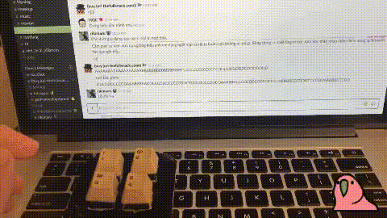
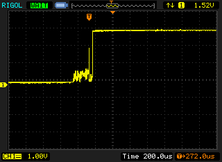
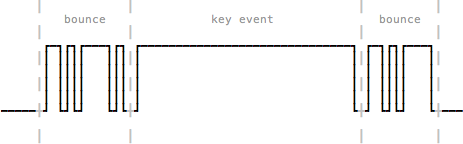
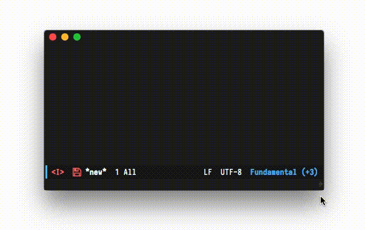

_Bạn đang xem phần hai của một [sê ri nhiều phần](/tags/keyboard-building.html), nhiều chừng nào, nhiều đến khi nào, thì chưa biết được._

Ở phần trước, chúng ta đã _sắp_ hoàn thiện một bản prototype bàn phím nho nhỏ với 4 nút, đáng ra ở bài này chúng ta đã có thể đi từ prototype đến thực tế, bắt tay vào thiết kế một quả phím cơ hoàn chỉnh, nhưng không, chúng ta gặp lỗi nhảy phím.

<video style="max-width: 500px; margin: 0 auto;" autoplay loop>
    <source type="video/mp4" src="../posts/img/mech-keyboard-part2/fourkey_test.mp4">
    
</video>
<div class="center mute">Video chỉ mang tính chất minh họa, căng mắt ra thì may ra còn thấy...</div>

Khi gõ, thì đôi lúc thay vì một kí tự được gửi đến máy tính, sẽ có 2, 3 kí tự cùng lúc.<span class="mute sidenote"><i class="em em-pig"></i> Lỗi này rất tai ương, trong mọi trường hợp, hãy tưởng tượng bạn đang ngồi xem phim heu thì phụ huynh bước vào, bạn nhanh tay nhấn Alt+Tab một cái, nhưng khốn nạn thay, máy tính lại nhận được hai cái...</span> Ví dụ gõ `ABCAB` thì trên máy tính lại nhận được `AAABCCABBB`, kiểu vậy. Lỗi này gọi là **bounce**, hay **key chatter**. Và kĩ thuật để fix lỗi này, đương nhiên được gọi là **debounce**.

## Tại sao lại xảy ra hiện tượng bounce/key chatter?

Các linh kiện như nút bấm, switch được cấu tạo từ nhiều thành phần, trong đó phần cơ thường sẽ bằng kim loại có tính đàn hồi.

Khi chúng ta nhấn xuống hoặc thả ra, các phần cơ bằng kim loại này xảy ra sự tiếp xúc với nhau tạo ra một mạch kín để truyền tín hiệu đi, nhưng vì tính đàn hồi, các phần kim loại này cứ liên tục va chạm rồi tách ra (bounce), có khi từ 10 đến 100 lần trong khoảng 1 milli-giây [^1]. Gây ra nhiễu khi ta đọc tín hiệu từ switch/nút.


<div class="center mute">Nhiễu tín hiệu của switch Cherry MX Brown. Nguồn: https://geekhack.org/index.php?topic=42385.0</div>

Như hình trên, khi switch chuyển từ tín hiệu mở (bên trái) sang đóng (bên phải), hiện tượng bounce xảy ra ở giai đoạn chuyển tiếp, gây ra nhiễu. Tùy vào mỗi loại nút/switch khác nhau (dựa trên cấu tạo, chất liệu, kĩ thuật sản xuất,...) mà cái sơ đồ tín hiệu sẽ thể hiện cái sự nhiễu khác nhau.

Và mặc dù bạn thấy tín hiệu nhiễu nó lên lên xuống xuống không ra ất giáp gì, nhưng vì khi viết firmware, chúng ta đọc các tín hiệu này dưới dạng digital (bằng hàm `digitalRead()`), nên chúng ta sẽ thu về được một chuỗi tín hiệu LOW/HIGH kiểu như hình sau:



Mỗi lần tín hiệu HIGH xuất hiện là một lần chúng ta gửi key event đến máy tính, và như thế là bạn đã có thể hình dung ra, hiện tượng key chatter xảy ra như thế nào rồi đó.

Việc chúng ta cần làm là, đọc theo một cách nào đó để loại bỏ phần tín hiệu noise này đi, đưa tín hiệu về dạng ổn định hơn, việc này gọi là **debounce**.

## Giải pháp debounce

Có rất nhiều cách để debounce, cả bằng phần cứng lẫn phần mềm, mình cũng không có ý định viết sâu về các cách này, cho nên các bạn có thể đọc thêm trong các link tham khảo ở cuối bài [^2] [^3] [^4] [^5].

Ở đây mình sẽ chọn cách debounce bằng phần mềm<span class="mute sidenote">Cũng cần phải nói thêm, debouncing bằng phần mềm không phải là một giải pháp tối ưu, hiển nhiên rồi, làm sao chúng ta có thể giải quyết triệt để một vấn đề mang tính vật lý chỉ bằng một thứ giải pháp phi vật chất chứ :joy: ngoài yếu tố vật lý đến từ tính đàn hồi của những thứ bên trong switch, người ta thậm chí còn tính tới những thứ như _nhiễu sóng điện từ_ (electromagnetic interference, EMI) :scream:. [^6]</span>, và sử dụng phương pháp đơn giản nhất, đó là **phương pháp đếm và chờ**.

Ta có thể mô tả thuật toán này như sau:

<div class="box-green skip" style="padding-left: 10px; padding-right: 10px">
<p>
<b>1:</b> Lặp vô hạn:<br>
<b>2:</b> &nbsp;Tăng biến đếm lên một đơn vị.<br>
<b>3:</b> &nbsp;Nếu đã đến thời gian cho phép nhận phím (REGISTER_DELAY):<br>
<b>4:</b> &nbsp;&nbsp;Quét và gửi phím được nhấn nếu có.<br>
<b>5:</b> &nbsp;Nếu đã đủ thời gian cho một chu kỳ xử lý (REPEAT_DELAY):<br>
<b>6:</b> &nbsp;&nbsp;Reset lại biến đếm và chờ vòng lặp tiếp theo.<br>
</p>
</div>

Vì Teensy 3.2 (microcontroller được dùng trong bài) có xung nhịp là 96MHz, như vậy hàm `loop()` sẽ được chạy với chu kì 96 triệu lần / giây, mỗi vòng lặp sẽ có thời lượng xấp xỉ 10.4 nano-giây. Tương tự, nếu bạn sử dụng microcontroller khác, có xung nhịp khác, thì thời lượng của mỗi frame cũng khác đi. Để cho ổn định, ta sẽ giới hạn chu kì xử lý lại về mỗi 1 milli-giây.

Thuật toán này có hai giá trị thời gian cần lưu ý đó là `REGISTER_DELAY`, chỉ khoảng thời gian mà ta có phải chờ để có thể quét phím khi bắt đầu một vòng lặp mới, mục đích của giá trị này nhằm hạn chế việc quét và gửi phím liên tục để tránh ghi nhận các tín hiệu khi bị bouncing. Giá trị tiếp theo là `REPEAT_DELAY`, chỉ khoảng thời gian từ lúc bắt đầu cho tới lúc chúng ta cho phép vòng lặp tiếp theo diễn ra, khi bạn nhấn giữ phím thì đây sẽ là khoảng thời gian chờ giữa hai lần mã phím được gửi đi.

Với mạch prototype của mình, hai giá trị này lần lượt là `REGISTER_DELAY = 10`, `REPEAT_DELAY = 80`.

Implementation sẽ như thế này:

```
const byte REGISTER_DELAY = 10;
const byte REPEAT_DELAY = 80;
int frameCount = 0;
unsigned long lastFrame = 0;

void loop() {
    unsigned long timeNow = millis();
    if (timeNow != lastFrame) {
        frameCount++;
        if (frameCount == REGISTER_DELAY) {
        // Begin process
        int code = scan();
        if (code != -1) {
            char keyCode = process(code);
            output(keyCode);
        } else {
            frameCount = 0;
        }
    }
    if (frameCount == REPEAT_DELAY) {
        frameCount = 0;
    }
    lastFrame = timeNow;
}
```

Và đây là thành quả:

<video style="max-width: 500px; margin: 0 auto;" autoplay loop>
    <source type="video/mp4" src="../posts/img/mech-keyboard-part2/final.mp4">
    
</video>

Phèo, vậy là cuối cùng cũng đã giải quyết xong một trong những phần rắc rối nhất. Các bạn có thể tham khảo [mã nguồn đầy đủ của bản prototype](https://gist.github.com/huytd/8dabf762a868b86d2aa597b878e53df0) trên Gist của mình. Thực ra từ đầu mình cũng không có ý định viết kĩ về phần này, chỉ viết vội cho xong để mà còn bắt tay vô phần sau thú vị hơn :grin: cho nên nếu có gì khó hiểu hoặc thiếu sót, mong các bạn lượng thứ và nhiệt tình góp ý.

Rất cảm ơn các bạn đã theo dõi bài viết. Hẹn gặp lại các bạn ở phần tiếp theo ~vào một ngày nào đó~, trong phần tới, chúng ta sẽ bắt tay vào thiết kế layout và mạch in cho một phiên bản bàn phím 40% hoàn chỉnh.

---

<center><b>Ghi chú</b></center>

[^1]: Thông tin này được ghi trong quyển **The Art of Electronics 2nd Edition**, mình chưa đọc, nhưng được trích dẫn rất nhiều. Xem: http://www.eng.uwaterloo.ca/~tnaqvi/downloads/DOC/sd192/SwitchDebouncing.htm

[^2]: My favorite software debouncers, Jack Ganssle, https://www.embedded.com/electronics-blogs/break-points/4024981/My-favorite-software-debouncers

[^3]: A Guide to Debouncing, Jack Ganssle, http://www.ganssle.com/debouncing-pt2.htm

[^4]: Debounce your Noisy Buttons, Elliot Williams, https://hackaday.com/2015/12/09/embed-with-elliot-debounce-your-noisy-buttons-part-i/

[^5]: Keyboard Matrix Scanning and Debouncing, Yin Zhong, https://summivox.wordpress.com/2016/06/03/keyboard-matrix-scanning-and-debouncing/

[^6]: Nói để thấy, bouncing là một vấn đề cực kì phức tạp vì phụ thuộc vào nhiều yếu tố, và debouncing giống như là trò rút dây, kéo bên này thì buộc phải hụt bên kia (trade off). Rất may, vấn đề chúng ta đang giải quyết chỉ gói gọn trong phạm vi một cái bàn phím dùng switch Cherry MX, có thời gian bouncing là 5ms (https://deskthority.net/wiki/Cherry_MX), nếu viết firmware cho mọi thể loại switch thì chúng ta cần một giải pháp rộng hơn để có thể cover hết mọi thứ.
