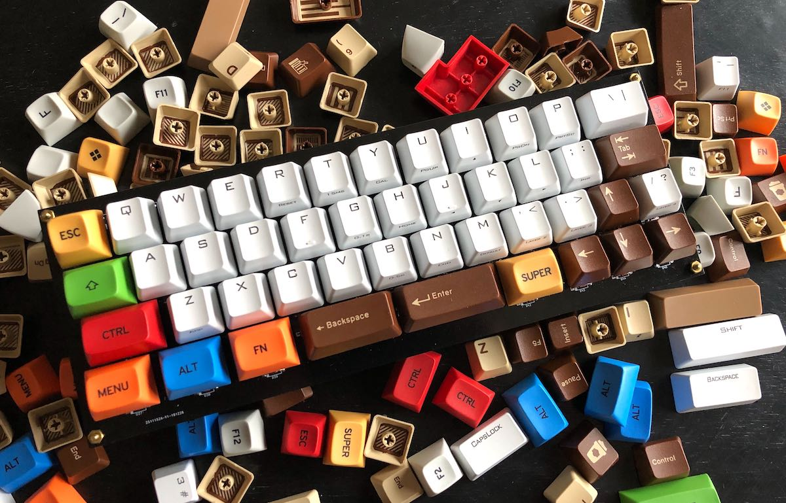
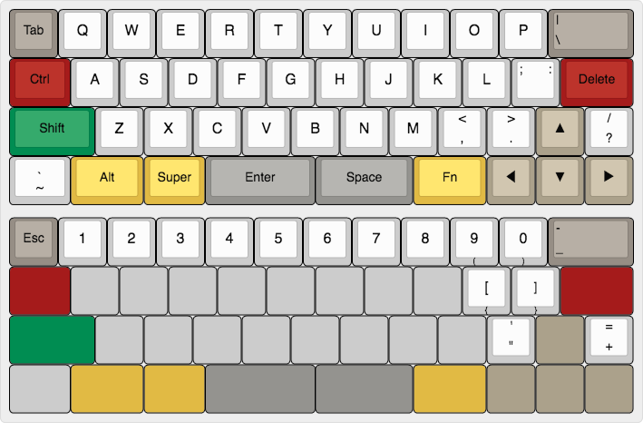
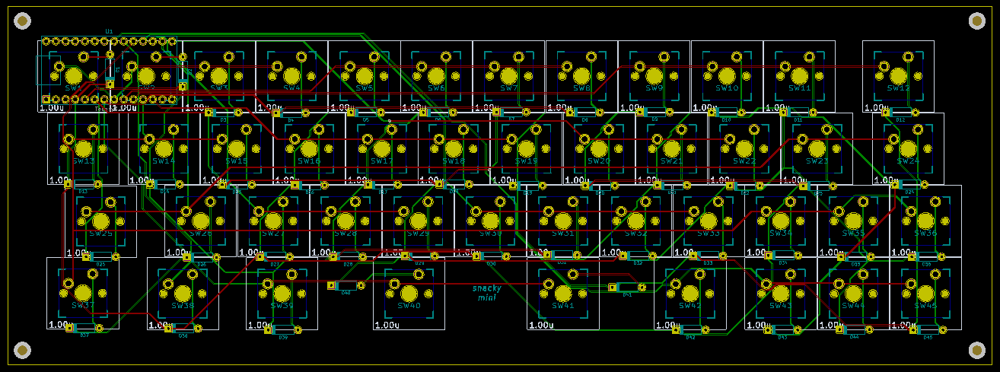

Sau khi kết thúc [hai phần trước](/tags/keyboard-building.html), chúng ta đã có những kiến thức cơ bản về chiếc bàn phím cơ, không để các bạn đợi lâu, ở phần này chúng ta sẽ thực sự bắt tay vào làm một chiếc bàn phím hoàn chỉnh.

**TL;DR:** Các bước để build một chiếc bàn phím cơ
1. Tham khảo thật nhiều layout, thiết kế của cộng đồng
2. Thiết kế cho mình một layout hợp lý
3. Đặt mua linh kiện, keycaps, switches, cắt plate nếu cần thiết
4. Hàn mạch bằng tay, hoặc thiết kế mạch in rồi mới hàn
5. Hàn controller, viết firmware hoặc modify từ các firmware có sẵn như QMK hay TMK
6. Done

---

Trước khi bắt đầu thì các bạn hãy để mình khoe hàng tí đã, chiếc bàn phím bốn chấm không, à nhầm 40% mang tên **SnackyMini Keyboard** :think-hopeful: một sản phẩm kết tinh của tinh thần bốn chấm không, của trí tuệ Việt và nền công nghệ tiên tiến của Đế quốc Tư bản Huê Kỳ, cộng với nguồn cung cấp thiết bị kĩ thuật, linh kiện bán dẫn phong phú của người anh lớn Trung Hoa, một sản phẩm của người Việt, dành cho cả người Việt lẫn người không Việt, được nghiên cứu, thiết kế và tối ưu dành riêng cho các software developer, một... ấy ấy ấy, thôi các bạn đừng tắt mà, ở lại đọc tiếp đi mà, mình im rồi đây :joy:



Bài viết sẽ mang tính chất ghi chép lại quá trình mình thực hiện chiếc bàn phím, một số yếu tố kĩ thuật sẽ được lượt bỏ hoặc tối giản, phun ra mà không có giải thích hay chú thích, nên có thể bài viết sẽ có những đoạn khó  hiểu. Nếu sau khi đọc xong series bài viết này và các bạn có ý định tự mình làm một chiếc bàn phím cơ, và có thắc mắc, xin đừng ngại comment hoặc để lại lời nhắn, mình sẽ cố gắng trả lời trong phạm vi hiểu biết của bản thân.

## Thiết kế layout

Việc đầu tiên cần làm khi bắt đầu bất kì một dự án nào đó là thiết kế. Chúng ta cần phải thiết kế bố cục (layout) <span class="sidenote mute">Làm phần cứng không giống như phần mềm, chỉ cần một sai sót nhỏ trong bố cục hoặc một điểm bất hợp lý trong thiết kế thì chúng ta phải trả giá bằng cả thời gian lẫn tiền bạc và công sức, các sai lầm thường rất khó hoặc là không thể sửa chữa, làm lại.</span> của chiếc bàn phím, bước này rất quan trọng và đòi hỏi bạn phải tham khảo thật nhiều, suy nghĩ một cách thật kĩ lưỡng để chọn được một bố cục và thiết kế ưng ý.

Nếu chưa biết mình muốn gì, thì các bạn có thể tham khảo qua các mẫu bàn phím khác nhau trên các cộng đồng dân chơi phím cơ như [Reddit /r/MechanicalKeyboards](https://www.reddit.com/r/MechanicalKeyboards/), [Geekhack](https://geekhack.org/index.php?board=178.0), [Deskthority](https://deskthority.net/viewforum.php?f=62&sid=feb51050d8448b8afb108c05f64ab5aa), trên những cộng đồng này cũng thường xuyên có những thảo luận về việc tự build bàn phím, rất hữu ích. Ngoài ra thì còn nhiều cộng đồng khác, ví dụ như [VietnamMechKey](https://www.facebook.com/groups/VietNamMechKey/).

Ý tưởng của mình là thiết kế bộ chiếc bàn phím có layout 40% nên cũng đã tham khảo nhiều từ trang [40percent.club](http://www.40percent.club/). Một số yêu cầu thiết kế của mình tự đặt ra là như sau:

- Sau một thời gian xài layout 60% thì mình thấy dù sao bàn phím có hàng phím mũi tên vẫn tiện hơn cả, vì thế chiếc bàn phím nhỏ gọn sắp build cũng phải có 4 phím mũi tên.
- Tiếp theo, vì công việc chính của mình là code, nên để có thể sử dụng chiếc bàn phím này hằng ngày, thì mình vẫn phải giữ lại các phím cơ bản hay dùng như `[ ] ( ) { } ; : < > , .`, hoặc `Tab`.
- Sau một thời gian sử dụng Emacs thì mình sử dụng phím `Ctrl` khá thường xuyên, vì thế phím này cần phải đặt ở một vị trí nào đó cho tiện bấm nhất.
- Cụm phím `Cmd`, `Alt`, `Shift` bên phía tay phải mình chưa một lần nào phải đụng tới trong suốt bao nhiêu năm xài máy tính, nên tốt nhất là vứt nó đi.
- Layout vừa nhỏ nên sẽ không đủ chỗ để đặt hàng phím số vào, cho nên tốt hơn cả là giấu nó vào hàng phím `QWERTY` thông qua một phím `Fn`, khi nhấn phím này thì bàn phím sẽ chuyển qua layout phím số.

Sau khi quyết định xong các yêu cầu trên, thì mình bắt tay vào thiết kế layout bằng trang web http://www.keyboard-layout-editor.com, layout có dạng tương tự như bàn phím [Minivan Arrow](https://www.massdrop.com/buy/minivan-keyboard):

Bàn phím mặc định ở trên, và bàn phím khi nhấn nút `Fn` ở dưới:



Sau khi kết thúc bước này, các bạn có thể export layout này ra định dạng JSON và đưa qua http://builder.swillkb.com/ để thiết kế plate và case, nếu các bạn có ý định làm bàn phím plate mount. Ở đây mình chỉ xài PCB mount nên bỏ qua bước này.

Ngoài ra, bạn còn có thể vào tab Summary để xem danh sách và số lượng các phím cần dùng, ví dụ đây là danh sách các phím cần dùng cho layout của mình:


## Thiết kế mạch in

Đến đây, chúng ta đã có layout, bước tiếp theo là thiết kế mạch in (PCB) để hàn các linh kiện vào. Thực ra việc này đối với nhiều người khó hơn là hàn mạch bằng tay (handwired), với mình thì... trước đây mình cũng đã làm một bản prototype handwired, tuy nhiên nhờ kĩ năng hàn mạch thần sầu, mình nướng chín luôn hầu hết diode trên mạch :joy: và cuối cùng thì bản này bị vứt xó.


Sau khi xem xét nhiều phương án, thì việc tự thiết kế PCB là khả thi nhất, vì như thế đến công đoạn hàn linh kiện vào đỡ vất vả hơn, và giảm thiểu được tối đa nguy cơ xảy ra lỗi. Mỗi tội tốn tiền nhiều hơn.

Để thiết kế PCB thì mình dùng phần mềm [KiCad](http://kicad-pcb.org/) vì nó trực quan, đầy đủ nhiều chức năng, có khả năng render ra board mạch hoàn chỉnh trông rất đẹp, open source và miễn phí, và quan trọng nhất là đa số các cơ sở sản xuất mạch đều hỗ trợ định dạng file của KiCad.

Cái khó nhất khi dùng KiCad là giao diện của nó không được thông minh cho lắm, hay nói thẳng ra nó luôn là giao diện ngu như :poop:. Đặc biệt là trên macOS. Đó là chưa kể cơ chế quản lý thư viện footprint và component của nó khá rối. Trước khi bắt tay vào làm thì các bạn nên đọc qua [bài hướng dẫn sử dụng của Deskthority](https://deskthority.net/wiki/KiCAD_keyboard_PCB_design_guide), đây là bài viết dễ hiểu nhất mà mình có thể tìm thấy, mặc dù hơi cũ.

Cái khó thứ hai, là bắt đầu như thế nào? một cái switch có những chân nào, cần đục những lỗ nào? khoảng cách giữa các switch là bao xa? để nắm được các thông tin này thì bạn cần phải bới tung các wiki và các diễn đàn về phím cơ lên. Ở đây mình sẽ nói sơ qua, vì các bạn có đọc trước cũng không thể nhớ được cho tới khi các bạn bắt tay vô làm và tự mình đụng phải các vấn đề đó :joy:

- Về chân switch (footprint) và các linh kiện khác, các bạn có thể tải thư viện hỗ trợ cho KiCad tại đây https://github.com/tmk/keyboard_parts.pretty và đây https://github.com/tmk/kicad_lib_tmk. Đồng thời tham khảo bài viết này để biết cách import https://github.com/ruiqimao/keyboard-pcb-guide.
- Về khoảng cách giữa các chân switch, thì theo tài liệu của hãng Cherry, mỗi switch có kích thước `15.6mm x 15.6mm`, keycaps có kích thước tầm `18mm x 18mm` nữa, [theo matt3o](https://deskthority.net/viewtopic.php?p=327503#p327503), khi kết hợp lại thì mỗi một switch `1u` nên chiếm một ô có kích thước `19.05mm x 19.05mm`.

  

  Một hình vuông màu đen như trên là footprint cho một phím/switch đã kèm cả key caps (`1u`). Hai phím `1u` kề nhau sẽ có footprint kề cạnh nhau, và khoảng cách giữa hai phím như thế này đủ để đặt vào một con diode (kí hiệu D39 như trong hình).

À, cũng phải nói thêm, mình sử dụng Teensy 3.2 làm controller cho chiếc bàn phím này, vì lý do nó dễ mua, dễ lập trình, hỗ trợ giao tiếp với máy tính như là một thiết bị USB, và có sẵn bộ thư viện Teensyduino xài khá tiện.

Sau vài ngày hì hục với KiCad thì đây là thành quả, nhìn rối như tơ vò, nhưng là một cái PCB 2 mặt:



Ngày xưa mình từng có thời gian tự làm PCB trên miếng đồng bằng máy in laser, giấy màu, bàn ủi, bàn chải đánh răng và thuốc sắt FeCl3, chưa bao giờ mình dám mơ tới chuyện làm một cái PCB có đường mạch mỏng hơn 2mm, chứ đừng nói tới một cái PCB 2 mặt.

Quên nói, 4 cái lỗ ở 4 góc board có đường kính `2.5mm`, vừa đủ cho một con M2 standoff cắm vào.

Sau khi hoàn thành, thì mình hí hửng xuất file ra và gửi cho nhà in, đây là một công ty ở Trung Quốc, sở dĩ chọn Trung Quốc là vì hôm đó ngày lễ ở Mỹ, không có nhà in nào của Mỹ làm việc cả.

Có bạn hỏi muốn biết thêm chi tiết về công đoạn này, thì như thế này: Khi làm việc với các công ty in mạch, bạn sẽ phải gửi file cho họ, bạn có thể nén và gửi toàn bộ project KiCad cho họ, hoặc đơn giản hơn thì có thể xuất project ra thành nhiều file gerber (mỗi một file gerber sẽ là một layer của board, ví dụ layer mạch đồng, layer khoan lỗ, layer hình vẽ trên mạch,...) rồi nén tất cả lại thành một file zip để gửi. Trong repo Github ở cuối bài, mình có để sẵn file `snackymini-manufacturing-submission.zip` trong thư mục `hardware`, chứa các file gerber này, có thể gửi trực tiếp file này tới nhà in. Còn dịch vụ mình sử dụng là công ty **JLCPCB**, họ có đội ngũ support rất tận tình, trao đổi và confirm qua mail liên tục, mỗi tội tiếng Anh của các bạn này hơi bị dỏm, được cái giá cả khá ổn và thời gian gia công khá nhanh.

Vì nôn nóng nên mình chọn in gấp, chỉ tốn 2 ngày gia công và 3 ngày để mấy cái mạch bơi từ bên đó qua bên đây, tầm 50 USD ra đi cho 10 cái board mạch đen cóng ngầu xì dầu:


Trong thời gian chờ in mạch thì mình cũng đặt mua luôn các linh kiện cần thiết, bao gồm:

- 1 board mạch Teensy 3.2 loại có hàn sẵn header
- 50 switch Cherry MX Black
- 100 diode 1N4148
- Keycaps thì đã có sẵn, gom góp lại cũng đủ quân số, mặc dù lố nhố

Hầu hết các phím mình dùng đều không quá `2.5u`, và cũng quên không đục lỗ cắm stabilizer, nên mình bỏ qua nó luôn, gõ thấy cũng hơi kì kì nhưng kệ đi.

Việc tiếp theo là lôi switches và diodes ra hàn, mình dùng Cherry Black, ban đầu gõ thấy khá nặng vì đã quen xài Brown, nhưng dần cũng quen.


Hàn controller vô mặt sau, ở đây thì có một vấn đề, đó là vì sợ Teensy sẽ đụng vào switch, mình phải dùng header để tạo ra khoảng cách, và hàn ngược con Teensy lại cho phần chân cắm vào phần bụng của PCB, điều này sai với thiết kế ban đầu. Rất may lỗi này có thể khắc phục được bằng phần mềm:


Hàn xong đâu ra đấy thì mới thấy khi thiết kế mạch, mình quá cẩn thận khi đã dành ra một phần diện tích khá lớn cho viền ngoài của board, về sau khi xem mạch thực tế và xem các bản thiết kế khác thì khá tiếc, vì đáng ra không có phần viền, bàn phím trông sẽ gọn gàng hơn.

Đâu ra đấy xong thì lắp key caps vào:


Thế là xong phần cứng. Tiếp theo là đến firmware.

## Viết Firmware

Nếu các bạn không đọc các bài trước, thì lý do mình quyết định tự viết firmware chỉ đơn giản là vì mình không compile được các firmware có sẵn như QMK hay TMK cho Teensy 3.2 :think-cry: nếu các bạn sử dụng controller khác, có thể các bạn sẽ compile được và không cần phải đâm đầu vào con đường đen tối này. Suy cho cùng, tự viết firmware cũng có cái hay của nó, và mình học được rất nhiều từ việc này. Dưới đây là một vài ghi chép của mình trong quá trình viết, nếu không thực sự quan tâm, các bạn có thể bỏ qua cũng được.

Mãi cho đến khi hoàn thành xong phần hardware thì mình mới bắt tay vào viết firmware hoàn chỉnh (chứ không phải là cái firmware điều khiển 4 nút như trong bài trước). Về cơ bản thì không khác nhiều mấy so với trong bài trước, mình dùng một mảng kiểu `unit8_t` để lưu thông tin về layout bàn phím, đây là một mảng 3 chiều, nó gồm có 2 mảng 2 chiều, mỗi một mảng 2 chiều là một layout:

```c
uint8_t keyLayout[][ROWS][COLS] = {
  // Default layout
  {
   { KEY_TAB  , KEY_Q   , KEY_W   , KEY_E   , KEY_R   , KEY_T   , KEY_Y   ,...
   { NULL_KEY , KEY_A   , KEY_S   , KEY_D   , KEY_F   , KEY_G   , KEY_H   ,...
   { NULL_KEY , KEY_Z   , KEY_X   , KEY_C   , KEY_V   , KEY_B   , KEY_N   ,...
   { KEY_TILDE, NULL_KEY, NULL_KEY, NULL_KEY, NULL_KEY, NULL_KEY, NULL_KEY,...
  },
  // Fn layout
  {
   { KEY_ESC , KEY_1   , KEY_2   , KEY_3   , KEY_4   , KEY_5   , KEY_6   ,...
   { NULL_KEY, NULL_KEY, NULL_KEY, NULL_KEY, NULL_KEY, NULL_KEY, NULL_KEY,...
   { NULL_KEY, NULL_KEY, NULL_KEY, NULL_KEY, NULL_KEY, NULL_KEY, NULL_KEY,...
   { NULL_KEY, NULL_KEY, NULL_KEY, NULL_KEY, NULL_KEY, NULL_KEY, NULL_KEY,...
  }
};
```

Code cho việc chuyển layout bằng phím `Fn`:

```c
if (keys[i].code == FN_KEY) {
  layoutId = FN_LAYOUT; break;
}
submitLayout(keys, keyLayout[layoutId]);
```

Một thay đổi nữa so với bài viết trước, đó là thuật toán debounce, sau khi thử nghiệm và tham khảo từ các firmware khác, thì mình quyết định làm đơn giản hơn, giống với các firmware phổ biến như QMK/TMK, là quét từng đợt sau mỗi 15 milli giây, đơn giản đến không đỡ được:

```c
#define DEBOUNCE_DELAY 15

void loop()
{
  unsigned long timeNow = millis();
  if (timeNow - lastFrame > DEBOUNCE_DELAY) {
    lastFrame = timeNow;
    // Scan key
  }
}
```

Khi compile và upload firmware vào bàn phím, ban đầu thì mọi thứ có vẻ hoạt động rất trơn tru, nhưng khi mình thử gõ một đoạn nội dung dài vào, thì xảy ra tình trạng mất phím, ví dụ gõ:

> Hello I am Huy

thì lại thành ra:

> Helo I m Hy

Thế là tốn thêm 1 ngày để debug, nguyên nhân thì hết sức ngớ ngẩn :joy: vì trong lúc viết firmware, mình lười và chỉ làm cho cái bàn phím đọc mỗi một phím duy nhất ở một thời điểm, và khi gõ nhanh, ở một thời điểm có thể sẽ có rất nhiều phím được nhấn xuống. Cũng nhờ thế mà lại biết thêm được khái niệm **NKRO** (n-key roll over), một chức năng giúp cho bàn phím có thể ghi nhận được nhiều phím trong một thời điểm. Đối với các bàn phím sử dụng cổng USB, thì tối đa chi ghi nhận được 6 phím, trong khi đó bàn phím dùng cổng PS/2 thì xả láng.

Việc implement chức năng này cũng không mấy khó khăn, nhờ các hàm `Keyboard.set_key1`, `Keyboard.set_key2`, `Keyboard.set_key3`,... của Teensyduino. Về ý tưởng thì ở mỗi lần quét, mình tạo một mảng gồm 6 phần tử để lưu lần lượt giá trị các phím nhận được:

```c
#define MAXIMUM_STROKES 6

struct Key* readKey() {
  struct Key* result = (Key*)malloc(MAXIMUM_STROKES * sizeof(struct Key));
  int currentFinger = 0;

  for (int row = 0; row < ROWS; row++) {
    for (int col = 0; col < COLS; col++) {
      if (keyPressedAt(row, col)) {
        result[currentFinger].row = row;
        result[currentFinger].col = col;
        if (currentFinger < MAXIMUM_STROKES) currentFinger++;
      }
    }
  }

  return result;
}
```

Rồi sau đó lần lượt sử dụng các hàm `Keyboard.set_key<x>` để gán giá trị cho từng phím, và gửi đi một lần bằng hàm `Keyboard.send_now()`:

```c
void submitLayout(struct Key* keys, uint8_t layout[ROWS][COLS]) {
  int currentFinger = 0;
  ...
  for (int i = 0; i < SUPPORTED_STROKES; i++) {
    int c = layout[pos.r][pos.c];
    if (c != NULL_KEY) {
      setKey(currentFinger, c);
      currentFinger++;
    }
  }
  ...
  Keyboard.send_now();
}
```

Một số bàn phím còn cho phép người dùng tự cấu hình layout bằng phần mềm trên máy tính, xét ở góc độ firmware, điều này không quá khó, chỉ việc chuyển mảng `keyLayout` về một cấu trúc khác có thể lưu được vào bộ nhớ của Teensy, từ đó ta có thể load ra mỗi khi bàn phím được khởi động. Ví dụ [lưu vào EEPROM](https://www.pjrc.com/teensy/td_libs_EEPROM.html) thông qua hàm `EEPROM.read()` và `EEPROM.write()`, tuy nhiên cần lưu ý, EEPROM của Teensy 3.2 chỉ có 2KB, hơi ít, nhưng chắc vừa đủ xài. Nhưng nếu đã tự build được firmware, thì chả cần làm vậy cho mất công, chỉ cần customize layout bằng cách customize luôn source code :joy:

Mấy hôm nay ngồi xem kĩ lại firmware QMK, thấy nó [có vài features khá thú vị](https://beta.docs.qmk.fm/features), như Grave Escape Key, Key Lock, Tap Dance hay Mouse Key,... hôm nào có thời gian mình sẽ ngồi clone lại và viết thêm về chủ đề này.

Chỉ cần chừng đó thứ thì bạn đã có thể tự mình viết được firmware cho chiếc bàn phím của mình rồi. Nếu quan tâm, các bạn có thể tham khảo mã nguồn đầy đủ của firmware lẫn hardware cho bàn phím này tại đây https://github.com/huytd/snackymini-keyboard/

---

Xin cảm ơn các bạn đã kiên nhẫn đọc đến tận đây (tui nói vậy thôi chứ tui biết bạn scroll xuống đây từ đầu trang, chỉ tốn có 3 giây). Nếu bạn cũng là dân chơi mech, hy vọng bài viết này giúp các bạn hiểu thêm về những chiếc bàn phím tiền triệu mà mình đã mua. Nếu bạn chưa phải là dân chơi, hy vọng bài viết này làm nhụt chí và ngăn bạn lao vào con đường tốn kém này. Nếu đã đọc hết mà vẫn quyết định sẽ mua hoặc tự làm một chiếc bàn phím cơ, thì mình xin chúc mừng và chúc các bạn may mắn luôn.

**P/S:** Nếu bạn nào đang ở US, thì mình còn dư vài cái PCB, nếu có hứng thú thì cứ PM mình qua Facebook, mình sẽ gửi tặng.

Bài viết này được gõ bằng bàn phím **SnackyMini Keyboard** :smirk:
