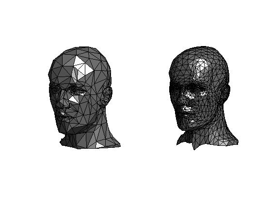
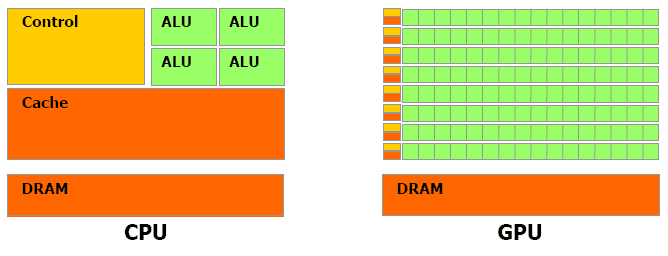
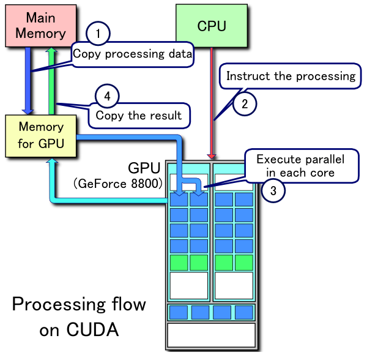
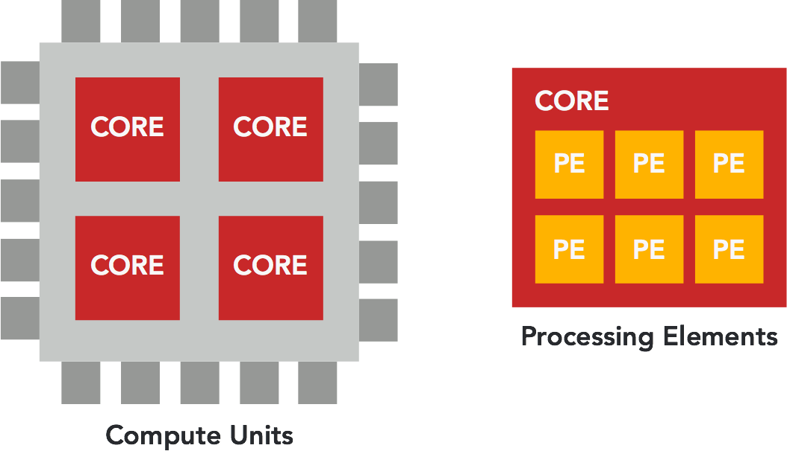

Sau khi viết xong [bài đầu tiên](https://thefullsnack.com/posts/nhan-ma-tran.html), mình tiếp tục tìm hiểu sâu hơn về ma trận và cảm thấy cần phải viết thêm một (vài) bài nữa vì có quá nhiều thứ hay ho khi đi sâu vào.

Trong phần này, mình giới thiệu về phương pháp sử dụng GPU để thực hiện phép tính nhân 2 ma trận (GPU Calculation), thay cho việc dùng CPU truyền thống, để tăng tốc độ tính toán.

## Tại sao lại là GPU? có cả việc tính toán trên GPU sao?

Câu trả lời là có, thưa các bạn. Chúng ta đều biết GPU là một thành phần trong card đồ họa, thường được giới game thủ mua về cắm vô cho máy tính xử lý đồ họa nhanh hơn. Vậy thao tác xử lý đồ họa ở đây là gì? 

Để hiểu được chức năng của GPU, hãy cùng lái chủ đề một tí sang lĩnh vực đồ họa máy tính, viết đến đây mình thấy hơi bị máu vì dù đã từ bỏ ngành game được hơn 1 năm rồi nhưng giờ vẫn có cơ hội quay lại viết tiếp về nó, hê hê, lạc đề tí thôi, các bạn cũng yên tâm vì mình sẽ không để bài viết này thành bài hướng dẫn làm game gì đâu =)))

### Máy tính tạo ra hình ảnh như thế nào?

Một hình ảnh trên máy tính được cấu tạo thành từng pixel, điều này hẳn ai cũng biết, nhưng làm thế nào để máy tính hiểu và vẽ được một hình ảnh thành một tổ hợp các pixel đưa lên màn hình qua sự chỉ đạo của chương trình (application)?


<div class="copyright center">_Nguồn: http://ithare.com/game-graphics-101-rendering-pipeline/_</div>

Trong trường hợp là game thì các dữ liệu hình ảnh (3d mesh, texture,...) sẽ được load từ đĩa (hard disk, file,...) và truyền vào GPU. Tại đây, GPU sẽ tiến hành phân tích và thực hiện những công việc tính toán cần thiết để chuyển chúng thành tập hợp các pixel gửi trả về CPU để vẽ ra màn hình máy tính (IO devices).

Quá trình tính toán đó ở trong GPU, được gọi là **Rendering Pipeline**, trong hình minh họa ở trên thì dây chuyền vận chuyển các khối hộp pixel kia chính là pipeline.

### Rendering Pipeline

Một vật thể 3D trong máy tính được cấu thành từ nhiều đỉnh, gọi là **vertex**, mảng các vertex được gọi là **vertices** array.


Hình trên cho thấy một khối hộp được tạo từ mảng $v$ gồm các đỉnh $v_{0}, v_{1}, \ldots, v_{7}$

Trong máy tính, mọi hình ảnh từ đơn giản hay phức tạp đều được tạo thành từ các vertices như vậy.



Render Pipeline là quá trình xảy ra trong GPU, khi nó nhận một tập hợp các vertices, trải qua các bước xử lý kết nối các vertices lại với nhau (vertex processing) thành các khối 3D cơ bản (thường là các khối tam giác, gọi là 3D primitives), sau đó phân tích (rasterization) các hình khối 3D này thành từng mảnh nhỏ (fragments), thực hiện việc tính toán tô màu, đổ bóng,... cho các khối này rồi ánh xạ nó thành mảng các pixel tương ứng với màn hình máy tính, gửi trả về CPU để đưa lên màn hình.

Vì quy trình này diễn ra liên tục với tốc độ cực kì cao để đảm bảo cho việc hiển thị hình ảnh lên màn hình diễn ra xuyên suốt và mượt mà, nên GPU phải làm việc với một khối lượng các phép tính cực kì lớn. Nói như vậy thì không có nghĩa là CPU không có khả năng dựng hình ảnh đồ họa trên máy tính, bản thân CPU cũng có thể làm được nhưng sẽ không đạt được performance như GPU, lý do tại sao xin mời các bạn xem tiếp.

### GPU vs CPU

Hình sau so sánh kiến trúc của một CPU so với một GPU:



Các bạn có thể thấy khối tính toán của GPU nhiều hơn CPU rất nhiều lần, vì thế làm cho GPU có khả năng tính toán cao hơn CPU.

Thêm một hình ảnh nữa để so sánh sự lợi hại của GPU, nếu bạn có một máy tính có vi xử lý 4 nhân thì đây là sự khác biệt đối với GPU:


Nhưng nếu sử dụng GPU lợi hại như vậy thì tại sao người ta không dùng GPU để thay thế CPU luôn? Câu trả lời là rất khó, vì việc debug trên GPU không đơn giản như với CPU, thêm nữa là GPU code chạy song song (parallel) nên cần phải có các phương pháp để phân vùng dữ liệu, liên lạc, đồng bộ hóa giữa các core nên các thuật toán xử lý trên GPU cực kì phức tạp.

Đoạn video sau đây minh họa sự khác biệt về việc dùng CPU và GPU để vẽ hình ảnh, con robot màu vàng là CPU còn cái máy bự chà bá kia là sức mạnh thực sự của một GPU.

<iframe width="700" height="400" src="https://www.youtube.com/embed/-P28LKWTzrI" frameborder="0" allowfullscreen></iframe>

### GPU chỉ dùng làm đồ họa?

Với sự phát triển của lĩnh vực công nghệ thông tin hiện nay, những công việc yêu cầu khả năng tính toán cực kì cao đã bắt đầu cần đến các hệ thống máy tính có khả năng xử lý mạnh hơn, và người ta đã bắt đầu tìm đến sự trợ giúp của các GPU trong công việc tính toán, không phải chỉ riêng CPU nữa.

Một ứng dụng thực tế có lẽ nhiều người biết đến nhất đó là việc sử dụng GPU để "đào" Bitcoin.


Một ứng dụng khác thường thấy nữa là trong ngành Machine Learning, người ta thường sử dụng GPU để gia tăng tốc độ tính toán đối với các vector dữ liệu, vì đây cũng là một ngành phải xử lý với lượng dữ liệu cực kì lớn.

Gói EC2 P2 của AWS cũng hỗ trợ GPU [https://aws.amazon.com/blogs/aws/new-p2-instance-type-for-amazon-ec2-up-to-16-gpus/](https://aws.amazon.com/blogs/aws/new-p2-instance-type-for-amazon-ec2-up-to-16-gpus/)

## Tính toán với GPU bằng cách nào?

Có rất nhiều cách để sử dụng GPU làm công cụ tính toán, bạn có thể khởi tạo một ứng dụng đồ họa, chuyển đổi vector dữ liệu cần tính toán thành các ma trận texture rồi nạp vào GPU, viết các Shader program (là một dạng chương trình chạy trên GPU, trong quá trình fragment processing của rendering pipeline) để tính toán và trả dữ liệu về lại CPU.

Tuy nhiên cách làm trên khá là phức tạp và dư thừa (phải khởi tạo môi trường đồ họa, không cần thiết, và đó là cách làm thủ công, không có gì đảm bảo, và bị giới hạn bởi khả năng của Shader program. 

Ngày nay chúng ta có các giải pháp khác, có thể nói là "native" hơn, đó là **OpenCL** và **CUDA**.

### CUDA

Khi mới được ra mắt, **CUDA** là tên viết tắt của **Compute Unified Device Architecture** tuy nhiên về sau thì Nvidia bỏ hẳn tên gọi này.

**CUDA** là một nền tảng lập trình song song (parallel computing platform), cung cấp cho chúng ta các API trên các ngôn ngữ như C/C++, Fortran, và về sau còn xuất hiện thêm các wrapper cho Java, Ruby, Python, Haskell... để giao tiếp với các GPU của Nvidia và thực hiện công việc tính toán giống như trên CPU.

Quy trình hoạt động của một ứng dụng CUDA khá là giống với rendering pipeline:



 1. Copy dữ liệu từ bộ nhớ chính vào bộ nhớ GPU
 2. CPU chỉ thị cho GPU thực hiện tính toán
 3. GPU thực hiện tính toán song song trên các core của nó
 4. Tính xong GPU gửi trả dữ liệu về lại cho bộ nhớ chính

CUDA có một vài nhược điểm nhất định, tuy nhiên điểm yếu lớn nhất của nó là được làm ra bởi Nvidia nên chỉ hỗ trợ chạy trên phần cứng của Nvidia, và không ai muốn công nghệ mình sử dụng lại bị phụ thuộc vào một hãng sản xuất nhất định nào hết (trừ trường hợp Apple =))) vậy cho nên người ta bắt đầu tìm đến một giải pháp tổng quát hơn, đó là **OpenCL**

### OpenCL

**Open Computing Language** viết tắt là **OpenCL** là một framework giúp các lập trình viên phát triển các ứng dụng mà chương trình có thể chạy được trên nhiều bộ xử lý như CPU, GPU, FPGA,...


**OpenCL** là một chuẩn mở được Apple tạo ra và trao quyền phát triển cho tổ chức Khronos Group trứ danh (tổ chức đang nắm quyền phát triển OpenGL). **OpenCL** được rất nhiều hãng phần cứng hỗ trợ như là AMD, Apple, ARM, IBM, Imagination Technologies, Intel, Nvidia, Qualcomm, Samsung,... điều này khiến cho OpenCL trở thành một tiêu chuẩn chung cho cả ngành công nghiệp, giống như OpenGL vậy.

Và trong bài viết này chúng ta sẽ sử dụng OpenCL để implement thuật toán nhân ma trận trên GPU. Để có thể implement được thì đầu tiên phải tìm hiểu rõ hơn về OpenCL và cách lập trình sử dụng OpenCL.

## Lập trình GPU với OpenCL

Đầu tiên chúng ta cần hiểu các khái niệm sử dụng trong **OpenCL**.

### Các thuật ngữ trong OpenCL

Các thành phần tham gia việc tính toán trong một ứng dụng **OpenCL** là các **Compute Device**, gọi là các thiết bị tính toán. Và các thiết bị tính toán này có thể là các **CPU**, **GPU** hoặc các thiết bị khác có tính năng tương tự bên trong máy tính.


Trong mỗi một **Compute Device** chúng ta có nhiều **Compute Unit**, là các core bên trong nó.



Và trong mỗi **Compute Unit** (core) ta có nhiều **Processing Element** trực tiếp nhận lệnh để tính toán.

### Mô hình làm việc trong OpenCL

Mô hình xử lý của **OpenCL** gồm có một chương trình **Host** có nhiệm vụ điều khiển và liên lạc với nhiều **Compute Device** theo sơ đồ sau:


Khi thực hiện xử lý, **Host** sẽ khởi tạo trên mỗi **Compute Device** một **Context** chứa các thành phần như là: 
- Thông tin device đang chạy
- Kernel (là đơn vị nhỏ nhất của quá trình xử lý, như là một hàm)
- Program Object (là đoạn code implement của Kernel)
- Command Queues (là queue các lệnh được truyền vào device từ host)
- Memory Object (là đối tượng chứa dữ liệu sẽ được truyền/nhận qua lại giữa device và host)

Thao tác copy dữ liệu từ **Host** tới **Compute Device** gọi là thao tác **ghi** (writing), và thao tác copy dữ liệu ngược lại từ **Compute Device** về **Host** gọi là **đọc** (reading).

Đây là flow của một chương trình OpenCL thường thấy:

- **Bước 1:** Chọn device cần dùng (ví dụ như: Toàn bộ GPU)
- **Bước 2:** Khởi tạo context
- **Bước 3:** Khởi tạo Command Queue cho từng device
- **Bước 4:** Biên dịch chương trình
- **Bước 5:** Tạo các kernel từ chương trình
- **Bước 6:** Cấp phát bộ nhớ trên từng device
- **Bước 7:** Ghi dữ liệu vào memory object trên device
- **Bước 8:** Thực hiện xử lý các kernel trên device
- **Bước 9:** Gửi dữ liệu về lại host
- **Bước 10:** Giải phóng bộ nhớ trên device

Có thể thấy mô hình trên có phần phức tạp hơn **CUDA**. Nhưng làm việc với **OpenCL** linh hoạt hơn và không bị giới hạn về mặt thiết bị như **CUDA**.

Việc khởi động một **kernel** rất tốn kém, vì thế lời khuyên được đưa ra là nên thiết kế mỗi kernel làm nhiều việc nhất có thể.

### Mô hình quản lý bộ nhớ của OpenCL

## Implement một chương trình OpenCL đơn giản

Vậy coi như xong phần lý thuyết, giờ chúng ta đi vào phần thực hành cơ bản để hiểu kĩ hơn về cách lập trình trên GPU.

Đề bài sẽ là: _Implement chương trình tính tổng từ 0 đến 100 triệu_

### Implement trên CPU

Với cách này thì không có gì để bàn rồi, đơn giản chúng ta sẽ implement một vòng `for` rồi cho nó chạy từ 0 đến 100 triệu, cứ thế mà cộng số vào.

```
for (unsigned long long i = 0; i < 100000000; i++) {
  val += i;
}
```

Chúng ta sẽ thêm vào một đoạn code để đo thời gian chương trình bỏ ra để thực hiện phép tính trên.

```
clock_t begin = clock();

// Do something

clock_t end = clock();
double runtime = (double)(end - begin) / CLOCKS_PER_SEC;
```

Hàm `clock()` lấy thời gian hiện tại, có trong thư viện `time.h`, mục đích của đoạn code trên là lấy thời gian ở vị trí bắt đầu xử lý, và thời gian ở vị trí sau khi kết thúc xử lý, trừ 2 số đó với nhau ta có được thời gian cần để chạy chương trình.

Đoạn implement đầy đủ sẽ như sau:

```
#include <stdio.h>
#include <time.h>

typedef unsigned long long fuckin_large;

int main() {
  clock_t begin = clock();

  fuckin_large val = 0;
  for (fuckin_large j = 0; j < 100000000; j++) {
    val += j;
  }
  printf("Result: %llu\n", val);

  clock_t end = clock();
  double runtime = (double)(end - begin) / CLOCKS_PER_SEC;
  printf("Runtime: %lfms\n", runtime);
}
```

Chạy thử chương trình trên, output sẽ có dạng như sau:

```
Result: 4999999950000000
Runtime: 0.225600ms
```

Dòng đầu là con số kết quả sau khi đã tính ra, dòng thứ 2 cho biết thời gian cần để thực hiện chương trình. 

Mình có chạy thử chương trình này trên các máy MacBook Pro từ 2012 tới 2015, trung bình mất tầm **0.2 mili giây** để tính ra kết quả.

Tiếp theo hãy thử implement chương trình này với cách xử lý tương tự nhưng chạy trên GPU xem tốc độ được cải thiện như thế nào nhé.

### Implement trên GPU

Để implement một chương trình dùng OpenCL thì ta cần implement 2 phần: **Host** program và **Kernel** program.


**Host** là một chương trình C/C++ có nhiệm vụ đọc file chương trình **Kernel** (đuôi `*.cl`) và làm các công việc khác như là khởi tạo context, chọn device, build program object, memory object, thực thi kernel,... như đã nói ở phần trên.

#### Host Program

**Bước 1: Khởi tạo**

Đầu tiên **Host** cần khởi tạo các biến để chứa các đối tượng cần thiết như là **Device**, **Context**, **Command Queue**,...:

```
cl_device_id device_id          = NULL;
cl_context context              = NULL;
cl_command_queue command_queue  = NULL;
cl_mem memobj                   = NULL;
cl_program program              = NULL;
cl_kernel kernel                = NULL;
cl_platform_id platform_id      = NULL;
cl_uint ret_num_devices;
cl_uint ret_num_platforms;
cl_int ret;
```

**Bước 2: Đọc Kernel Source**

Tiếp theo chúng ta đọc file **Kernel** source và lưu vào một file pointer:

```
FILE *fp;
char fileName[]   = "./sum.cl";
char *source_str;
size_t source_size;

fp = fopen(fileName, "r");
if (!fp) {
  fprintf(stderr, "Failed to load kernel\n");
  exit(1);
}
source_str  = (char*)malloc(MAX_SOURCE_SIZE);
source_size = fread(source_str, 1, MAX_SOURCE_SIZE, fp);
fclose(fp);
```

Trong ví dụ này thì file **Kernel** của chúng ta là `sum.cl`

**Bước 3: Khởi tạo Context và các thành phần liên quan**

Sau khi đã có source code của **Kernel**, ta tiến hành chọn device và khởi tạo context, biên dịch source code của kernel thành **Program Object** 

```
ret = clGetPlatformIDs(1, &platform_id, &ret_num_platforms);
ret = clGetDeviceIDs(platform_id, CL_DEVICE_TYPE_DEFAULT, 1, &device_id, &ret_num_devices);

context       = clCreateContext(NULL, 1, &device_id, NULL, NULL, &ret);
command_queue = clCreateCommandQueue(context, device_id, 0, &ret);
program       = clCreateProgramWithSource(context, 1, 
                                         (const char **)&source_str, 
                                         (const size_t *)&source_size, 
                                         &ret);
ret           = clBuildProgram(program, 1, &device_id, 
                                           NULL, NULL, NULL);
kernel        = clCreateKernel(program, "hello", &ret);
```

**Bước 4: Cấp phát bộ nhớ trên Compute Device**

Sau đó cấp phát bộ nhớ cho Compute Device trong Context thông qua hàm `clCreateBuffer` và `clSetKernelArg` để chỉ định vùng nhớ này tương ứng với tham số nào khi truyền vào kernel.

```
memobj = clCreateBuffer(context, CL_MEM_READ_WRITE, 
                        sizeof(cl_mem), NULL, &ret);
ret = clSetKernelArg(kernel, 0, sizeof(cl_mem), (void*)&memobj);
```

Ngoài ra, chúng ta có thể truyền giá trị vào cho các tham số thông qua hàm `clEnqueueWriteBuffer`:

```
ret = clEnqueueWriteBuffer(command_queue, memobj_A, CL_TRUE, 0, MATRIX_SIZE * MATRIX_SIZE * sizeof(cl_mem), A, 0, NULL, NULL);
```

**Bước 5: Chạy Kernel và Đọc kết quả**

Đến bước này chúng ta sử dụng hàm `clEnqueueTask` để gán **Command Queue** đã tạo vào cho **Kernel**. Sau khi được gán thì **Kernel** sẽ khởi động và bắt đầu xử lý trên các **Processing Elements** trên **Compute Device** (ở đây có thể là GPU của chúng ta).

```
ret = clEnqueueTask(command_queue, kernel, 0, NULL, NULL);
```

Để lấy dữ liệu ra sau khi **Kernel** hoàn thành việc tính toán, chúng ta dùng hàm `clEnqueueReadBuffer`:

```
ret = clEnqueueReadBuffer(command_queue, memobj, CL_TRUE, 0, sizeof(cl_mem), val, 0, NULL, NULL);
```

Giá trị `CL_TRUE` truyền vào hàm này là cho tham số `cl_bool blocking_read`, tham số này cho biết hàm `clEnqueueReadBuffer` sẽ block không cho **Host** program thực hiện tiếp cho đến khi nó nhận được giá trị trả về sau khi **Kernel** hoàn thành.

Đây cũng là bước mà chúng ta cần sử dụng hàm `clock()` để tính toán thời gian xử lý của **Kernel**.

```
clock_t begin = clock();

// Do something

clock_t end = clock();
double runtime = (double)(end - begin) / CLOCKS_PER_SEC;
```

**Bước 6: Giải phóng bộ nhớ**

Kết thúc chương trình, chúng ta giải phóng tất cả các đối tượng đã tạo ra để tránh bị memory leak.

```
ret = clFlush(command_queue);
ret = clFinish(command_queue);
ret = clReleaseKernel(kernel);
ret = clReleaseProgram(program);
ret = clReleaseMemObject(memobj);
ret = clReleaseCommandQueue(command_queue);
ret = clReleaseContext(context);

free(source_str);
```

Đây là đoạn code implement đầy đủ của **Host** program làm công việc tính tổng theo đề bài đã cho:

```
#include <stdio.h>
#include <stdlib.h>
#include <OpenCL/opencl.h>
#include <time.h>

#define MAX_SOURCE_SIZE (0x100000)

int main() {
  cl_device_id device_id = NULL;
  cl_context context = NULL;
  cl_command_queue command_queue = NULL;
  cl_mem memobj = NULL;
  cl_program program = NULL;
  cl_kernel kernel = NULL;
  cl_platform_id platform_id = NULL;
  cl_uint ret_num_devices;
  cl_uint ret_num_platforms;
  cl_int ret;

  cl_ulong val[1];

  FILE *fp;
  char fileName[] = "./sum.cl";
  char *source_str;
  size_t source_size;

  fp = fopen(fileName, "r");
  if (!fp) {
    fprintf(stderr, "Failed to load kernel\n");
    exit(1);
  }
  source_str = (char*)malloc(MAX_SOURCE_SIZE);
  source_size = fread(source_str, 1, MAX_SOURCE_SIZE, fp);
  fclose(fp);

  ret = clGetPlatformIDs(1, &platform_id, &ret_num_platforms);
  ret = clGetDeviceIDs(platform_id, CL_DEVICE_TYPE_DEFAULT, 1, &device_id, &ret_num_devices);

  context = clCreateContext(NULL, 1, &device_id, NULL, NULL, &ret);
  command_queue = clCreateCommandQueue(context, device_id, 0, &ret);
  memobj = clCreateBuffer(context, CL_MEM_READ_WRITE, sizeof(cl_mem), NULL, &ret);
  program = clCreateProgramWithSource(context, 1, (const char **)&source_str, (const size_t *)&source_size, &ret);
  ret = clBuildProgram(program, 1, &device_id, NULL, NULL, NULL);
  kernel = clCreateKernel(program, "hello", &ret);

  ret = clSetKernelArg(kernel, 0, sizeof(cl_mem), (void*)&memobj);

  clock_t begin = clock();

  ret = clEnqueueTask(command_queue, kernel, 0, NULL, NULL);

  ret = clEnqueueReadBuffer(command_queue, memobj, CL_TRUE, 0, sizeof(cl_mem), val, 0, NULL, NULL);

  clock_t end = clock();
  double runtime = (double)(end - begin) / CLOCKS_PER_SEC;

  ret = clFlush(command_queue);
  ret = clFinish(command_queue);
  ret = clReleaseKernel(kernel);
  ret = clReleaseProgram(program);
  ret = clReleaseMemObject(memobj);
  ret = clReleaseCommandQueue(command_queue);
  ret = clReleaseContext(context);

  printf("Result: %llu\n", val[0]);
  printf("Runtime: %lfms\n", runtime);
  
  free(source_str);

  return 0;
}
```

#### Kernel Program

Tiếp đến chúng ta implement **Kernel**, đây là đoạn chương trình sẽ được **Host** nạp vào **Program Object** để thực hiện xử lý trên GPU.

Chương trình này sẽ được định nghĩa bằng các từ khóa `kernel`. Ta truyền vào một biến con trỏ để tiếp nhận dữ liệu đầu ra, chương trình này sử dụng phương pháp tính bằng cách chạy một vòng lặp for, có thể implement như sau:

```
kernel void hello(global ulong *val) {
  size_t i = get_global_id(0);
  for (ulong j = 0; j < 100000000; j++) {
    val[i] += j;
  }
}
```

Biến `i` trong chương trình trên là id của tiến trình kernel được khởi tạo trong lúc thực thi, chúng ta cần phải lấy chính xác id này để gửi trả dữ liệu về cho **Host**.

Đặc điểm của kernel là các biến, tham số truyền vào đều mutable và chúng ta không cần return dữ liệu (vì ở host đã có một bước đọc dữ liệu từ memory object ra rồi).

---

Hy vọng qua bài viết này, các bạn đã nắm được phần nào khái niệm về việc sử dụng GPU để cải thiện hiệu quả tính toán, và lý do tại sao phải dùng GPU.

Trong phần tiếp theo, mình sẽ giới thiệu cách implement thuật toán nhân ma trận trên GPU.

Xin cảm ơn các bạn đã theo dõi bài viết, và hẹn gặp lại các bạn trong các bài viết sắp tới.
