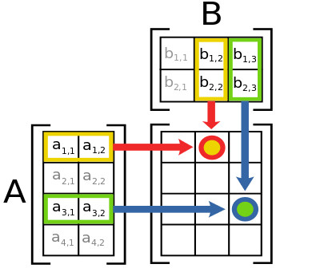
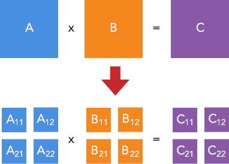
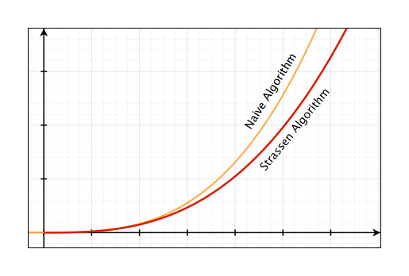
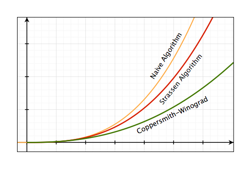
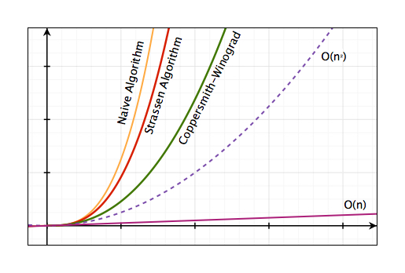

<b>Update 03/01/2018:</b> Bài viết đã được cập nhật để sửa một số lỗi sai về cách ký hiệu kích thước ma trận trong phần ví dụ và thuật toán, cụ thể là: 
<ul>
  <li>Ma trận $A$ kích thước $m \times n$ được sửa thành $n \times m$</li>
  <li>Ma trận $B$ kích thước $n \times p$ được sửa thành $m \times p$</li>
  <li>Ma trận $C$ kích thước $m \times p$ được sửa thành $n \times p$</li>
</ul>
Xin thành thật cáo lỗi với các bạn về sự nhầm lẫn này. Và xin cảm ơn các bạn @Jack Tăng và @Khanh Pham đã comment/nhắn tin góp ý.

Ma trận và các phép toán liên quan tới nó là một phần rất quan trọng trong hầu hết mọi thuật toán liên quan đến số học. 

Ở [bài trước](https://thefullsnack.com/posts/fibonacci-4m.html), chúng ta có đề cập tới việc ứng dụng phép nhân ma trận để tính số Fibonacci một cách hiệu quả. Vậy thuật toán nhân ma trận mà chúng ta sử dụng ở trong bài viết đã thực sự hiệu quả hay chưa?

<cover>img/matrixmul.jpg</cover>

Trong quá trình tìm hiểu để viết bài này thì mình phát hiện ra một điều khá là thú vị, đó là có rất nhiều thuật toán để thực hiện nhân ma trận, tuy nhiên ngành khoa học máy tính vẫn chưa tìm ra được câu trả lời cho câu hỏi: **Đâu là thuật toán tối ưu để thực hiện phép nhân ma trận?** [[1]](https://en.m.wikipedia.org/wiki/List_of_unsolved_problems_in_computer_science#Other_algorithmic_problems)

## Định nghĩa phép Nhân ma trận

Nhắc lại một chút kiến thức toán học về phương pháp nhân 2 ma trận $A$ và $B$, điều kiện đầu tiên để có thể thực hiện phép nhân này là **khi số cột của ma trận $A$ bằng số hàng của ma trận $B$**.

Với $A$ là một ma trận có kích thước $n \times m$ và $B$ là một ma trận kích thước $m \times p$ thì tích của $A \times B$ sẽ là một ma trận $n \times p$ được tính bằng cách sau:

<math>
\left( \begin{array}{ccc}
a & b  \\
c & d  \end{array} \right) 
\times
\left( \begin{array}{ccc}
x \\
y
\end{array} \right)
=
\left( \begin{array}{ccc}
ax + by \\
cx + dy
\end{array} \right)
</math>

Hình sau mô tả cách tính một phần tử `AB[i][j]` của ma trận tích:

Một phần tử là tổng của phép nhân các phần tử trong một hàng của ma trận $A$ với các phần tử trong cột tương ứng trong ma trận $B$

<math>
[AB]_{i,j} = A_{i,1}B_{1,j} + A_{i,2}B_{2,j} + \ldots + A_{i,n}B_{n,j}
</math>

Hay viết cho gọn hơn như sau:

<math>
[AB]_{i,j} = \displaystyle\sum_{r=1}^{n} A_{i,r}B_{r,j}
</math>

<b>Noob Question:</b> Cái dấu hình zích zắc $\sum$ kia là gì vậy???

<b>Chửi trước:</b> Ôi trời, đây là cái dấu tính tổng mà cũng không biết à? Về học lại toán cấp 3 hay năm nhất ĐH gì đó đi nhé! Tốn thời gian bm!! 

<b>Đáp sau:</b> Cái dấu zích zắc đó là kí hiệu phép tính tổng, có thể hình dung kí hiệu này giống như một vòng lặp for trong thực hiện phép tính cộng, số $n$ ở trên đỉnh chỉ tổng số lần lặp cần thiết, số $r = 1$ ở dưới cho ta biết giá trị nào cần chạy trong vòng lặp for và bắt đầu chạy từ giá trị bao nhiêu. Biểu thức đi liền sau kí hiệu $\sum$ cho ta biết phép cộng các giá trị nào sẽ được thực hiện bên trong vòng lặp đó.

Tiếp theo, hãy cùng xem chúng ta có những cách nào để implement thuật toán này trên máy tính.

## The naive algorithm

Naive Algorithm là từ dùng để chỉ một thuật toán đơn giản nhất được suy luận một cách "ngây thơ" bằng cách xử lý thông thường, ví dụ như tìm kiếm tuần từ (sequential/linear search)

Trong trường hợp này, chúng ta thường implement thuật toán nhân ma trận bằng cách áp dụng chính xác công thức từ định nghĩa toán học của nó, sử dụng vòng lặp, như sau:

<b>Input:</b> Hai ma trận A kích thước $n \times m$ và B kích thước $m \times p$

<b>1:</b> Khởi tạo ma trận C có kích thước $n \times p$  
<b>2:</b> For i từ $1 \rightarrow n$: 
<b>3:</b> &emsp;For j từ $1 \rightarrow p$: 
<b>4:</b> &emsp;&emsp;Gán $sum = 0$ 
<b>5:</b> &emsp;&emsp;For r từ $1 \rightarrow m$: 
<b>6:</b> &emsp;&emsp;&emsp;Gán $sum = sum + A_{i,r} \times B_{r,j}$ 
<b>7:</b> &emsp;&emsp;Gán $C_{i,j} = sum$ 

<p<b>Output:</b> Ma trận C kích thước $n \times p$

Tại sao lại gọi là naive algorithm (ngây thơ)? đó là vì nó rất dễ implement, chỉ cần đi theo lối suy nghĩ thông thường, bỏ qua hết mọi yếu tố như độ phức tạp, sự tối ưu...

Độ phức tạp của thuật toán trên là $\mathcal{O}(nmp)$, trong trường hợp tất cả các ma trận đều là ma trận vuông $n \times n$ thì độ phức tạp của thuật toán sẽ là $\mathcal{O}(n^{3})$

## Chia để trị - Thuật toán Strassen

Vào năm 1969, Volker Strassen - lúc đó đang là sinh viên tại MIT - cho rằng $\mathcal{O}(n^{3})$ chưa phải là con số tối ưu cho phép nhân ma trận, và đề xuất một thuật toán mới có thời gian chạy chỉ nhanh hơn một chút nhưng về sau đã kéo theo rất nhiều nhà khoa học lao vào tiếp tục nghiên cứu và cho đến thời điểm bây giờ, đã có rất nhiều phương pháp mới được đưa ra như là thuật toán Coppersmith-Winograd (sẽ nói ở phần sau), hoặc các giải pháp tiếp cận bằng lập trình song song trên nhiều máy tính/nhiều core,... Điểm thú vị là Strassen nghĩ ra thuật toán này vì nó là bài tập trong một lớp mà ông đang học [[2]](http://www.procul.org/blog/2005/11/16/nhan-ma-tr%E1%BA%ADn-dft-va-ly-thuy%E1%BA%BFt-bi%E1%BB%83u-di%E1%BB%85n-nhom-1/).

Xét lại thuật toán naive ở phần trước, để tính một phần tử $C_{i,j}$ của ma trận tích $C$, ta phải thực hiện hai phép nhân và một phép cộng. Suy ra nếu $C$ là một ma trận vuông có kích thước $2 \times 2$, thì để tính bốn phần tử của $C$, đòi hỏi phải thực hiện $2 \times 2^{2} = 2^{3} = 8$ phép nhân và $(2 - 1) \times 2^{2} = 4$ phép cộng. Nếu $A$ và $B$ là những ma trận cấp $n$ (tức là các ma trận $n \times n$) thì chúng ta cần phải thực hiện $n^{3}$ phép nhân và $(n - 1) \times n^{2}$ phép cộng.

Ý tưởng thuật toán của Strassen [[3]](https://en.m.wikipedia.org/wiki/Strassen_algorithm) là áp dụng chia để trị để giải quyết bài toán theo hướng của giải thuật cơ bản trên. Cụ thể là: **với mỗi ma trận vuông A, B, C có kích thước $n \times n$, chúng ta chia chúng thành 4 ma trận con, và biểu diễn tích $A \times B = C$ theo các ma trận con đó**:

Trong đó:

<math>
\begin{align}
C_{1,1} & = A_{1,1}B_{1,1} + A_{1,2}B_{2,1} \\
C_{1,2} & = A_{1,1}B_{1,2} + A_{1,2}B_{2,2} \\
C_{2,1} & = A_{2,1}B_{1,1} + A_{2,2}B_{2,1} \\
C_{2,2} & = A_{2,1}B_{1,2} + A_{2,2}B_{2,2} 
\end{align}
</math>

Tuy nhiên với cách phân tích này thì chúng ta vẫn cần 8 phép nhân để tính ra ma trận $C$. Đây là phần quan trọng nhất của vấn đề.

Chúng ta định nghĩa ra các ma trận $M$ mới như sau:

<math>
\begin{align}
M_{1} & = (A_{1,1} + A_{2,2})(B_{1,1} + B_{2,2}) \\
M_{2} & = (A_{2,1} + A_{2,2}) B_{1,1} \\
M_{3} & = A_{1,1} (B_{1,2} - B_{2,2}) \\
M_{4} & = A_{2,2} (B_{2,1} - B_{1,1}) \\
M_{5} & = (A_{1,1} + A_{1,2}) B_{2,2} \\
M_{6} & = (A_{2,1} - A_{1,1})(B_{1,1} + B_{1,2}) \\
M_{7} & = (A_{1,2} - A_{2,2})(B_{2,1} + B_{2,2})
\end{align}
</math>

Và biểu diễn lại các phần tử của $C$ theo $M$ như sau:

<math>
\begin{align}
C_{1,1} & = M_{1} + M_{4} - M_{5} + M_{7} \\
C_{1,2} & = M_{3} + M_{5} \\ 
C_{2,1} & = M_{2} + M_{4} \\
C_{2,2} & = M_{1} - M_{2} + M_{3} + M_{6}
\end{align}
</math>

Bằng cách này, chúng ta chỉ cần 7 phép nhân (mỗi $M$ một phép nhân) thay vì 8 như phương pháp cũ.

Thực hiện đệ quy quá trình trên cho đến khi ma trận có cấp hai.

Độ phức tạp của thuật toán Strassen là $\mathcal{O}(n^{\log{7}}) \approx \mathcal{O}(n^{2.807})$

Đồ thị sau so sánh sự khác nhau về độ phức tạp của hai thuật toán vừa bàn:

## Coppersmith-Winograd Algorithm và các thuật toán cải tiến 

Dựa trên phát minh của Strassen, vào tháng 5/1987, hai nhà khoa học Don Coppersmith và Shmuel Winograd công bố bài báo **Matrix Multiplication via Arithmetic Progression** [[4]](https://www.cs.umd.edu/~gasarch/TOPICS/ramsey/matrixmult.pdf) giới thiệu một phương pháp mới để tăng tốc độ nhân ma trận và cho biết độ phức tạp của thuật toán mà họ phát triển là $\mathcal{O}(n^{2.376})$ và được đánh giá là thuật toán nhân ma trận nhanh nhất tính tới thời điểm đó.

Vào tháng 3/2013, A. M. Davie và A. J. Stothers công bố bài báo **Improved bound for complexity of matrix multiplication** [[5]](http://www.maths.ed.ac.uk/~sandy/a11164.pdf) và cho biết họ đặt được con số $\mathcal{O}(n^{2.37369})$ khi cải tiến và khảo sát thuật toán của Coppersmith-Winograd.

Tháng 1/2014, François Le Gall công bố bài báo **Powers of Tensors and Fast Matrix Multiplication** [[6]](https://arxiv.org/abs/1401.7714) tiếp tục phân tích thuật toán của hai nhà khoa học này và đạt được con số $\mathcal{O}(n^{2.3728639})$.

Vào tháng 7/2014, Virginia Vassilevska Williams thuộc đại học Standford công bố bài báo **Multiplying matrices in $\mathcal{O}(n^{2.373})$ time** [[7]](http://theory.stanford.edu/~virgi/matrixmult-f.pdf) đưa ra phương pháp cải tiến thuật toán của Coppersmith-Winograd và công bố độ phức tạp là $\mathcal{O}(n^{2.372873})$.

## Kết luận

Tổng kết lại, với các thuật toán hiện tại, chúng ta rút ra được bảng so sánh về độ phức tạp như sau:

| Thuật toán                      | Input           | Độ phức tạp              |
|---------------------------------|-----------------|--------------------------|
| Naive Algorithm                 | Ma trận vuông   | $O(n^{3})$     |
| Naive Algorithm                 | Ma trận bất kì  | $O(nmp)$     |
| Strassen Algorithm              | Ma trận vuông   | $O(n^{2.807})$ |
| Coppersmith-Winograd Algorithm  | Ma trận vuông   | $O(n^{2.376})$ |
| Các thuật toán CW cải tiến      | Ma trận vuông   | $O(n^{2.373})$ |

Và các nhà khoa học vẫn đang miệt mài nghiên cứu để đưa con số này về $\mathcal{O}(n^{2})$

Theo một bình luận của giáo sư Ngô Quang Hưng trên Procul, thì các thuật toán của Strassen và Coppersmith-Winograd chỉ mang giá trị lý thuyết là chính, trong thực tế ít ai dùng cho các ma trận lớn vì hidden-constant quá lớn và implement phức tạp, dễ bị lỗi [[8]](http://www.procul.org/blog/2005/11/16/nhan-ma-tr%E1%BA%ADn-dft-va-ly-thuy%E1%BA%BFt-bi%E1%BB%83u-di%E1%BB%85n-nhom-1/#comment-11070).
