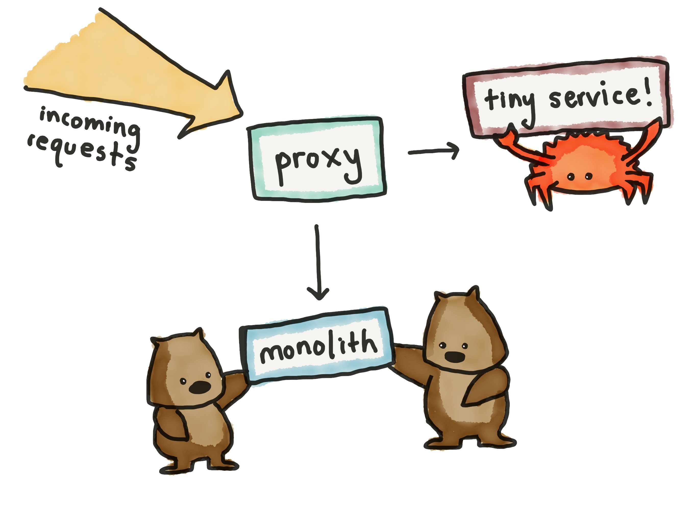

# Cách mà NPM sử dụng Rust

`npm` là package manager [nổi tiếng](http://blog.npmjs.org/post/141577284765/kik-left-pad-and-npm) dành cho Node.js, mới đây đã công bố là họ bắt đầu xài Rust trong hệ thống của mình.

Mô hình hệ thống được một bạn developer nữ (cũng là người đề xuất sử dụng Rust) vẽ lại một cách cực kì dễ thương :))

Họ không đập hết làm lại, không viết lại toàn bộ hệ thống bằng Rust mà chọn cách implement hoặc thay thế từng phần nhỏ riêng biệt bằng Rust. Đây cũng là cách được Mozilla và team phát triển Rust khuyến khích sử dụng.

Các bạn có thể tham khảo slide đầy đủ của họ tại link: [https://ashleygwilliams.github.io/rustfest-2017/](https://ashleygwilliams.github.io/rustfest-2017/)

--@TAGS: rust
