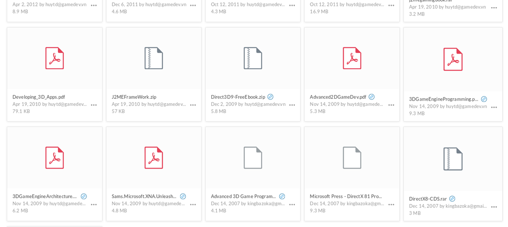

# Chuyện đi mua sách cũ ở Silicon Valley

Hồi còn ở Việt Nam, có một thứ mình cực kì ghét đó là phải đọc sách về lập trình :angry:. Quầy, tất nhiên là trừ mấy cuốn sách được các tác giả trong nước tự viết ra, thì đa phần đều là sách dịch. Nhưng buồn cái là đọc vô cảm giác như người dịch là người ngoài ngành, và không biết mình đang dịch cái gì :joy:.

Thế nên giải pháp duy nhất là download sách tiếng Anh lậu về đọc :blush:.

Tuy thế thì không phải cứ sách lậu thì sách gì cũng có, có những quyển sách cực kì quý hiếm mà không thể tìm ra ở bất kỳ một trang chia sẻ lậu nào. Hoặc là bị chèn thêm virus để rồi bấm vào là cái máy tính nó banh xác, hoặc là chỉ down trúng những bản PDF fake chứa toàn nội dung quảng cáo, hoặc xui hơn nữa là down trúng bản chụp trực tiếp của thằng uploader không khác gì coi phim bản cam :unamused:

Cho đến tận bây giờ thì một phần trong đống thư viện sách lậu đồ sộ ấy mình vẫn còn giữ :joy:.

Khi sang Mỹ, chuyện mua sách gốc tiếng Anh khá là dễ dàng, có thể mua online từ Amazon để họ ship về ngay trong ngày hôm sau, hoặc ra các nhà sách, tuy nhiên sách mới thì giá cũng khá là mắc (từ $\$20$ đến tận $\$200$).

Về vụ giá sách, có một cách khá hay để mua được sách hay mà không hề tốn kém, đó là đi săn tại các nhà sách cũ.

Với đống này, nếu là sách mới thì giá thành cũng lên tới hơn $\$300$ chứ chả đùa, nhưng nếu là sách cũ thì lại rẻ đến mức không thể ngờ tới.

Ví dụ như cuốn **Introduction to Algorithms** mình mua với giá $\$6.50$ :joy:, so với sách mới từ Amazon giá gần $\$80$. Tất nhiên đây là bản cũ, nhưng who cares, những thứ kiến thức từ sách vở không phải là thứ có thể lỗi mốt như iPhone.

