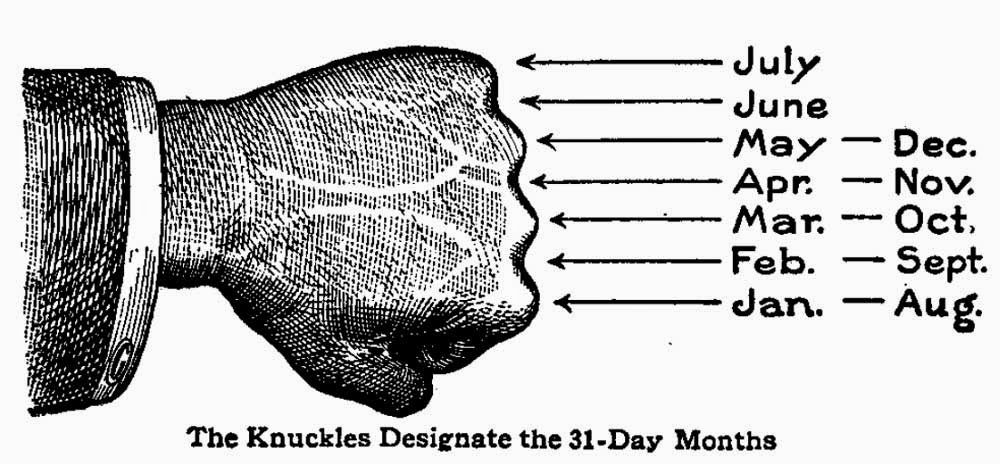

Trong sê-ri bài viết **Phức tạp hóa vấn đề** này, mình sẽ trình bày các vấn đề kĩ thuật đằng sau những tác vụ đơn giản thường gặp trong công việc hằng ngày. Sẽ thật là tệ nếu chúng ta chỉ là những lập trình viên chỉ biết dùng những thứ được dọn ra sẵn và dâng tận miệng chỉ để xong việc, mà bỏ qua những kiến thức hay ho đằng sau, vốn đã dành cho chúng ta ngay từ đầu.

> Mọi công việc bất kỳ đều dễ đối với những người không phải làm nó. - Murphy's law

---

Datepicker là một dạng component đã quá quen thuộc với các bạn làm front-end, được sử dụng rộng rãi trên rất nhiều ứng dụng web. Mục đích của nó là hiển thị một "tờ" lịch trên màn hình máy tính để người dùng có thể chọn ngày tháng một cách dễ dàng.


Cách sử dụng các component này cũng rất là đơn giản, vì hầu như các thư viện UI phổ biến hiện nay đều có cả, ví dụ đây là cách sử dụng trong [Angular UI](https://angular-ui.github.io/bootstrap/)

```
<input type="text" uib-datepicker-popup="{{format}}" />
```

Mặc dù Datepicker chẳng có vẻ gì là to tát, nhưng thuật toán đằng sau nó thì lại rất thú vị và đáng để tìm hiểu.

## Phân tích vấn đề

Khi hiển thị lịch cho một tháng bất kì, chúng ta phải bắt đầu hiển thị từ ngày đầu tiên của tháng đó (ngày 1), vấn đề là ngày này có thể thuộc một "thứ" nào đó bất kì trong tuần (từ thứ 2 đến CN). Các thứ trước đó sẽ bị bỏ trống vì nó thuộc về tháng trước.

```
      January                February                March
Su Mo Tu We Th Fr Sa   Su Mo Tu We Th Fr Sa   Su Mo Tu We Th Fr Sa
               1  2       1  2  3  4  5  6          1  2  3  4  5
3  4  5  6  7  8  9    7  8  9  10 11 12 13   6  7  8  9  10 11 12
10 11 12 13 14 15 16   14 15 16 17 18 19 20   13 14 15 16 17 18 19
17 18 19 20 21 22 23   21 22 23 24 25 26 27   20 21 22 23 24 25 26
24 25 26 27 28 29 30   28 29                  27 28 29 30 31
31
```

Vì vậy, việc đầu tiên chúng ta cần làm là _xác định ngày đầu tiên của tháng cần tạo là ngày thứ mấy trong tuần_.

Sau khi đã xác định được đâu là ngày bắt đầu, chúng ta sẽ bắt đầu điền tiếp vào các ngày tiếp theo cho đến hết tháng (30 hoặc 31 ngày). Riêng tháng 2 sẽ có 28 ngày, đặc biệt vào _năm nhuận_ thì tháng 2 sẽ có 29 ngày. Vậy, việc thứ 2 cần làm đó là _xác định năm hiện tại có phải là năm nhuận_ không.

## Công thức Zeller - Tính thứ ngày trong tuần


**Nếu không thích toán thì các bạn có thể bỏ qua và đọc đến phần [Implement](#implement-c-ng-th-c-zeller) luôn cũng được, nhưng mà nên đọc phần này để hiểu nhé :)**

Đầu tiên, ta sẽ tìm hiểu về **công thức Zeller**. Đây là công thức giúp chúng ta xác định được một ngày thuộc thứ mấy. Giúp giải quyết vấn đề thứ 1 đã đề cập ở trên.

Công thức Zeller có dạng:

<math>
weekday=\left( \frac{13 \times month - 1}{5}+\frac{year}{4}+\frac{century}{4}+day+year-2\times century \right)\%7
</math>

Trong đó ta có:

| Ký hiệu 	| Mô tả 	| Ví dụ 	|
|---------	|-------	|-------	|
| $weekday$	| là thứ ngày mà chúng ta cần tìm      	| `0 = Chủ nhật`, `1 = Thứ 2`,...      	|
| $month$	| là tháng chúng ta cần xét, giá trị `1` đến `12`, bắt đầu từ tháng `3`      	| `Tháng 3 = 1`, `Tháng 4 = 2`,..., `Tháng 12 = 10`, `Tháng 1 = 11`, `Tháng 2 = 12`      	|
| $day$ 	| là ngày chúng ta cần tính      	| ngày 1, 2, 3,..., 29, 30, 31      	|
| $century$ | là thế kỷ hiện tại của năm đang xét, **bắt đầu từ 0**, hoặc đơn giản là 2 con số đầu tiên của năm hiện tại      	| `Thế kỷ 21 = 20`      	|
| $year$ 	| là số năm thứ mấy thuộc thế kỷ đang xét, hoặc đơn giản là 2 con số cuối cùng của năm hiện tại      	| `Năm 2016 = 16`      	|

---
**Ví dụ:** Tìm xem ngày `18/09/2016` là thứ mấy?

Đối với ngày $18/09/2016$ ta có:

$month = 7$, $day = 18$, $century = 20$, $year = 16$

Áp dụng công thức Zeller, ta có:

<math>
\begin{align}
weekday &= \left( \frac{13 \times 7 - 1}{5}+\frac{16}{4}+\frac{20}{4}+18+16-2\times 20 \right)\%7 \\

&= 21 \% 7 \\

&= 0

\end{align}
</math>

Như vậy ta tính được ngày $18/09/2016$ có $weekday = 0$ suy ra đó là ngày _Chủ nhật_. Ta có thể tra lịch để kiểm chứng:

```
         September 2016
Su   Mo   Tu   We   Th   Fr   Sa
                    1    2    3
4    5    6    7    8    9    10
11   12   13   14   15   16   17
[18] 19   20   21   22   23   24
25   26   27   28   29   30
```
---

### Implement công thức Zeller

Chúng ta có thể implement công thức Zeller bằng JavaScript như sau:

```
// hàm tính thế kỷ
function century(y) {
	return Math.floor(y / 100);
}

// hàm tính tháng cho công thức zeller
function month(m) {
	if (m < 3) return m + 10;
	else return m - 2;
}

// hàm tính năm trong thể kỷ
function year(y) {
	return y % 100;
}

// công thức zeller
function _zeller(day, month, year, century) {
  return ((13 * month - 1) / 5 + year / 4 + century/4 + day + year - 2 * century) % 7;
}

// viết lại cho dễ dùng
function zeller(d, m, y) {
   return _zeller(d, month(m), year(y), century(y));
}
```

Ở đây mình tách từng hàm xử lý ra cho dễ đọc, các bạn có thể gộp chung lại cho gọn như thế này cũng được:

```
function zeller(d, m, y) {
    return ((13 * ((m < 3) ? (m + 10) : (m - 2)) - 1) / 5 + (y % 100) / 4 + Math.floor(y / 100) / 4 + d + (y % 100) - 2 * Math.floor(y / 100)) % 7;
}
```

Kết quả của công thức Zeller không phải lúc nào cũng là số nguyên (integer), nhưng ta chỉ cần xét phần số nguyên trong đó. Để tách lấy phần nguyên, ta dùng hàm `Math.trunc()`:

```
var zweekday = zeller(12, 5, 2016); // = 4.600000000000001
var weekday = Math.trunc(zweekday); // = 4
```

## Xác định năm nhuận


Cái này thì phổ biến quá rồi không có gì để nói, tổng hợp lại tí điều kiện xác định năm nhuận cho bạn nào cần:

| Điều kiện            | Là năm nhuận? |
|----------------------|---------------|
| Không chia hết cho 4 | Sai           |
| Chia hết cho 4       | Đúng          |
| Chia hết cho 100     | Sai           |
| Chia hết cho 400     | Đúng          |

Giờ quăng code luôn:

```
function isLeap(year) {
   if ((year % 4) || ((year % 100 === 0) && (year % 400))) return 0;
   else return 1;
}
```

Ở đây chúng ta trả về giá trị `0` (không nhuận) và `1` (nhuận) thay vì `true`/`false` để phục vụ cho hàm tính số ngày của tháng sẽ đề cập ở phần sau.

## Tính số ngày của một tháng



Tiếp đến chúng ta sẽ có hàm tính số ngày của một tháng, ví dụ tháng 1 là 31 ngày, tháng 2 sẽ có 28 ngày nếu không phải năm nhuận và 29 ngày nếu năm nhuận, code như sau:

```
function daysIn(month, year) {
    return (month === 2) ? (28 + isLeap(year)) : 31 - (month - 1) % 7 % 2;
}
```

## Gộp chung lại nào: Thuật toán lập lịch tháng


Bây giờ chúng ta sẽ tổng hợp các phân tích ở trên và implement thuật toán lập lịch cho một tháng bất kì.

**Input:** Tháng và năm cần lập lịch, ví dụ: **1** và **2016**

**Output:** Một mảng 1 chiều chứa **42** phần tử ứng với một khung lịch **6x7** ô

Đầu tiên ta sẽ khởi tạo mảng `result` 1 chiều gồm `42` phần tử, tất cả đều mang giá trị mặc định là `0`.
Sau đó tạo 1 biến `startIndex`, có giá trị là kết quả của hàm `zeller()` với ngày đầu tiên của tháng (ngày 1). Cuối cùng bạn chỉ cần điền các ngày tương ứng từ (gía trị của) `startIndex` đến `daysIn(month, year)` của tháng hiện tại là hoàn thành.

Sau đây là cách implement của thuật toán bằng JavaScript:

```
function calendar(month, year) {
    var startIndex = Math.trunc(zeller(1, month, year));
    var endIndex = daysIn(month, year);
    var result = Array.apply(0, Array(42)).map(function(i){ return 0; });
    for (var i = startIndex; i < endIndex + startIndex; i++) {
        result[i] = (i - startIndex) + 1;
    }
    return result;
}
```

Để sử dụng, chúng ta gọi hàm `calendar()`, truyền vào `tháng` và `năm` cần tìm:

```
var september = calendar(9, 2016);
```

Kết quả sẽ có dạng như sau (lưu ý các số `0` ở đầu và cuối kết quả):

```
[0, 0, 0, 0, 1, 2, 3, 4, 5, 6, ..., 28, 29, 30, 0, 0, 0, 0, 0, 0, 0, 0]
```

Vậy chúng ta sẽ sử dụng kết quả này như thế nào? Chúng ta sẽ đọc mảng này theo từng cụm 7 phần tử.

Để kiểm chứng, mời bạn sử dụng câu lệnh `cal` (trong Mac OS X hoặc Linux) để in lịch của tháng 9 năm 2016 lên màn hình.

```
cal 9 2016
```

Và đối chiếu với mảng `september` của chúng ta.

```
                                       September 2016
                                    Su Mo Tu We Th Fr Sa
0,  0,  0,  0,  1,  2,  3,                       1  2  3
4,  5,  6,  7,  8,  9,  10,          4  5  6  7  8  9 10
11, 12, 13, 14, 15, 16, 17,         11 12 13 14 15 16 17
18, 19, 20, 21, 22, 23, 24,         18 19 20 21 22 23 24
25, 26, 27, 28, 29, 30, 0,          25 26 27 28 29 30
0,  0,  0,  0,  0,  0,  0
```

---

Hy vọng qua bài viết này, mỗi khi nghĩ tới Datepicker hoặc việc xử lý ngày tháng, các bạn sẽ cảm thấy nó phiền phức hơn một tí =)) Nhưng bù lại các bạn đã hiểu rằng nó được tạo ra như thế nào (và cũng hiểu luôn câu quote Murphy's Law ở đầu bài :v).

Đến đây bạn hoàn toàn có thể tự viết cho riêng mình một component Datepicker mà không bị phụ thuộc vào bất cứ một món ăn sẵn nào nữa.

Hẹn gặp lại các bạn trong các bài viết tiếp theo của sê-ri **Phức tạp hoá vấn đề** ^^
