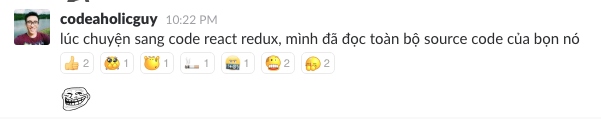

# Có gì trong source code của Redis?

Bắt nguồn từ một cuộc thảo luận trên room #javascript của [Cộng đồng Ruby Việt Nam](http://chat.ruby.org.vn) với bác [Hoàng Codeaholicguy](https://codeaholicguy.com/) và bác ấy có chia sẽ một kinh nghiệm như thế này:

Chả biết bác ấy có chém không, nhưng nghĩ đi nghĩ lại thì việc đọc source cũng là một kĩ năng cực kì cần thiết đối với một developer. 

Nghĩ cái là làm luôn, mình quyết định tìm một project nào đó thiệt hoành tráng và đọc thử source code của nó coi sao, vì quan niệm là cái gì đã ko làm thì thôi, đã làm thì mấy cái dễ dễ bỏ hết qua 1 bên. Và mình đã sai lầm ngay từ chỗ đó. Sau gần 1 ngày đọc source của Linux, mình đã bỏ cuộc...

Trong cơn tuyệt vọng, mình tìm đến một project khác cũng nằm trong top C project trên Github =)) đó là Redis, thiệt là may mắn vì bác [antirez](https://github.com/antirez) viết một cái file README cực kì chi tiết để hướng dẫn người mới làm quen với cấu trúc của project.

Nói dông dài vậy thôi, mục đích chính của bài viết hôm nay là mình sẽ nói về các kĩ thuật được bác **antirez** sử dụng trong [mã nguồn của Redis](https://github.com/antirez/redis).
