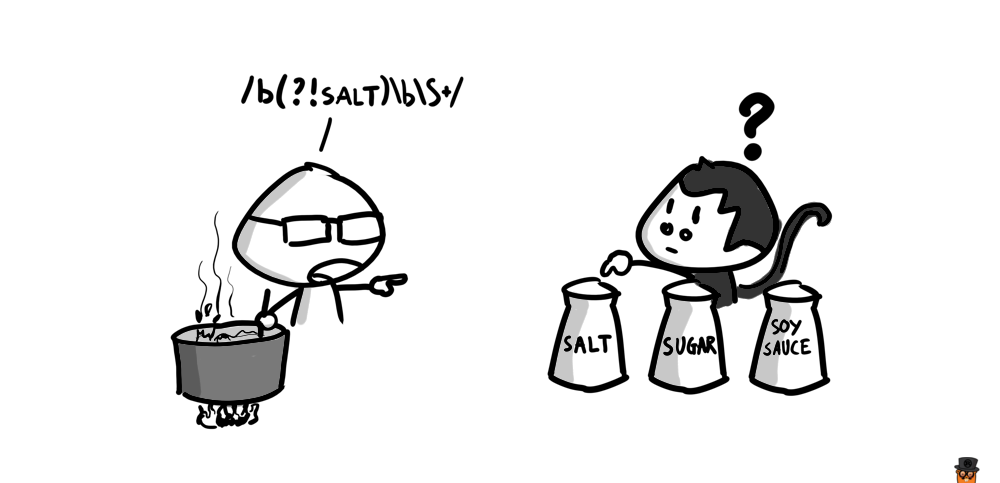

Đối với nghề lập trình nói chung và công việc Frontend nói riêng, theo mình, cái khoảnh khắc tự mình đọc hiểu hoặc viết ra được một đoạn Regex (biểu thức chính quy - reqular expression) có thể coi là một trong những khoảnh khắc đáng nhớ nhất (well...).

Thực ra cũng như nhiều người khác, mình được tiếp xúc với Regex từ khá sớm - từ những ngày đầu tiên bắt đầu nghề mần web, với PHP. Xuất hiện thường xuyên nhất chắc là khi phải viết các route handler, rồi thì kiểm tra độ chính xác của email,... Và trong một thời gian rất dài, mình cũng chỉ đi copy paste. Nhưng rồi mình quyết định phải học để hiểu được thứ cú pháp ngoài hành tinh này. Và cũng trong một thời gian dài mình vỗ ngực tự khen là **đã học được Regex**, xong rồi muối mặt khi nhận ra bất cứ ai nghiêm túc theo nghề lập trình đều biết Regex hết :)) và nhất là cái bọn xài [vim](https://thefullsnack.com/tags/vim.html).



Khoan hãy bàn đến tính hiệu quả của Regex, bài viết này mình muốn nói đến một thực trạng của rất đông đảo các lập trình viên, tech blogger, mentor, giảng-bài-viên ở các trung tâm,...

Đó là việc chia sẻ và copy về sử dụng các đoạn Regex một cách mù quáng.

Không quá khó để có thể tìm thấy trên Google các kết quả như: **n đoạn biểu thức chính quy cần biết cho tất cả mọi thể loại lập trình viên**. Mình không hiểu viết ra những bài này thì đem lại lợi ích gì cho người đọc?

Đồng ý là vì Regex có cú pháp không hề đẹp mắt, dẫn đến khó đọc và khó hiểu (nhưng không hề khó học), đa số chúng ta có xu hướng thích copy những đoạn được viết sẵn về để sử dụng. Và đa số sẽ bỏ ra hơn 10 giờ đồng hồ chỉ để tìm được một đoạn Regex nào đó được post sẵn trên mạng mà chạy **gần đúng nhất** đối với một cái requirement ất ơ nào đó của dự án mà chúng ta đang làm. Đó là chưa kể nếu dự án có ra những yêu cầu trên trời rơi xuống thì biết Google ở đâu cho ra đây?

Ví dụ: Lấy tất cả các lọ gia vị, trừ lọ muối

```javascript
["sugar", "salt", "chilli", "pepper"].join(" ").match(/\b(?!salt)\b\S+/g)
```

Và việc này hoàn toàn không đáng nếu bạn có thể bỏ ra 30 phút để học cú pháp của Regex và tự sửa nó cho **đúng chính xác** với cái requirement ất ơ kia.

Nói chung là còn rất nhiều những ví dụ và những trường hợp mà chúng ta buộc phải học cách sử dụng Regex một cách linh động, và việc học để hiểu được cú pháp của nó là giải pháp duy nhất. Nếu bạn vẫn còn đang đi tìm một đoạn Regex ăn sẵn nào đó trên mạng, thì thôi hãy dừng lại và [bắt đầu học Regex ngay và luôn đi](http://regextutorials.com/intro.html?Basic%20symbols).

Và đôi lời cho bạn nào vẫn có ý định viết về Regex: Thay vì copy dán các đoạn Regex vào bài viết của bạn một cách vô trách nhiệm, hãy bớt chút thời gian tìm hiểu cú pháp của nó và giải thích cặn kẽ từng phần của mỗi biểu thức. Việc bạn muốn chia sẻ kiến thức thì rất đáng hoan nghênh, nhưng xin đừng chia sẻ sự lười biếng và ngu dốt.
