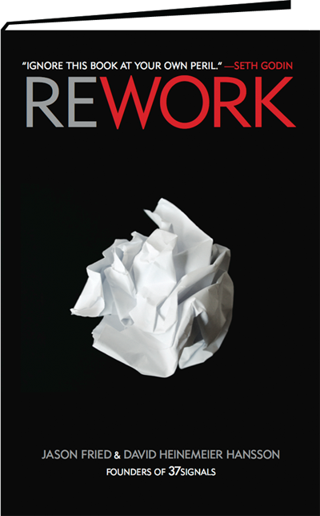
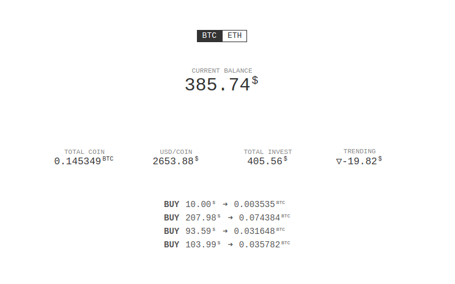
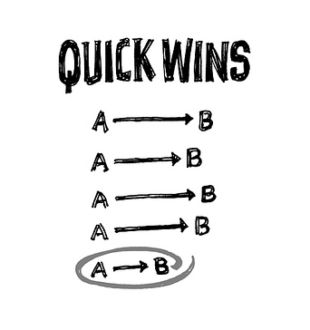
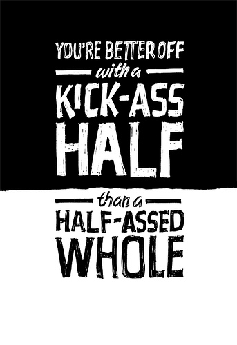
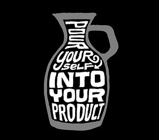

Quyển này thì khá là nổi rồi, không cần phải giới thiệu nhiều về nó nữa.

Quả thực thì ngay từ đầu mình không hề có ý định đọc quyển này, vì nghĩ chắc nó dành cho dân **startup** này kia, không phải thứ dành cho mình.

Nhân tiện có thằng em nhờ mua dùm quyển này nên tranh thủ đọc ké =)))

Nhận xét chung thì đây là một quyển sách khá dễ đọc, và nội dung thì thú vị hơn những gì mình nghĩ ban đầu rất nhiều. Đặc biệt đây không phải là quyển sách dành riêng cho dân startup như những gì mình nghĩ ban đầu.

Nói đúng hơn thì cuốn sách này nói nhiều về tư duy để **build sản phẩm** hơn là startup "thuần túy". Và cũng rất thích hợp đối với dân developer, chuyên làm side project xong rồi bỏ như mình =)))

Sách không dài, tuy nhiên không phải không có những đoạn lộn xộn, nói không trúng không trật, tuy nhiên cũng có một số bài mà mình tâm đắc và cảm thấy rất phù hợp nếu đứng ở góc độ một developer khi đọc quyển này:

- **Ignore the real world:** Chắc hẳn ai cũng từng gặp vấn đề khi trình bày một ý tưởng gì đó thì sẽ bị phán ngay một câu  là _"ý tưởng này không dùng được đâu"_, mà như trong sách là _"that would never work in the real world"_, và lời khuyên được đưa ra ở đây rất đơn giản: _**"that world may be real for them, but it doesn't mean you have to live in it"**_, dịch ra thì chắc là _"thôi kệ mẹ nó, làm tới đi"_ :))

- **Scratch your own itch:** tự gãi chỗ ngứa của chính bạn. Cái này thì rõ ràng rồi, chỉ khi bạn build một sản phẩm để giải quyết vấn đề do chính mình gặp phải, thì bạn mới biết mình cần cái gì và nên làm như thế nào. Nhiều startup hoặc side project được làm ra để giải quyết những vấn đề được đoán mò của người khác, tất nhiên nó sẽ fail sấp mặt ngay. Đơn giản vì bạn gãi mà người ta không đã ngứa, hoặc tệ hơn là càng ngứa thêm =))

  Về điểm này thì mình có áp dụng ngay, số là mình cũng có bu theo dư luận đi đầu tư bitcoin và etherum tại Coinbase, nhưng ngặt nỗi trang này không có thống kê rõ ràng về tình trạng lời lỗ khi đầu tư, thế là tự build, và kết quả nhìn vào thấy ngay đang lỗ sấp mặt T_T

  

- **Start making something** và **No time is no excuse**: Không đủ thời gian nên không làm, thực ra 1 ngày 24 tiếng, thì việc có đủ thời gian hay ko là do cách chúng ta tận dụng thời gian của mình như thế nào thôi, thức đêm thêm 1, 2 tiếng hoặc bớt đi 1, 2 tiếng chơi game, xem phim thì sẽ thừa ra thời gian để viết lách hoặc code thêm project gì đó, học thêm được cái gì đó ngay. Và khi đã có thòi gian rồi thì nên làm ngay đi, đừng có chờ đợi.

  

- **Quick wins:** hoàn tất những mục tiêu nhỏ, để "giữ lửa". Một trong những yếu tố khiến cho các side project dễ bị drop nhất đó chính là nản. Cái này là bệnh chung, ai cũng rất dễ nản chí khi bị stuck với một vấn đề gì đó quá lâu.

  Chẳng hạn như trong quá trình build cái tool tracking kết quả đầu tư bitcoin ở trên, mình cũng từng drop mấy lần vì cảm thấy phiền phức khi vấn đề đột nhiên trở nên quá lớn. Ý tưởng ban đầu là làm ra một tool có khả năng tracking realtime kết quả đầu tư, với danh sách các transaction được rút về tự động thông qua API của Coinbase.

  Tuy nhiên vấn đề mà mình gặp ngay sau đó là rate limit khi gọi API của Coinbase nên không thể làm realtime được, thế là bỏ luôn chức năng realtime, thay vào đó chỉ request dữ liệu định kì một phút 1 lần. 

  Việc tự động rút dữ liệu từ Coinbase đòi hỏi phải tích hợp authentication và lấy thông tin người dùng, mình tạm bỏ qua luôn và giải quyết bằng cách cho người dùng tự nhập thông tin từng transaction vào.

  Cả 2 quyết định trên đều có thể cải tiến về sau khi cần, nhưng ngay lúc này có thể bỏ qua để không bị stuck quá lâu vào một vấn đề gì, khiến cho dự án bị đình trệ và bản thân trở nên chán nản.

  Cách này rất hiệu quả.

- **Outside money is PlanZ** và **Start a business, not a start-up**: Nhiều người nghĩ ngay đến việc làm sao để xin đầu tư, gọi vốn, funding gì đó khi startup hoặc khi build một sản phẩm mới. Mấu chốt của việc làm ra sản phẩm là bán được nó cho người dùng chứ không phải cho investor hoặc cho đối thủ cạnh tranh. Và nhận tiền của người khác đồng nghĩa với việc chịu sự chi phối của họ, điều này tắt nhiên có hại hơn là có lợi, rõ ràng.

  

- **Build half, not half-ass**, **Ignore the details early on** và **Launch now**: Cái này thì là điểm chung của mọi sự thất bại khi build product, và mình cũng gặp rất nhiều trong các side project mình làm. Thường khi bắt đầu làm, thì chúng ta chỉ plan một chức năng rất nhỏ, nhưng trong quá trình làm thường đẻ thêm nhiều thứ, hay ho có, tào lao cũng có. Và đến cuối cùng thì từ một product nhỏ nó phình to ra một product to, to đến mức không hoàn thành nổi và drop bà nó luôn. Hoặc có build ra xong thì [cũng không đâu ra đâu cả](https://codeaholicguy.com/2015/11/12/neu-ban-khong-tim-ra-gia-tri-cua-san-pham-thi-dung-co-tao-ra-no/), cho nên lời khuyên ở đây là mạnh dạng bỏ bớt những thứ không cần thiết, và chỉ tập trung vào những gì thiết yếu nhất, mấy cái râu ria có thể thêm thắt vào sau.

- **Sell your by-products**: Bài này khá thú vị, **by-products** nghĩa là phụ phẩm, giống như phụ phẩm khi làm đồ gỗ là mùn cưa, phụ phẩm trong mấy tiệm cắt tóc là tóc được cắt ra, và họ thường không vứt đi mà bán đi hoặc đem làm ra thứ khác (giống như lúc ban đầu, [trò chơi LEGO cũng được làm ra từ gỗ thừa](http://www.encyclopedia.com/history/culture-magazines/legos) trong xưởng đồ chơi của họ).

  Vậy by-products của dân developer khi làm project là gì? Có thể là một vài đoạn code/function/component được build ra phục vụ cho product, một vài script hay ho có thể đem đi share được, hoặc một vài kĩ thuật mà bạn học hỏi được trong quá trình làm việc, có thể đem viết thành bài blog được,... nếu để ý thì sẽ có rất nhiều.

- **Don't copy** và **Underdo your competitor**: Clone là một hành vi rất phổ biến, đặc biệt trong cộng đồng dev. Có thể bạn thấy người ta làm một thứ hay ho và muốn clone lại, hoặc tệ hơn là đi copy hoàn toàn về và thay da đổi thịt. Bạn hoàn toàn có thể làm vậy nếu đang trong quá trình học, clone để biết được cách người ta xây dựng sản phẩm như thế nào, và học hỏi từ quá trình đó.

  Tuy nhiên đây không phải là cách để bạn thành công với sản phẩm của mình. Hãy quên đi những sản phẩm clone (toàn bộ, hoặc một vài feature) và trở nên thành công, bạn chỉ thực sự thành công nếu sản phẩm gốc giải quyết vấn đề chưa tốt, và bạn có thể làm tốt hơn. Nhưng trong hầu hết mọi trường hợp, những sản phẩm clone thường rất kém về mặt chất lượng và nghèo nàn về mặt nội dung.

  Khi bạn clone, bạn đơn giản là copy lại toàn bộ UI, hay cách mà người ta giải quyết một vấn đề gì đó và đưa vào trong sản phẩm của mình, nhưng bạn không hề hiểu được tại sao người ta lại thiết kế UI như vậy, tại sao người ta lại chọn cách đó để giải quyết vấn đề.

  Thay vào đó, có thể chọn giải quyết cùng một vấn đề với sản phẩm mà bạn muốn cạnh tranh, và làm ít hơn nhưng làm tốt hơn. Một sản phẩm A có 10 chức năng nhưng bạn có thể focus vào 1 chức năng nào đó và làm cho nó thật tốt.

  

  Cuối cùng, việc bị sao chép là không thể tránh khỏi. Bạn thành công thì người ta sẽ muốn sao chép lại sản phẩm của bạn. Vì thế, lời khuyên tiếp theo là _**"pour yourself into your product"**_, tạo ra dấu ấn của chính mình trong từng sản phẩm do mình làm ra, những thứ mang đậm phong cách của chính bạn, là cách để không ai có thể sao chép được sản phẩm của mình.

---

Tóm lại đây là một quyển sách khá hay, và dành cho những ai muốn build một (hoặc một vài) cái gì đó, sách không quá dài và được trình bày một cách rất dễ đọc. Nên tìm đọc bản gốc bằng tiếng Anh, vì sẽ có những đoạn mà mình không biết bản dịch tiếng Việt có giữ được hết nghĩa của nó không.

Tuy nhiên không phải điều gì được nói trong đây cũng đúng với đại đa số, cho nên cần đọc với thái độ hoài nghi và sẵn sàng reject những ý tưởng không hợp với bản thân =)))

Chốt, nên tìm thuê hoặc mượn về đọc, quyển này nên đọc nhưng không nhất thiết phải mua.
