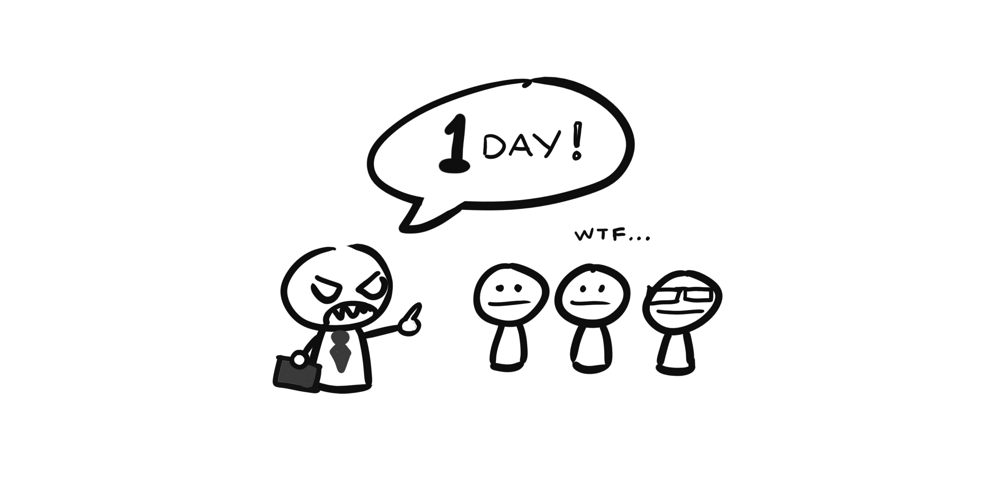
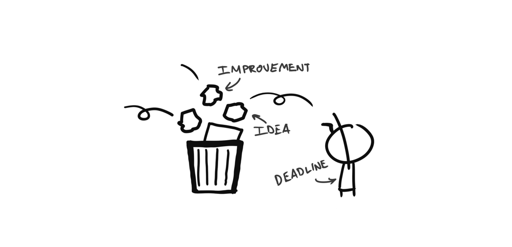
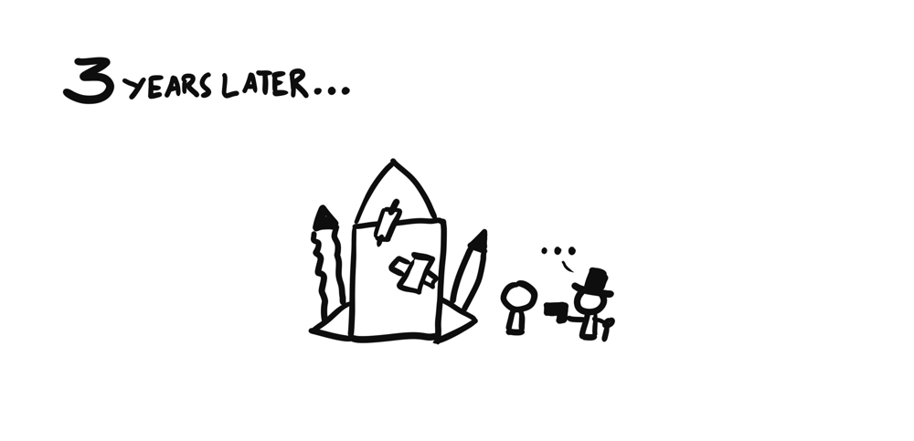

Giống như rất nhiều người, thì mình bắt đầu nghe Metal từ những năm cuối cấp 2, với những Breaking the habit, Numb hay In the end của Linkin Park, về sau thì NuMetal bị chê dữ quá, lên cấp 3 mình chập chững tìm  đến những giai điệu sâu lắng đến mê hồn nhưng không kém phần mãnh liệt của Nightwish, hay cái lãng mạn của Stratovarius, rồi đến speed metal dồn dập đến căng não của Metallica, lên đại học mình từng lải nhải suốt ngày cái điệp khúc _"Fight with blood, fight with steel, die with honor, never yield"_ trong Die With Honor của Manowar, sang đến Mỹ thì mình thích vặn max volume Guardian of Asgard hay On a Sea of Blood của Amon Amarth giữa những lúc kẹt xe trên đường =))

Đến khi có Evan mình cũng có cho nghe thử  Metallica nhìn bản mặt của cu cậu thì có vẻ không mấy nhiệt tình cho lắm, và sau đó thì mình bị vợ mắng cho một trận vì cái tội dám cho con nghe rock =)))

Đây cũng là kinh nghiệm xương máu, các bạn nếu có baby thì chỉ nên tập cho bé nghe rock/metal khi không có vợ ở  bên cạnh nhé.

---

## Chuyện rock bands

Một trong những người có ảnh hưởng nhất đến sự nghiệp nghe Metal của mình là anh Sáng Đặng, quen ảnh cũng gần 8 năm trước trên mấy cái forum lập trình, và chỉ gặp ảnh ngoài đời đúng 2 lần: Một lần vào năm ngoái ở  Mountain View, và lần đầu tiên là ở  Đà Nẵng.

Ổng là người đã chỉ cho mình cách phân biệt từng tiếng riff, tiếng bass. 

Một bản nhạc, bao giờ cũng là sự phối hợp của rất nhiều loại nhạc cụ khác nhau, dù là những bản nhạc trầm lắng nhẹ nhàng hay thứ âm nhạc "gào thét" là Metal như nhiều người vẫn đánh giá.

Thiếu đi một trong các yếu tố trên, thì bản nhạc không bao giờ là hoàn hảo. Và nếu mỗi một yếu tố chỉ đứng riêng lẽ một mình, nó cũng không thành ra cái gì được cả.

Và để  những loại nhạc cụ khác nhau kết hợp với nhau một cách hoàn hảo cho một bản thu dài chỉ 5 phút, là cả một quá trình phối hợp làm việc, tập luyện, thử nghiệm và cả những xung đột, tai nạn xảy ra như cơm bữa trong một band nhạc.

<iframe width="700" height="400" src="https://www.youtube.com/embed/irYapvdr-ow" frameborder="0" allowfullscreen></iframe>

Video hậu trường quá trình tập luyện và thu âm bài "Spit Out the Bone" của Metallica

Ngồi xem video trên, có một điều mình thấy rất rõ là quá trình sáng tác, chỉnh sửa, thu âm một bài hát là cực kì không đơn giản, đó là còn chưa kể đến việc ra được bài hát còn phải tìm cách phát hành, quảng bá,... Nhưng xuyên suốt video không thấy một ai là không có cái nhiệt huyết và cố gắng tuyệt đối cả. Và cái cách mà họ thể hiện sự cố gắng chỉ có thể lý giải bằng một điều, đó là: **Phải làm ra một bản thu hoàn hảo**.

---

## Chuyện dev teams

Đó là chuyện trong một rock band, bây giờ mình lại ngồi nghĩ về các thành phần thường có trong một dev team, xem nào:

- Developers
- Product Manager
- QA/Tester
- Designer
- Business Team

Và cũng giống như trong một rock band, mọi người trong một dev team cũng cùng nhau hợp sức để làm ra sản phẩm cuối cùng là một phần mềm tốt, tốt cho ai thì chưa nói đến ở đây. Thiếu vắng một vị trí bất kì trong team thì không có cái gì có thể gọi là hoàn hảo được nữa.

Tuy nhiên cái cách mà mỗi team cùng cố gắng nó cũng rất là khác nhau.

---

### Outsourcing teams

Hẳn đây không phải lần đầu tiên mình nói về chuyện Outsourcing trên blog này, hôm nay mình lại nói tiếp.

Trong suốt những năm đi học và đi làm ở VN thì mình cũng tham gia vào rất nhiều team/công ty làm Outsource. Lớn vài trăm hoặc ngàn người có, vài chục người có, vài người cũng có luôn.

Không thể phủ nhận là trong một số công ty đó, có rất nhiều công ty rất chuyên nghiệp, cả về quy trình phát triển, lẫn tinh thần hợp tác, làm việc trong team, trình độ của team cũng rất cao.

Tinh thần lăn xả cống hiến cũng rất cao, khi mà có không ít lần mình và cả team đến gần 12h đêm ngày 28 tết vẫn còn ngồi lại công ty chỉ vì bug fix chưa xong.

Rồi cả những lúc mà khách hàng nổi điên lên gửi mail mắng xối xả, cả team vẫn cùng ôm nhau chịu trận =)) Tất cả thời gian đáng lẽ dành cho việc đi chơi với người yêu, hay về nhà ăn tối với vợ con thì nay bạn phải dành hết 14, 15 tiếng một ngày cho mấy em QA đang ngồi còng lưng ra test bug, tất cả tâm trí đáng  lẽ dành cho gia đình và cuộc sống thường ngày hay cho việc học hỏi trau dồi thêm kĩ năng, kinh nghiệm thì nay bạn phải dành hết cho việc fix bug.

Ở những nơi như thế, cả team đồng lòng chiến đấu vì một mục đích chung là **hoành thành project trước deadline** (vốn đã là một lời nói dối ngay từ ban đầu của business team) và **làm cho khách hàng (chủ dự án) hài lòng**. Còn đâu những ý tưởng vĩ đại về **một sản phẩm hoàn hảo**, hay **sự hài lòng của người dùng**, đều bị quăng vào sọt rác hết.

Có thể nhận xét của mình đối với Outsource là phiến diện, và nếu bạn đang làm việc trong một team Outsourcing, nơi mà những điều mình kể ở trên là sai hoàn toàn, thì xin vui lòng để lại comment để mình có đủ can đảm vứt bỏ cái định kiến này đi :D

---

### Product teams

Làm việc trong một team phát triển product thì những trải nghiệm nó đem lại khác hoàn toàn so với một team Outsourcing.

Trong các team production mà mình từng/và đang tham gia thì động lực đầu tiên đến từ việc **xây dựng một sản phẩm tốt cho người dùng**. Việc bán được sản phẩm và kiếm được **cực kì nhiều tiền** đương nhiên là một trong vô số động lực, nhưng tất cả mọi người đều biết nếu build một sản phẩm nửa mùa thì cũng đừng mơ tới chuyện kiếm được tiền.

Team làm product thường không lớn lắm, khởi sự có khi chỉ 2, hoặc 3 người, ai có gì dùng nấy chứ không có nhiều tiền tới mức đòi mua cả license Visual Studio Ultimate Edition như hồi mình làm ở công ty **F.** và công ty **A.** ở Đà Nẵng.

Chuyện lăn xả hay cống hiến ở một team làm Product thì gần  như là một điều **bắt buộc**. Không hề có những kiểu động lực như: cố gắng làm để khách hàng thưởng, OT thêm vài tiếng để có thêm tiền hay năng nổ lên để sếp để ý tới. Trong một team đang gồng mình lên để nhích từng bước một thì chẳng có mấy ai có thời gian để khen thưởng chuyện mình cố gắng như thế nào cả, mặc dù tất cả những nỗ lực đó đều sẽ được ghi nhận, và chỉ khi nào sản phẩm vượt qua được giai đoạn khó khăn nhất thì mới có chuyện thưởng phạt xảy ra.

Nếu bạn nằm trong một production team, thì chìa khóa để thành công đó là không bao giờ bị động  trước những vấn đề xảy ra trong team. Và luôn suy nghĩ để tìm cách cải thiện thứ mà mình đang làm - như là chất lượng code, chất lượng dự án, chức năng mới,... (à khoan, thực ra cái này áp dụng được cho cả outsourcing team đấy, nhưng **lực cản** ở đó sẽ lớn hơn và bạn phải cố gắng nhiều hơn rất rất rất rất nhiều).

Và cố gắng như thế để đạt được điều gì?

Thành công hoặc là thất bại. Một trong hai thứ đó. Và kết quả nó rất rõ ràng, một màu trắng hoặc một màu đen.

Tin mình đi, trong thế giới của những người làm product không bao giờ có kết quả huề vốn, hoặc là bạn thành công với sản phẩm của mình vì bạn và cả team đã làm rất tốt, hoặc là sản phẩm đó không đem lại được một đồng tiền nào cho bạn và cả team, vì chúng ta đã chưa cố gắng hết sức mình.

Nhưng dù là một dự án thành công hay một dự án thất bại, thì khi bạn nhìn lại chặng đường mà mình đã đi qua, cùng với team cố gắng từng ngày, bỏ qua mọi lời khen chê đến từ bạn bè, gia đình và xã hội, thứ mà bạn còn lại nó rất lớn, và quý giá, đó là: **Trải nghiệm**.

Đó là những thứ mà có thể 5 năm, 10 năm sau bạn vẫn có thể tự hào kể lại cho bạn bè, hoặc chia sẽ trong một buổi meetup nào đó, có người sẽ đem viết thành sách, có những người thậm chí sẽ đi vào lịch sử như là Linus Torvalds hay Steve Wozniak. Và đó cũng là lý do mà chúng ta vẫn thường thấy những tựa sách như **42 năm làm ăn tại Mỹ và Trung Quốc** (Alan Phan), hay **Cuộc đời và sự nghiệp của tôi** (Henry Ford), mà không bao giờ thấy những tựa sách như là **Hồi ký 30 năm làm công ăn lương của một công chức gương mẫu** cả.

---

Cuối cùng, có thể bạn đang tự hỏi, vậy **rock band** nó có liên quan gì tới chuyện **outsourcing** hay **làm product** đâu, thì câu trả lời là: Nó có liên quan gì đâu, tại mình đang rảnh quá nên viết lung tung cho vui thôi =)))

Các bạn quan tâm có thể đọc thêm bài ["3 điểm khác nhau giữa công ty Product và công ty Outsourcing"](http://blog.itviec.com/3-diem-khac-biet-giua-cong-ty-product-outsourcing/) tại ITviec Blog, bài này rất thú vị. Hôm nào có thời gian mình sẽ lại viết tiếp những bài review kĩ hơn về các công ty outsource cũng như product mà mình đã từng kinh qua nhé :D
