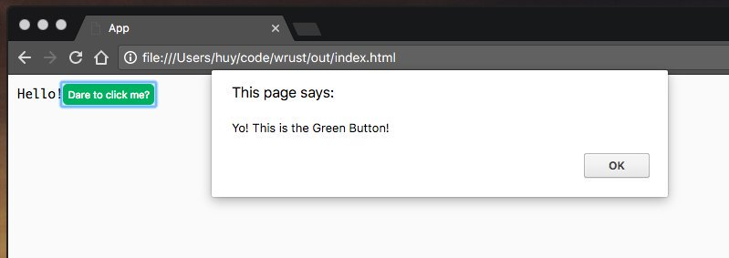
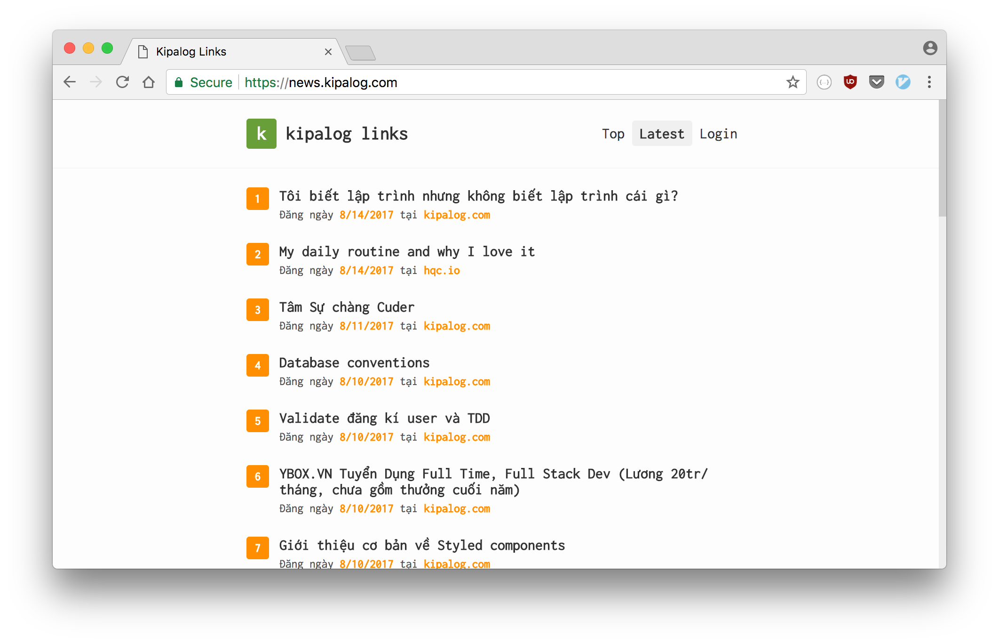
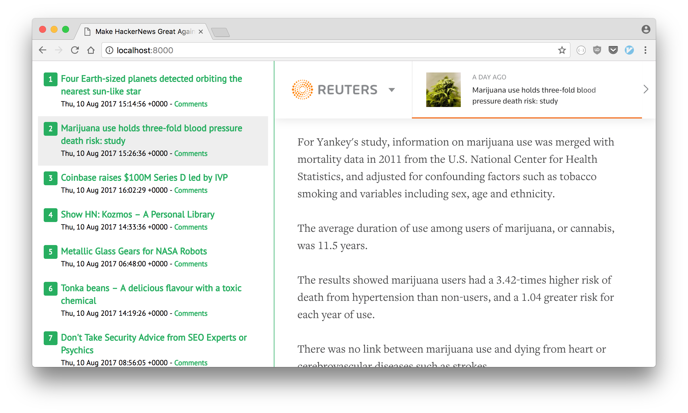

Bài viết được dịch lại từ bản gốc ["Rust for the Web"](https://thefullsnack.com/en/rust-for-the-web.html) đăng tại phiên bản blog tiếng Anh của mình.

---

_"Rust có làm được Web không nhỉ?"_ - Đây là câu hỏi của rất nhiều người, trong đó có mình.

Một trong những mục tiêu được đặt ra khi mình bắt đầu học Rust đó chính là **sử dụng Rust để làm web apps**.

Và sau gần 1 năm thì mình cũng học được vài thứ. Vì thế mình viết bài này để chia sẽ lại kinh nghiệm **Làm web với Rust** của mình.

Có rất nhiều phương pháp để làm web dùng Rust, ví dụ như là, compile Rust code ra thành client-side JavaScript code dùng WebAssembly, viết RESTful API, hoặc xây dựng ứng dụng web được render từ phía server, giống như những năm 2012 vậy :v

Chúng ta sẽ đi vào từng phương pháp một.

## Client-side JavaScript trong Rust

Cách đầu tiên, hoàn toàn là frontend, mà mình nghiên cứu đó là dùng Rust để viết web theo dạng component-based như là React vậy. Điều này có nghĩa là chúng ta phải tìm ra cách nào đó để chạy Rust ngay trên trình duyệt.

Và tất nhiên không phải tìm lâu, chúng ta có thể [dễ dàng biên dịch code Rust ra thành JavaScript](https://users.rust-lang.org/t/compiling-to-the-web-with-rust-and-emscripten/7627) để chạy trên trình duyệt, nhờ vào các dự án như ASM.js và WebAssembly.

Rồi, giờ quay lại vụ component-based. Mình có viết một macro đơn giản để wrap các API của crate [stdweb](https://crates.io/crates/stdweb), và render các HTML elements thông qua DOM API của trình duyệt:

[https://github.com/huytd/rust-webapp-template/blob/master/src/main.rs#L13-L58](https://github.com/huytd/rust-webapp-template/blob/master/src/main.rs#L13-L58)

Nếu mà nhìn vào đoạn code trên bạn cảm thấy mông lung không hiểu gì, thì thôi cũng đừng hoảng. Cú pháp macro của Rust vốn không được đẹp cho lắm. Mà thực ra giờ mình đọc lại cũng không hiểu mình đang viết gì nữa, tự thấy nể bản thân mình ghê gớm =)))

Chi tiết về đoạn macro trên, `component!` làm nhiệm vụ định nghĩa ra một HTML element mới, `mount_component!` làm nhiệm vụ chèn (append) cái element đó vào document, và `html!` làm nhiệm vụ tạo ra một element từ một chuỗi HTML bất kỳ.

Cách dùng như sau:

```rust
component!(AppComponent => {
    init: {
        let e: Element = html!("
        <div>
            <p>
                <span>Hello</span>
                <span>World</span>
            </p>
            <GreenButton />
        </div>
        ");

        let mut button = GreenButton::new();
        mount_component!(e, "GreenButton", button);

        e
    },
    render: |this: &Element| {
    }
});

component!(GreenButton => {
    init: {
        let button = document().create_element("button");
        button.add_event_listener(move |_: ClickEvent| {
            js! {
                alert("Yo! This is the Green Button!");
            }
        });
        button
    },
    render: |this: &Element| {
        this.set_text_content("This is a button");
    }
});

fn main() {
    stdweb::initialize();

    let mut app = AppComponent::new();
    mount_component!(document(), "#root", app);

    stdweb::event_loop();
}
```

Đấy, như thế thì ai cần xài React làm gì nữa nào? =))) (đùa tí thôi)



Các bạn có thể tham khảo [mã nguồn đầy đủ](https://github.com/huytd/rust-webapp-template) để xem cách sử dụng `stdweb` với các macro trên để minh họa cho phương pháp **biên dịch Rust sang JavaScript**.

## Dùng Rust viết RESTful API

Phương pháp thứ 2 tập trung vào backend. Đó là dùng Rust để viết một API server và kết nối nó với frontend có sẵn của bạn.

Hiện tại có một lượng kha khá framework để bạn chọn, có thể tham khảo tại [AreWeWebYet](http://www.arewewebyet.org/).

Với những ai thích xài các framework nhỏ gọn [tiny_http](https://crates.io/crates/tiny_http) là sự lựa chọn hoàn hảo.

Xét về mặt đơn giản, dễ dùng thì [nickel.rs](https://github.com/nickel-org/nickel.rs), là một trong những framework tinh gọn nhất trong Rust, và lấy cảm hứng từ Express framework bên Node.js 

Nếu bạn muốn hỗ trợ HTTP/2, thì [solicit](https://github.com/mlalic/solicit) là sự lựa chọn duy nhất tính tới thời điểm này.

Cá nhân mình thích xài [rocket.rs](https://rocket.rs) vì nó là một framework rất mạnh và có rất nhiều tính năng, nhưng vẫn giữ cho code của bạn đơn giản tới mức tối đa. Gần đây thì rocket.rs đã hỗ trợ luôn TLS built-in. Điểm trừ duy nhất của framework này đó là cần sử dụng phiên bản Rust Nightly.

Đây là đoạn code ví dụ việc handle một endpoint dùng `GET` method với rocket.rs:

```rust
[get("/posts", format = "application/json")]
fn get_posts(page: i64) -> Json<Value> {
    Json(json!({
        "result": []
    }))
}
```

Bên cạnh việc serve API, mình thường dùng rocket.rs để serve static files luôn, giống như khi xài Express:

```rust
#[get("/")]
fn index() -> io::Result<NamedFile> {
    NamedFile::open("www/index.html")
}

#[get("/<file..>", rank = 5)]
fn files(file: PathBuf) -> Option<NamedFile> {
    NamedFile::open(Path::new("www/").join(file)).ok()
}
```

Từ đây thì mình có thể đưa hết toàn bộ code frontend vào một thư mục, ví dụ như là `www`, và gọi tới RESTful API từ Rust. Để rõ hơn thì đây là ví dụ minh họa về cấu trúc của mộ project mà mình thường làm:

```
├── Cargo.toml
├── README.md
├── src
│   ├── main.rs
│   └── ...Rust code here...
└── www
    ├── index.html
    ├── main.js
    ├── package.json
    ├── webpack.config.js
    └── ...JavaScript code here...
```

Để kết nối với database, chúng ta có thể sử dụng các ORM như [Diesel](https://diesel.rs/).

Nếu bạn muốn tham khảo ví dụ thực tế về 1 project sử dụng `rocket.rs` + `Diesel` (cho backend) và `React` (cho frontend), thì [đây là mã nguồn](https://github.com/huytd/codedaily-v3) của [Kipalog Links](https://news.kipalog.com/) - website đọc/tổng hợp tin bài từ các blogger công nghệ tiếng Việt mình làm cho [Kipalog](https://kipalog.com).



_Gửi mail cho mình link RSS blog của bạn nếu bạn muốn bài viết của mình được list trên Kipalog Links :P_

## Server-side rendering với Rust

Phương pháp cuối cùng, là phương pháp mình thích nhất, giống với thời kì nằm 2012, khi mình mới bắt đầu sự nghiệp lập trình với một chân code thuê PHP. :))

Không còn những khái niệm Single Page Application, client-side rendering. Không còn những trang web bể tè le hột me khi [người dùng disable JavaScript](https://www.quora.com/Why-do-some-people-disable-JavaScript-in-their-browser) nữa.

_Fun fact: Hầu hết các website lớn đều hoạt động ngay cả khi bạn tắt JavaScript của trình duyệt_

Cũng như nhiều framework đến từ các ngôn ngữ khác (như Rails, CakePHP, ASP.NET...), rocket.rs hỗ trợ bạn render một HTML template sau khi đã bind dữ liệu vào đó từ phía server, trình duyệt chỉ cần nhận về và hiển thị lên màn hình.

```rust
#[get("/")]
fn index() -> Template {
    let news = fetch_from(RSS_URL).ok().expect("Could not read RSS");
    Template::render("index", &news)
}
```

Ở [bài viết trước](https://thefullsnack.com/posts/making-rust-hackernews.html), mình hướng dẫn cách build một ứng dụng đọc tin Hacker News dùng rocket.rs và Handlebars template, chính là áp dụng phương pháp này.



Các bạn có thể tham khảo [mã nguồn đầy đủ của project](https://github.com/huytd/hackernews-rss-reader) để nắm rõ hơn. Phiên bản code trong mã nguồn này có áp dụng một vài kĩ thuật mới chưa được đề cập trong bài trước để giải quyết vấn đề load nội dung qua giao thức HTTPS.

---

Vậy là chúng ta đã điểm qua hết các phương pháp sử dụng Rust vào cho một project Web. Mỗi một phương pháp trên đều có những ưu nhược điểm khác nhau, có thể sử dụng tùy theo từng yêu cầu khác nhau của mỗi dự án, và bạn cũng hoàn toàn có thể kết hợp các phương pháp này lại với nhau trong cùng một dự án.

Hy vọng qua bài viết này, các bạn có được cái nhìn toàn cảnh về việc lập trình Web với Rust, và có được câu trả lời của riêng mình cho câu hỏi: _"Rust có làm được Web không?"_.

Và chúc các bạn may mắn nếu quyết định sử dụng Rust vào cho project của mình.

Happy Rusting...
