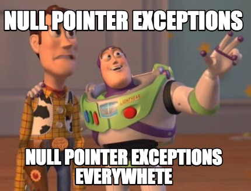
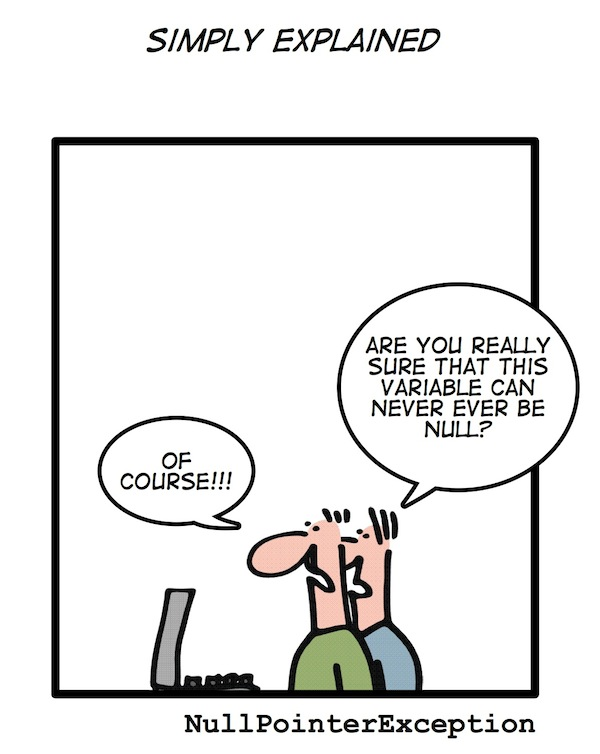

# Rust không có NULL thì code kiểu gì?

Có lẽ một số bạn sẽ có thắc mắc như tiêu đề khi mới tìm hiểu về Rust. Hẳn là các bạn đã biết, hoặc nghe đâu đó là: **Trong Rust không có NULL**. Bài viết này sẽ giúp cho các bạn hiểu rõ hơn về vấn đề này. 

## NULL trong các ngôn ngữ lập trình 

Đã là lập trình viên, chắc hẳn ai cũng quá quen thuộc với `NULL`, hay `nil`.

Thậm chí trong phiên bản Pokemon Sun & Pokemon Moon mới nhất (ở thời điểm viết bài này), cũng xuất hiện một Pokemon mới tên là **Type: Null** ([タイプ：ヌル][pkmnull]).


=)) lạc đề, quay lại chủ đề chính.

`NULL` là một giá trị diễn tả trạng thái không có gì cả, một giá trị chưa biết. Trong trường hợp là một con trỏ thì `NULL` cho biết con trỏ này không trỏ tới đâu cả.

Việc sử dụng `NULL` là rất phổ biến, ví dụ một trong những best practices khi lập trình C đó là kiểm tra giá trị `NULL` khi sử dụng hàm `malloc` để cấp phát bộ nhớ:

```
#include <stdlib.h>

char* str = malloc(_MATH_PATH);
if (str == NULL) {
  printf(" Lỗi rồi các bác ạ! Buồn quá! Không đủ bộ nhớ! :( ");
} else {
  // Đã cấp phát bộ nhớ thành công cho biến str
}
```

Hay như cách kiểm tra lỗi vô cùng "đẹp mắt" của Golang:

```
f, err := os.Open("how-to-be-a-richman.txt")
if err != nil {
  // Tạch chỗ này nè 
  log.Fatal(err)
}
// Tới được đây thì không tạch nhá 
```

Tuy nhiên, dù được dùng rất phổ biến, việc tạo ra giá tri `NULL` vẫn bị chính cha đẻ của nó coi là một sai lầm "trị giá tỉ đô"<sup>[[1]][ref]</sup>.

Trong suốt lịch sử phát triển của nền khoa học máy tính, đã có vô số chương trình máy tính tỏi không lý do, bởi cùng một hung thủ đó là `Null Pointer Exception`. =))



Hoặc có thể kể đến mối quan hệ nhập nhằng mù mờ giữa `null` và `undefined` đã khiến bao nhiêu thế hệ lập trình viên JavaScript phải vò đầu bứt tai:

```
typeof null           // "object"
typeof undefined      // "undefined"
null === undefined    // false
null  == undefined    // true
null === null         // true
null == null          // true
!null                 // true
isNaN(1 + null)       // false
isNaN(1 + undefined)  // true
```

Hoặc đối với SQL, chúng ta không thể so sánh giá trị `NULL` với các field trong một bảng một cách trực tiếp bằng các toán tử `=` hay `<>` được, mà phải dùng các toán tử đặc biệt, là `IS` và `IS NOT` để làm việc với chúng.<sup>[[2]][ref]</sup>

## Tại sao lại phải check NULL?

Trong hầu hết mọi trường hợp, chúng ta thực hiện thao tác kiểm tra một biến có phải là `NULL` không, là vì chúng ta cần dùng tới giá trị của biến đó, nhưng lại sợ rằng nó không mang giá trị. Và vì sợ nên cứ phải check.



Giống như cứ bước ra khỏi nhà là cho tay vào sờ cái quần, à, cái túi quần, để kiểm tra xem mình có đem theo điện thoại không. Riết rồi thành quen, đưa tay sờ quần như một phản xạ tự nhiên.

Vậy làm sao để khỏi phải đưa tay sờ quần liên tục nữa? Phải có một cách gì đó để chắc chắn rằng cái điện thoại luôn luôn nằm trong túi, đúng không?

Tương tự như thế đối với lập trình, để thoát khỏi việc check `NULL` liên tục thì ta phải có cách gì đó để đảm bảo rằng một giá trị không bao giờ bị `NULL`.

Để làm được điều này, Rust không cho bạn gán bất kì giá trị nào là `NULL` cả (dữ dội chưa, quản không được thì cấm luôn cho khỏe :))) và Rust không phải là ngôn ngữ đầu tiên hoặc duy nhất áp dụng phương pháp này, một số ngôn ngữ lập trình hàm như Haskell cũng cấm không cho một biến mang giá trị `NULL`. <sup>[[3]][maybe-monad]</sup>

(Nói như vậy không có nghĩa Rust là một ngôn ngữ lập trình hàm nhé)

## Không cho xài NULL thì giờ xài gì?

Và cũng giống như Haskell, Rust cung cấp một kiểu gọi là `Option<T>` (trong Haskell là `Maybe` và trong Swift là `Optional`, giờ thì trong Java cũng có nốt), cho chúng ta một phương pháp khác để giải quyết vấn đề mà không cần dùng tới `NULL`. 

Ở [bài trước](https://thefullsnack.com/posts/rust-binary-tree-traversal.html) mình cũng đã giới thiệu cách sử dụng `Option<T>`.

Bây giờ là lúc nói rõ hơn về vấn đề này.

### Bản chất của kiểu Option

Bằng việc bỏ `NULl`, từ bây giờ mỗi khi sử dụng một biến, bạn có thể yên tâm rằng biến đó luôn có giá trị, không bị `NULL` nữa.

Khi gặp một vấn đề mà ta chưa biết chắc chắn kết quả trả về của vấn đề đó như thế nào, nó có thể chứa giá trị hoặc không, ví dụ như trong linked list, hoặc khi implement một hàm chia hai số `a` và `b`, thì ta có thể dùng kiểu `Option<T>`.

Một biến kiểu `Option<T>` sẽ luôn luôn tồn tại một trong hai giá trị `None` (không có giá trị nào cả) hoặc `Some(T)` (trả về giá trị kiểu `T` của biến đó). Ví dụ:

```
fn divide(a: f64, b: f64) -> Option<f64> {
  if b == 0.0 {
    None
  } else {
    Some(a / b)
  }
}
```

Trong đoạn code trên, chúng ta kiểm tra nếu mẫu số `b` bằng `0` thì phép chia không thực hiện được, và hàm `divide(a,b)` trả về giá trị `None`, ngược lại thì trả về giá trị `Some(a / b)`.

Vậy chúng ta sẽ làm gì với một trong 2 giá trị trả về này? Chúng ta sẽ lấy nó ra như thế nào?

### Dùng match để handle các giá trị trả về

Khi nhận được một giá trị kiểu `Option<T>`, chúng ta có thể đọc giá trị từ biến này ra bằng cách dùng `match`:

```
match result {
  Some(c) => println!("Kết quả là: {}", c),
  None    => println!("Không chia được cho 0 đâu nhá!")
}
```

Tất nhiên đến đây thì chưa có gì đáng nói, nghe có vẻ giống với câu lệnh `switch()` ở các ngôn ngữ khác.

Điều đáng nói ở đây là `match` bắt buộc bạn **phải kiểm tra hết tất cả mọi trường hợp có thể xảy ra** (exhaustiveness checking), ví dụ như ở đoạn code trên mà bạn không handle trường hợp `None` thì sẽ nhận thông báo lỗi:

```
error: non-exhaustive patterns: `None` not covered
```

Vì chúng ta sử dụng kiểu `Option<T>` cho một biến khi chúng ta không chắc chắn giá trị của nó là gì, nên bắt buộc chúng ta phải kiểm tra đầy đủ mọi khả năng có thể có của nó. 

### Dùng if let để lấy giá trị trả về 

Một cách khác đó là dùng `if let` để lấy ra đúng giá trị cần dùng, cả cách này lẫn cách trên đều là các ứng dụng của pattern matching trong Rust.

```
if let Some(ref c) = result {
  println!("Kết quả là: {}", c);
} else {
  println!("Chia hổng có được :(");
}
```

### Dùng unwrap để lấy giá trị trả về 

Nếu không muốn dùng pattern matching, chúng ta có thể sử dụng một cách khác đó là `unwrap`.

Unwrap tức là mở gói, giá sử hàm `divide(a,b)` trả về cho bạn một gói quà, bạn chưa biết bên trong có gì, bạn phải `unwrap()` nó để lấy giá trị ở bên trong.

Có nhiều cách để unwrap một giá trị, mỗi cách đều sẽ có những cách hoạt động khác nhau, ví dụ:

- `unwrap()`: Mở gói và xem giá trị bên trong, nếu giá trị bên trong là `None` thì chương trình sẽ bị **panic** (kiểu như háo hức mở quà ra mà ko thấy có gì bên trong, shock quá tỏi luôn)
- `unwrap_or()`: Lần này thì bình tĩnh hơn, mở quà lấy giá trị, nếu không có gì (`None`) thì sẽ lấy giá trị truyền vào chứ không bị panic.
- `unwrap_or_else()`: Mở gói quà ra lấy giá trị bên trong, nếu bên trong là `None` thì thực thi khối lệnh được truyền vào để lấy giá trị ra.
- `unwrap_or_default()`: Mở quà lấy giá trị, nếu là `None` thì lấy giá trị mặc định của kiểu dữ liệu đó.

```
let result = divide(10.0, 0.0);

let c = result.unwrap_or_default();
println!("{}", c); // Trả về 0.0

let d = result.unwrap_or(-999.0);
println!("{}", d); // Trả về -999.0

let e = result.unwrap(); // Panic :(
```

## Kết luận

Tóm lại, bằng cách từ bỏ việc sử dụng `NULL`, Rust cung cấp cho chúng ta rất nhiều cách khác để khiến ta khó viết code xấu (bad code, unsafe, ẩu) hơn, an toàn hơn và đảm bảo rằng không bao giờ chúng ta để lọt một trường hợp nguy hiểm nào ra ngoài. Từ đó sẽ giảm thiểu được tối đa nguy cơ xảy ra lỗi khi chạy chương trình.

Và luôn luôn, sẽ có một anh bạn Rust compiler đẹp zai và khó tính luôn chực chờ bật ra để bắt nạt chúng ta mỗi khi chúng ta để lọt các trường hợp nguy hiểm.


Có thể bạn sẽ thấy các cách mà Rust đưa ra để chúng ta có thể từ bỏ việc sử dụng `NULL` nó chẳng có gì mới mẻ, hay thậm chí là chúng ta có thể dễ dàng sử dụng những cách này (hoặc tương tự như những cách này) trong các ngôn ngữ khác như C/C++ hay Java, JavaScript. Điều này đúng. Vấn đề là nếu không bắt buộc thì bạn sẽ chẳng bao giờ dùng tới những cách này, mọi lập trình viên đều như vậy (trừ một vài người kĩ tính), những gì Rust làm chỉ đơn giản là bắt bẻ và khắt khe hơn để chúng ta buộc phải sử dụng những cách đó vào mà thôi.

## Đọc thêm

- [1]: Tony Hoare, [Null References: The Billion Dollar Mistake][billion-dollar-mistake], Infoq
- [2]: Huy Đỗ, [SQL and NULL][sql-null], Kipalog
- [3]: Justin Le, ["Có Không?" Functional idioms để dùng nullable values với functions như normal values][maybe-monad], Kipalog
- [4]: Neil Brown, [A taste of Rust][taste-of-rust], LWN.net

[ref]: #-c-th-m
[pkmnull]: http://bulbapedia.bulbagarden.net/wiki/Type:_Null_(Pok%C3%A9mon)
[sql-null]: https://kipalog.com/posts/SQL-and-NULL
[billion-dollar-mistake]: https://www.infoq.com/presentations/Null-References-The-Billion-Dollar-Mistake-Tony-Hoare
[maybe-monad]: https://kipalog.com/posts/Co-Khong---Functional-idioms-de-dung-nullable-values-voi-functions-nhu-normal-values--Phan-1
[taste-of-rust]: https://lwn.net/Articles/547145/

--@TAGS: rust
