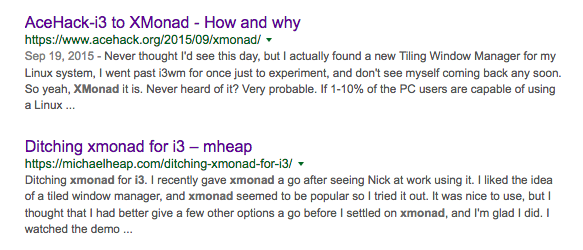
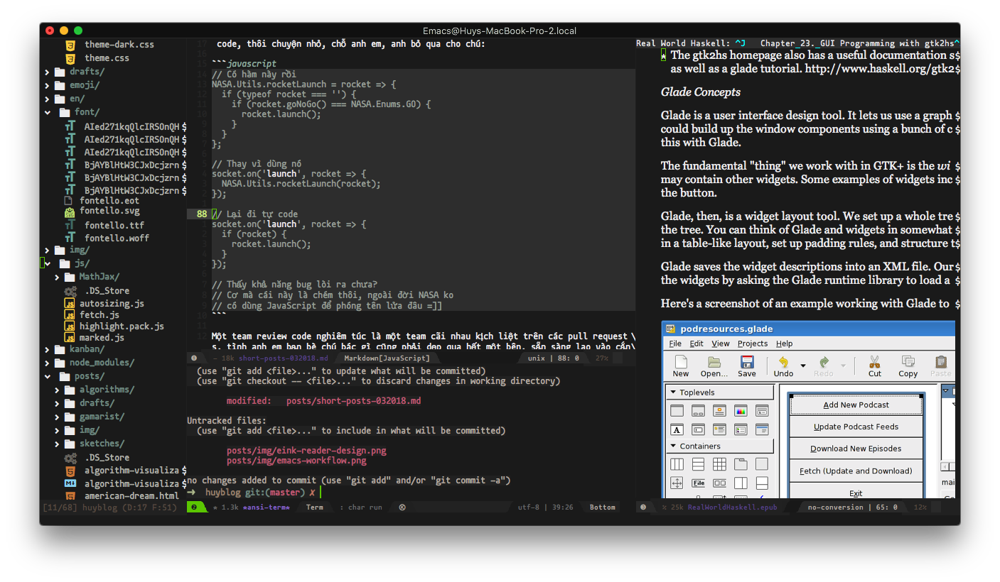
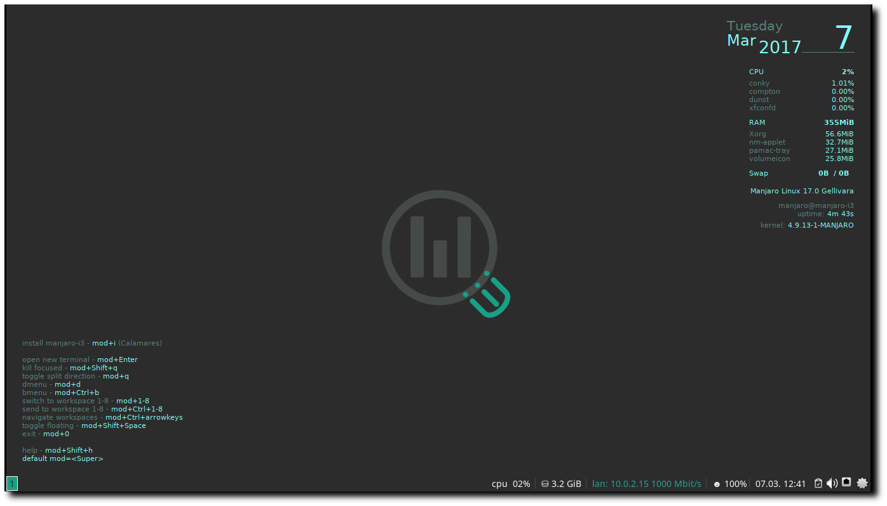
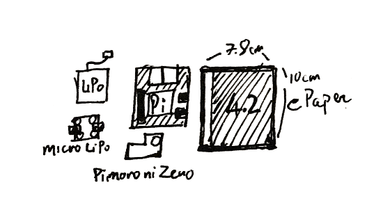

<div class="toc">
<h2>Mục lục</h2>
<ul>
<li><a href="#pick-your-side...">Pick your side</a></li>
<li><a href="#mỗi-năm-một-ngôn-ngữ-mới">Mỗi năm một ngôn ngữ mới</a></li>
<li><a href="#review-code-có-cần-phải-nể-nhau-không?">Review code có cần phải nể nhau không?</a></li>
<li><a href="#người-lớn-không-ra-người-lớn">Người lớn không ra người lớn</a></li>
<li><a href="#life-is-short">Life is short</a></li>
<li><a href="#israel">Israel</a></li>
<li><a href="#alias-vimemacs">alias vim=emacs</a></li>
<li><a href="#i3-in-a-distro">i3 in a distro</a></li>
<li><a href="#lets-talk-about-electron">Let's talk about Electron</a></li>
<li><a href="kindle-or-not-kindle-or-diy-kindle?">Kindle or not Kindle, or DIY Kindle?</a></li>
<li><a href="#you-are-being-monitored">You are being monitored</a></li>
</ul>
</div>

---

Tổng hợp mấy dòng trong tháng qua, không có time viết thành post dài, nhưng coi bộ post này cũng khá là dài :v

## Pick your side...

"Thánh chiến" là một phần không thể thiếu trong giới developers, không khó để nhận ra những cuộc chiến dài dai dẳng này trên các forum hoặc chat room. Từ `vim` vs `emacs`, đến `go` vs `rust`, `chrome` vs `firefox`,...



Mặc dù đa phần đều là những vấn đề mang tính "personal taste" mà lại đi lôi ra để làm luận điểm đánh nhau thì sai hết sức. Nhưng công bằng mà nói, việc lôi sở thích của thằng khác ra để flame công nhận lại rất là vui :))

Bài ["Editor War"](https://en.wikipedia.org/wiki/Editor_war#Humor) trên Wikipedia có một đoạn khá là hài, nhưng mình thấy khá là quen, đó là trong mọi cuộc "thánh chiến", không thiếu những thanh niên tổ lái:

> Frequently, at some point in the discussion, someone will point out that ed is the standard text editor

À, nhân nói về editor war, thì sau nhiều năm xài `vim`, mình đã chuyển sang xài `emacs` từ đầu năm nay, lý do thì khá nhiều, nhưng lý do chính là `vim` không còn đáp ứng đủ nhu cầu của mình trong công việc nữa :joy:, và mình cũng là thằng khơi mào cho hầu hết mọi buổi war trên [rbvn](https://chat.ruby.org.vn), trước là để cổ xúy cho `vim`, giờ thì lại quay sang `emacs`, suy ra, "chiến tuyến" của bạn có thể thay đổi, và chừng nào bạn vẫn cảm thấy thoải mái với "phe" mà mình chọn, thì cứ thoải mái mà war vì nó đi, ahihi :v

_Nói thế chứ cứ mỗi lần đụng vô IntelliJ là mỗi lần mình bực không chịu được._

---

## Mỗi năm một ngôn ngữ mới

Mình rất thích học ngoại ngữ, và rất nể những người nói được nhiều thứ tiếng, đặc biệt là các bạn châu Âu, đa số mây bạn ấy, dỏm lắm cũng 3 thứ tiếng: Anh, Pháp và tiếng mẹ đẻ. Ở Mỹ cũng có nhiều người nói cả tiếng Anh và Tây Ban Nha. Bác Hồ cũng nói rất nhiều thứ tiếng khác nhau.

Mình chỉ nói được 2 thứ tiếng là Anh và Việt, đã cố học tiếng Nhật và Tây Ban Nha trong nhiều năm nhưng mà vô vọng.

Học tiếng người ko xong, thế nên mình quay qua học tiếng máy, mỗi năm pick cho mình một ngôn ngữ lập trình mới để học.

Bắt đầu cái trò này là vào đêm giao thừa cách đây 4, 5 năm gì đó. Thế rồi mình thấy hay hay và duy trì đến tận bây giờ. Có ngôn ngữ mình học xong thì cũng làm được thứ này thứ kia, cũng có thứ học chưa xong thì đã drop. Về cơ bản, chắc tại do ngôn ngữ đó dỏm, chớ ko phải do mình hời hợt :smirk:

Cụ thể thì mình sẽ đặt ra mục tiêu gì đó khi học một ngôn ngữ mới, và vì là "kĩ sư mặt tiền", mình thường chọn một goal nào đó liên quan tới web programming. Ví dụ một số món mình đã từng làm qua từng ngôn ngữ, cũng có mấy cái được lên top Hacker News, nhưng số đông còn lại thì rơi vào trong quên lãng :joy:

- https://github.com/huytd/manga-frame-detect-opencv (Python)
- https://github.com/huytd/swift-http (Swift)
- https://github.com/huytd/playgo (Golang)
- https://github.com/huytd/codedaily-v3 (Rust)
- https://github.com/huytd/kanelm (Elm)
- https://github.com/huytd/bubble-sort-visualized (C)
- https://github.com/huytd/kip (Ruby)
- ...

Thế rồi, nói dông nói dài, năm nay target tiếp theo của mình là [học `Haskell`](https://kipalog.com/posts/Mot-so-ky-hieu-can-biet-khi-hoc-Haskell) :smirk: Mình cũng share luôn một tutorial khá là nhộn về Haskell: [For most programmers, learning haskell will be no picnic... unless they read this tutorial first!](http://lisperati.com/haskell/)

À, đừng vội cho rằng mình là thằng hipster, hay master of none :cry: vì tông màu chủ đạo của mình vẫn là JavaScript, mặc cho người đời có chê bai, hay tự thân nó cực kì dỏm. JavaScript vẫn được việc, và vẫn là cái "cần kiếm cơm" của mình :joy:.

---

## Review code có cần phải nể nhau không?

Người ta vẫn hay nói, đem ba cái tình anh em, bạn bè, nể nang nhau vô công việc thì kiểu gì cũng hỏng việc. Cái này đúng cho cả chuyện review code.

Về cơ bản, cứ nể nang nhau thì khi review code cũng sẽ nể nang nhau, rồi sẽ châm chước mà bỏ qua cho nhau những cái lỗi vụn vặt, nhưng đôi khi mấy cái vụn vặt lại trở thành yếu tố then chốt khiến cho project cũng thành vụn cám :joy:.

Ví dụ như project đã có sẵn mấy cái hàm util thường dùng rồi, nhưng mấy ông thần lại cứ thích tự code, thôi chuyện nhỏ, chỗ anh em, anh bỏ qua cho chú:

```javascript
// Có hàm này rồi
NASA.Utils.rocketLaunch = rocket => {
  if (typeof rocket === 'object') {
    if (rocket.goNoGo() === NASA.Enums.GO) {
      rocket.launch();
    }
  }
};

// Thay vì dùng nó
socket.on('launch', rocket => {
  NASA.Utils.rocketLaunch(rocket);
});

// Lại đi tự code
socket.on('launch', rocket => {
  if (rocket) {
    rocket.launch();
  }
});

// Thấy khả năng bug lòi ra chưa?
// Cơ mà cái này là chém thôi, ngoài đời NASA ko
// có dùng JavaScript để phóng tên lửa đâu =]]
```

Một team review code nghiêm túc là một team cãi nhau kịch liệt trên các pull requests, tình anh em bạn bè chú bác gì cũng phải dẹp qua hết một bên, sẵn sàng lao vào cắn xé nhau để khưi cho ra được code thối, hoặc bảo vệ quan điểm của mình.

```javascript
NASA.Utils.rocketLaunch = rocket => {
  if (typeof rocket === 'object') {
// Reviewer A: Tên lửa sao type lại là object được? Lỡ nó là class thì sao?
//     Author: Mày có tin tao đập chết mẹ mày không? Ngu ngu vừa thôi, trong
//                   JS thứ gì lại không là object?
    if (rocket.goNoGo() === NASA.Enums.GO) {
      rocket.launch();
// Reviewer B: Tao nghĩ chỗ này cần phải kiểm tra bình nhiên liệu nữa...
// Reviewer A: đcm https://en.wikipedia.org/wiki/Go/no_go
    }
  }
};
```

_Tên công ty và nhân vật trong code đã được thay đổi vì lý do bảo mật._

---

## Người lớn không ra người lớn

Mấy nay lại rộ lên một chuyện không mới, có một em học sinh cấp 3, chế ra cánh tay robot có thể xoay chuyển cầm nắm các kiểu giống như chúng ta vẫn thường thấy trên mạng.

Chuyện tiếp theo như thế nào thì chắc mọi người cũng đã rõ, sau những lời khen là đến một đội quân hùng hậu các nhà điều tra nhảy vào dẫn link các dự án tương tự ở nước ngoài, kèm theo một điệu cười khẩy (đọc đoán là thế, chứ mấy thằng này nó cười bằng bàn phím, biết thế đếch nào được nó cười khẩy) kiểu: _"Có tiền mua giải dễ dàng quá"_, _"Nhờ người làm hộ rồi đem đi thi ấy mà"_,...

Thực hư thế nào mình không nói tới, vì thực ra cũng không phải người trong cuộc để mà đưa ra bình luận được. Chuyện đem đi thi thì mình cũng không bình luận luôn, vì vốn dĩ những cuộc thi kiểu này nó cũng linh tinh lắm rồi.

Mình có cảm giác ở Việt Nam lắm phốt nên giờ cứ trẻ con mà làm ra cái gì hổ báo tí là giống như tội đồ, bị gắn cho cái mác lừa dối, cũng không ai tin tưởng. Vẫn còn mừng là nhìn vào mấy cái Fab Lab sẽ thấy họ vẫn tổ chức những hoạt động cho thiếu nhi làm quen với DIY hay lập trình liên tục, ở nước ngoài, thậm chí VN cũng có.


<div class="copyright center">Nguồn: MakeZine</div>

Nhìn những khuông mặt hớn hở trong [bài này](https://makezine.com/2017/09/06/summer-making-maker-camp-round-world/) khi được tự tay làm ra và thử nghiệm những món đồ của mình làm ra, và nghĩ lại, liệu cách mà chúng ta đón nhận những sản phẩm của các bạn trẻ làm ra kia có đúng hay không? Và thậm chí là cái cách mà mấy ông thầy bà thầy rủ rỉ vào đó cái tư tưởng làm hộ, thi hộ kia là có đúng hay không? Hay là quá sức thô bạo và độc ác?

Vì cái lợi của bản thân, chạy đua theo thành tích mà thuê người làm hộ, hoặc vì cái tự ái cá nhân mà sẵn sàng dìm hàng, chê bai công sức lao động của người khác như thế thì được gì? chỉ tội cho mấy đứa nhỏ, thành công cụ để người này điều khiển và người kia bôi nhọ.

Làm vậy rồi còn đứa nào dám đâm đầu vào khoa học nữa? Nhân tài rồi cũng được ba mẹ cho đi du học rồi lấy vợ đẻ con bên kia hết. Khi đó thì mấy ông lại ngửa mặt lên trời để blame cái đất nước không biết nuôi dưỡng nhân tài. Blame ai? Có mà blame cái đít gà :chicken:.

---

## Life is short

> "Relentlessly prune bullshit, don't wait to do things that matter, and savor the time you have. That's what you do when life is short."

<p style="text-align: right;">Paul Graham, <a href="http://www.paulgraham.com/vb.html">Life is Short</a>, 2016</p>

Đọc đi đọc lại, xoay qua xoay lại vẫn thấy đúng, cuộc đời quá ngắn nên những thứ gì mà cảm thấy nó không đáng thì nên dẹp hết qua một bên, để dành thời gian cho những thứ gì đáng giá hơn.

À, nhân tiện lái một tí, có một cuốn sách khá hay mà mình mới đọc gần đây đó là [Sum: Forty Tales from the Afterlives](https://www.amazon.com/Sum-Forty-Afterlives-David-Eagleman-ebook/dp/B001TKA0VO/ref=tmm_kin_swatch_0?_encoding=UTF8&qid=&sr=), là tập hợp những mẫu chuyện nhỏ giả tưởng về Afterlife, nơi mà bạn sẽ đến sau khi rời bỏ thế giới, vừa hài hước, vừa nhẹ nhàng mà vừa đậm đà đủ để chúng ta phải suy nghĩ về việc phải sống thế nào trong thế giới của những người đang sống.

---

## Israel

Hẳn không ai lạ gì quyển [Quốc gia khởi nghiệp](https://en.wikipedia.org/wiki/Start-up_Nation), nội dung xoay quanh chuyện tìm cách lý giải nguyên nhân khiến người Israel gặt hái được nhiều thành công trong mọi việc mà họ làm.

Mình vừa may mắn join vào một công ty non-startup, mà phần lớn những người sáng lập là người Israel. Và thực sự có rất nhiều ấn tượng, một trong số đó là về cái cách họ sử dụng thời gian một cách cực kì hiệu quả.

Trong một lần đi nhậu thì mình có đem vấn đề quyển Quốc gia khởi nghiệp ra để hỏi mấy ông sếp:

- Ê sếp, biết quyển Quốc gia khởi nghiệp chớ?
- Biết chớ. Sách nói đúng đó. Người nước tao được cái là có tính cách thích hợp để làm startup.
- Tính cách gì?
- Không ngại va chạm.
- Là sao?
- Bọn tao không ngại làm việc cật lực để hoàn thành mục tiêu của mình, nên trong công việc thì rất là quyết liệt. Một phần cũng vì ai cũng được rèn cái tính đó trong quân đội cả.
- Chém! Nước tao cũng bắt đi nghĩa vụ nè, có thấy khác đ' gì đâu?
- Nước tụi mày có chiến tranh không?
- Ơ, không.
- Đó, khác nhau đó. Ở nước tao đi bộ đội nghĩa là luôn trong trạng thái ứng phó với chiến sự, có nguy cơ quay trở lại bất kì lúc nào. Và đa số mọi người đều đi bộ đội (vẫn có ngoại lệ). Mày phải cầm súng trên tay rồi mới thấm ý nghĩa của những thứ mày bỏ lại ở nhà.
- _Gật gù..._
- Chưa hết, còn đi dự bị nữa, một năm 1 lần, cỡ hơn một tháng. Thử tưởng tượng một năm một lần mày bị "remove" khỏi cuộc sống thường ngày của mày, mày sẽ thấy quý thời gian đến thế nào.
- Ai cũng phải đi dự bị hết hả?
- Ờ.
- Ông đi Mỹ rồi thì đâu có bị đi nữa?
- Tao hả, tao bị đuổi khỏi quân đội rồi, vì không ra trình diện 4 năm nay rồi :joy: mà giờ mày biết tính nết tụi tao rồi đó, lo cày đi nghe ku.
- :cry:

Nghe nói chuyện kiểu troll troll, không biết đúng hay sai nữa.

Nhưng tính nết nhà binh nên công ty hoạt động khá là hiệu quả, không giống như những công ty Silicon Valley <sup>\[1\]</sup> mà mình đã từng làm việc. Ở đây người ta làm việc rất cẩn thận, tuân thủ PCI tuyệt đối, không một dòng code nào có thể push lên production mà không có ít nhất 2 người ngồi cãi nhau, cho dù là hot fix. Thậm chí cái editor của mình tự chọn thì công ty cũng tốn mất một ngày để review license của nó =))

\[1\] _"Move fast and break everything"_ =))

---

## alias vim=emacs

Từ nhiều năm rồi workflow của mình là `vim` + `tmux` + `iTerm`. Theo đó thì `tmux` sẽ đóng vai trò screen manager, quản lý nhiều màn hình dòng lệnh khác nhau, mọi hoạt động gói gọn trong môi trường dòng lệnh.

Mặc dù khá là tiện, nhưng nó tồn tại khá nhiều vấn đề, một trong những vấn đề đó là:

- Phụ thuộc hoàn toàn vào performance của terminal emulator
- Không sử dụng được các chức năng cần đồ họa (lướt web, đọc ebook,...)

Cho nên từ đầu năm nay mình đã chuyển sang dùng `emacs`, ban đầu vẫn là workflow cũ `emacs` + `tmux` + `iTerm`, tuy nhiên với workflow này, nó chậm còn hơn `vim`, vì lý do đơn giản, `emacs` chạy GUI thì tốt hơn chạy trên terminal (điều ngày ngược lại so với `vim`). Thế là chuyển sang xài `emacs GUI`.


<div class="copyright center">Fake busy =]]</div>

Cảm giác là, mọi thứ nó mượt hơn hẳn :joy: và thực ra mình cũng không bị mất thứ gì (à, có, terminal giờ performance còn tệ hơn cả `iTerm`, như :poop:, nhưng mà kệ nó đi :))).

Từ chỗ editor sống trong terminal, giờ terminal của mình chuyển sang sống trong editor :joy: Sau nhiều năm bảo vệ cái trường phái "sống trong terminal" và giờ tự mình đi ngược lại nó, mình ~~biện hộ~~ rút ra một điều là: theo trường phái nào cũng được miễn thoải mái là được =)))

_Emacs is my new terminal!_

Với bạn nào có ý định xài `emacs` sau khi đọc bài này, thì đây là [một link khá hay về Emacs Lisp](http://www.lisperati.com/casting-spels-emacs/html/casting-spels-emacs-1.html), một phiên bản `lisp` được sử dụng trong `emacs`.

---

## i3 in a distro

Từ khi chuyển qua xài `i3` (window manager / WM) thay cho các desktop environment (DE) truyền thống như `GNOME` hoặc `xfce` thì mình không còn quay về với mấy thể loại DE được nữa.

Giải pháp thường dùng của mình khi cài máy ảo hoặc một máy linux mới là `archlinux` + `i3`, nhưng việc cài như vậy khá là tốn time và phiền phức, lại khó truyền bá được nữa.

Manjaro là một distro xây dựng trên nền tảng của `archlinux` và họ có rất nhiều phiên bản, tích hợp sẵn `GNOME`, `xfce` và `KDE` hoặc vanilla như arch luôn.

Hôm nay đọc reddit mới thấy hóa ra bản `community edition` của họ cũng có [một phiên bản tích hợp sẵn `i3`](https://manjaro.org/2017/03/07/manjaro-i3-community-edition-17-0-released/).


<div class="copyright center">Nguồn: Manjaro Website</div>

Nhìn bao ngầu luôn. Nếu ai muốn trải nghiệm `archlinux` mà ngại tốn thời gian thì có thể thử cài distro này.

---

## Let's talk about Electron

Electron là thứ công nghệ ăn nhiều gạch đá nhất bởi độ nặng nề của nó, hầu hết mọi ứng dụng xây dựng bằng Electron có performance cực kì tệ.

Tuy nhiên nó cũng là nền tảng được nhiều người lựa chọn nhất khi nói đến việc xây dựng ứng dụng cross-platform, đơn giản vì nó dùng JavaScript, tích hợp NodeJS, tận dụng được ecosystem rộng lớn của NodeJS, kết hợp với sự tiện dụng và tự do xây dựng UI của HTML/CSS. Điều này là không thể bàn cãi.

Mặt trái của Electron lại chính là viêc tích hợp NodeJS và disable sandbox mặc định của Chromium (nhằm phục vụ cho nhu cầu của một desktop app, như truy xuất vào file system,...) khiến cho nền tảng này trở nên nguy hiểm hơn bao giờ hết, chỉ cần cài một package bậy bạ nào đó trên `npm` cũng đủ khiến ứng dụng của bạn trở thành vật chủ mang virus =))) để phát tán khắp nơi.

Để tìm hiểu thêm về những vấn đề bảo mật của Electron, và đứng ở phía một developer chúng ta cần làm gì, các bạn có thể tham khảo [Electron Security Checklist](https://www.blackhat.com/docs/us-17/thursday/us-17-Carettoni-Electronegativity-A-Study-Of-Electron-Security-wp.pdf) từ Black Hat 2017.

Vậy đây có phải là nền tảng đáng bỏ đi hay không? Câu trả lời là **KHÔNG**.

Vấn đề nằm ở JavaScript, vì thế có rất nhiều giải pháp để khắc phục, bản thân Electron team cũng đang bỏ ra rất nhiều công sức để cải thiện nó. Và một giải pháp khác nữa đó là dùng một ngôn ngữ khác làm backend thay vì JavaScript. Electron chỉ cần dùng làm frontend ở trên để tiếp nhận thông tin và render ra màn hình. Như thế sẽ loại bỏ được nhu cầu sử dụng NodeJS, cắt đứt đa số mọi mối nguy hiểm tiềm năng.

Team Atom cũng đang phát triển một phiên bản mới theo mô hình này, dùng Rust làm backend và Electron làm frontend, dự án có tên là [Xray](https://github.com/atom/xray), hiện vẫn đang trong giai đoạn thử nghiệm.

Các bạn có thể tìm hiểu thêm về mô hình này qua một bài viết khác không liên quan đến Atom :joy: đó là bài [Building a fast Electron app with Rust](https://keminglabs.com/blog/building-a-fast-electron-app-with-rust/) của Kevin J. Lynagh.

Tiếp tục không liên quan, team VS Code cũng có một [bài viết](https://code.visualstudio.com/blogs/2017/10/03/terminal-renderer) giới thiệu về cách họ dùng HTML5 Canvas thay cho render DOM elements truyền thống để tăng tốc cho cái terminal được tích hợp trong VS Code lên từ "5 đến 45 lần". Cũng rất thú vị.

_Thú vị ở chỗ, HTML5 Canvas không phải là một giải pháp có performance tốt hơn DOM rendering, nhưng cách mà team áp dụng để giúp cho việc render hiệu quả hơn thì rất là phức tạp và hay ho._

---

## Kindle or not Kindle, or DIY Kindle?

Kindle là một thiết bị tuyệt vời cho việc đọc sách, được recommend nhiều hơn cả iPad. Điều làm cho Kindle trở nên đặc biệt lại chính là những chức năng mà nó không có, hoặc có nhưng làm rất kém :joy: ví dụ như lướt web.

Mình cũng xài Kindle, từ bản Kindle Gen 5, lên Paperwhite, Voyage và giờ là Oasis 2 <sup>\[1\]</sup> vấn đề lớn nhất của Kindle mà mình thường gặp đó là... thời gian để đọc. Hầu như mình chỉ cầm máy để đọc vào dịp cuối tuần, còn ngày thường thì chỉ đọc đâu tầm 15 phút là lăn ra ngủ rồi. Ban ngày thì ở công ty, mình không đọc bằng Kindle, cũng chả đem nó theo, vì nó to quá, mà thay vào đó là cầm điện thoại để đọc.

Vậy nên mình mới nảy ra một ý là làm một cái máy đọc sách nhỏ nhỏ, màn hình cỡ 5 inch trở xuống, tức là bằng cái điện thoại thôi, như thế thì dễ dàng đem theo hơn, mà vẫn có thể đọc được sách trên màn hình eInk. Thanh niên nói là làm, mình bắt tay vào thiết kế ngay =))



Đội hình các components cần dùng (trên lý thuyết) gồm có:

- Raspberry Pi hoặc [Pi Zero](https://www.adafruit.com/product/3708) cho nó gọn
- [Pin LiPo 3.7v 2500mAh](https://www.adafruit.com/product/328)
- Mạch nguồn cho pin LiPo [Pimoroni LiPO SHIM](https://www.adafruit.com/product/3196)
- Mạch sạc cho pin LiPo [Micro LiPo](https://www.adafruit.com/product/1304)
- [Màn hình eInk 4.2 inch độ phân giải 400x300](https://www.waveshare.com/product/modules/oleds-lcds/e-paper/4.2inch-e-paper-module.htm)

Tính toán sơ bộ, Pi 3 sử dụng điện áp `5V`, dòng tiêu thụ khoảng `480mA`, màn eInk dùng điện áp `3.3V`, dòng tiêu thụ khoảng `8.18mA`, nếu lạc quan mà tính, ta cho con Pi cần `500mA`, cái màn hình cần `10mA`, vị chi là `510mA`, vậy ta chọn pin LiPo `3.7V 2500mAh`, sẽ cho kết quả tầm `4.5` giờ đọc liên tục, và thời gian chờ (tiêu thụ khoảng `20mA` toàn mạch) tầm `125` giờ. Chưa tính mức hao phí điện năng của mạch nguồn, mạch này chỉ cung cấp được cho con Pi tầm 96% điện năng từ pin.

Mọi con số chỉ mới nằm trên lý thuyết :joy: nên đừng ai bắt bẻ về tính chính xác. Tuy nhiên tổng chi phí (kèm cả thuế và ship) thì cao hơn một con Paperwhite luôn rồi, cho nên khi nào ~~vợ cho phép~~ có thời gian thì mình sẽ làm :smirk:.

Từ lý thuyết đến thực tết vẫn còn khá là xa...

\[1\] _Kindle fanboi_ =]]

---

## You are being monitored


Mấy nay lùm xùm vụ Facebook, không nói chắc ai cũng đã rõ, ai không rõ thì đọc [bài này](https://tinhte.vn/threads/tong-hop-thong-tin-vu-ro-ri-thong-tin-50-trieu-nguoi-dung-facebook-va-loi-noi-cua-ceo-mark-zuck.2778171/).

Lại nhớ cách đây không lâu khi mình đi phỏng vấn nên phải lưu số điện thoại của HR và mấy ông sếp vô máy để lên tới nơi còn có cái mà gọi mấy ổng ra dẫn độ vào văn phòng, sáng lưu số phỏng vấn thì đến chiều đã thấy Facebook suggest kết bạn rồi =)) sợ vãi ra.

Chuyện bị theo dõi và collect thông tin cá nhân nó diễn ra thường xuyên hơn chúng ta nghĩ, và không chỉ có mỗi Facebook.

Đầu tiên phải nói đến Google, đặc biệt là dành cho những ai xài trình duyệt Chrome hoặc điện thoại Android. Các bạn có thể vào đây để [xem mọi hành tung trên internet của mình](https://myactivity.google.com/myactivity), hoặc vào đây để [xem mọi đường đi nước bước của bạn](https://www.google.com/maps/timeline?pb), dữ liệu được thu thập bằng cả location của các tấm ảnh mà bạn chụp, bản đồ mà bạn tìm,...

Theo một nguồn tin không thể kiểm chứng, thì pỏn hub và x vi đê ô cũng theo dõi lịch sử tìm kiếm của bạn để tìm ra và suggest các loại hình nghệ thuật mà bạn yêu thích.

Linkedin và Gmail học cách trả lời, đối đáp của bạn để làm "nguyên liệu" cho chức năng suggest trả lời tin nhắn.

Amazon thì [điều khiển luôn cả hành vi mua hàng của bạn](https://www.quora.com/Why-is-the-Amazon-autocomplete-so-fast) (just kidding =]]).

Và trong lúc các bạn đang đọc những dòng này, các bạn cũng đang bị theo dõi =)))

```javascript
var trackData = {
  userAgent: navigator.userAgent,
  language: navigator.language,
  url: window.location.href,
  refer: document.referrer
};
```

Mình không dùng Google Analytics mà chỉ thu thập những thông tin trên cho mục đích thống kê :D
