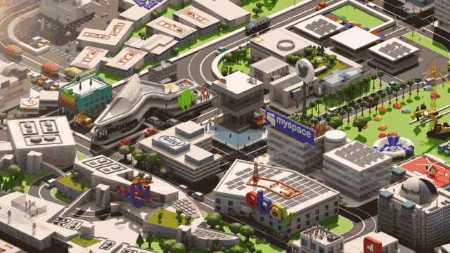

Hồi đầu tháng 12 vừa rồi bác Nguyễn Thiện Nhân sang Mỹ và có một buổi gặp mặt với cộng đồng người Việt làm công nghệ tại đây. Trong buổi gặp mặt thì bác ấy có đề cập tới chuyện: Nhà nước có thể làm gì để giúp phát triển một Silicon Valley ngay tại Việt Nam.

Tiếc là mình thuộc dạng vô danh tiểu tốt nên không có cơ hội tham gia buổi nói chuyện này, hầu hết thông tin đều được [chia sẻ lại](https://www.facebook.com/maisaotran/posts/10159638176685510) từ các anh chị có tham gia ngày hôm đó.

Ảnh từ sê-ri phim Silicon Valley của HBO

Trước khi đọc bài viết, các bạn có thể tra cứu thông tin từ Google, Wiki để hiểu thêm về các yếu tố tạo nên Silicon Valley, có thể đọc thêm bài [Tại sao việc nhân bản Thung lũng Silicon là không thể?](https://vinacode.net/2014/10/08/ban-sao-thung-lung-silicon/) đăng tại VinaCode.

Ban đầu mình tính dịch lại, nhưng về sau thấy không cần thiết, các bạn có thể tự đọc từ các link dưới đây.

Nhận xét của mình thì câu chuyện Silicon Valley vs. Route 128 tự thân nó đã nói lên khá rõ về lý do tại sao Silicon Valley của ngày hôm nay lại là nơi mà khó có một vùng nào trên thế giới có thể bắt chước được. Đó là còn chưa kể đến các yếu tố khác góp phần làm nên "hệ sinh thái" Silicon như: Khí hậu vùng Bay Area, hệ thống các trường ĐH chất lượng cao, lượng nhân lực dồi dào và world-class, lượng doanh nhân, công ty đổ xô về đây, số lượng các nhà đầu tư và các quỹ đầu tư, hệ thống luật pháp,...  Tuy nhiên việc bác Nhân sang Mỹ và đưa vấn đề này ra trong buổi gặp gỡ, mình đánh giá cao tinh thần của bác ấy trong cái tham vọng xây dựng Silicon Valley ở TP. HCM.

Mặc dù mình không hoàn toàn tin tưởng vào chuyện có thể xây dựng được một Silicon Valley thứ **2** ở TP. HCM hay Đà Nẵng, Bình Dương hay bất kì đâu khác, nhưng trong lòng thì vẫn thầm mong mỏi sẽ có ngày nào đó chứng kiến cảnh mỗi sáng được đứng chờ kẹt xe ở Đà Nẵng và nhình quanh 4 phía đâu đâu cũng thấy developers :joy: (đấy mới là thực tế về Silicon Valley mà mình đã trải nghiệm).

Với "thế mạnh truyền thống" để cạnh tranh trong thị trường phần mềm của Việt Nam là **nhân lực giá rẻ, chất lượng không quá thấp**, đây hoàn toàn không phải là yếu tố cạnh tranh trong môi trường như Silicon Valley. Việt Nam vẫn có những hướng đi khác hay ho và hiệu quả, nói thẳng ra là phù hợp với đặc điểm của mình hơn việc sao chép mô hình Silicon Valley. Ví dụ như mô hình của Israel, xuất khẩu công nghệ cao, hay mô hình của nhiều startup Việt Nam, Ấn Độ tại Mỹ, là sử dụng engineer từ trong nước để vận hành công ty tại Mỹ,...

Còn bây giờ, xin mời các bạn bắt đầu đọc nội dung chính :joy:, link số 3 khá là dài nhưng rất đáng đọc, đừng nên bỏ qua.

- [1] [Bài chia sẻ của chị Mai Sao trên Facebook](https://www.facebook.com/maisaotran/posts/10159638176685510)

- [1] [Transcript buổi nói chuyện của anh Jeff](https://docsend.com/view/v2kmbm2)
- [2] [Slide từ bài nói của anh Jeff](https://docsend.com/view/x3b743j)

- [3] [Silicon Valley Versus Route 128]( https://www.inc.com/magazine/19940201/2758.html), Inc., 1994

- [4] [Tại sao việc nhân bản Silicon Valley là không thể?](https://vinacode.net/2014/10/08/ban-sao-thung-lung-silicon/), VinaCode, 2014

---

**Update:** Link số 1 của chị Mai Sao chỉ để visible cho friends of friends của chị ấy, nên mình copy lại nội dung vào đây cho các bạn tiện đọc, nội dung thì là tổng hợp lại từ transcript của anh Jeff:

 
Sunday note cho anh em startup Việt + những ai muốn tìm hiểu thêm lịch sử và chính sách: This morning on the invitation of the consulate Ms. Dung, Jeff shared his views and answered HCMC Delegates as well as Mr. Nguyễn Thiện Nhân on what government can do to create a Silicon Valley for Vietnam. I'm noting down a very brief summary here:

<ul>
<li>1. History on Silicon Valley vs. Route 128 (Boston, MA): in 1950s, Harvard & MIT were considered the hub of innovation, the start of first modern Venture Capital while Stanford and Berkeley were located in the "rural agricultural" area. Today, Silicon Valley are leading the innovation and a hub of VCs only after 2 decades.</li>
<li>2. The Traitorous Eight, The Fairchildren and the Descendants: Shockley Semiconductor had 8 PhD employees who didn't like the way the company is running. They went on to start Fairchild Semiconductor and from then, we have AMD, Intel, National Semiconductor, Kleiner Perkins. The descendants of those were Google, Tesla, Paypal... The list goes on. The 8 PhD who left were called "The Traitorous Eight". Later on, people called Fairchild a "trillion dollars valuation" because of all the successful companies that derive from it.</li>
<li>3. On Route 128 , because of "non-compete agreements" many things were restricted. The companies there were more "centralized, more government consumers and more fragile". In Silicon Valley, companies were more "decentralized, more civilian consumers and more robust".</li>
<li>4. Only in Silicon Valley: youth respected more, predigee respected less, customer oriented (not relationship), gold-rush mentality (move fast, break things) and most importantly.... WHAT IS NOT PROHIBITED, IS ALLOWED.</li>
<li>5. Onto Vietnam's barriers to a successful ecosystem: 
<ul>
<li>-Short term mentality: Lack of real angel investors (NOT lack of money). High net worth individuals want a 30 to 50% return in one year instead of 10 to 100x over many years. Problems with kickbacks, 51% control...</li>
<li>- Startup Culture: Employee ownership (stock options vs. cash) is not common --> no long term alliance, but can't blame them for not seeing any meaningful exits. Vietnam startups is copying SV’s social scene more quickly than building successful companies.</li>
<li>- Government intervention: Companies are taxed and regulated out of existence before they have a chance to be successful in large scale. Large risk of new rules/ laws that make businesses illegal or impossible to be profitable (WHAT IS NOT ALLOWED IS PROHIBITED). Attempts by government to help full of micromanagement & over planning</li>
</ul>
</li>
<li>6. Create labs and don't do patent enforcement: Things government can do well instead of "centralize " startup funding and eco-system as mentioned on Decision 844 and 677 (Nghị quyết 844/QĐ-TTg & 677/QĐ-TTg) is to create more innovation labs and attract research talents like how both Route 128 and Silicon Valley did so well with Bell Labs, DARPA, Lincoln Labs, PARC, Stanford labs. ... And even with innovation from the lab, DON'T ENFORCE PATENTS until there are enough billion dollars company for patents to even matter.</li>
</ul>

Full presentation here: https://docsend.com/view/x3b743j

Full transcript here: https://docsend.com/view/v2kmbm2

Have fun enjoy your Sunday coffee!! xoxo - Sao.

