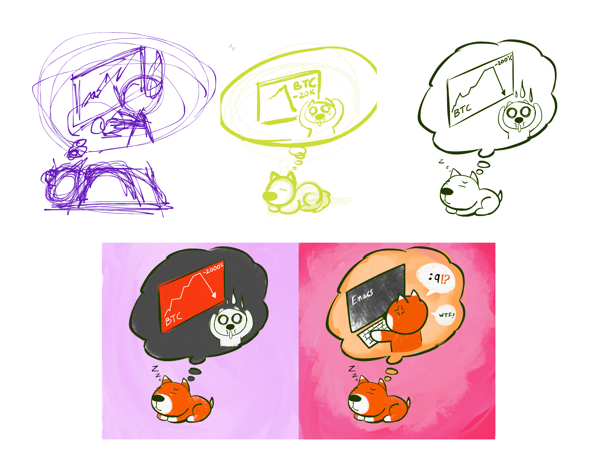

Sketching có điểm tương đồng với nói/viết ở chỗ nó có thể dùng để miêu
tả một vấn đề hay sự vật sự việc, suy nghĩ, ý tưởng một cách không
giới hạn. Nhưng nó lợi hại hơn nhờ khả năng mang nhiều thông tin hơn,
ẩn dụ hơn (ví dụ: vài nét vẽ nguệch ngoạc, vẫn có thể diễn đạt một cái
gì đó một cách ngắn gọn thay vì phải viết 100 từ để làm việc tương
tự).

Nhìn vào một bản sketch, chúng ta không thể trích xuất được toàn bộ
chi tiết ý tưởng của người sketch, mà cái chúng ta trích xuất được là
cấu trúc của ý tưởng đó, và đôi khi còn có cả trình tự suy nghĩ của
người ta nữa.

Trong một số trường hợp, dựa vào kinh nghiệm và kiến thức bản thân,
người xem còn tự mình tưởng tượng hoặc hình dung ra được những thứ mà
bản sketch không (và không thể) thể hiện ra, ví dụ, một bản vẽ cái
pit-tông, nhưng nếu được vẽ thêm một cái mũi tên thể hiện hướng di
chuyển của pit-tông, thì người xem, dựa trên kiến thức cá nhân, có thể
hình dung được hình ảnh cái pit-tông đang chuyển động lui tới một cách
sống động bên trong đầu của họ.

Nhờ vào khả năng tự biên tự diễn của trí óc này, việc sketch ra một ý
tưởng ở trong đầu, có thể giúp cho chúng ta phát triển ý tưởng đó lên
một mức độ mới, thấy được những điều mà ban đầu chưa thể thấy, đem lại
được những ý tưởng mới tốt hơn ý tưởng ban đầu.

Chi tiết có thể tìm đọc trong "What do Sketches say about Thinking"
(https://www.researchgate.net/publication/2541825_What_do_Sketches_say_about_Thinking)
và các article khác trong phần references.

Vụ see the unseen cũng là lý do vì sao các bạn designer hay làm nghề
sáng tạo thì thường làm việc hiệu quả hơn khi họ vẽ ra giấy (hoặc với
nhiều designer giàu có hiện nay thì là combo iPad Pro + Apple Pencil).
Với người làm kĩ thuật, như developer thì cũng có thể áp dụng tính
chất này của sketching khi suy nghĩ, động não để hình dung và giải
quyết vấn đề tốt hơn.
