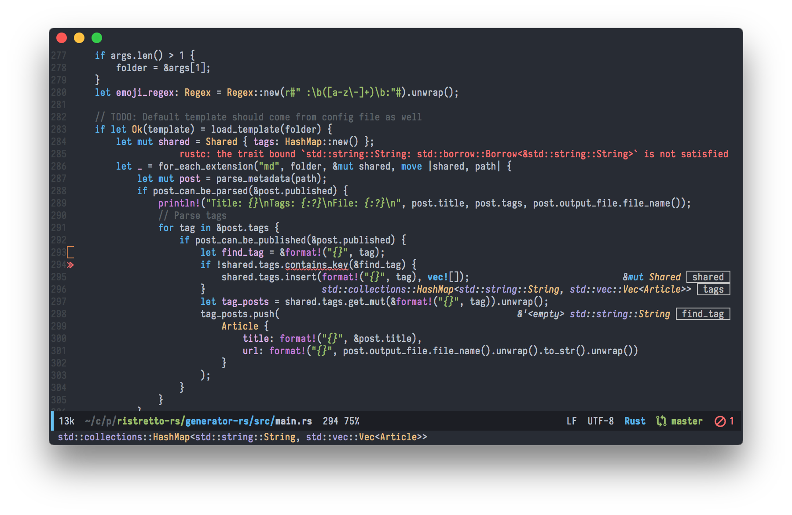

Chuyển từ `vim` sang `emacs`, sự lựa chọn hàng đầu là `spacemacs`. Lý do? vì `spacemacs` có `evil-mode`, giúp sử dụng keybinding giống `vim` trên `emacs`, có khả năng tự động cài đặt những package cần thiết (ví dụ khi mở file `*.rs` mà chưa cài `rust-mode`), tự động gỡ bỏ các package không sử dụng, giao diện được config sẵn, và kèm theo hơn 200 packages các kiểu được cài sẵn... nói chung đây là một bản `emacs` không có gì ngoài magic :think-hard:

Tuy nhiên, magic quá mức vừa là điểm mạnh, vừa là vấn đề hết sức nghiêm trọng của `spacemacs`. Ngoài việc nó làm cho quá trình khởi động chậm đi rất nhiều (mình đã từng rất bất ngờ khi biết `emacs` của nhiều người chỉ tốn có 2 giây để khởi động), việc sử dụng khái niệm `layer` làm giấu đi nhiều thứ mà đáng lẽ ra chính người dùng phải kiểm soát được, và tạo thêm nhiều sự phức tạp không đáng có, ví dụ như không ít lần `spacemacs` bị crash hoặc tệ hơn là một chức năng nào đó bỗng nhiên dở chứng không hoạt động được nữa, sau khi cài một hoặc một vài packages mới, và dù gỡ nó ra cũng không giúp ích gì được.

Trên kênh support chính của team `spacemacs`, là github, thì đa phần mọi issue đều được reply một cách chung chung là:

- "Bạn đã thử chạy emacs với lệnh --debug-init chưa?"
- "Bạn post cấu hình file .spacemacs lên xem nào?"

Những câu trả lời như thế này không hề có ích, đơn giản là vì output của `--debug-init` không thực sự hữu dụng vì `spacemacs` còn load thêm quá nhiều thứ linh tinh khiến cho việc debug gặp khá là nhiều khó khăn.

Thêm một vấn đề khi sử dụng `spacemacs` và `evil-mode` đó là cảm giác sợ bỏ lỡ mất những gì thuộc về `emacs` truyền thống, tuy nhiên vấn đề này về sau không phải là mối bận tâm của mình nữa.

Nhìn chung, `spacemacs` là một giải pháp khá thích hợp cho những ai muốn chuyển từ `vim` sang, nhưng chỉ thích hợp dùng một thời gian. Để có thể tìm hiểu sâu hơn về `emacs`, thì kiểu gì cũng nên tự tìm cách xây dựng cho mình một file config riêng. Nhiều người cực đoan thậm chí còn nói như này (hơi tục một tí nhé :joy:):

- "Xài spacemacs cũng giống như mặc quần sịp của thằng khác vậy" :joy:

Thế nên sau một thời gian thì mình cũng bắt đầu thử nghiệm một vài phiên bản `emacs` customized khác, như `doom-emacs` (sau đó thì bợ luôn cái theme `doom-one` của ông này), `centaur-emacs` (không thích lắm),... nhưng nhìn chung thì vẫn đi tới quyết định tự cấu hình một file `init.el` riêng.

Kết quả là giờ mình có một bản `emacs` mà tự mình có thể kiểm soát mọi thứ bên trong nó, tốc độ startup chỉ `2.8s` (kiểm tra bằng `M-x emacs-init-time`), và quan trọng là cực kì nhanh, mượt. Kèm theo đó là việc viết code Emacs Lisp cũng rất là sướng :think-hopeful:

Cách cấu hình như nào thì mình sẽ không ghi lại ra bài này, vì đã [từng post ở bên blog tiếng Anh rồi](https://huytd.github.io/emacs-from-scratch.html), và nó cực kì dễ, ai cũng có thể làm theo :smirk:

Các bạn cũng có thể tham khảo thêm [cấu hình `init.el` mà mình đang sử dụng](https://gist.github.com/huytd/6b785bdaeb595401d69adc7797e5c22c), sử dụng `use-package` để cài đặt và quản lý config, kèm theo các package cơ bản như là `evil-mode` cho `vim` keybinding, `doom-one` theme, `helm` cho vụ search và fuzzy match, `projectile` để quản lý project, `neotree` để hiện cây thư muc, `which-key` để hiện danh sách các keybinding khi bắt đầu gõ phím tắt, `general` để customize phím tắt, `flycheck` để kiểm tra code khi đang gõ, `company` cho vụ autocomplete,...

Ngoài ra, vì việc cấu hình `emacs` sử dụng `lisp`, việc tìm hiểu xem [viết code lisp như thế nào mới đúng chuẩn](https://github.com/bbatsov/emacs-lisp-style-guide) cũng là một việc khá quan trọng :))
