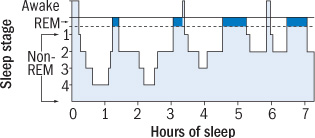

Đi làm về lướt newsfeed thấy [ông bạn](https://github.com/zunc) share một bài về tác hại của đèn đóm ở trên trang [Harvard Health Publishing](https://www.health.havard.edu) thấy cũng thú vị và thiết thực đối với dân developers, đọc tiếp thấy có thêm nhiều bài hay nên biên vội mấy dòng bookmark.

## Tác hại của ánh sáng xanh, hãy đọc bằng Kindle

URL: https://www.health.harvard.edu/staying-healthy/blue-light-has-a-dark-side

Ánh sáng xanh, đến từ các thiết bị điện tử (tivi, máy tính, điện thoại,...) hay các loại bóng đèn tiết kiệm điện có tác dụng tăng cường sự chú ý, tăng tốc độ phản xạ, cải thiện cảm xúc,... vốn rất có lợi vào ban ngày. Nhưng về đêm, thì việc tiếp xúc với ánh sáng (đặc biệt là ánh sáng xanh) lại gây ức chế việc sản sinh Melatonin của não, một hormone giúp duy trì nhịp sinh học của cơ thể. Về lâu dài có nguy cơ mắc nhiều bệnh nguy hiểm.

Giải pháp để hạn chế tiếp xúc với ánh sáng xanh về đêm là:

- Dùng đèn màu đỏ dịu vào ban đêm.
- Tránh nhìn vào màn hình sáng trước khi đi ngủ từ 2 đến 3 tiếng.
- Nếu phải làm việc vào ban đêm hoặc dùng nhiều đồ điện tử, nên đeo kính chống ánh sáng xanh hoặc dùng app lọc màu xanh của màn hình (như nightshift mode, f.lux cho macOS, redshift cho linux)
- Ban ngày nên ra tiếp xúc với ánh sáng nhiều vào, đêm sẽ dễ ngủ.

## Ngủ

URL: https://www.health.harvard.edu/womens-health/repaying-your-sleep-debt

Theo như thông tin trong bài, việc ngủ của chúng ta chia làm 2 loại: REM (rapid eye movement) và non-REM.

Để phân loại, REM là khi sóng não nhanh nhất và bất ổn định nhất, mắt khi đó vẫn còn quét tới quét lui bên dưới (ghê vãi). Và non-REM là khi chúng ta ngủ sâu, sóng não và việc hít thở chậm, nhịp tim cũng như huyết áp giảm đến 30%, nhưng đây cũng là lúc mà một số thành phần trong cơ thể hoạt động hiệu quả nhất, ví dụ như việc tiết ra hormone tăng trưỏng giúp cho chúng ta cao lên (lol).

Việc nằm mơ cũng sẽ xảy ra ở REM, và việc nảy ra những ý tưỏng điên rồ hoặc lời giải cho các vấn đề hóc búa lúc còn thức cũng sẽ xảy ra ở giai đoạn này.

Ở một người trưỏng thành, một đêm cần ngủ từ 7 đến 9 tiếng. Và chu kì diễn ra REM / non-REM nó sẽ như thế này (xen kẽ vào đó là một vài giai đoạn Awake, ví dụ thức dậy và rất tỉnh, rồi ngủ lại):

Và việc ngủ đủ giấc là rất quan trọng, nếu thức quá khuya, ngủ không đủ trung bình 8 tiếng một ngày, thì gọi là `sleep debt` (nợ ngủ :think-hard:), không như nợ thẻ tín dụng, nợ ngủ không tính lãi, nên thiếu ngủ bao nhiêu tiếng, cứ ngủ bù lại là đủ.

Với trưòng hợp bạn thiếu ngủ cả... vài thập kỉ, bạn không cần phải ngủ một lèo cả chừng đó thập kỉ để bù, mà chỉ cần sắp xếp thật nhiều thời gian (tốt nhất là đi vacation), và ngủ càng nhiều mỗi đêm càng tốt, cho tới khi nào bạn thức dậy và cảm thấy thật tươi tỉnh, thoải mái.

## Đứng tốt hơn ngồi

URL: https://www.health.harvard.edu/heart-health/standing-vs-sitting-fewer-pounds-less-heart-disease

Là developers thì hẳn ai cũng phải ngồi nhiều. Tuy nhiên, đứng giúp đốt calories nhiều hơn một tí (0.15 calories một phút), nếu một người nặng 143 pounds (tầm 65 kí, mình nặng 210 pounds :think-cry:), có thể đốt tầm 54 calories một ngày bằng cách đứng thay vì ngồi 6 tiếng (không cần liên tục).

Nếu giữ nguyên số calories được đốt mỗi ngày đó trong vòng một năm, thì có thể giảm thêm được... 5.5 pounds (2 kí rưỡi).

Nhưng đó không phải lý do chính, theo một nghiên cứu được published vào tháng 3 năm 2018 trên _American Journal of Preventive Medicine_, những người ngồi dưới 3 tiếng một ngày, có tỉ lệ chết vì bệnh tim mạch ít hơn 33% so với những người ngồi trung bình 7 tiếng một ngày.

Giải pháp dành cho đám developers chúng ta là dùng standing desk khi code.

## Cà phê

URL: https://www.health.harvard.edu/staying-healthy/coffee-more-links-to-health-than-harm

Chỉ nên uống dưới 4 ly cà phê một ngày, thì có thể đem lại một vài lợi ích nhất định cho sức khỏe, nhiều hơn thì không tốt.

Nhưng cà phê ở đây không biết là như nào, nhưng chắc chắn không phải loại đen đá hay nâu đá như ở nhà. Đa phần mình thấy người ta uống latte (hoặc tự pha gần giống latte), và ít hoặc không có đường. Riêng mình thì buổi sáng làm một ly lungo, tới trưa làm thêm 1 ly single-shot, mỗi ly đi kèm 2 gói đưòng nâu :think-cry: nên không chắc như vậy có healthy không.

Xem thêm các thể loại cà phê: https://www.gocoffeego.com/professor-peaberry/brewing-tips/espresso-drinks
