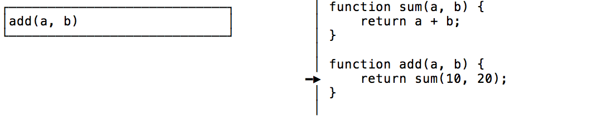

_Chỉ nếu như bạn sử dụng JavaScript..._

**Tail call** là từ được cấu thành từ hai chữ, chữ _tail_ và chữ _call_.

> **tail** /teɪl/<br/>
> **call** /kɔːl/ (in UK) or /kɑl/ (in US)

Chữ _tail_ <span class="mute sidenote">Hài hước tí, nếu các bạn không thấy zui thì nên tự xem lại óc hài hước của mình. À không, ý mình là của các bạn. :smirk:</span> có nghĩa là _đuôi_, còn chữ _call_ có nghĩa là _gọi_, hợp lại ta có chữ _gọi đuôi_, hay _gọi đằng đuôi_. Trong môn khoa học máy tính, _gọi đằng đuôi_ có nghĩa là **lời gọi tới một hàm con <u>tại vị trí cuối cùng</u> trong một hàm cha nào đó**, đằng sau lời gọi này, hàm cha không còn làm bất cứ một việc gì khác nữa.

Kiểu như này:

```
function sum(a, b) {
    return a + b;
}

// Ví dụ 1
function add(a, b) {
    return sum(10, 20); // đây là tail call
}

// Ví dụ 2
function add(a, b) {
    return 10 + sum(10, 20); // đây không phải là tail call
}

// Ví dụ 3
function add(a, b) {
    let result = sum(10, 20); // đây không phải là tail call
    return result;
}
```

Như trên ta thấy, chỉ có lời gọi hàm `sum()` ở ví dụ 1 là tail call, còn hai ví dụ còn lại thì không.

---

Trước khi nói tiếp về **tail call optimization**, chúng ta hãy nói qua một chút về **call stack**.

Call stack là một cấu trúc dữ liệu kiểu ngăn xếp (stack) được sử dụng để lưu vị trí hoạt động của một chương trình, khi có một lời gọi hàm (call) xảy ra, thì stack sẽ được đẩy thêm vào (push) một phần tử, sau khi hàm đó xử lý xong thì nó sẽ bị gỡ ra (pop). Việc này giúp cho máy tính biết được nó đang đứng ở đâu trước khi một lời gọi hàm xảy ra, và có thể quay về sau khi hàm đó kết thúc.

Ở ví dụ 3, đầu tiên, khi chương trình thực hiện, thì call stack của chúng ta sẽ biến đổi như sau:

Đầu tiên, hàm `add(a, b)` sẽ được push vào call stack, vì đây là hàm vừa được gọi:


Khi đi vào hàm này, chúng ta bắt gặp lời gọi đến hàm `sum()`, lúc này trong call stack sẽ được push vào một frame mới cho hàm `sum`, việc call stack được push thêm frame mới gọi là **call stack growth**:


Đi vào hàm `sum`, giá trị của biểu thức `10 + 20` sẽ được tính và trả về:


Sau khi hàm `sum()` trả về kết quả, nó sẽ bị pop khỏi call stack, chương trình lúc này tiếp tục sau khi đã tính toán được giá trị của biến `result`:


Sau khi lệnh `return result` được hoàn thành, thì hàm `add` cũng đã được thực hiện xong, nó cũng sẽ được pop ra khỏi call stack, và call stack lúc này không còn gì nữa:


---

**Tail Call Optimization** là một kĩ thuật tối ưu mà compiler sẽ làm cho <span class="sidenote mute">Compiler làm điều này như thế nào thì các bạn có thể xem thêm ở cuối bài.</span> việc thực thi code không xảy ra _call stack growth_.

Cụ thể, với tail call optimization, thì call stack của chúng ta sẽ biến đổi như sau khi thực thi code ở ví dụ 1:

Đầu tiên chúng ta cũng bắt đầu với hàm `add()` nằm trong call stack:


Và khi gặp lời gọi hàm `sum()` thì chuyện gì sẽ xảy ra? Lưu ý lúc này, hàm `sum()` được gọi khi chúng ta `return` về giá trị của nó, có nghĩa là hàm `add()` đã xong nhiệm vụ:



Chính vì thế, `add()` sẽ bị loại khỏi call stack, và `sum()` sẽ được đưa vào thay thế. Lưu ý là, stack frame trước đó dành cho `add()` có thể sẽ được sử dụng lại cho `sum()` luôn. Nói chung là không xảy ra _call stack growth_.


Tiếp tục thực thi, chúng ta tính toán biểu thức `10 + 20`:


Rồi `return` luôn, hàm `sum()` lúc này sẽ bị pop khỏi call stack, và chương trình kết thúc tại đây:


Việc thực thi mà không làm call stack phình ra, chúng ta gọi đó là _zero stack growth_. 

---

Vậy compiler đã làm gì để khi thực thi chúng ta có _zero stack growth_? Chúng ta đều biết, compiler sẽ biên dịch chương trình về mã máy, có thể biểu diễn bằng code Assembly, điều này đúng với cả JavaScript mặc dù để giải thích thì dài dòng lắm, nên mình sẽ để dành cho một bài viết sau.

Các bạn đừng lo khi thấy phần này bắt đầu nói về Assembly, mình cũng đâu có biết Assembly đâu :joy:. Chúng ta chỉ cần biết rằng, khi máy tính thực thi code Assembly, nó sẽ có một con trỏ, gọi là `program counter`, chạy từ đầu tới cuối của chương trình đó, đụng lệnh nào thì thực thi lệnh đó (giống khi ta đọc sách mà lấy tay chỉ vào từng dòng để đánh vần vậy).

Và để tìm hiểu về kĩ thuật **tail call optimization** của compiler, chúng ta chỉ cần biết 2 lệnh, đó là:

- `call`: lệnh điều khiển cho `program counter` tạm thời nhảy đến một vị trí nào đó trong chương trình để xử lý, sau khi xử lý xong thì nó sẽ quay về, và tiếp tục xử lý lệnh kế tiếp, nghe như ném boomerang nhỉ. Ví dụ đoạn code sau có lệnh `call`, sẽ được thực thi theo thứ tự từ trên xuống, và nhảy tứa lưa như mấy mũi tên trong hình:

  

- `jmp`: là `jump`, lệnh điều khiển `program counter` nhảy từ vị trí hiện tại sang một vị trí được chỉ định, nhảy xong thì đi luôn chứ không quay về nữa.

  

Như vậy, theo như hiểu biết về call stack ở phần trước, ta cũng có thể hình dung ra rằng, khi `call` được gọi thì sẽ có _call stack growth_ xảy ra.

Và khi thực hiện **tail call optimization**, compiler sẽ sinh code đại loại như sau trong trường hợp ví dụ 3, không có tail call:

```
fn_add:       # hàm add
call fn_sum   # call hàm sum
ret           # rồi quay lại return kết quả
```

Và trong trường hợp có tail call của ví dụ 1 thì sẽ như sau:

```
fn_add:      # hàm add
jmp fn_sum   # jump tới sum luôn
```

Quá dễ hiểu, đúng không? :grin:

---

OK, vậy tại sao đầu bài lại nói là _không cần_ quan tâm đến **tail call optimization** khi dùng JavaScript?

Đơn giản, là vì **JavaScript không có tail call optimization**!

Mặc dù trong đặc tả ES6 [có mô tả về nó](http://www.ecma-international.org/ecma-262/6.0/#sec-tail-position-calls), hầu như [không có một JavaScript engine nào implement nó cả, trừ Safari](https://kangax.github.io/compat-table/es6/#test-proper_tail_calls_(tail_call_optimisation)) :sob:.

**Đọc thêm**

- **Tail Calls, Optimization, and ES6**, Gustavo Duarte<br/>https://manybutfinite.com/post/tail-calls-optimization-es6/
- **Tail call optimization in ECMAScript 6**, Axel Rauschmayer<br/>http://2ality.com/2015/06/tail-call-optimization.html
- **Tail Call Optimization**, Ward Cunningham<br/>http://wiki.c2.com/?TailCallOptimization
- **Call vs Jmp: The Stack Connection**, Dr. O. Lawlor<br/>https://www.cs.uaf.edu/2012/fall/cs301/lecture/09_24_call_and_ret.html
- https://www.chromestatus.com/feature/5516876633341952
