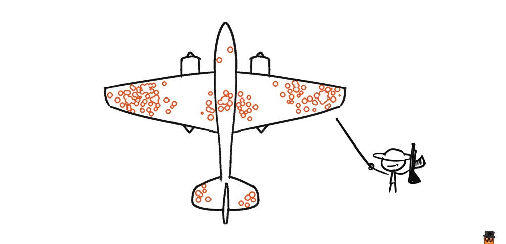
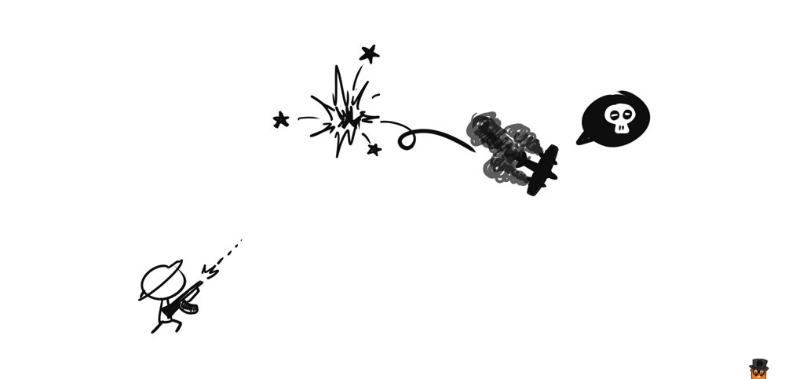
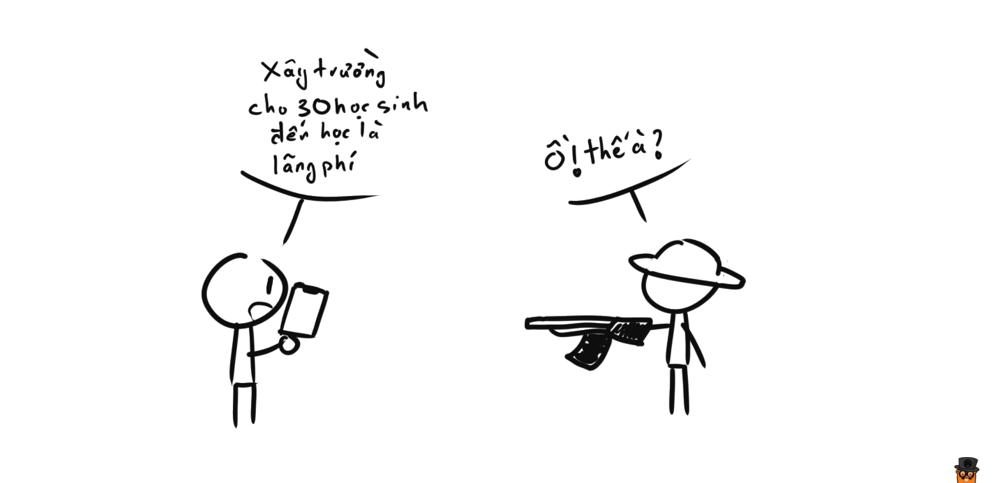

Đây là một câu trả lời cho câu hỏi [Đâu là những kĩ năng toán học cơ bản nhất mà mọi người nên biết?](https://www.quora.com/What-are-the-basic-math-skills-that-everyone-should-know). Khá là thú vị nên mình trích dẫn lại.

---

**Hỏi:** Đâu là những kĩ năng toán học cơ bản nhất mà mọi người cần phải biết?

**Đáp:** Trong giai đoạn cao trào của cuộc Chiến tranh thế giới lần thứ II, rất nhiều chiến đấu cơ của Mỹ quay trở về từ chiến trường mang theo hàng đống vết đạn bắn chi chít trên mình.

Vị trí các vết đạn phân bố tập trung vào các vùng khác nhau trên máy bay, chủ yếu là động cơ, thân, cánh, đuôi,...

Quân đội (Hoa Kỳ) nhận ra rằng họ có thể khảo sát vị trí các vết đạn bắn trên các máy bay trở về, từ đó họ có thể gia cố những vùng nào mà thường xuyên bị bắn trúng nhất, từ đó thì họ có thể giảm được tối đa số máy bay bị bắn hạ.

Họ tìm đến [**Abraham Wald**](https://en.wikipedia.org/wiki/Abraham_Wald) và một vài nhà nghiên cứu thống kê đầu ngành thời đó, với dữ liệu họ đưa ra như sau:

| Vùng trên máy bay | Tỉ lệ lỗ đạn trên một feet vuông |
|:-----------------:|:---------------------------------|
| Động cơ           | 1.11                             |
| Thân              | 1.73                             |
| Hệ thống dẫn nhiên liệu | 1.55                       |
| Các phần khác     | 1.8                              |

Dựa vào số liệu này, bạn nghĩ quân đội cần gia cố phần nào?

Đa số mọi người cho rằng nên gia cố thân máy bay (vì có tỉ lệ ăn đạn cao nhất), và **tất cả đều sai**.

Câu trả lời chính xác phải là **động cơ**.

Wald nhận ra một điều là, dữ liệu mà phía quân đội cung cấp cho ông không nói lên được vấn đề. Lý do mà tỉ lệ bắn trúng động cơ trên bảng số liệu trên thấp rất đơn giản. Đó là **các máy bay ăn đạn vào động cơ thường không còn quay về được nữa** (vcl).

Và thực tế là phần lớn các máy bay trở về có tỉ lệ ăn đạn vào thân cao hơn nói lên một điều là thân máy bay dù có ăn nhiều đạn thì vẫn có khả năng chịu đựng cao hơn là các bộ phận khác.

Wald cho rằng chỉ có 2 cách giải thích cho số liệu mà ông được cung cấp:

1. Mấy viên đạn thường được bắn trúng các phần khác nhiều hơn là bắn vào động cơ
2. Động cơ là tử huyệt của máy bay

Và không cần phải là thiên tài thì mới nhận ra ngay, cách thứ 2 mới là cách giải thích chính xác vấn đề này. Và quân đội đã nghe theo lời của Wald để gia cố phần động cơ, hiệu quả thấy ngay, rất nhiều máy bay Mỹ đã sống sót trở về sau đó.

Một trong những kĩ năng toán học bị coi nhẹ nhất đó chính là **khả năng thấu hiểu được vấn đề ẩn giấu đằng sau những phỏng đoán do các con số đưa ra**. Abraham Wald đã giải quyết được vấn đề máy bay bởi vì ông ấy nhận ra quân đội Mỹ đã mắc sai lầm khi phỏng đoán rằng dữ liệu trên đại diện cho toàn bộ tất cả các chiến đấu cơ, thay vì chính xác phải là các chiến đấu cơ quay trở về được.

Ngày nay, có rất nhiều những con số được trưng ra trên truyền thông, chỉ nhằm một mục đích duy nhất là đánh lừa người đọc để họ phải tin vào những gì họ muốn nghe, nhưng mà bạn cần phải tỉnh táo để nhận ra cái nào là _bullshit_ và cái nào là đúng, nhận ra cái nào là những sự phỏng đoán, bị đánh lừa bởi những con số.

Nếu bạn muốn xem thêm nhiều ví dụ kiểu này nữa, tôi rất khuyến khích đọc quyển sách [How Not to Be Wrong: The Power of Mathematical Thinking](https://www.amazon.com/How-Not-Be-Wrong-Mathematical/dp/0143127535) của Jordan Ellenberg, trong cuốn này giải thích rất hay ví dụ về Wald và rất nhiều ví dụ khác về chuyện bị dữ liệu đánh lừa dẫn đến những kết luận ngớ ngẩn nữa.
